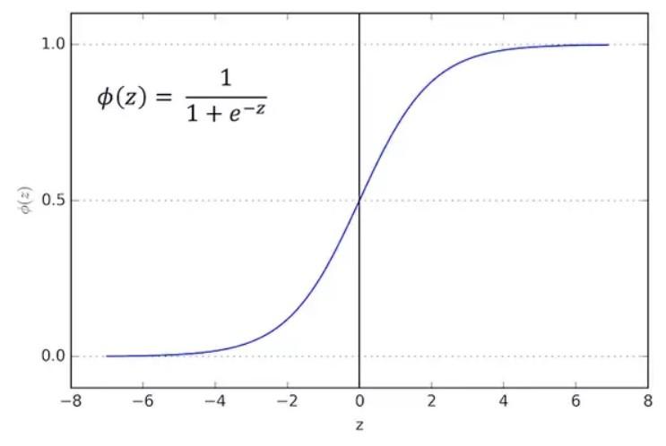
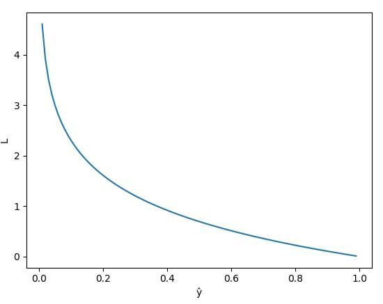

# Public_041

# Bài toán

Ngân hàng bạn đang làm có chương trình cho vay ưu đãi cho các đối tượng mua chung cư. Tuy nhiên gần đây có một vài chung cư rất hấp dẫn (giá tốt, vị trí đẹp,...) nên lượng hồ sơ người nộp cho chương trình ưu đãi tăng đáng kể. Bình thường bạn có thể duyệt 10-20 hồ sơ một ngày để quyết định hồ sơ có được cho vay hay không, tuy nhiên gần đây bạn nhận được 1000-2000 hồ sơ mỗi ngày. Bạn không thể xử lý hết hồ sơ và bạn cần có một giải pháp để có thể dự đoán hồ sơ mới là có nên cho vay hay không.
Sau khi phân tích thì bạn nhận thấy là hai yếu tố chính quyết định đến việc được vay tiền đó là mức lương và thời gian công tác. Đây là dữ liệu bạn có từ trước đến nay:

| Lương | Thời gian làm việc | Cho vay |
| --- | --- | --- |
| 10 | 1 | 1 |
| 9 | 0.5 | 1 |
| 5 | 2 | 1 |
| ... | ... | ... |
| 8 | 0.1 | 0 |
| 6 | 0.3 | 0 |
| 7 | 0.15 | 0 |
| ... | ... | ... |

 

Khi có dữ liệu bạn visualize dữ liệu lên như hình 4.1
Về mặt logic, giờ ta cần tìm đường thẳng phân chia giữa các điểm cho vay và từ chối. Rồi quyết định hồ sơ mới có nên có vay hay không từ đường đấy như hình 4.2

Hình 4.1: Đồ thị giữa mức lương, số năm kinh nghiệm và kết quả cho vay

Hình 4.2: Đường phân chia và dự đoán điểm dữ liệu mới
Ví dụ đường xanh là đường phân chia. Dự đoán cho hồ sơ của người có mức lương 6 triệu và 1 năm kinh nghiệm là không cho vay.
Tuy nhiên, do ngân hàng đang trong thời kỳ khó khăn nên việc cho vay bị thắt lại, chỉ những hồ sơ nào chắc chắn trên 80% mới được vay.
Vậy nên bây giờ bạn không những tìm là hồ sơ ấy cho vay hay không cho vay mà cần tìm xác suất nên cho hồ sơ ấy vay là bao nhiêu.
Hay trong nhiều trường hợp khác trong bài toán phân loại người ta quan tâm hơn đến xác suất hay vì chỉ 1 hay 0. Ví dụ: bác sĩ sẽ thông báo ca mổ này 80% thành công cho người nhà bệnh nhân.

# Xác suất

Bạn được học xác suất từ cấp hai, cấp ba rồi đến toán cao cấp, nhưng có bao giờ bạn hỏi tại sao lại có xác suất không? Vì trong cuộc sống này có những sự việc không chắc chắn, ví dụ ngày mai trời có mưa không. Vậy nên xác suất ra đời để đo lường sự không chắc chắn ấy.
Vậy xác suất là gì? "Các nhà toán học coi xác suất là các số trong khoảng [0,1], được gán tương ứng với một biến cố mà khả năng xảy ra hoặc không xảy ra là ngẫu nhiên" [28]. Ví dụ bạn tung đồng xu có 2 mặt, thì xác suất bạn tung được mặt ngửa là 50% ( = 50/100 = 0.5).
Nhận xét:

  * Xác suất của 1 sự kiện trong khoảng [0,1]

  * Sự kiện bạn càng chắc chắn xảy ra thì xác suất càng cao. Ví dụ bạn lương cao và còn đi làm lâu lăm thì xác suất bạn được vay mua chung cư là cao.

  * Tổng xác suất của sự kiện A và sự kiện phủ định của A là 100% (hay 1). Ví dụ sự kiện A: tung đồng xu mặt ngửa, xác suất 50%; phủ định của sự kiện A: tung đồng xu mặt sấp, xác suất 50% => tổng 100%.

Bạn sẽ thấy xác suất quan trọng hơn là chỉ 0 hay 1, ví dụ trước mỗi ca mổ khó, bác sĩ không thể chắc chắn là sẽ thất bại hay thành công mà chỉ có thể nói xác suất thành công là bao nhiêu (ví dụ 80%).

# Hàm sigmoid

Giờ ta cần tìm xác suất của hồ sơ mới nên cho vay. Hay giá trị của hàm cần trong khoảng [0,1]. Rõ ràng là giá trị của phương trình đường thẳng như bài trước có thể ra ngoài khoảng [0,1] nên cần một hàm mới luôn có giá trị trong khoảng [0,1]. Đó là hàm sigmoid.

Hình 4.3: Đồ thị hàm sigmoid
Nhận xét:

  * Hàm số liên tục, nhận giá trị thực trong khoảng (0,1).

  * Hàm có đạo hàm tại mọi điểm (để áp dụng gradient descent).

# Thiết lập bài toán

Mọi người có để ý các bước trong bài linear regression không nhỉ, các bước bao gồm:

  1. Visualize dữ liệu

  2. Thiết lập model

  3. Thiết lập loss function

  4. Tìm tham số bằng việc tối ưu loss function

  5. Dự đoán dữ liệu mới bằng model vừa tìm được 

Đây là mô hình chung cho bài toán trong Deep Learning.

## Model

Với dòng thứ i trong bảng dữ liệu, gọi _x_ 1 là lương và _x_ 2 là thời gian làm việc của hồ sơ thứ i .
$$
p(x(i)=1)=ŷipleft( x^{(i)} = 1 right) = {widehat{y}}_{i}
$$ là xác suất mà model dự đoán hồ sơ thứ i được cho vay.
$$
p(x(i)=0)=1−ŷipleft( x^{(i)} = 0 right) = 1 - {widehat{y}}_{i}
$$là xác suất mà model dự đoán hồ sơ thứ i không được cho vay.
Như bài trước công thức của linear regression là: $$
ŷi=w0+w1x1+w2x2{widehat{y}}_{i} = w_{0} + w_{1}x_{1} + w_{2}x_{2}
$$ thì giờ công thức của logistic regression là:

$$
ŷi=σ(w0+w1x1(i)+w2x2(i))=11+e−(w0+w1x1(i)+w2x2(i)){widehat{y}}_{i} = sigmaleft( w_{0} + w_{1}x_{1}^{(i)} + w_{2}x_{2}^{(i)} right) = frac{1}{1 + e^{- left( w_{0} + w_{1}x_{1}^{(i)} + w_{2}x_{2}^{(i)} right)}}
$$

Ở phần cuối mọi người sẽ thấy được quan hệ giữa xác suất và đường thẳng.

## Loss function

Giờ cũng cần một hàm để đánh giá độ tốt của model. Như bài trước là _y_ ˆ càng gần y càng tốt, giờ cũng vậy:

  * Nếu hồ sơ thứ i là cho vay, tức _y i _= 1 thì ta cũng mong muốn _y_ ˆ _i_ càng gần 1 càng tốt hay model dự đoán xác suất người thứ i được vay vốn càng cao càng tốt.

  * Nếu hồ sơ thứ i không được vay, tức _y i _= 0 thì ta cũng mong muốn _y_ ˆ _i_ càng gần 0 càng tốt hay model dự đoán xác suất người thứ i được vay vốn càng thấp càng tốt.

Với mỗi điểm , gọi hàm loss function $$
L=−(yiloglogŷi+(1−yi)loglog(1−ŷi))L = - left( y_{i}loglog {widehat{y}}_{i}  + left( 1 - y_{i} right)loglog left( 1 - {widehat{y}}_{i} right)  right)
$$, loss function này có tên gọi là binary_crossentropy
**Mặc định trong machine learning nói chung hay deep learning thì viết log hiểu là ln**
Thử đánh giá hàm L nhé. Nếu _y i _= 1 => L = − _log_ ( _y_ ˆ _i_ )

Hình 4.4: Đồ thị hàm loss function trong trường hợp _y i _= 1
Nhận xét:

  * Hàm L giảm dần từ 0 đến 1.

  * Khi model dự đoán _y_ ˆ _i_ gần 1, tức giá trị dự đoán gần với giá trị thật _y i _thì L nhỏ, xấp xỉ 0

  * Khi model dự đoán _y_ ˆ _i_ gần 0, tức giá trị dự đoán ngược lại giá trị thật _y i _thì L rất lớn

Ngược lại, nếu _y i _= 0 => L = − _log_ (1− _y_ ˆ _i_ )

Hình 4.5: Đồ thị hàm loss function trong trường hợp _y i _= 0
Nhận xét:

  * Hàm L tăng dần từ 0 đến 1

  * Khi model dự đoán _y_ ˆ _i_ gần 0, tức giá trị dự đoán gần với giá trị thật _y i _thì L nhỏ, xấp xỉ 0

  * Khi model dự đoán _y_ ˆ _i_ gần 1, tức giá trị dự đoán ngược lại giá trị thật _y i _thì L rất lớn => Hàm L nhỏ khi giá trị model dự đoán gần với giá trị thật và rất lớn khi model dự đoán sai, hay nói cách khác L càng nhỏ thì model dự đoán càng gần với giá trị thật. => Bài toán tìm model trở thành tìm giá trị nhỏ nhất của L

Hàm loss function trên toàn bộ dữ liệu $$
J=−1N∑i=1N(yiloglogŷi+(1−yi)loglog(1−ŷi))J = - frac{1}{N}sum_{i = 1}^{N}left( y_{i}loglog {widehat{y}}_{i}  + left( 1 - y_{i} right)loglog left( 1 - {widehat{y}}_{i} right)  right)
$$