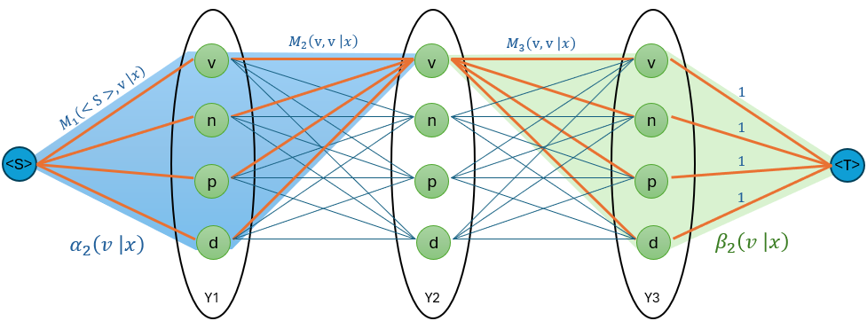
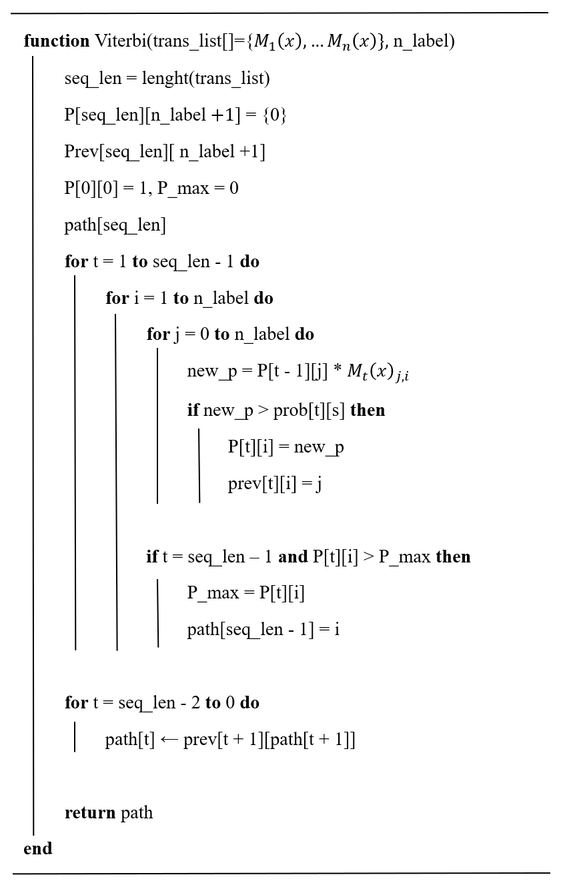
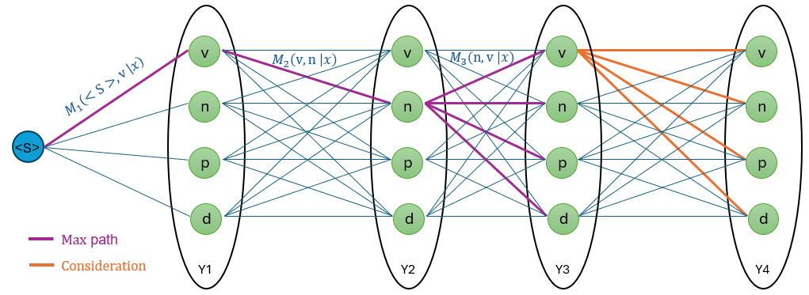

# Public_103

  1. **Giải thích:**

Tương tự CRFs, Linear-Chain CRFs phân loại chuỗi dựa trên xác suất $P(Y|X)Pleft( Y middle| X right)$. Với chuỗi x cho trước, CRFs sẽ tìm ra chuỗi y sao cho xác suất $P(Y=y|X=x)Pleft( Y = y middle| X =  x right)$ là lớn nhất.

$$
ŷ=argmaxyP(y|x)widehat{y} =  {argmax}_{y} Pleft( y middle| x right)
$$

Xác suất $P(Y|X)Pleft( Y middle| X right)$ được xây dựng thông qua việc định nghĩa các hàm đặc trưng $fkf_{k}$và $gkg_{k}$ và xác định giá trị $λklambda_{k}$, $μkmu_{k}$. Các trọng số được tối ưu trong quá trình huấn huyện với tập dữ liệu huấn luyện. Nói cách khác, quá trình huấn luyện CRFs là quá trình học phân phối xác suất $P(Y|X)Pleft( Y middle| X right)$ của tập dữ liệu huấn luyện.

Việc tối ưu hóa các trọng số $$
θ=(λ1,…,λk;μ1,…,μk)theta = (lambda_{1}, ldots,lambda_{k};mu_{1},ldots,mu_{k})
$$ tương đương với việc tìm kiếm hàm năng lượng tối ưu cho mô hình. Mô hình CRFs sẽ điều chỉnh các trọng số để hàm đặc trưng phản ánh chính xác mối quan hệ giữa chuỗi quan sát và chuỗi nhãn, từ đó đưa ra dự đoán chính xác nhất. Do đó, hàm đặc trưng đóng vai trò then chốt trong việc xác định mối quan hệ giữa chuỗi quan sát x và chuỗi nhãn y. Việc lựa chọn và thiết kế hàm đặc trưng phù hợp với bài toán cụ thể là rất quan trọng để đảm bảo mô hình có thể học được các mẫu quan trọng từ dữ liệu và đưa ra dự đoán chính xác.

### 2\. Huấn luyện 

Việc huấn luyện thường sử dụng phương pháp MLE (Maximum Likelihood Estimation) để tối ưu hóa các trọng số $$
θ=(λ1,…,λk;μ1,…,μk)theta = (lambda_{1}, ldots,lambda_{k};mu_{1},ldots,mu_{k})
$$ từ tập huấn luyện $$
D={(x(𝕚),y(𝕚))}i=1ND = left{ left( x^{(mathbb{i})},y^{(mathbb{i})} right) right}_{i = 1}^{N}
$$. Mục tiêu của quá trình huấn luyện là tìm ra bộ trọng số $θtheta$ để hàm mục tiêu log-likelihood $L(θ)L(theta)$ là lớn nhất.

$$
L(θ)=∑i=1Nlog(Pθ(y(𝕚)|x(𝕚)))L(theta) = sum_{i = 1}^{N}{logleft( P_{theta}left( y^{(mathbb{i})} middle| x^{(mathbb{i})} right) right)}
$$

$$
=∑i=1N(∑t=1n(∑kλkfk(yt−1(i),yt(i),x(𝕚),t)+∑kμkgk(yt(i),x(𝕚),t))−log(Zθ(x(𝕚))))=  sum_{i = 1}^{N}left( sum_{t = 1}^{n}left( sum_{k}^{}{{lambda_{k}f}_{k}left( y_{t - 1}^{(i)}, y_{t}^{(i)}, x^{(mathbb{i})},t right)} + sum_{k}^{}{mu_{k}g_{k}left( y_{t}^{(i)}, x^{(mathbb{i})},t right)} right)  -  logleft( Z_{theta}left( x^{(mathbb{i})} right) right) right)
$$

Việc tối ưu hóa hàm mục tiêu có thể sử dụng các phương pháp tối ưu dựa trên việc tính gradient như Gradient Descent, Stochastic Gradient Descent (SGD), L-BFGS (Limited-memory BFGS). Do đó chúng ta cần tính gradient của $L(θ)L(theta)$.

$$
∂L∂λk=∑i=1N(∑t=1nfk(yt−1(i),yt(i),x(𝕚),t)−1Zθ(x(𝕚))∂Zθ∂λk)frac{partial Ltext{  }}{text{ }partiallambda_{ktext{  }}} = text{ }sum_{i = 1}^{N}left( sum_{t = 1}^{n}{f_{k}left( y_{t - 1}^{(i)}, y_{t}^{(i)}, x^{(mathbb{i})},t right)}  -  frac{1}{Z_{theta}left( x^{(mathbb{i})} right)}frac{partial Z_{theta}}{partiallambda_{ktext{  }}} right)
$$

$$
1Zθ(x(𝕚))∂Zθ∂λk=1Zθ(x(𝕚))∑y′∈Ωy(∑t=1nfk(y′t−1,y′t,x(𝕚),t)e−E(x(𝕚),y′))frac{1}{Z_{theta}left( x^{(mathbb{i})} right)}frac{partial Z_{theta}text{  }}{text{ }partiallambda_{ktext{  }}} = frac{1}{Z_{theta}left( x^{(mathbb{i})} right)}sum_{y^{'} in  Omega_{y}}^{}left( sum_{t = 1}^{n}{f_{k}left( {y'}_{t - 1}, {y'}_{t}, x^{(mathbb{i})},t right)}e^{- Eleft( x^{(mathbb{i})},y^{'} right)} right)
$$

$$
=∑y′∈Ωy(∑t=1nfk(y′t−1,y′t,x(𝕚),t)e−E(x(𝕚),y′)Zθ(x(𝕚)))= sum_{y^{'} in  Omega_{y}}^{}left( sum_{t = 1}^{n}{f_{k}left( {y'}_{t - 1}, {y'}_{t}, x^{(mathbb{i})},t right)}frac{e^{- Eleft( x^{(mathbb{i})},y^{'} right)}}{Z_{theta}left( x^{(mathbb{i})} right)} right)
$$
$$
=∑y′∈Ωy(∑t=1nfk(y′t−1,y′t,x(𝕚),t)P(y′|x(𝕚)))= sum_{y^{'} in  Omega_{y}}^{}left( sum_{t = 1}^{n}{f_{k}left( {y'}_{t - 1}, {y'}_{t},x^{(mathbb{i})},t right)}Pleft( y' middle| x^{(mathbb{i})} right) right)
$$
$$
=∑t=1n∑y′∈Ωyfk(y′t−1,y′t,x(𝕚),t)P(y′|x(𝕚))=  sum_{t = 1}^{n}{sum_{y^{'} in  Omega_{y}}^{}{f_{k}left( {y'}_{t - 1}, {y'}_{t},x^{(mathbb{i})},t right)Pleft( y' middle| x^{(mathbb{i})} right)}}
$$

$$
⇒∂L∂λk=∑i=1N∑t=1n(fk(yt−1(i),yt(i),x(𝕚),t)−∑y′∈Ωyfk(y′t−1,y′t,x(𝕚),t)P(y′|x(𝕚)))Rightarrow frac{partial Ltext{  }}{text{ }partiallambda_{ktext{  }}} = text{ }sum_{i = 1}^{N}{sum_{t = 1}^{n}left( f_{k}left( y_{t - 1}^{(i)}, y_{t}^{(i)}, x^{(mathbb{i})},t right) - sum_{y^{'} in  Omega_{y}}^{}{f_{k}left( {y'}_{t - 1}, {y'}_{t}, x^{(mathbb{i})},t right)Pleft( y^{'} middle| x^{(mathbb{i})} right)} right)}
$$

Gọi $Ex(fk)E_{x}left( f_{k} right)$ là kì vòng hàm đặc trưng $fkf_{k}$ theo phân phối xác suất $P(y|x)Pleft( y middle| x right)$:

$$
Ex(fk)=∑t=1n∑y′∈Ωyfk(y′t−1,y′t,x(𝕚),t)P(y′|x(𝕚))E_{x}left( f_{k} right) =  sum_{t = 1}^{n}{sum_{y^{'} in  Omega_{y}}^{}{f_{k}left( {y'}_{t - 1}, {y'}_{t}, x^{(mathbb{i})},t right)Pleft( y^{'} middle| x^{(mathbb{i})} right)}}
$$

$$
⇒∂L∂λk=∑i=1N(∑t=1nfk(yt−1(i),yt(i),x(𝕚),t)+Ex(i)(fk))Rightarrow frac{partial Ltext{  }}{text{ }partiallambda_{ktext{  }}} = text{ }sum_{i = 1}^{N}left( sum_{t = 1}^{n}{f_{k}left( y_{t - 1}^{(i)}, y_{t}^{(i)}, x^{(mathbb{i})},t right)} +  E_{x^{(i)}}left( f_{k} right) right)
$$

Tương tự ta cũng có gradient cho $μkmu_{k}$:

$$
Ex(gk)=∑t=1n∑y′∈Ωygk(y′t,x(𝕚),t)P(y′|x(𝕚))E_{x}left( g_{k} right) =  sum_{t = 1}^{n}{sum_{y^{'} in  Omega_{y}}^{}{g_{k}left( {y'}_{t}, x^{(mathbb{i})},t right)Pleft( y^{'} middle| x^{(mathbb{i})} right)}}
$$

$$
∂L∂μk=∑i=1N(∑t=1ngk(yt(i),x(𝕚),t)+Ex(i)(gk))frac{partial Ltext{  }}{text{ }partialmu_{k}} = text{ }sum_{i = 1}^{N}left( sum_{t = 1}^{n}{g_{k}left( y_{t}^{(i)}, x^{(mathbb{i})},t right)} +  E_{x^{(i)}}left( g_{k} right) right)
$$

Nếu tính trực tiếp kì vọng của các hàm đặc trưng từ công thức trên thì độ phức tạp tính toán sẽ là hàm mũ $$
(O(n×|𝒴|n))left( Oleft( n times left| mathcal{Y} right|^{n} right) right)
$$. Do đó không khả thi khi số lượng nhãn và bộ dữ liệu lớn. Để giảm độ phức tạp tính toán ta biến đổi công thức trên thành dạng sau:

$$
Ex(fk)=∑t=1n∑y′∈Ωyfk(y′t−1,y′t,x(𝕚),t)P(y′|x(𝕚))E_{x}left( f_{k} right) =  sum_{t = 1}^{n}{sum_{y^{'} in  Omega_{y}}^{}{f_{k}left( {y'}_{t - 1}, {y'}_{t}, x^{(mathbb{i})},t right)Pleft( y^{'} middle| x^{(mathbb{i})} right)}}
$$
$$
=∑t=1n∑y′,y″∈𝒴fk(y′,y″,x(𝕚),t)P(Yt−1=y′,Yt=y″|x(𝕚))= sum_{t = 1}^{n}{sum_{y^{'}, y^{''} in  mathcal{Y}}^{}{f_{k}left( y', y'', x^{(mathbb{i})},t right)Pleft( Y_{t - 1} = y^{'}, Y_{t} = y'' middle| x^{(mathbb{i})} right)}}
$$

Trong đó $$
P(Yt−1=y′,Yt=y″|x(𝕚))Pleft( Y_{t - 1} = y^{'}, Y_{t} = y'' middle| x^{(mathbb{i})} right)
$$ là xác xuất biên của $Yt−1=y′,Yt=y″Y_{t - 1} = y^{'}, Y_{t} = y''$ khi biết chuỗi quan sát $x(𝕚)x^{(mathbb{i})}$, tức xác suất để cặp nhãn $(y′,y″)(y', y'')$ được gán tại vị trí t-1 và t khi biết $x(𝕚)x^{(mathbb{i})}$ mà không quan tâm đến các nhãn còn lại. Xác suất biên này có thể được tính trong thời gian đa thức bằng thuật toán Forward-Backward.

Tương tự cho $μkmu_{k}$:

$$
Ex(gk)=∑t=1n∑y′∈𝒴gk(y′,x(𝕚),t)P(Yt=y′|x(𝕚))E_{x}left( g_{k} right) =  sum_{t = 1}^{n}{sum_{y^{'} in  mathcal{Y}}^{}{g_{k}left( y', x^{(mathbb{i})},t right)Pleft( Y_{t} = y^{'} middle| x^{(mathbb{i})} right)}}
$$

### 3\. Thuật toán Forward-Backward áp dụng trong tính gradient

Hình 3.1. Minh họa thuật toán Forward-Backward trong việc xác suất biên tại 1 nút

Ý tưởng của thuật toán Forward-Backward là tính xác suất biên dựa vào việc tính xác suất tiến $αi(x)alpha_{i}(x)$ và xác suất lùi $βi(x)beta_{i}(x)$. Hình 8 mô tả ý tưởng tính xác suất biên $P(Y2=v|x)Pleft( Y_{2} =  v middle| x right)$ và hình 9 mô tả ý tưởng cách tính xác suất biên $$
P(Yt−1=y′,Yt=y″|x)Pleft( Y_{t - 1} = y^{'}, Y_{t} = y'' middle| x right)
$$ cho bài toán POS. Mỗi một đường đi từ <S> đến <T> là 1 trường hợp của chuỗi Y. Trọng số của của mỗi cạnh được tính theo công thức $Mi(Cj,Ck|x)M_{i}left( C_{j},C_{k} middle| x right)$ đã trình bày ở phần trước thể hiện khả năng nhãn của từ liền kề khi biết trước nhãn, trọng số của 1 đường đi là tích các trọng số cạnh mà đường đi qua.

$$
pθ(Y=y|X=x)=pθ(pathy|X=x)=TrọngsốcủapathyZθ(x)p_{theta}left( Y = y middle|  X = x right) =  p_{theta}left( path_{y} middle|  X = x right) =  frac{Trọng số của path_{y}}{Z_{theta}(x)}
$$

Xác suất biên $P(Y2=v|x)Pleft( Y_{2} =  v middle| x right)$ sẽ là tổng xác suất của tất cả các đường đi đi qua v tại $Y2Y_{2}$ hay tổng trọng số các đường đi đó. Ta có thể phân tích tổng này thành tích của 2 tổng $α2(v|x)alpha_{2}left( v middle| x right)$ và $β2(v|x)beta_{2}left( v middle| x right)$.

$$
P(Y2=v|x)=α2(v|x)×β2(v|x)Pleft( Y_{2} =  v middle| x right) =  alpha_{2}left( v middle| x right) times beta_{2}left( v middle| x right)
$$

Trong đó $α2(v|x)alpha_{2}left( v middle| x right)$ là tổng trọng số tất cả các đường đi từ <S> đến v tại $Y2Y_{2}$, $β2(v|x)beta_{2}left( v middle| x right)$ là tổng trọng số tất cả các đường đi từ v tại $Y2Y_{2}$ đến <T>.

Để tính $α2(v|x)alpha_{2}left( v middle| x right)$ ta sẽ tính $α1alpha_{1}$ của tất cả các giá trị của Y1 rồi nhân với trọng số chuyển đổi thành nhãn v tương ứng với từng giá trị (v => v, n => v, p => v, d => v). Như vậy thì $αialpha_{i}$ sẽ được tính dựa theo $αi−1alpha_{i - 1}$ và quá trình này là quá trình tiến của thuật toán Forward-Backward. Tương tự $βibeta_{i}$ cũng được tính toán dựa trên quy hoạch động và quá trình này là quá trình lùi.

Tổng quát, ta có chuỗi $Y=(Y0,…,Yn)Y =  left( Y_{0}, ldots,Y_{n} right)$, gọi $$
Yi:j=(Yi,…,Yj)với0≤i<j≤nY_{i:j} =  left( Y_{i}, ldots,Y_{j} right) với 0 leq i < j leq n
$$.

Ta có:

$$
αt(Yt=y′|x)={∑y0:t−1′∏i=1tMi(y′i−1,y′i|x),với1<t≤nM1(<Start>,y′1|x),vớit=1alpha_{t}left( Y_{t} = y^{'} middle| x right) = left{ begin{array}{r}
sum_{y_{0:t - 1}^{'}}^{}{prod_{i = 1}^{t}{M_{i}left( {y^{'}}_{i - 1},{y^{'}}_{i} middle| x right)}},  với 1 < t leq n  
M_{1}left( < Start > ,{y^{'}}_{1} middle| x right) ,  với t = 1
end{array} right.
$$

$$
βt(Yt=y′|x)={∑yt+1:n′∏i=t+1nMi(y′i−1,y′i|x),với1≤t<n−1∑y″∈𝒴Mt(y′,y″|x),vớit=n−11,vớit=nbeta_{t}left( Y_{t} = y^{'} middle| x right) =  left{ begin{array}{r}
sum_{y_{t + 1:n}^{'}}^{}{prod_{i = t + 1}^{n}{M_{i}left( {y^{'}}_{i - 1},{y^{'}}_{i} middle| x right)}},   với 1 leq t < n - 1 
sum_{y^{''} in  mathcal{Y}}^{}{M_{t}left( y',y'' middle| x right)},    với t = n - 1 
1 ,                                  với t = n
end{array} right.
$$

Ta chứng minh $$
αt(Yt=y′|x)=∑y′t−1∈𝒴αt−1(Yt−1=y′t−1|x)×Mt(y′t−1,y′|x)alpha_{t}left( Y_{t} = y^{'} middle| x right) =  sum_{{y^{'}}_{t - 1} in mathcal{Y}}^{}{alpha_{t - 1}left( Y_{t - 1} = {y^{'}}_{t - 1} middle| x right)} times M_{t}left( {y^{'}}_{t - 1},y^{'} middle| x right)
$$ với $1<t≤n 1 < t leq n$, thật vậy:

$$
αt(Yt=y′|x)=∑y0:t−2′∑y′t−1∈𝒴∏i=1t−1Mi(y′i−1,y′i|x)×Mt(y′t−1,y′t|x)alpha_{t}left( Y_{t} = y^{'} middle| x right) = sum_{y_{0:t - 2}^{'}}^{}{sum_{{y^{'}}_{t - 1} in mathcal{Y}}^{}{prod_{i = 1}^{t - 1}{M_{i}left( {y^{'}}_{i - 1},{y^{'}}_{i} middle| x right) times}}}M_{t}left( {y^{'}}_{t - 1},{y^{'}}_{t} middle| x right)
$$
$$
=∑y′t−1∈𝒴(∑y0:t−2′∏i=1t−1Mi(y′i−1,y′i|x))×Mt(y′t−1,y′t|x)= sum_{{y^{'}}_{t - 1} in mathcal{Y}}^{}left( sum_{y_{0:t - 2}^{'}}^{}{prod_{i = 1}^{t - 1}{M_{i}left( {y^{'}}_{i - 1},{y^{'}}_{i} middle| x right)}} right) times M_{t}left( {y^{'}}_{t - 1},{y^{'}}_{t} middle| x right)
$$
$$
=∑y′t−1∈𝒴αt−1(Yt−1=y′t−1|x)×Mt(y′t−1,y′|x)=  sum_{{y^{'}}_{t - 1} in mathcal{Y}}^{}{alpha_{t - 1}left( Y_{t - 1} = {y^{'}}_{t - 1} middle| x right)} times M_{t}left( {y^{'}}_{t - 1},y^{'} middle| x right)
$$

Tương tự, với$1≤t<n−1 1 leq t < n - 1$ta cũng có:

$$
βt(Yt=y′|x)=∑y′t+1∈𝒴Mt+1(y′,y′t+1|x)βt+1(Yt+1=y′t+1|x)beta_{t}left( Y_{t} = y^{'} middle| x right) =  sum_{{y^{'}}_{t + 1} in mathcal{Y}}^{}{{M_{t + 1}left( y^{'}, {y^{'}}_{t + 1} middle| x right)beta}_{t + 1}left( Y_{t + 1} = {y^{'}}_{t + 1} middle| x right)}
$$

Với cách biểu diễn dưới dạng ma trận công thức $$
αt(Yt=y′|x)alpha_{t}left( Y_{t} = y^{'} middle| x right)
$$ và $$
βt(Yt=y′|x)beta_{t}left( Y_{t} = y^{'} middle| x right)
$$ có thể biểu diễn dưới dạng tích ma trận và vector với $Mi(x)<Start>{M_{i}(x)}_{< Start >}$ là vetor hàng ứng vói nhãn $<Start>< Start >$, $1|𝒴′|×11_{left| mathcal{Y'} right| times 1}$ là ma trận các giá trị 1 kích thước $|𝒴′|×1left| mathcal{Y'} right| times 1$:

$$
αt(Yt=y′|x)={(Mi(x)<Start>×∏i=2tMi(x))0,y′,với1<t≤nMi(x)<Start>,y′,vớit=1alpha_{t}left( Y_{t} = y^{'} middle| x right) = left{ begin{array}{r}
left( {M_{i}(x)}_{< Start >} times prod_{i = 2}^{t}{M_{i}(x)} right)_{0,y'}    , với 1 < t leq n  
{M_{i}(x)}_{< Start > ,y^{'}} ,                           với t = 1
end{array} right.
$$

$$
βt(Yt=y′|x)={((∏i=1t+1Mi(x))×1|𝒴′|×1)y′,0,với1≤t<n1,vớit=nbeta_{t}left( Y_{t} = y^{'} middle| x right) = left{ begin{array}{r}
left( left( prod_{i = 1}^{t + 1}{M_{i}(x)} right){times 1}_{left| mathcal{Y'} right| times 1} right)_{y', 0}    , với 1 leq t < n  
1 ,                                              với t = n
end{array} right.
$$

Công thức xác xuất biên biểu diễn bằng xác suất tiến và lùi có dạng:

$$
P(Yt=y′|x)=αt(Yt=y′|x)×βt(Yt=y′|x)Zθ(x)Pleft( Y_{t} = y^{'} middle| x right) = frac{alpha_{t}left( Y_{t} = y^{'} middle| x right) times beta_{t}left( Y_{t} = y^{'} middle| x right)}{Z_{theta}(x)}
$$

Hình 3.2. Minh họa thuật toán Forward-Backward trong việc xác suất biên tại 1 cạnh

Tương tự với xác suất biên $$
P(Yt−1=y′,Yt=y″|x)Pleft( Y_{t - 1} = y^{'}, Y_{t} = y'' middle| x right)
$$, ta có:

$$
P(Yt−1=y′,Yt=y″|x)=αt−1(Yt−1=y′|x)×Mt(y′,y″|x)×βt(Yt=y″|x)Zθ(x)Pleft( Y_{t - 1} = y^{'}, Y_{t} = y'' middle| x right) =  frac{alpha_{t - 1}left( Y_{t - 1} = y^{'} middle| x right) times M_{t}left( y',y'' middle| x right) times beta_{t}left( Y_{t} = y^{''} middle| x right)}{Z_{theta}(x)}
$$

Bằng phương pháp quy hoạch động, ta có thể tính các xác suất biên với độ phức tạp $$
O(n×|𝒴|2)Oleft( n times left| mathcal{Y} right|^{2} right)
$$ và chính là độ phức tạp khi tính kì vọng của các hàm đặc trưng.

### 4\. Thuật toán Viterbi áp dụng trong suy luận Linear-Chain CRFs

Xác định chuỗi $ŷwidehat{y}$ có xác suất xảy ra cao nhất khi biết x:

$$
ŷ=argmaxyP(y|x)=argmaxy∏i=1nMi(yi−1,yi|x)Zθ(x)widehat{y} =  {argmax}_{y} Pleft( y middle| x right) =  {argmax}_{y}frac{prod_{i = 1}^{n}{M_{i}left( y_{i - 1},y_{i} middle| x right)}}{Z_{theta}(x)}
$$

Vì $Zθ(x)Z_{theta}(x)$ là hằng số khi biết nên việc xác định chuỗi $ŷwidehat{y}$ có xác suất xảy ra cao nhất khi biết x tương đương với xác định chuỗi $ŷwidehat{y}$ để $$
∏i=1nMi(yi−1,yi|x)prod_{i = 1}^{n}{M_{i}left( y_{i - 1},y_{i} middle| x right)}
$$ lớn nhất:

$$
ŷ=argmaxy∏i=1nMi(yi−1,yi|x)widehat{y} =  {argmax}_{y}prod_{i = 1}^{n}{M_{i}left( y_{i - 1},y_{i} middle| x right)}
$$

Việc tìm $ŷwidehat{y}$ có thể tính trong thời gian $$
O(n×|𝒴|2)Oleft( n times left| mathcal{Y} right|^{2} right)
$$ với thuật toán quy hoạch động Viterbi. Thuật toán Viterbi được mô tả bằng mã giả trong hình 10.

Hình 4.1: Thuật toán Viterbi cho suy luận Linear-chain CRFs

$Mi(x)M_{i}(x)$ là ma trận đã được trình bày trong phần 3 với hàng 0 và cột 0 tương ứng với nhãn <Start>.

Hình 4.2: Hình minh họa thuật toán Viterbi cho POS

Hình 4.2 là minh họa quá trình suy luận Viterbi cho POS. Giả sử sau khi huấn luyện ta đã có được trọng số của các đường đi $MiM_{i}$. Với đầu câu đầu vào có 4 từ, và cần gán nhãn cho 4 từ này một nhãn từ loại là 1 trong 4 giá trị: v, n, p, d. Ở đây, mỗi một miền tương đương với 1 từ cần được gán nhãn và số đỉnh trong miền là nhãn có thể có của từ, ví dụ, miền Y1 có 4 đỉnh là v, n, p, d tương đương với 4 giá trị có thể gán cho từ đầu tiên của câu. Một đường đi hợp lệ là đường đi đi qua duy nhất một đỉnh trong mỗi miền. Thuật toán Viterbi sẽ tìm đường sao cho trọng số là lớn nhất (tương đương với xác suất chuỗi nhãn là lớn nhất.

Ý tưởng của Viterbi là đường đi lớn nhất đến một đỉnh sẽ bao gồm đường đi lớn nhất đến đỉnh trước nó. Xuất phát từ ý tưởng này, để tìm đường đi lớn nhất đến miền Y4, ta sẽ tính đường đi lớn nhất đến các đỉnh của miền Y3, sau đó từ các đỉnh của Y3 ta tính trọng số đến các đỉnh của Y4 và chọn ra đường đi có trọng số lớn nhât. Tương tự đường đi có trọng số lớn nhất đến các đỉnh trong Y3 có thể tính qua đường đi có trọng số lớn nhất đến các đỉnh trong Y2, ….