# Public_108

  1. **Giới thiệu**

Bài báo này đề xuất phương pháp định vị và tránh vật cản cho robot di động hoạt động trong môi trường đa vật thể dựa trên thuật toán học tăng cường. Mô hình robot di động gồm đầy đủ các thông số hình học và thông số vật lý được xây dựng trên nền tảng phần mềm Gazebo. Các hoạt động huấn luyện cho mô hình để robot tự tìm đường di chuyển được thực hiện cho cả thuật toán Q-Learning và thuật toán SARSA. Kết quả thử nghiệm được so sánh giữa hai thuật toán để đánh giá hiệu quả và chất lượng của các hoạt động huấn luyện.

**2\. Cơ sở lý thuyết**

Phương pháp học tăng cường tập trung vào việc học hướng tới mục tiêu từ sự tương tác khác nhau. Thực thể thực hiện quá trình học tập sẽ không biết trước hành động cần phải thực hiện, thay vào đó phải tự khám phá ra hành động nào mang lại phần thưởng lớn nhất bằng cách kiểm tra các hành động này thông qua phương pháp thử sai. Các thành phần cơ bản trong học tăng cường bao gồm:

  * Tác nhân (Agent): đóng vai trò trong việc giải quyết các vấn đề ra quyết định, tác động dưới sự không chắc chắn.

  * Môi trường (Environment): là những gì tồn tại bên ngoài tác nhân, tiếp nhận các tác độc từ tác nhân và tạo ra phần thưởng và những quan sát.

  * Hành động (Actions): tập hợp các phương thức hành động mà tác nhân tác động đến môi trường.

  * Trạng thái (State): trạng thái của tác nhân sau khi tác động qua lại với môi trường.

  * Phần thưởng (Reward): là giá trị thu được tương ứng với mỗi cặp Trạng thái - Hành động của tác nhân nhận được khi thực hiện tương tác với môi trường.

  * Tập (Episode): một chu kỳ bao gồm các tương tác giữa tác nhân và môi trường từ thời điểm bắt đầu đến kết thúc.

  * Chính sách (Policy): là hàm biểu diễn sự tương quan giữa những quan sát thu được từ môi trường và hành động cần thực hiện.

Trong đó, tác nhân và môi trường là hai thành phần cốt lõi của một mô hình học tăng cường. Hai thành phần này tương tác liên tục với nhau theo trình tự: Tác nhân thực hiện các tương tác tới môi trường thông qua các hành động, từ đó môi trường tác động lại các hành động của tác nhân. Môi trường lưu trữ các luồng thông tin khác nhau và phản hồi cho tác nhân một “giá trị khen thưởng” sau mỗi hành động của tác nhân. Giá trị này biểu hiện mức độ hiệu quả từng hành động của tác nhân trong quá trình hoàn thành nhiệm vụ. Mục đích của phương pháp học tăng cường là tác nhân tìm ra được chính sách tối đa hoá giá trị phần thưởng tích luỹ trong thời gian dài. Trong hướng tiếp cận của bài báo, tác giả chỉ ra tính hiệu quả của phương thức triển khai mô hình đề xuất dựa trên hai thuật toán học tăng cường Q-Learning và SARSA.

2.1. Thuật toán Q-Learning

Q-Learning là một thuật toán học tăng cường thực hiện phương thức cập nhật giá trị (values-based) dựa trên cập nhật hàm giá trị từ phương trình Bellman [14]. Phương trình Bellman tính toán giá trị kỳ vọng của trạng thái như sau:

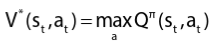

(1)

  * Trong đó: 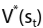 là giá trị tối ưu trả về từ giá trị kỳ vọng theo trạng thái st theo chính sách thực hiện π; maxQπ là giá trị Q lớn nhất thể hiện hành động at tại trạng thái st theo chính sách π.

Phương trình tính toán giá trị Q kỳ vọng thực hiện một hành động at tại trạng thái st dựa trên phương trình Bellman:

(2) 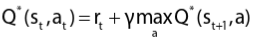

  * Trong đó: 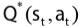 là giá trị kỳ vọng của phần thưởng mà phương trình hướng đến nhằm tối ưu cho mỗi cặp trạng thái st và hành động at tại thời điểm t; rt là phần thưởng tức thời nhận lại được tại thời điểm t; γlà hằng số chiết khấu xác định mức độ quan trọng được trao cho phần thưởng hiện tại và phần thưởng trong tương lai;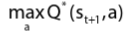 là giá trị kỳ vọng lớn nhất có thể xảy ra của Q tại trạng thái 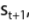 với mọi hành động a.

Q-Learning là một thuật toán Off-policy, quá trình học của mô hình chủ yếu dựa trên giá trị của chính sách tối ưu và độc lập với các hành động của chủ thể. Off-policy được định nghĩa là tác nhân tuân theo một chính sách quyết định cho việc lựa chọn hành động để đạt trạng thái từ trạng thái st . Kể từ trạng thái, tác nhân sử dụng một chính sách khác cho khâu quyết định này. Phương trình của thuật toán Q-Learning được trình bày như sau: 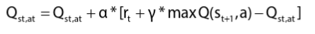

Q*(s, a) trong (3) là giá trị kỳ vọng (phần thưởng của chiết khấu tích lũy trong việc thực hiện hành động a ở trạng thái s và sau đó tuân theo chính sách tối ưu. Hành động từ mỗi trạng thái thu được của thuật toán Q-Learning được xác định bởi quy trình ra quyết định Markov (MDP) [15, 16]. Các bước triển khai thuật toán được trình bày như trong bảng 1.

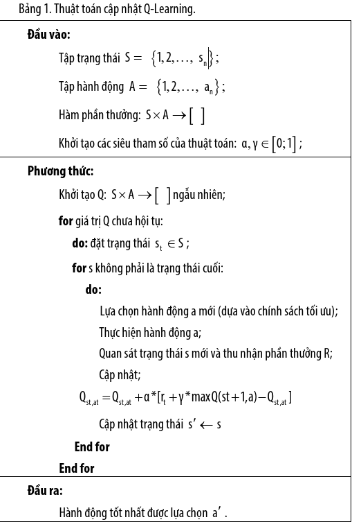

2.2. Thuật toán SARSA

Tương tự Q-Learning, SARSA là một thuật toán học tăng cường tuân thủ theo phương thức cập nhật Value-based và được tính toán dựa trên phương trình Bellman. Tuy nhiên, SARSA là một thuật toán On-policy. Thuật toán On-policy là thuật toán đánh giá và cải thiện cùng một chính sách π, hay nói cách khác tác nhân học và tuân theo một chính sách duy nhất xuyên suốt quá trình đào tạo.

SARSA là một thuật toán chỉ định rằng tại trạng thái thời điểm st , thực hiện hành động at , tiếp đó phần thưởng rt được nhận lại và kết thúc với trạng thái 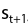 , đồng thời thực hiện hành động 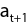 . Do đó, chuỗi giá trị 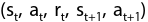 đại diện cho chính tên gọi của thuật toán. Điểm khác biệt duy nhất là thành phần 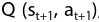, thay vì tối đa hoá cập nhật dựa trên giá trị Q kỳ vọng cao nhất 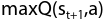trong bảng giá trị kinh nghiệm như Q-Learning. SARSA được thiết lập thêm bước cập nhật hành động tại thời điểm kế tiếp. Phương trình cơ bản của thuật toán SARSA được trình bày như trong (4) và các bước triển khai thuật toán được mô tả trong bảng 2.

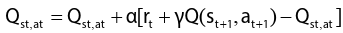

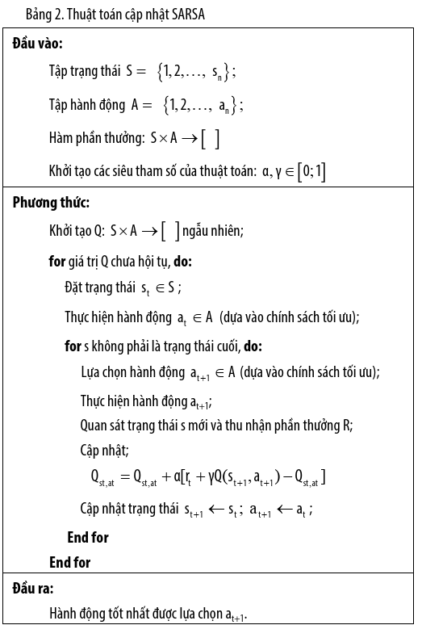