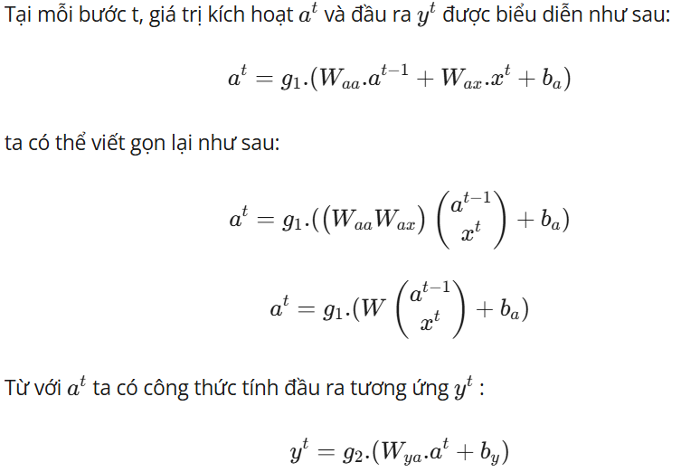
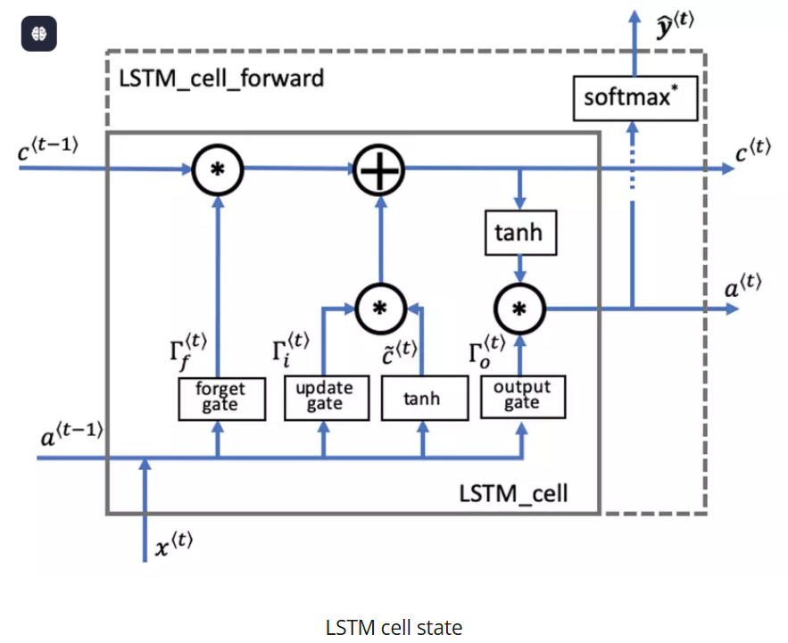
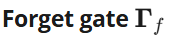
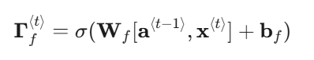
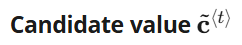
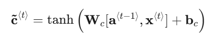
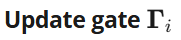
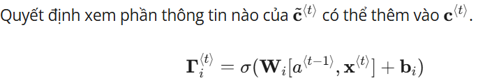
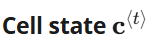
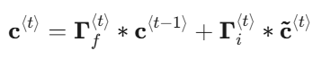

# Public_113

**1\. Định nghĩa:**

Attention là một kĩ thuật được sử dụng trong các mạng neural, kỹ thuật này được sử dụng trong các mô hình thực hiện các task như dịch máy hay ngôn ngữ tự nhiên. BERT và GPT là 2 mô hình điển hình có sử dụng Attention. Attention là thành phần chính tạo nên sự đình đám của mô hình Transformer, mô hình này chính là sự đột phá trong các bài toán xử lý của NLP so với các mạng neural hồi quy. Vậy Attention là gì mà tại sao nó lại là sự khác biệt đến vậy, hãy cũng tôi đi tìm hiểu trong bài viêt ngày hôm nay với tiêu đề “Attention và sự hình thành của mô hình Transformer”

## **2\. Động lực cho sự phát triển của Attention**

### **2.1. Recurrent Neural Network (RNN) và sự hạn chế đáng kể**

#### **2.1.1. Ý tưởng cốt lõi của RNN**

Con người chúng ta không thể bắt đầu suy nghĩ của mình tại tất cả các thời điểm, cũng giống như việc bạn đang đọc bài viết này, bạn hiểu mỗi chữ ở đây dựa vào các chữ mà bạn đã đọc và hiểu trước đó, chứ không phải đọc xong là quên chữ đó đi rồi đến lúc gặp thì lại phải đọc và tiếp thu lại. Giống như trong bài toán của chúng ta. Các mô hình mạng nơ-ron truyền thống lại không thể làm được việc trên. Vì vậy mạng nơ-ron hồi quy (RNN) được sinh ra để giải quyết việc đó. Mạng này chứa các vòng lặp bên trong cho phép nó lưu lại các thông tin đã nhận được. RNN là một thuật toán quan trọng trong xử lý thông tin dạng chuỗi hay nói cách khác là dạng xử lý tuần tự.

Vậy như nào là xử lý tuần tự - Xử lý tuần tự là mỗi block sẽ lấy thông tin của block trước và input hiện tại làm đầu vào

#### **2.1.2. Ưu điểm và nhược điểm của RNN**

| Ưu điểm | Nhược điểm |
| --- | --- |
| Khả năng xử lý các chuỗi đầu vào có độ dài khác
nhau | Tính toán khá chậm |
| Kích cỡ mô hình không bị tăng lên theo kích thước đầu
vào | Khó truy cập lại thông tin đã đi qua ở một khoảng thời gian
dài trước đó - hay còn gọi là bị quên thông tin khi gặp nhiều thông tin
mới |
| Quá trình tính toán có sử dụng thông tin trước đo | Phải thực hiện tuần tự nên không tận dụng triệt để được khả
năng tính toán song song của GPU |
| Trọng số được chia sẻ trong suốt qua trình học | Vanishing gradient |

 

### **2.2. Vấn đề gặp phải của Long Short Term Memory (LSTM)**

#### **2.2.1 Ý tưởng cốt lõi của LSTM (Long short term memory)**

LSTM là một dạng đặc biệt của RNN, nó có khả năng học các thông tin ở xa. Về cơ bản thì LSTM và RNN không khác nhau là mấy nhưng LSTM có cải tiển một số phép tính trong 1 hidden state và nó đã hiểu quả. Hiệu quả như nào thì chúng ta hãy cũng đọc tiếp nhé!

Cấu trúc của LSTM không khác gì RNN, nhưng sự cải tiến ở đây năm ở phần tính toán trong từng hidden state như sau: Thay vì chỉ có một tầng mạng nơ-ron, LSTM thiết kế với 4 tầng mạng nơ-ron tương tác với nhau một các rất đặc biệt.

Dưới đây là 2 hình ảnh biểu diễn sự khác nhau giữa RNN và LSTM

Chìa khóa để giúp LSTM có thể truyền tải thông tin giữa các hidden state một các xuyên suốt chính là cell state (hình dưới):

Đầu ra là hàm sigmoid chứa các giá trị từ 0 đến 1.

Nếu forget gate có giá trị bằng 0, LSTM sẽ "quên" trạng thái được lưu trữ trong đơn vị tương ứng của trạng thái cell trước đó.

Nếu cổng quên có giá trị bằng 1, LSTM sẽ chủ yếu ghi nhớ giá trị tương ứng ở trạng thái được lưu trữ.

Chứa thông tin có thể được lưu trữ từ time step hiện tại.

Là bộ nhớ trong của LSTM. Cell state như 1 băng tải truyền các thông tin cần thiết xuyết suất cả quá trình, qua các nút mạng và chỉ tương tác tuyển tính 1 chút. Vì vậy thông tin có thể tuyền đi thông suốt mà không bị thay đổi.

