# Public_130

## 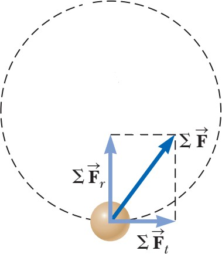 Chuyển động tròn không đều

Ở chương 4, chúng ta đã khảo sát chuyển động trên một đoạn đường tròn với tốc độ thay đổi thì ngoài gia tốc hướng tâm sẽ có thêm thành phần gia tốc tiếp tuyến. Điều đó, có nghĩa là lực tác dụng lên chất điểm cũng có thể phân tích ra thành phần hướng tâm và thành phần tiếp tuyến.
Bởi vì, gia tốc tổng cộng có dạng: _a_ = _ar_ \+ _at_ nên tổng hợp
lực tác dụng lên chất điểm được biểu diễn là:
Vectơ ∑
là lực hướng tâm, có chiều vào tâm của quỹ
đạo tròn là lực gây ra gia tốc hướng tâm, còn vectơ ∑
tiếp tuyến với đường tròn, là lực
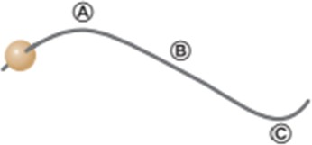gây ra gia tốc tiếp tuyến làm thay đổi tốc độ của chất điểm theo thời gian.
_**Câu hỏi 6.1:**_ Một hạt gỗ đục lỗ trượt dọc theo sợi dây có dạng như hình 6.6: a) Hãy vẽ các vectơ lực tác dụng lên hạt gỗ tại các vị trí A, B và C . b) Giả sử rằng hạt gỗ được tăng tốc với gia tốc tiếp tuyến không đổi khi chuyển động hướng sang phải. Hãy vẽ các vectơ lực tác dụng lên hạt gỗ tại các điểm A, B và C.
_Hình 6.6: một hạt gỗ chuyển động dọc theo sợi dây_

### Bài tập mẫu 6.5: Chuyển động tròn không đều theo phương thẳng đứng

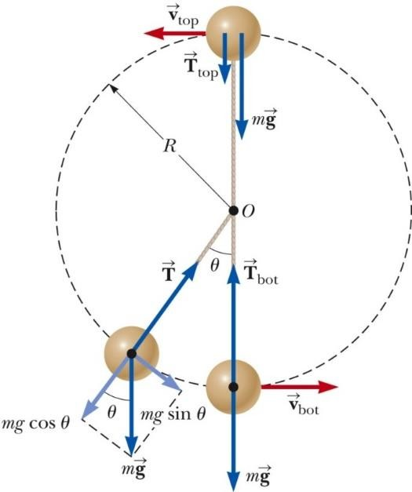Một quả cầu nhỏ khối lượng m được gắn vào đầu một sợi dây có chiều dài R và đang quay theo phương thẳng đứng quanh điểm O cố định như hình vẽ. Hãy xác định gia tốc tiếp tuyến của quả cầu và lực căng dây khi vận tốc của quả cầu là v và sợi dây tạo một với phương thẳng đứng một góc θ.

### Giải:

**Khái niệm:** So sánh chuyển động của quả cầu ở hình 6.7 và những đứa trẻ ở hình 6.4 thì thấy rằng cả hai đều chuyển động theo quỹ đạo tròn, nhưng điều khác ở đây là quả cầu chuyển động không đều, do đó, ở tại hầu hết các điểm trên quỹ đạo chuyển động của quả cầu, thành phần gia tốc tiếp tuyến được đóng góp bởi lực hấp dẫn.
**Phân loại:** Bài toán này sẽ sử dụng mô hình _chất điểm chuyển động dưới tổng hợp lực,_ và chịu tác dụng của lực hấp dẫn trong toàn bộ quá trình chuyển động.
**Phân tích:** Từ hình 6.7, các lực tác dụng lên quả
cầu chỉ có 2 lực: lực hấp dẫn của Trái Đất tác _Hình 6.7: Một quả cầu được gắn vào_
dụng lên quả cầu
và _T_ lực căng dây.
_một sợi dây và quay theo phương_
Trọng lực
sẽ được phân tích thành 2 thành
_thẳng đứng._
phần, theo phương tiếp tuyến là _mgsinθ_ và theo phương hướng tấm là _mgcosθ_. Áp dụng định luật 2 Newton theo phương tiếp tuyến:
∑ _Ft_ = _mg_ sinθ = _mat_ → _at_ = _g_ sinθ
Áp dụng định luật 2 Newton theo phương hướng tâm:

_mv_ 2

∑ _Fr_ = _T_ − _mg_ cosθ = _mar_ = _R_
Do đó, đối với chuyển động tròn không đều. Lực căng dây được tính theo công thức:
 _v_ 2 
_T_ = _mg_  + cosθ 
 
(6.6)
Xét điểm trên cùng và dưới cùng của đường tròn. Ta thấy: Lực căng tại điểm dưới cùng là lớn nhất:
=  _v_ 2 
_T mg_  __bot__ \+ 1
 _Rg_ 

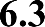

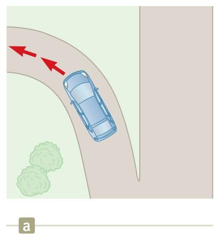Lực quán tính là kết quả khi chúng ta xét chuyển động trong một hệ quy chiếu không (phi) quán tính.
Lực quán tính xuất hiện và tác dụng lên vật giống như một lực thực, tuy nhiên chúng ta không thể phát hiện vật thứ hai nào gây ra lực quán tính đó. Nên nhớ rằng lực thực luôn gây ra bởi tương tác giữa hai vật nào đó.
Lực quán tính dễ thấy nhất khi các vật chuyển động thẳng có gia tốc.

### Lực ly tâm

Đối với hệ quy chiếu gắn với hành khách (trên hình 6.8b), một lực xuất hiện đẩy cô ta nghiêng khỏi ghế về phía bên phải.
Đối với hệ quy chiếu gắn với Trái Đất, chiếc xe hơi tác dụng một lực về bên trái vào hành khách (hình 6.8c).
Lực đẩy hành khách ra ngoài được gọi là lực ly tâm. Nó là lực quán tính do xuất hiện gia tốc hướng tâm khi xe chuyển hướng.
Còn trên thực tế, lực ma sát chính là lực giữ cho hành khách chuyển động cùng với chiếc xe. Do đó, nếu lực ma sát không đủ lớn, hành khách sẽ tiếp tục chuyển động thẳng theo phương ban đầu theo định luật 1 Newton.

### Lực Coriolis

Đây là lực xuất hiện bởi sự thay đổi bán kính quỹ đạo của một vật trong một hệ quy chiếu đang quay.
Trong hình vẽ 6.9, kết quả của chuyển động quay của vòng xoay là đường cong của quả bóng ném.
Đối với người bắt bóng, một lực theo phương ngang tác dụng vào làm quả bóng chuyển động cong.

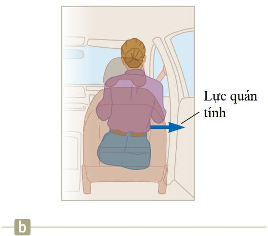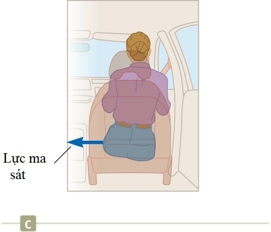

_Hình 6.8: a. Khi chiếc xe đi vào đoạn đường rẽ sang trái thì hành khách bị nghiêng sang phải, lực tác dụng: b. đối với hành khách. c. đối với Trái Đất_

_Hình 6.9: Khi 2 người bạn đứng trên một vòng xoay lớn, bạn cố gắng ném bóng thẳng về phía bạn mình. a. đối với người quan sát đứng dưới mặt đất. b. đối với người quan sát đứng cùng trên vòng quay._

### Ví dụ về lực quán tính:

Mặc dù lực quán tính không phải lực thực, nhưng nó lại gây ra những tác động thực. Ví
dụ:

  * Những vật trên xe hơi thường bị trượt đi.

  * Bạn cảm giác như bị đẩy ra ngoài khi ngồi trên một bề mặt đang quay.

  * Lực Coriolis chịu trách nhiệm cho chuyển động quay trong hệ thống thời tiết, bao gồm cả bão, và các dòng hải lưu.

_**Câu hỏi 6.2:**_ Một hành khách ngồi trên xe đang rẽ trái như hình 6.8. Chọn phát biểu đúng về lực theo phương nằm ngang nếu hành khách ấy đặt tay lên cửa sổ: a) Hành khách ấy ở trạng thái cân bằng bởi lực thực tác dụng sang bên phải và lực thực tác dụng sang bên trái. b) Hành khách chịu tác dụng của lực chỉ tác dụng sang bên phải. c) Hành khách chỉ bị lực thực tác dụng sang bên trái. d) Không có phát biểu nào ở trên đúng.

### Lực quán tính trong chuyển động thẳng

Đối với quan sát viên ở ngoài xe (hình a), gia tốc của quả cầu do thành phần nằm ngang của lực căng dây gây ra. Còn vật ở trạng thái cân bằng theo phương thẳng đứng

∑ _Fx_ = _T_ sinθ = _ma_

∑ _Fy_ = _T_ cosθ − _mg_ = 0
Đối với quan sát viên trên xe (hình b), tổng hợp lực tác dụng lên quả cầu bằng 0 và vật ở trạng thái cân bằng theo cả hai phương

| 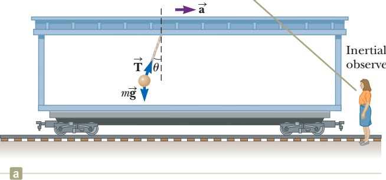 | 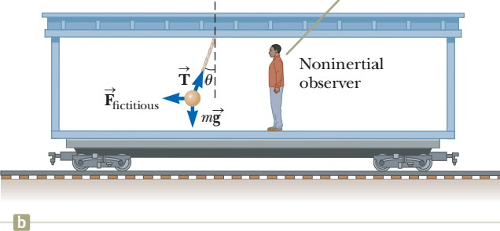 |
| --- | --- |

 

_Hình 6.10: Một quả cầu nhỏ được treo trên một sợi dây cột trên trần một toa tàu. Các lực tác dụng lên quả cầu đối với: ass. hệ quy chiếu quán tính. b. hệ quy chiếu phi quán tính_
∑ _F_ ' _x_ = _T_ sinθ − _Ffictitious_ = _ma_

∑ _F_ ' _y_ = _T_ cosθ − _mg_ = 0

Và hai phương trình ở hai hệ quy chiếu sẽ thỏa mãn khi:
_Ffictiitous = ma_ (6.7)

##  Chuyển động với lực cản

Chuyển động của một vật có thể trong một môi trường nào đó như chất lỏng, hoặc chất
khí. Và môi trường sẽ tác dụng lên vật một lực cản khi vật chuyển động trong nó.
Độ lớn của lực cản phụ thuộc vào nhiều yếu tố như: bản chất môi trường, tốc độ của
vật, hình dạng và kích thước của vật.
Hướng của lực cản luôn ngược với hướng chuyển động của vật so với môi trường.
gần như luôn tăng cùng với sự tăng của tốc độ. Độ lớn của lực cản phức tạp vào tốc độ. Chúng ta chỉ khảo sát hai trường hợp:
phụ thuộc rất

  *  tỉ lệ với tốc độ ( _v_ ): _đối với_ các trường hợp vật chuyển động với tốc độ nhỏ và các vật có kích thước nhỏ (ví dụ như các hạt bụi chuyển động trong không khí).

  * tỉ lệ với bình phương tốc độ ( _v_ 2 ): trong trường hợp vật có kích thước lớn (ví dụ như người nhảy dù).

### Lực cản tỉ lệ với tốc độ

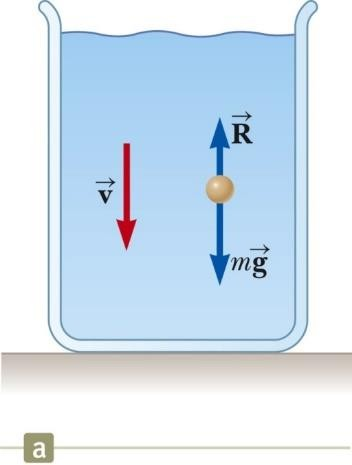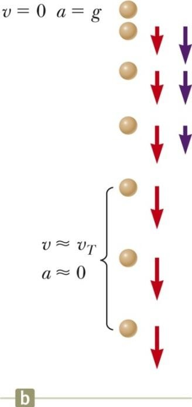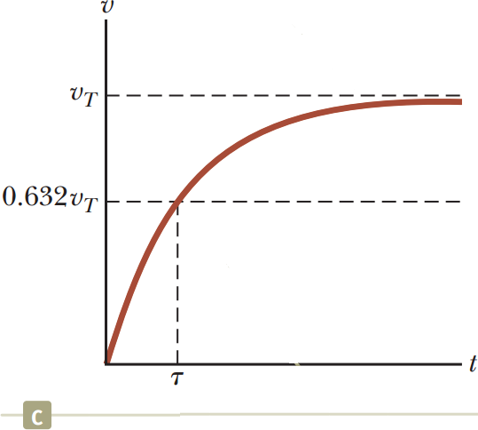Lực cản có thể cho bởi công thức:

(6.8)

Với _b_ phụ thuộc vào tính chất của môi trường và hình dáng, kích thước của vật. 𝑣⃗ là vận tốc của vật đối với môi trường. Dấu trừ trong công thức thể hiện lực cản ngược hướng với chiều chuyển động.

### Bài tập mẫu 6.6:

Xét một quả cầu nhỏ có khối lượng m đang rơi trong chất lỏng từ trạng thái nghỉ.
Những lực tác dụng lên vật:

  * Lực cản

  * Lực hấp dẫn

Kết quả của chuyển động là:
_mg_ − _bv_ = _ma_ = _m dv_
_dt_
_a_ = _dv_
= _g_ − _b v_
_dt m_
Lực cản tỉ lệ với tốc độ:

  * Tại thời điểm ban đầu, _v_ = 0 và _dv_ / _dt_ = _g_

  * Theo thời gian, _lực cản R tăng, còn gia tốc giảm dần._

Gia tốc của vật bằng 0 khi _R_ = _mg_
Lúc này, tốc độ v đạt đến tốc độ tốc giới hạn và không thay đổi nữa.
Vận tốc giới hạn
Để tìm vận tốc giới hạn, ta có _a_ = 0
_v_ = _mg_
_T b_
Giải phương trình vi phân, ta được:
_v_ = _mg_ (1− _e_ − _bt_  _m_ ) = _v_
(1− _e_ − _t_ τ )
Với _τ_ là hằng số thời gian, có độ lớn: τ = __m__
_b_

### Lực cản tỉ lệ thuận với bình phương tốc độ

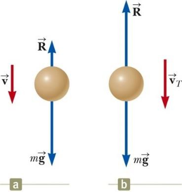Những vật chuyển động với tốc độ lớn trong không khí, lực cản của không khí sẽ tỉ lệ với bình phương vận tốc:
_R = ½ D_ ρ _Av 2_ (6.9)
Với _D_ là một đại lượng không thứ nguyên được gọi là hệ số cản, ρ là mật độ của không khí, _A_ là diện tích tiết diện vuông góc với vận tốc của vật, _v_ là tốc độ của vật.
Khảo sát một vật rơi trong không khí khi tính đến lực cản của không khí:
∑ _F_ = _mg_ − _1_ _D_ ρ _Av_ 2 = _ma a_ = _g_ −  __D_ ρ _A__  _v_ 2
2  2 _m_ 

 

Vận tốc giới hạn sẽ đạt được khi gia tốc tiến tới 0.
_Hình 6.12: Chuyển động của một vật rơi trong chất lỏng._
Giải các phương trình trên ta sẽ được: _v T_ =
(6.10)
_Bảng 6.1: Một vài tốc độ giới hạn_

| Vật thể | Khối lượng (kg) | Diện tích mặt cắt (m2) | Vận tốc giới hạn (m/s) |
| --- | --- | --- | --- |
| Người nhảy dù | 75 | 0,7 | 60 |
| Quả bóng chày (bán kính 3,7 cm) | 0,145 | 4,2.10-3 | 43 |
| Quả golf (bán kính 2,1 cm) | 0,046 | 1,4.10-3 | 44 |
| Hạt mưa đá (bán kính 0,5 cm) | 4,8.10-4 | 7,9.10-5 | 14 |
| Giọt mưa (bán kính 0,2 cm) | 3,4.10-5 | 1,3.10-5 | 9 |