# Public_133

Khi giải quyết một bài toán cơ học ta có thể sử dụng nhiều phương pháp khác nhau. Đối với một số bài toán nếu ta dùng phương pháp này thì sẽ phức tạp nhưng nếu ta dùng phương pháp khác thì lại trở nên dễ dàng hơn. Ví dụ trường hợp người đàn ông đứng trên băng bắn cung tên hoặc tình huống các viên bi-da va chạm với nhau.
Giả sử xét một tình huống đơn giản là cho biết vận tốc của mũi tên ngay sau khi được bắn ra và yêu cầu tính vận tốc của người bắn cung ngay khi đó. Ta không thể giải bài toán này với các mô hình động học (chương 2), động lực học (chương 5), hoặc năng lượng (chương 7). Tuy nhiên, ta có thể giải quyết bài toán này một cách dễ dàng dùng cách tiếp cận liên quan đến động lượng.
Chương này sẽ trình bày các khái niệm động lượng, xung lượng, các định lý liên quan đến động lượng, xung lượng, từ đó đưa ra phương pháp giải các bài toán cơ học liên quan đến động lượng, đặc biệt là các bài toán va chạm.

## 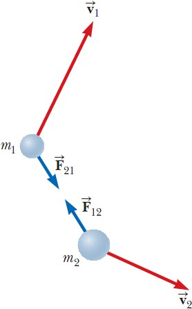 Động lượng

Xét hệ cô lập gồm 2 chất điểm có khối lượng m1, m2, chuyển động với các vận tốc 𝑣⃗1 và 𝑣⃗2 (hình 9.1). Vì hệ cô lập nên lực tác dụng lên chất điểm này là do chất điểm kia gây ra. Nếu chất điểm 1
tác dụng lên chất điểm 2 một lực 𝐹⃗12 thì chất điểm 2 cũng tác dụng lên chất điểm 1 một lực 𝐹⃗21 bằng về độ lớn nhưng ngược chiều. Các lực này tạo thành một cặp lực-phản lực theo định luật 3 Newton,
𝐹⃗12 = −𝐹⃗21, nên ta có: 𝐹⃗12 + 𝐹⃗21 = 0.
Theo định luật 2 Newton: lực tác dụng lên mỗi chất điểm bằng
𝑚𝑎⃗ nên:
𝑚1𝑎⃗1 + 𝑚2𝑎⃗2 = 0
Thay các gia tốc bằng biểu thức định nghĩa của nó theo phương trình 4.5, ta có:
_Hình 9.1 Hai chất điểm tương tác với nhau_

𝑚1

𝑑𝑣⃗1
𝑑𝑡 + 𝑚2
𝑑𝑣⃗2
= 0
𝑑𝑡
Nếu các khối lượng m1, m2 không đổi, ta có thể đưa chúng vào trong dấu đạo hàm:
𝑑(𝑚1𝑣⃗1)
+
𝑑𝑡
𝑑(𝑚2𝑣⃗2)
= 0
𝑑𝑡

 _d_ ( _m_ 1 _v_ 1 \+ _m_ 2 _v_ 2 ) = 0

_dt_

(9.1)

Vì đạo hàm của tổng 𝑚1𝑣⃗1 + 𝑚2𝑣⃗2 theo thời gian bằng không, nên tổng này là không đổi. Đại lượng _mv_ được gọi là động lượng của một chất điểm, và đối với hệ các chất điểm cô lập, tổng các đại lượng này được bảo toàn.

### Định nghĩa động lượng của chất điểm:

_Động lượng của một chất điểm có khối lượng m chuyển động với vận tốc_ 𝑣⃗ _được xác định bằng tích của khối lượng và vận tốc của nó:_

(9.2)

Động lượng là một đại lượng vectơ, hướng dọc theo 𝑣⃗, thứ nguyên là ML/T, đơn vị trong hệ SI là kg.m/s.
Nếu chất điểm chuyển động theo hướng bất kỳ thì động lượng 𝑝⃗ có 3 thành phần, và phương trình (9.2) viết cho các thành phần là:

𝑝𝑥 = 𝑚𝑣𝑥 𝑝𝑦 = 𝑚𝑣𝑦 𝑝𝑧 = 𝑚𝑣𝑧

Khái niệm động lượng giúp ta phân biệt một cách định lượng giữa các vật nặng và vật nhẹ chuyển động với cùng vận tốc. Ví dụ động lượng của một quả bóng bowling thì lớn hơn nhiều so với động lượng của một quả bóng tennis chuyển động với cùng vận tốc. Newton đã gọi 𝑚𝑣⃗ là _khối lượng chuyển động_ ; thuật ngữ này có lẽ sinh động hơn thuật ngữ _động lượng_ ta dùng hiện nay.

### Phân biệt động năng và động lượng:

_Thứ nhất, động năng là đại lượng vô hướng còn động lượng là đại lượng vectơ_. Ví dụ xét hai chất điểm có khối lượng bằng nhau chuyển động về phía nhau theo một đường thẳng với cùng tốc độ. Động năng của hệ này khác không, động lượng của hệ này bằng không.
_Thứ hai là động năng có thể chuyển hóa thành các dạng năng lượng khác chẳng hạn như thế năng hoặc nội năng, còn động lượng không chuyển đổi được thành năng lượng._ Các khác biệt này đủ để tạo ra các mô hình phân tích dựa vào động lượng, tách biệt với các mô hình dựa vào năng lượng, cung cấp một công cụ độc lập để sử dụng trong việc giải quyết các bài toán.
Theo định luật 2 Newton, ta có:
𝑑𝑣⃗

∑ 𝐹⃗ = 𝑚𝑎⃗ = 𝑚

𝑑𝑡
Giả sử khối lượng m là không đổi, ta có thể đưa khối lượng m vào trong dấu đạo hàm, nên:

 _F_ = __d_ ( _mv_ )_ = __dp__

_dt dt_

(9.3)

_Phương trình (9.3) là dạng khác của định luật 2 Newton đối với chất điểm_. Phương trình này chỉ ra **rằng tốc độ biến thiên theo thời gian của động lượng của chất điểm thì bằng hợp lực tác dụng lên chất điểm**. Dạng này tổng quát hơn dạng đã giới thiệu ở chương 5, và có thể sử dụng để khảo sát các hiện tượng trong đó khối lượng thay đổi, ngoài các trường hợp
trong đó vận tốc thay đổi. Ví dụ trường hợp khối lượng của tên lửa thay đổi do nhiên liệu bị đốt và bị phóng ra khỏi tên lửa, ta không thể sử dụng phương trình ∑ 𝐹⃗ = 𝑚𝑎⃗ để phân tích mà phải dùng cách tiếp cận động lượng như sẽ trình bày trong mục 9.9.
_**Câu hỏi 9.1:**_ Hai vật có động năng bằng nhau. Độ lớn động lượng của chúng so với nhau thế nào? ( **a** ) p1 < p2 ( **b** ) p1 = p2 ( **c** ) p1 > p2 ( **d** ) không đủ thông tin để phát biểu.
_**Câu hỏi 9.2:**_ Giáo viên thể dục ném một quả bóng chày về phía bạn với một tốc độ nào đó và bạn bắt lấy nó. Tiếp theo giáo viên sẽ ném một quả bóng tập nặng gấp 10 lần quả bóng chày. Bạn có các lựa chọn sau: Bạn có thể bắt được quả bóng tập được ném với ( **a** ) cùng tốc độ với quả bóng chày, ( **b** ) cùng động lượng với quả bóng chày, hoặc ( **c** ) cùng động năng với quả bóng chày. Hãy sắp xếp các lựa chọn này từ dễ đến khó để bắt.

##  Mô hình phân tích: Hệ cô lập (động lượng)

Sử dụng định nghĩa động lượng, biểu thức 9.1 có thể viết là:
𝑑
𝑑𝑡 (𝑝⃗1 + 𝑝⃗2) = 0
Vì đạo hàm của động lượng toàn phần 𝑝⃗𝑡𝑜𝑡 = 𝑝⃗1 + 𝑝⃗2 bằng không, nên động lượng toàn phần của hệ hai chất điểm cô lập trong hình 9.1 là không đổi:
Hay:
hoặc viết theo dạng khác là:

𝑝⃗1𝑖 + 𝑝⃗2𝑖 = 𝑝⃗1𝑓 + 𝑝⃗2𝑓

(9.4)

9.5)

với 𝑝⃗1𝑖, 𝑝⃗2𝑖 là các giá trị đầu và 𝑝⃗1𝑓, 𝑝⃗2𝑓 là các giá trị cuối của động lượng của hai chất điểm.
Phương trình (9.5) chứng tỏ động lượng toàn phần theo các hướng x, y, z đều được bảo toàn một cách độc lập:
_p_ 1 _ix_ \+ _p_ 2 _ix_ = _p_ 1 _fx_ \+ _p_ 2 _fx_
_p_ 1 _iy_ \+ _p_ 2 _iy_ = _p_ 1 _fy_ \+ _p_ 2 _fy_
_p_ 1 _iz_ \+ _p_ 2 _iz_ = _p_ 1 _fz_ \+ _p_ 2 _fz_
(9.6)
Phương trình (9.5) là dạng toán học của một mô hình phân tích mới, gọi là mô hình **hệ cô lập** ( **động lượng)**. Mô hình này có thể mở rộng cho hệ cô lập nhiều chất điểm bất kỳ như sẽ trình bày trong mục 9.7.
Từ phương trình (9.5) ta có thể phát biểu như sau: _Khi hai hay nhiều chất điểm của một hệ cô lập tương tác với nhau, động lượng toàn phần của hệ luôn không đổi._ Như vậy động lượng toàn phần của hệ cô lập tại các thời điểm bất kì đều bằng động lượng ban đầu của nó.
Mô hình phân tích hệ cô lập không cần xét đến ngoại lực tác dụng lên hệ, cũng như lực đó là lực bảo toàn hay không bảo toàn, lực biến thiên hay không biến thiên theo thời gian. Yêu cầu duy nhất là các lực phải là nội lực của hệ. Điều này cho thấy tầm quan trọng của mô hình mới này.

### Mô hình phân tích: Hệ cô lập (động lượng)

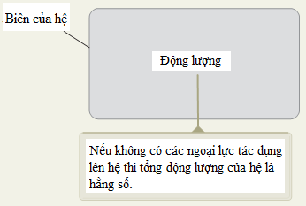Giả sử ta đã xác định được hệ cần phân tích và biên của nó. Nếu không có ngoại lực nào tác dụng lên hệ thì hệ là cô lập. Khi đó động lượng toàn phần của hệ được bảo toàn:
∆ _ptot_ = 0
Ví dụ:
(9.5)

  * Viên bi da cái đánh vào các viên bi da khác trên bàn

  * Tàu vũ trụ bắn tên lửa ra và chuyển động nhanh hơn trong không gian

  * Các phân tử chất khí ở một nhiệt độ xác định chuyển động và va chạm với nhau

### Bài tập mẫu 9.1:

Một người bắn cung đứng trên mặt băng không ma sát bắn một mũi tên nặng 0.03 kg theo phương ngang với vận tốc đầu 85 m/s. (A) Hỏi vận tốc của người sau khi mũi tên được bắn ra. (B) Điều gì xảy ra nếu mũi tên được bắn theo hướng hợp với phương nằm ngang một góc θ? Điều này sẽ làm thay đổi vận tốc giật lùi của người bắn cung như thế nào?

### Giải:

 **Phân tích bài toán:** Hãy tưởng tượng mũi tên bị bắn đi trên một đường thẳng và người bắn cung thủ chuyển động giật lùi theo hướng ngược lại. Ta không thể giải bài toán này với các mô hình dựa trên chuyển động, lực, hoặc năng lượng. Tuy nhiên, ta có thể giải quyết vấn đề này một cách dễ dàng với cách tiếp cận liên quan đến động lượng. Ta xét hệ gồm có người bắn cung (bao gồm cả cung) và mũi tên. Hệ không cô lập vì có lực hấp dẫn và phản lực pháp tuyến từ băng tác dụng lên hệ. Tuy nhiên, các lực này theo phương thẳng đứng và vuông góc với chiều
chuyển động của hệ. Không có ngoại lực tác dụng lên hệ theo phương ngang, và ta có thể áp dụng mô hình hệ cô lập (động lượng) đối với các thành phần động lượng theo hướng này.
_Hình 9.2 Bài tập mẫu 9.1 – Người bắn cung_

  1. Áp dụng mô hình hệ cô lập (động lượng) theo phương ngang, động lượng theo phương ngang của hệ trước và sau khi bắn đều bằng 0. Ta chọn hướng bắn mũi tên là hướng dương của trục x. Xem người bắn cung là chất điểm 1 và mũi tên là chất điểm 2, theo phương trình 9.5 ta được:

∆ _ptot_ = 0 →
Theo đề bài ta có m1 = 60 kg, m2 = 0,030 kg và _v_ 2 _f_
Giải phương trình này và thay số ta được:
= 85 _i_
m/s.

1 _f_

2 _f_
1
Dấu trừ chỉ ra rằng người bắn cung chuyển động về phía bên trái trên hình 9.2 sau khi bắn mũi tên, phù hợp với định luật 3 Newton. Gia tốc và vận tốc của người bắn cung nhỏ hơn nhiều so với gia tốc và vận tốc của mũi tên vì khối lượng của người bắn cung rất lớn so với mũi tên.

  2. Độ lớn của vận tốc giật lùi sẽ giảm vì chỉ một thành phần của vận tốc mũi tên là theo hướng x. Sự bảo toàn động lượng theo hướng x cho ta:

_m v_ \+ _m v_ cosθ = 0 dẫn tới _v_ =− _m_ 2 _v_ cosθ .

  1. 1 _f_

  2. 2 _f_

1 _f_ 2 _f_
1
Với các giá trị θ ≠ 0 thì _v_ 1 _f_ nhỏ hơn _v_ 1 _f_ khi θ = 0 vì cosθ < 1.

## 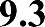 Mô hình phân tích: Hệ không cô lập (động lượng)

Đối với các khảo sát động lượng, _hệ không cô lập_ nếu có lực tác dụng lên hệ. Ta có thể hình dung động lượng được chuyển từ môi trường đến hệ thông qua lực. Việc hiểu được lực là nguyên nhân gây ra sự biến thiên động lượng rất quan trọng khi giải quyết một số loại bài toán.
Giả sử có một hợp lực ∑ 𝐹⃗ tác dụng lên chất điểm và hợp lực này có thể biến thiên theo thời gian. Theo định luật 2 Newton:
hay
𝑑𝑝⃗

∑ 𝐹⃗ =

𝑑𝑡
𝑑𝑝⃗ = ∑ 𝐹⃗ 𝑑𝑡 (9.7)
Ta có thể lấy tích phân biểu thức (9.7) để tìm độ biến thiên động lượng của chất điểm khi
có lực tác dụng lên nó trong một khoảng thời gian nào đó. Nếu động lượng của chất điểm thay đổi từ 𝑝⃗𝑖 tại thời điểm 𝑡𝑖 tới 𝑝⃗𝑓 tại thời điểm 𝑡𝑓, lấy tích phân phương trình 9.7 ta được:
𝑡𝑓
∆𝑝⃗ = 𝑝⃗𝑓 − 𝑝⃗𝑖 = ∫ ∑ 𝐹⃗ 𝑑𝑡

𝑡𝑖

(9.8)

Để tính tích phân này, ta cần biết hợp lực tác dụng lên chất điểm biến thiên theo thời gian như thế nào. Đại lượng ở vế phải của phương trình (9.8) được gọi là **xung của hợp lực** ∑ 𝐹⃗ tác dụng lên chất điểm trong khoảng thời gian ∆𝑡 = 𝑡𝑓 − 𝑡𝑖, kí hiệu là 𝐼⃗:

𝐼⃗ =

∫𝑡𝑓 ∑ 𝐹⃗ 𝑑𝑡
𝑡𝑖
(9.9)
Giả sử lực biến thiên theo thời gian như trên hình 9.3a và khác không trong khoảng thời gian ∆𝑡 = 𝑡𝑓 − 𝑡𝑖. Vectơ xung lực 𝐼⃗ cùng hướng với vectơ độ biến
thiên động lượng ∆𝑝⃗. Xung lực có thứ nguyên của động lượng là ML/T. Xung lực không phải là một thuộc tính của chất điểm, mà là số đo mức độ ngoại lực làm thay đổi động lượng của chất điểm.
Do hợp lực truyền xung lực cho chất điểm thường thay đổi theo thời gian, nên để thuận tiện, người ta định nghĩa hợp lực trung bình theo thời gian:
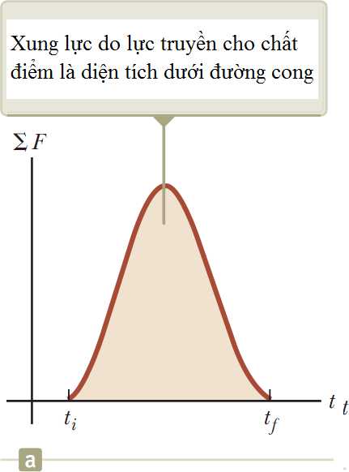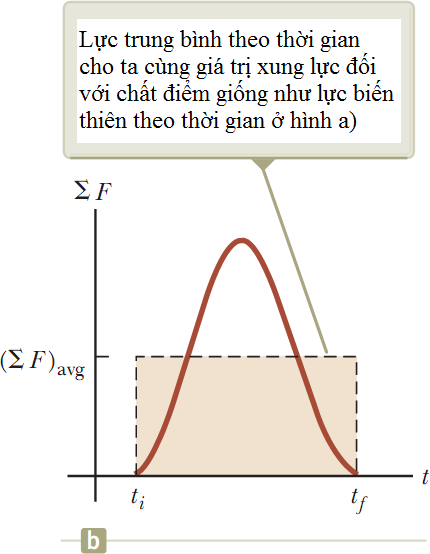 _Hình 9.3 (a) Lực tác dụng lên chất điểm biến thiên theo thời gian. (b) Giá trị của lực không đổi (đường nét đứt nằm ngang) được lấy sao cho diện tích của hình chữ nhật bằng diện tích dưới đường cong ở_
𝑡𝑓

(∑ 𝐹⃗)

𝑎𝑣𝑔

1
=
∆𝑡
∫ ∑ 𝐹⃗ 𝑑𝑡
𝑡𝑖

(9.10)

trong đó ∆𝑡 = 𝑡𝑓 − 𝑡𝑖. (Phương trình 9.11 là một áp dụng của định lý giá trị trung bình trong giải tích.) Do đó có thể biểu diễn phương trình 9.9 như là:
𝐼⃗ = (∑ 𝐹⃗) ∆𝑡 (9.11)
𝑎𝑣𝑔
Lực trung bình này, như chỉ ra trên hình 9.3b, có thể xem là lực không đổi tác dụng lên chất điểm trong khoảng thời gian ∆𝑡, có cùng xung lực với xung lực của lực biến thiên theo thời gian tác dụng lên chất điểm trong khoảng thời gian đó.
Nếu ∑ 𝐹⃗ là một hàm của thời gian, có thể tính được xung lực từ phương trình 9.9. Việc tính toán trở nên rất đơn giản nếu như lực tác dụng lên chất điểm là không đổi. Trong trường
hợp này, (∑ 𝐹⃗) = ∑ 𝐹⃗, trong đó ∑ 𝐹⃗ là hợp lực không đổi tác dụng lên chất điểm, và
𝑎𝑣𝑔
phương trình (9.11) trở thành:
𝐼⃗ = ∑ 𝐹⃗ ∆𝑡 (9.12)
Kết hợp các phương trình (9.8) và (9.9) ta được **định lý xung lượng-động lượng** :
_Độ biến thiên động lượng của một chất điểm thì bằng xung lượng của hợp lực tác dụng lên chất điểm đó:_
∆𝑝⃗ = 𝐼⃗ (9.13)
Phát biểu này tương đương với định luật 2 Newton. Khi nói một xung lực được truyền cho chất điểm, ta muốn nói rằng động lượng được truyền từ một tác nhân bên ngoài tới chất điểm
đó. Phương trình (9.13) có dạng tương tự với các phương trình bảo toàn năng lượng (8.1) và (8.2).
Phương trình 9.13 là phát biểu tổng quát nhất của nguyên lý **bảo toàn động lượng** và được gọi là **phương trình bảo toàn động lượng**. Trong cách tiếp cận động lượng, hệ cô lập xuất hiện thường xuyên hơn hệ không cô lập, nên phương trình (9.13) có thể xem như trường hợp đặc biệt của phương trình (9.5). Vế trái của phương trình (9.13) là độ biến thiên động lượng của hệ. Vế phải là số đo động lượng đi qua biên của hệ khi có lực tác dụng lên hệ. Phương trình (9.13) là phát biểu toán học của một mô hình phân tích mới, gọi là **mô hình hệ không cô lập (động lượng)**. Phương trình này có dạng tương tự phương trình (8.1) nhưng có một số khác biệt khi áp dụng cho các bài toán. Trước tiên, phương trình (9.13) là phương trình vectơ, trong khi phương trình (8.1) là phương trình vô hướng. Do đó hướng là quan trọng đối với phương trình (9.13). Thứ hai, chỉ có một loại động lượng nên chỉ có một cách duy nhất để tích trữ động lượng trong hệ. Ngược lại, như thấy từ phương trình (8.2), có 3 cách để tích năng lượng cho hệ là động năng, thế năng và nội năng. Thứ ba, chỉ có một cách để truyền động lượng cho hệ là tác dụng lực lên hệ trong một khoảng thời gian. Phương trình (8.2) chỉ ra 6 cách mà ta đã biết để truyền năng lượng cho một hệ. Do đó, không có sự mở rộng phương trình (9.13) tương tự như phương trình (8.2).
Trong nhiều tình huống người ta dùng “xấp xỉ xung lực”, bằng cách giả sử một trong các lực tác dụng lên chất điểm tác dụng trong một khoảng thời gian ngắn nhưng lớn hơn nhiều so với các lực khác cùng có mặt. Khi đó, hợp lực ∑ 𝐹⃗ trong phương trình (9.9) được thay thế bằng một lực đơn 𝐹⃗ để tính xung lực tác dụng lên chất điểm. Sự xấp xỉ này rất hữu ích khi xét các bài toán va chạm trong đó khoảng thời gian va chạm rất ngắn. Khi sử dụng xấp xỉ này, lực đơn được xem là một xung lực. Ví dụ khi quả bóng chày bị đánh bằng cái gậy, thời
gian va chạm khoảng 0,01s và lực trung bình mà gậy tác dụng lên quả bóng là vài ngàn Newton. Vì lực này lớn hơn nhiều so với trọng lực tác dụng lên quả bóng và cái gậy, nên sự xấp xỉ xung lực cho thấy việc bỏ qua trọng lực là đúng đắn. Khi dùng xấp xỉ này, cần nhớ rằng 𝑝⃗𝑖 và 𝑝⃗𝑓 là các động lượng tức thời trước và sau khi va chạm. Do đó trường hợp phù hợp để dùng xấp xỉ xung là khi va chạm chất điểm di chuyển một đoạn rất ngắn.
_**Câu hỏi 9.3:**_ Hai vật nằm yên trên một bề mặt không có ma sát. Vật 1 có khối lượng lớn hơn vật 2. ( **i** ) Khi một lực không đổi tác dụng lên vật 1, nó gia tốc vật trên quãng đường d theo một đường thẳng. Ngừng cho lực tác dụng lên vật 1 mà cho nó tác dụng lên vật 2. Tại thời điểm vật 2 được gia tốc qua cùng quãng đường d, phát biểu nào đúng? (a) p1 < p2, (b) p1 = p2,
(c) p1 > p2, (d) K1 < K2, (e) K1 = K2, (f) K1 > K2. ( **ii** ) Khi một lực không đổi tác dụng lên vật 1, nó gia tốc vật trong một khoảng thời gian ∆ t. Ngừng cho lực tác dụng lên vật 1 mà cho nó tác dụng lên vật 2. Từ danh sách các lựa chọn như trên, phát biểu nào là đúng sau khi vật 2 được gia tốc trong cùng khoảng thời gian ∆ t?
_**Câu hỏi 9.4:**_ Hãy xếp hạng từ lớn nhất đến nhỏ nhất một bảng điều khiển ô tô, một dây an toàn và một túi khí, mỗi cái được sử dụng một mình trong các va chạm có cùng tốc độ, về (a) xung lực và (b) lực trung bình mà mỗi cái mang lại cho một hành khách ngồi phía trước.

### 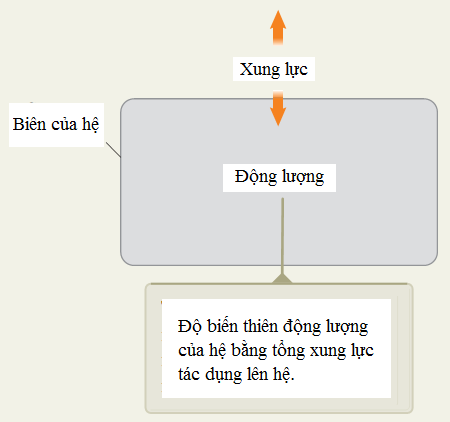Mô hình phân tích: Hệ không cô lập (động lượng)

Giả sử ta đã xác định được hệ cần phân tích và biên của nó. Nếu có ngoại lực tác dụng lên hệ thì hệ là không cô lập. Khi đó độ biến thiên động lượng toàn phần của hệ bằng xung lực tác dụng lên hệ (định lý
xung lực - động lượng):
Ví dụ:
∆ _ptot_ = _I_
(9.13)

  * Cái gậy đánh vào quả bóng chày

  * Dùng sợi dây kéo một ống chỉ đặt trên bàn

### Bài tập mẫu 9.3: Cái đỡ va tốt như thế nào?

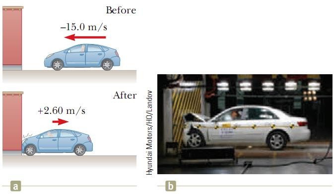Trong một thử nghiệm va chạm, một xe hơi có khối lượng 1500 kg va chạm với một bức tường như trên hình 9.4. Vận tốc của xe trước
và sau khi va chạm lần lượt là
_vi_ = −15 _i_ m/s
và _vf_ = 2, 6 _i_ m/s. (A) Va chạm kéo dài trong
0.15 s, hãy tìm xung lực c ủa vụ va chạm và lực trung bình tác dụng lên xe. (B) Điều gì xảy ra nếu chiếc xe không bật ra khỏi bức tường? Giả sử tốc độ cuối cùng của xe bằng không và khoảng thời gian của va chạm vẫn
_Hình 9.4 Bài tập mẫu 9.3_
ở mức 0.15 s. Điều đó có thể hiện là lực lớn hơn hoặc nhỏ hơn tác dụng lên xe không?

### Giải:

  1. Sử dụng công thức 9.13 để tính xung lực tác dụng lên xe hơi:

 _I_ = ∆ _p_ = p _f_ − p _i_ = _mvf_ − _mvi_ = _m_ ( _vf_ − _vi_ ) = 26400 _i_ kg.m/s
Dùng công thức (9.11) để tính lực trung bình tác dụng lên xe: (∑ _F_ )
N

_avg_

= __I__ = 176000 i
∆ _t_
Lực tính được ở trên là tổng hợp của phản lực vuông góc do tường tác dụng lên xe và lực ma sát giữa các lốp xe và mặt đất khi đầu xe bị biến dạng. Nếu các bánh xe quay tự do, lực ma sát này là tương đối nhỏ.

  2. Trong tình huống trên, khi mà chiếc xe bật ra khỏi tường, lực tác dụng lên xe thực hiện hai việc trong khoảng thời gian 0.15s: (1) nó dừng xe, và (2) nó làm cho xe chuyển động ra khỏi tường với tốc độ 2.60 m/s sau khi va chạm. Nếu chiếc xe không bật ra, lực chỉ thực hiện bước đầu tiên đó là dừng xe - đòi hỏi một lực nhỏ hơn. Trong trường hợp này, xung lực là:

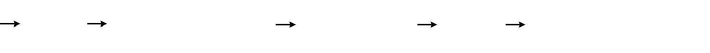 _I_ = ∆ _p_ = p _f_ − p _i_ = 0 − _mvi_ = _m_ ( _vf_ − _vi_ ) = 22500 _i_ kg.m/s và lực trung bình tác dụng lên xe là:
(∑ _F_ )

_avg_

= __I__ = 150000 i N.
∆ _t_

##  Va chạm một chiều

Thuật ngữ va chạm biểu thị sự kiện hai chất điểm đi lại gần nhau và tương tác với nhau bằng các lực. Các lực tương tác được giả sử rất lớn so với các ngoại lực có mặt, nên có thể sử dụng xấp xỉ xung lực.
Va chạm không chỉ xảy ra khi có sự tiếp xúc trực tiếp giữa hai vật thể vĩ mô, như mô tả trên hình 9.5a, mà phải được hiểu tổng quát hơn. Ví dụ xét một va chạm ở tỉ lệ nguyên tử giữa proton và hạt alpha (hình 9.5b). Vì cả hai hạt đều mang điện dương, chúng đẩy nhau, va chạm với nhau thông qua trường điện từ.
Khi hai vật có khối lượng m1 và m2 va chạm như trên hình 9.5, các xung lực có thể thay đổi rất phức tạp, chẳng hạn như trên hình 9.3. Tuy nhiên, bất kể sự phức tạp của xung lực, lực luôn là nội lực của hệ hai vật. Do đó, hai vật tạo thành một hệ cô lập và động lượng của hệ được bảo toàn trong va chạm bất kỳ. Tuy nhiên, tổng động năng của hệ có thể bảo toàn hoặc không, tùy thuộc vào loại va chạm.
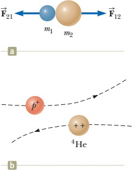
_Hình 9.5 (a) Va chạm giữa hai vật như kết quả của sự tiếp xúc trực tiếp, (b) "Va chạm" giữa hai hạt tích điện._
**Phân loại va chạm:** _Va chạm được chia thành va chạm đàn hồi hoặc va chạm không đàn hồi tùy thuộc vào việc động năng của hệ có bảo toàn hay không_.
_Va chạm đàn hồi_ gữa _hai vật là va chạm mà tổng động năng và tổng động lượng của hệ trước và sau khi va chạm là như nhau_. Va chạm giữa các vật trong thế giới vĩ mô, chẳng hạn giữa các quả bóng bi a, chỉ là xấp xỉ đàn hồi vì có xảy ra sự biến dạng và mất động năng. Ví dụ ta có thể nghe thấy tiếng các quả bi a va chạm nhau, như vậy có một số năng lượng từ hệ đã bị truyền đi xa bởi âm thanh. Va chạm đàn hồi phải hoàn toàn yên lặng
_Va chạm không đàn hồi là va chạm mà tổng động năng của hệ trước và sau khi va chạm khác nhau (mặc dù động lượng của hệ được bảo toàn)._ Các va chạm không đàn hồi có hai loại. Khi các vật dính vào nhau sau khi va chạm được gọi là _va chạm hoàn toàn không đàn hồi_ , ví dụ khi một thiên thạch va chạm với Trái đất. Khi các vật va chạm nhưng không dính vào nhau, nhưng một phần năng lượng bị chuyển sang dạng năng lượng khác hoặc bị truyền ra xa, như trường hợp quả bóng cao su va chạm với một bề mặt cứng, thì va chạm được gọi là _không đàn hồi_. Khi quả bóng cao su va chạm với nền cứng, một phần động năng của quả bóng bị chuyển đổi (sang nhiệt) khi quả bóng bị biến dạng trong khi nó tiếp xúc với bề mặt cứng. Các va chạm không đàn hồi được mô tả bằng cách diễn giải động lượng của mô hình hệ cô lập.

### Va chạm hoàn toàn không đàn hồi

Xét 2 vật khối lượng m1 và m2, chuyển động với các vận tốc ban đầu 𝑣⃗1𝑖, 𝑣⃗2𝑖 dọc theo một đường thẳng như trên hình 9.6. Hai vật va chạm trực diện với nhau, dính vào nhau và sau va chạm chúng chuyển động với vận tốc chung 𝑣⃗𝑓. Do động lượng của một hệ cô lập được bảo toàn trong va chạm bất kì, ta có tổng động lượng trước khi va chạm bằng với động lượng của hệ
hợp lại sau khi va chạm:

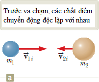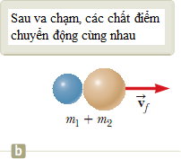

_Hình 9.6 Giản đồ biểu diễn va chạm xuyên tâm hoàn toàn không đàn hồi giữa hai chất điểm_
𝑚1𝑣⃗1𝑖 + 𝑚2𝑣⃗2𝑖 = (𝑚1 + 𝑚2)𝑣⃗𝑓 (9.14)
Giải phương trình này đối với ẩn số là vận tốc sau va chạm, ta được:
𝑚1𝑣⃗1𝑖 + 𝑚2𝑣⃗2𝑖