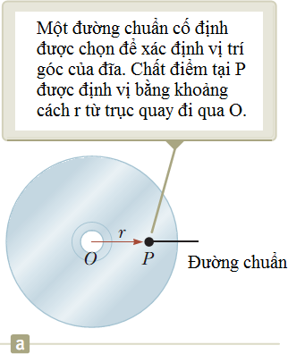
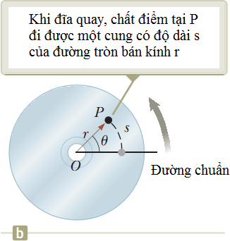
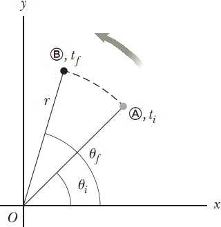
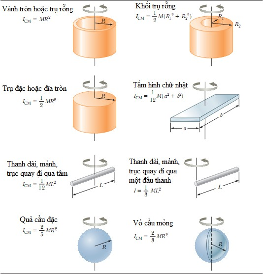
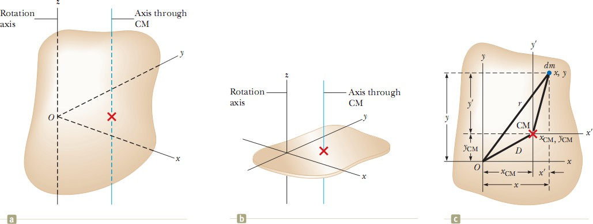
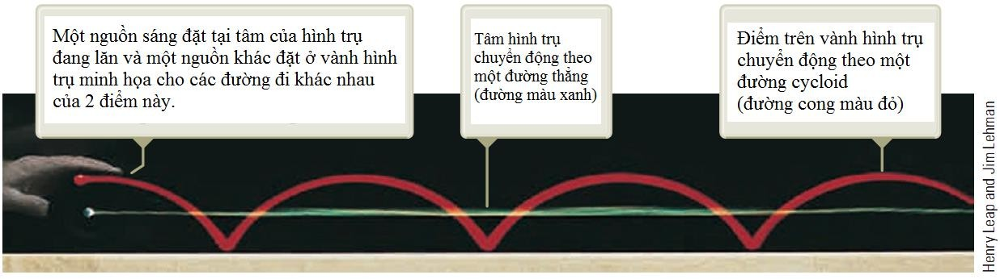
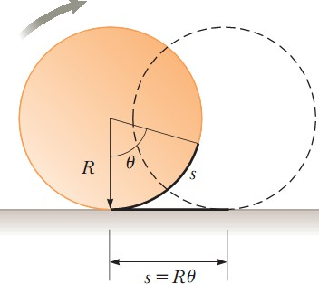
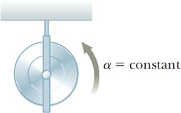
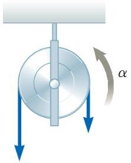

# Public_134

_Trong chương này ta sẽ phân tích kĩ chuyển động quay của một vật rắn, cụ thể là phân tích mô hình vật rắn quay với gia tốc góc không đổi, từ đó dẫn ra các phương trình động lực học của mô hình này_. Lưu ý, vật rắn là vật không bị biến dạng, tức là vị trí tương đối của các chất điểm cấu tạo nên hệ luôn không đổi. Mọi vật thể thực tế đều bị biến dạng ở mức độ nào đó; tuy nhiên, trong các phân tích dưới đây ta bỏ qua sự biến dạng của vật.

##  Tọa độ góc, vận tốc góc và gia tốc góc

Hình 10.1 minh họa một đĩa CD đang quay quanh trục cố định vuông góc với mặt phẳng hình vẽ và đi qua tâm O của đĩa. Một yếu tố nhỏ của đĩa được mô hình hóa như một chất điểm tại P, cách gốc O một khoảng cố định r và quay quanh O theo một vòng tròn bán kính r.
Ta biểu diễn vị trí của P theo tọa độ cực (𝑟, 𝜃), với _r là khoảng cách từ gốc tọa độ tới P_ , 𝜃 _là góc quay_ ngược
chiều kim đồng hồ từ một đường cố định được chọn làm mốc (đường chuẩn) như trên hình 10.1. Góc 𝜃
_Hình 10.1 Một đĩa compact quay quanh trục cố định qua O và vuông góc với mặt phẳng hình vẽ_
thay đổi theo thời gian, còn r không thay đổi. Khi chất điểm chuyển động dọc theo đường tròn bắt đầu từ đường chuẩn (𝜃 = 0), nó chuyển động qua một cung có độ dài s như trên hình 10.1b. Ta có:
𝑠 = 𝑟𝜃 (10.1a)

𝑠

𝜃 =
𝑟

(10.1b)

Vì 𝜃 là tỉ số giữa độ dài của cung và bán kính của đường tròn nên nó là một số thuần túy (không có đơn vị). Tuy nhiên, ta thường cho đơn vị (giả) của 𝜃 là radian (rad).
_**Tọa độ góc θ:**_ Vì đĩa là một vật rắn nên khi chất điểm tại P chuyển động quét qua một góc 𝜃 tính từ đường chuẩn thì mỗi yếu tố khác của vật cũng quay và quét qua một góc 𝜃. Nên ta có thể liên kết góc 𝜃 với toàn bộ vật, cũng như liên kết với từng chất điểm riêng biệt, cho phép xác định tọa độ góc của vật rắn trong chuyển động quay. Chọn một đường chuẩn trên vật thì _tọa độ góc của vật rắn là góc_ 𝜃 _giữa đường chuẩn này và một đường chuẩn cố định_
_khác (thường là trục x)_. Tọa độ góc θ trong chuyển động quay đóng vai trò tương tự như vị trí x trong chuyển động tịnh tiến.
Khi chất điểm đang xét chuyển động từ vị trí A tới vị trí B trong khoảng thời gian ∆𝑡 như trên hình 10.2, đường chuẩn gắn với vật quét được một góc ∆𝜃 = 𝜃𝑓 − 𝜃𝑖. Đại lượng ∆𝜃 này được gọi là _**độ dời góc**_ của vật rắn:

∆𝜃 ≡ 𝜃𝑓 − 𝜃𝑖

Nếu vật rắn quay nhanh, độ dời này diễn ra trong một khoảng thời gian ngắn. Nếu vật rắn quay chậm, độ dời này diễn ra trong một khoảng thời gian dài hơn. Các tốc độ quay khác nhau được định lượng bởi khái niệm tốc độ góc trung bình 𝜔𝑎𝑣𝑔, là tỉ số giữa độ dời góc của vật rắn và khoảng thời gian ∆𝑡 diễn ra độ dời đó:

𝜔𝑎𝑣𝑔 =

𝜃𝑓 − 𝜃𝑖
𝑡𝑓 − 𝑡𝑖
∆𝜃
= (10.2)
∆𝑡
_**Tốc độ góc tức thời ω**_ được xác định bằng giới hạn của tốc độ góc trung bình khi ∆𝑡 → 0:
_Hình 10.2 Chất điểm trên vật rắn quay từ (A) tới (B) dọc theo_
𝜔 ≡ lim ∆𝜃 = 𝑑𝜃

∆𝑡→0 ∆𝑡 𝑑𝑡

(10.3)

_cung tròn. Trong khoảng_ ∆𝑡 =

𝑡𝑓 − 𝑡𝑖 _, r quét qua một góc_

Đơn vị tốc độ góc là rad/s, có thể viết là s-1 vì rad không có thứ nguyên. 𝜔 dương khi 𝜃 tăng (chuyển động cùng chiều kim đồng hồ), 𝜔 âm khi 𝜃 giảm (chuyển động ngược chiều kim đồng hồ)
_Tính mômen quán tính của các vật rắn có hình dạng đơn giản (có tính đối xứng cao)_ là tương đối dễ với điều kiện trục quay trùng với một trục đối xứng, như trình bày trong mục
10.6 tiếp theo.

_Bảng 10.2: Mômen quán tính của các vật rắn đồng nhất có hình dạng khác nhau_
_**Câu hỏi 10.5:**_ Bạn tắt máy khoan điện và thấy rằng khoảng thời gian để cho mũi khoan dừng lại do mômen lực ma sát trong máy khoan là ∆ t. Bạn thay một mũi khoan lớn hơn có mômen quán tính gấp đôi. Khi mũi khoan lớn hơn này đang quay với tốc độ góc như cái nhỏ lúc đầu và khoan được ngắt điện, mômen lực ma sát vẫn giữ nguyên như trường hợp mũi khoan nhỏ.
Khoảng thời gian để mũi khoan lớn hơn dừng lại là (a) 4 ∆t (b) 2 ∆t

  2. ∆t

  3. 0.5 ∆t

  4. 0.25

∆t (f) không thể xác định được.

### Định lý các trục song song:

Việc tính mômen quán tính đối với một trục quay bất kì là khó khăn, ngay cả với vật có tính đối xứng cao. Ta có thể dùng **định lí các trục song song** để đơn giản hóa sự tính toán. Giả sử vật trên hình 10.14a quay quanh trục z. Mômen quán tính không phụ thuộc sự phân bố khối lượng dọc trục z. Tưởng tượng làm bẹp một vật thể 3 chiều thành một vật thể 2 chiều như trên hình 10.14b. Trong quá trình này tất cả khối lượng chuyển động song song với trục z cho đến khi nó nằm trong mặt phẳng xy. Các tọa độ khối tâm của vật lúc này là xCM, yCM, zCM=0. Xét phần tử khối lượng dm có các tọa độ (x, y, 0) như ở hình 10.14c khi nhìn từ trên
trục z xuống. Vì phần tử này cách trục z một khoảng 𝑟 = √𝑥2 \+ 𝑦2, nên mômen quán tính của vật đối với trục z là:

𝐼 = ∫ 𝑟2𝑑𝑚 = ∫(𝑥2 \+ 𝑦2) 𝑑𝑚

## 

## 

Trong đó tốc độ góc thay đổi từ 𝜔𝑖 đến 𝜔𝑓. Phương trình (10.27) là định lý công-động năng đối với chuyển động quay. Định lý này phát biểu rằng công do ngoại lực thực hiện lên vật rắn đối xứng đang quay quanh trục cố định thì bằng độ biến thiên động năng quay của vật.
Định lý này là một dạng của mô hình hệ không cô lập (năng lượng) đã thảo luận trong chương 8. Công thực hiện lên hệ vật rắn biểu thị sự truyền năng lượng qua biên của hệ do sự tăng động năng quay của vật.
Tổng quát, có thể tổ hợp định lí này với định lí công-động năng trong chuyển động tịnh tiến ở chương 7. Cho nên công do ngoại lực thực hiện lên vật bằng độ biến thiên động năng toàn phần gồm động năng tịnh tiến và động năng quay của vật. Ví dụ khi một cầu thủ ném quả bóng thì công thực hiện bởi tay của cầu thủ lên quả bóng bằng động năng do quả bóng chuyển động trong không gian và động năng quay của quả bóng.
Ngoài định lí công-động năng, các nguyên lí năng lượng khác cũng áp dụng được cho chuyển động quay. Ví dụ vật đang quay và không có các lực không bảo toàn tác dụng lên hệ thì có thể dùng mô hình hệ cô lập và nguyên lí bảo toàn cơ năng để phân tích hệ. Độ biến thiên động năng trong phương trình bảo toàn năng lượng 8.2 sẽ gồm cả độ biến thiên động năng tịnh tiến và độ biến thiên động năng quay.
Trong một số trường hợp, nếu cách tiếp cận năng lượng không đủ thông tin để giải bài toán thì phải kết hợp với cách tiếp cận động lượng. Một trường hợp như vậy được minh họa trong ví dụ 10.14 trong mục 10.9.
Bảng 10.3 liệt kê các phương trình liên quan đến chuyển động quay cùng với các công thức tương ứng của chuyển động tịnh tiến. Lưu ý đến sự giống nhau về dạng toán học của các phương trình. Hai phương trình cuối cùng ở cột bên trái của bảng 10.3 liên quan đến mômen động lượng L sẽ được trình bày trong chương 11. Ở đây chúng được đưa vào với mục đích làm hoàn chỉnh bảng các công thức chuyển động quay và chuyển động tịnh tiến.

##  Chuyển động lăn của vật rắn

Trong mục này ta xét chuyển động của vật rắn lăn trên mặt phẳng. Ví dụ, xét một khối trụ lăn trên một đường thẳng sao cho trục quay của nó luôn song song với hướng lúc đầu của nó. Như hình 10.18 cho thấy, một điểm trên vành của hình trụ chuyển động theo một đường phức tạp gọi là _cycloid_. Tuy nhiên ta đơn giản hóa vấn đề bằng cách chú ý đến khối tâm của vật hơn là điểm trên vành của vật đang lăn. Như thấy trên hình 10.18, khối tâm của vật chuyển động theo đường thẳng. Nếu một vật lăn không trượt trên mặt phẳng (gọi là _chuyển động lăn thuần túy_ ) thì tồn tại một mối liên hệ đơn giản giữa chuyển động tịnh tiến và chuyển động quay của nó.

_Hình 10.18 Hai điểm trên một vật đang lăn có quỹ đạo khác nhau trong không gian_
Xét một khối trụ đồng nhất có bán kính R lăn không trượt trên một mặt phẳng nằm ngang (hình 10.19).
Khi trụ quay được một góc 𝜃 thì khối tâm của nó đi được một đoạn 𝑠 = 𝑅𝜃. Do đó, tốc độ chuyển động tịnh tiến của khối tâm là:
𝑑𝑠 𝑑𝜃
𝑣𝐶𝑀 = 𝑑𝑡 = 𝑅 𝑑𝑡 = 𝑅𝜔 (10.28)
trong đó 𝜔 là tốc độ góc của hình trụ. Phương trình 10.28 đúng khi khối trụ hoặc khối cầu lăn không trượt và là điều kiện đối với chuyển động lăn thuần túy.
Độ lớn gia tốc tịnh tiến của khối tâm là:
_Hình 10.19 Đối với chuyển_

𝑎𝐶𝑀

𝑑𝑣𝐶𝑀
= = 𝑅
𝑑𝑡
𝑑𝜔
𝑑𝑡
= 𝑅𝛼 (10.29)
_động lăn thuần túy, khi hình trụ quay được một góc_ 𝜃 _thì khối tâm của nó đi được một_
trong đó 𝛼 là gia tốc góc của khối trụ.
_đoạn thẳng_ 𝑠 = 𝑅𝜃
**Khái niệm và nguyên lý**
**Các mô hình phân tích**

| Vật rắn quay với gia tốc góc không đổiNếu một vật rắn quay quanh trục cố định với gia tốc góc không đổi, có
thể áp dụng các phương trình động học tương tự các phương trình động học
của chuyển động tịnh tiến với gia tốc không đổi:𝜔𝑓 = 𝜔𝑖 + 𝛼𝑡 (10.6)𝜃 = 𝜃 + 𝜔 𝑡 + 1 𝛼𝑡2(10.7)𝑓 𝑖 𝑖 2𝜔2= 𝜔2+ 2𝛼(𝜃𝑓 − 𝜃𝑖) (10.8)𝑓 𝑖1𝜃𝑓 = 𝜃𝑖 + 2 (𝜔𝑖 + 𝜔𝑓)𝑡 (10.9) |  |
| --- | --- |

 
| Vật rắn quay dưới tác dụng của mômen lực tổng
hợpNếu vật rắn quay tự do quanh trục cố định và có các mômen ngoại lực
tác dụng lên nó, thì vật có gia tốc góc 𝛼, trong đó:∑ 𝜏𝑒𝑥𝑡 = 𝐼𝛼 (10.18)Phương trình này trong chuyển động quay tương tự như định luật 2
Newton trong mô hình chất điểm chịu tác dụng của hợp lực. |  |
| --- | --- |