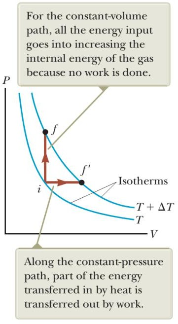
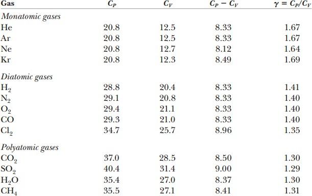
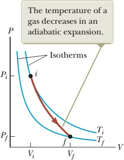
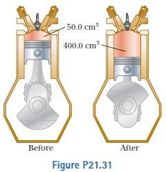

# Public_143

##  Mô hình phân tử của khí lý tưởng

### Mô hình khí lý tưởng

Một số giả thiết đơn giản hóa tính chất của một hệ khí lý tưởng:

  * Chất khí bao gồm một số rất lớn các phân tử. Mỗi phân tử có khối lượng và kích thước có thể bỏ qua so với khoảng cách trung bình giữa các phân tử.

  * Chuyển động của các phân tử cá thể được mô tả bằng cơ học Newton.

  * Phân tử chuyển động tự do trừ khi nó va chạm với phân tử khác hay với thành bình chứa nó. Tất cả va chạm xem là đàn hồi.

  * Bỏ qua thế năng tương tác giữa các phân tử khí.

### Số bậc tự do của phân tử khí _i_

Từ lý thuyết về _**sự phân bố đều năng lượng**_ của hệ khí như trình bày ở trên, ta phân tích cụ thể số bậc tự do của một hệ khí bất kỳ:

  * Khí đơn nguyên tử (phân tử khí có một nguyên tử): ví dụ các phân tử khí hiếm heli, neon, argon… Các phân tử khí đơn nguyên tử chuyển động tịnh tiến theo ba trục tọa độ xyz, mỗi chuyển động tịnh tiến sẽ có động năng tương ứng là _**½kBT**_. Chuyển động quay của phân tử khí đơn nguyên tử ứng với trục quay qua khối tâm của phân tử khí có năng lượng không đáng kể. _Tóm lại, phân tử khí đơn nguyên tử có số bậc tự do i = 3_.

  * Khí hai nguyên tử (hay lưỡng nguyên tử là phân tử khí có hai nguyên tử): ví dụ khí oxy, nito… Các phân tử khí lưỡng nguyên tử có ba chuyển động tịnh tiến và hai chuyển động quay quanh hai trục không đi qua hai nguyên tử của phân tử (một trục quay qua hai nguyên tử của phân tử có năng lượng không đáng kể), mỗi chuyển động này tương ứng động năng là _**½kBT**_. _Tóm lại, phân tử khí lưỡng nguyên tử có số bậc tự do i = 5_.

  * Khí đa nguyên tử (phân tử khí có ba nguyên tử trở lên): Các phân tử khí đa nguyên tử có 3 chuyển động tịnh tiến và 3 chuyển động quay quanh 3 trục, mỗi chuyển động này tương ứng động năng là _**½kBT**_. _Tóm lại, phân tử khí đa nguyên tử có số bậc tự do i = 6._

Tuy nhiên đối với phân tử đa nguyên tử, nhiều trường hợp i có giá trị lớn hơn do có thêm năng lượng dao động giữa các nguyên tử, phân tử.

### Nội năng của khí lý tưởng

Nội năng của một hệ khí là năng lượng bên trong hệ bao gồm động năng phân tử (năng lượng do chuyển động tự do của các phân tử), thế năng tương tác giữa các phân tử và năng lượng bên trong mỗi phân tử, nguyên tử.
Đối với khí lý tưởng, ta có thể bỏ qua thế năng tương tác giữa các phân tử do lực tương tác giữa các phân tử là rất yếu. Ngoài ra, chúng ta cũng không xét đến các quá trình biến đổi diễn ra trong
từng phân tử.
Độ biến thiên nội năng của một hệ khí lý tưởng khi hệ khí thay đổi một lượng nhiệt ∆𝑇
là:
𝑖
∆𝐸𝑖𝑛𝑡 = 𝑛 2 𝑅. ∆𝑇 (21.9)
Ví dụ một vài quá trình làm thay đổi nhiệt độ của một khối khí lý tưởng như hình 21.4.
Cả ba quá trình đều làm thay đổi một lượng nhiệt ∆𝑇 = 𝑇𝑓 − 𝑇𝑖 . Do ∆𝑇 là như nhau ở 3 quá
trình trên nên ∆ _E_ int cũng như nhau. Tuy nhiên công thực hiện trên chất khí là khác nhau đối với mỗi đường đi và nhiệt lượng tương ứng với mỗi đường biến đổi cũng không giống nhau. Bởi vì _**công và nhiệt lượng là hàm quá trình**_ , quá trình biến đổi khác nhau thì chúng khác nhau.

###  Nhiệt dung phân tử (nhiệt dung mol) của khí lý tưởng

Giả sử một khối khí lý tưởng biến đổi từ trạng thái _i_ có các thông số (Pi, Vi, Ti) sang trạng thái _f_ (Pf, Vf, Tf) có khối lượng m, phân tử gam M suy ra số mol của khối khí 𝑛 = 𝑚. Xét một

𝑀

số quá trình đặc biệt thường xảy ra như sau:
Suy ra _**nhiệt dung mol đẳng tích**_ :
𝑖
𝐶V = 2 𝑅 (21.11)

_Hình 21.5: Năng lượng được truyền bởi nhiệt cho hệ khí theo 2 cách._
_**Quá trình đẳng áp:**_ là quá trình áp suất của khí không đổi Pi = Pf, hình 21.5 là đường thẳng nằm ngang.

  * Nhiệt lượng trao đổi trong quá trình này là

𝑄 = 𝑛𝐶P∆𝑇 (21.12)
với _C_ P là nhiệt dung mol đẳng áp.

  * Công thực hiện trong quá trình này

𝑊 = − ∫ 𝑃𝑑𝑉 = −𝑃 ∫ 𝑑𝑉 = 𝑃(𝑉𝑖 − 𝑉𝑓)

  * Áp dụng nguyên lý 1 nhiệt động lực học ∆𝐸𝑖𝑛𝑡 = 𝑊 + 𝑄 cho quá trình đẳng tích:

𝑖
𝑛 2 𝑅. ∆𝑇 = 𝑃(𝑉𝑖 − 𝑉𝑓) + 𝑛𝐶P∆𝑇
Cộng thêm từ phương trình trạng thái khí lý tưởng 𝑃𝑉 = 𝑛𝑅𝑇 thay vào phương trình trên, ta được:
Hay
𝑖

𝑛 2 𝑅. ∆𝑇 = 𝑛𝑅(𝑇𝑖 − 𝑇𝑓 ) + 𝑛𝐶P∆𝑇

𝑖

𝑛 2 𝑅. ∆𝑇 = −𝑛𝑅∆𝑇 + 𝑛𝐶P∆𝑇

_Bảng 21.2: Tỷ số nhiệt dung phân tử của một số chất khí_

_**Câu hỏi 21.2:**_ (i) Nội năng của khí lý tưởng thay đổi từ trạng thái i đến f như trên hình 21.5.
(a) nội năng tăng, (b) nội năng giảm, (c) nội năng không đổi và (d) không đủ thông tin để xác định nội năng như thế nào. (ii) Cùng các lựa chọn như phần (i), nội năng thay đổi như thế nào khi hệ khí biến đổi từ f  f’ như trên hình 21.5.

### Bài tập mẫu 21.2:

Một xylanh chứa 3 mol khí lý tưởng heli ở 300 K.

  1. Khối khí được nung nóng đẳng tích, tính nhiệt lượng truyền cho khối khí để làm nó tăng nhiệt độ lên 500K.

  2. Khối khí được nung nóng đẳng áp, tính nhiệt lượng truyền cho khối khí để làm nó tăng nhiệt độ lên 500K.

### Giải:

He là khí đơn nguyên tử nên ta có i = 3

  1. Nhiệt lượng truyền cho khối khí để làm nó tăng nhiệt độ lên 500K trong quá trình đẳng tích là:

𝑖

𝑄1 = 𝑛𝐶V∆𝑇 = 𝑛 2 𝑅

(𝑇𝑓 − 𝑇𝑖 )

3

= 3 ×  × 8,31 ×

2

(500 − 300)
= 7,5 × 103𝐽

  2. Nhiệt lượng truyền cho khối khí để làm nó tăng nhiệt độ lên 500K trong quá trình đẳng áp là:

𝑄2

= 𝑛𝐶P

∆𝑇 = 𝑛 𝑖+2 𝑅

2

(𝑇𝑓 − 𝑇𝑖 )

5

= 3 ×  × 8,31 ×

2

(500 − 300)
= 12,5 × 103𝐽

##  Quá trình đoạn nhiệt cho khí lý tưởng

Nhiều quá trình quan trọng diễn ra nhanh đến nỗi phần nhiệt được thêm vào cho hệ là không đáng kể, đó là quá trình đoạn nhiệt. Nếu chất khí lý tưởng thực hiện một quá trình đoạn nhiệt chuẩn tĩnh, khi đó chất khí đi qua một chuỗi các trạng thái cân bằng được biểu diễn bằng đường cong trên giản đồ p-V. Ta xét một bước vô cùng nhỏ trong quá trình đoạn nhiệt dQ = 0.
Áp dụng định luật thứ nhất cho quá trình đoạn nhiệt:
𝑑𝐸𝑖𝑛𝑡 = 𝑛𝐶𝑉𝑑𝑇 = −𝑃𝑑𝑉
Lấy vi phân phương trình trạng thái khí lý tưởng:
𝑃𝑉 = 𝑛𝑅𝑇
ta có
𝑃𝑑𝑉 + 𝑉𝑑𝑃 = 𝑛𝑅𝑑𝑇
_Hình 21.6: Đường biểu diễn quá trình đoạn nhiệt_

# Câu hỏi lý thuyết chương 21

  1. Tại sao ở cùng một nhiệt độ, lượng năng lượng trên mỗi mol của khí lưỡng nguyên tử lại lớn hơn của khí đơn nguyên tử?

  2. Cái nào đậm đặc hơn: không khí khô, hay không khí bão hòa với hơi nước? Giải thích.

  3. Một thùng chứa đầy khí heli và một bình khác chứa khí argon. Cả hai thùng chứa đều ở cùng nhiệt độ. Những phân tử nào có tốc độ hiệu dụng vrms cao hơn? Giải thích.

# Bài tập chương 21

  1. Trong khoảng thời gian 30 s, 500 cục mưa đá tấn công tới bề mặt một cửa sổ làm bằng kính có diện tích 0,6 m2 theo một góc 450. Mỗi cục mưa đá có khối lượng 5 g và tốc độ 8 m/s. Giả sử các va chạm là đàn hồi, tìm (a) lực trung bình và (b) áp suất trung bình lên cửa sổ trong khoảng thời gian này **.**

ĐS: 0,94 N; 1,57 Pa

  2. Một bình 5 lít chứa khí nitơ ở 27°C và 3 atm. Tìm (a) tổng động năng chuyển động tịnh tiến của các phân tử khí và (b) động năng trung bình trên mỗi phân tử.

ĐS: 2,3 kJ; 6,2.10-21 J

  3. Trong quá trình đẳng tích, 209 J nhiệt lượng được truyền tới 1 mol khí đơn nguyên tử ở trạng thái lý tưởng, ban đầu ở 300 K. Tìm (a) công thực hiện của khí, (b) độ tăng nội năng của khí, và (c) nhiệt độ cuối cùng của nó.

ĐS: 0; 209 J; 317 K

  4. Cho 1mol khí hydro được nung nóng ở áp suất không đổi từ 300 K đến 420 K. Tính (a) nhiệt lượng khí nhận được, (b) độ tăng nội năng của nó, và (c) công khí thực hiện .

ĐS: 3,46 kJ; 2,45 kJ; -1,01kJ

  5. Một xylanh đứng với một piston nặng ở phía trên có chứa một khối không khí (xem là khí lưỡng nguyên tử) ở 300 K. Áp suất khí ban đầu là 2.105 Pa, thể tích ban đầu 0,35 m3. Khối lượng mol của không khí là 28,9 g/mol. (a) Tính nhiệt dung riêng đẳng tích của khối khí theo đơn vị kJ/kg.oC. (b) Tính khối lượng của khối khí trong xylanh. (c) Giả sử piston được giữ cố định, hỏi cần truyền cho khối khí một năng lượng bằng bao nhiêu để khí tăng nhiệt độ lên 700 K. (d) Giả sử piston được tự do dịch chuyển, hỏi cần truyền cho khối khí một năng lượng bằng bao nhiêu để khí tăng nhiệt độ lên 700 K.

ĐS: 0,719 kJ/kg.oC; 0,811 kg; 233 kJ; 327 kJ (giả sử đẳng áp)

  6. Tính công cần thiết để nén 5 mol không khí ở 200C và 1atm đến một phần mười của thể tích ban đầu. (a) trong quá trình đẳng nhiệt? (b) trong quá trình đoạn nhiệt? (c) Tính áp suất cuối trong quá trình đẳng nhiệt? (d) Tính áp suất cuối trong quá trình đoạn nhiệt?

ĐS: 28 kJ; 46 kJ; 10 atm; 25,1 atm

  7. Trong quá trình sinh công của động cơ ô tô bốn thì, Piston chuyển động xuống dưới cylinder (xi-lanh) tạo ra một khoảng không trong cylinder để chứa nhiên liệu phun sương từ bộ chế hoà khí. Xem nhiên liệu gồm hỗn hợp của các sản phẩm đốt và không khí. Chúng thực hiện quá trình giãn đoạn nhiệt. Giả sử (1) động cơ đang chạy ở tốc độ 2500 vòng/phút; (2) áp suất đo ngay lập tức trước khi giãn nở là 20 atm; (3) thể tích của hỗn hợp ngay trước và sau khi giãn nở là 50 cm3 và 400 cm3, tương ứng (Hình. P21.31); (4) khoảng thời gian cho việc giãn nỡ là một phần tư trong tổng chu kỳ; và (5) hỗn hợp hoạt động như một loại khí lý tưởng

với tỷ lệ nhiệt cụ thể 1,4. Tìm công suất trung bình được tạo ra trong quá trình sinh công trên.
ĐS: 25 kW