# Public_145

Điện trường đã được nghiên cứu về phương diện tác dụng lực trong các chương trước. Trong chương này, điện trường sẽ được khảo sát ở khía cạnh năng lượng. Bằng cách tiếp cận theo hướng năng lượng, các bài toán có thể được giải theo hướng không cần đến việc sử dụng lực. Khái niệm về thế năng có giá trị lớn trong
các nghiên cứu về điện. Do lực tĩnh điện là lực bảo toàn, hiện tượng tĩnh điện có thể được mô tả một cách dễ dàng dưới dạng năng lượng điện thế.

##  Điện thế và hiệu điện thế

Khi một điện tích _q_ đặt trong điện trường nó sẽ chịu tác dụng một lực bằng
Đây là lực bảo toàn bởi vì theo bản chất, các tương tác đều tuân theo định luật Coulomb. Hãy xem xét dưới góc độ một hệ kín các điện tích, khi điện tích _q_ chuyển động chỉ dưới tác dụng
của các điện tích còn lại. Với một chuyển dời vô cùng bé trường lực thế Coulomb sinh
một công bằng Trong cơ học ta biết rằng, công do trường lực thế sinh ra bằng đúng độ
suy giảm thế năng, cho nên:

− _dU_ =

Khi điện tích _q_ di chuyển từ vị trí A đến vị trí B trong điện trường, độ biến thiên thế năng bằng:
( _B_ )
∆ _U_ = − ∫
( _A_ ) ( _A_ )

(25.1)

Ở đây tích phân đường tính dọc theo quỹ đạo di chuyển của điện tích _q_ từ A đến B. Tuy nhiên vì trường lực bảo toàn nên dù đi theo con đường nào, giá trị của tích phân này cũng không thay đổi.
Khi đã có biểu thức tính độ biến thiên thế năng, chỉ cần chọn một điểm O nào đó làm gốc thế năng ( _U_ = 0 ), ta đã có thể tính _**thế năng**_ của điện tích đặt trong điện trường:

(P)

_U_ = − _q_ ∫

(O) (P)
 _Thế năng của điện tích q tại vị trí P bất kì trong điện trường có trị số bằng công của lực điện trường làm di chuyển điện tích q đó từ P về gốc thế năng_.
Thế năng tại vị trí P của một đơn vị điện tích trong điện trường tại điểm đó:
được gọi là _**điện thế**_

_V_ = _U_

_q_

(P)
= − ∫
(O) (P)

(25.2)

_Điện thế tại vị trí P bất kì trong điện trường có trị số bằng công của lực điện trường làm di chuyển điện tích 1 Coulomb từ P về gốc điện thế (gốc thế năng)_.
Tương tự như độ biến thiên thế năng ∆ _U_ ta cũng có khái niệm _**hiệu điện thế**_ giữa hai điểm B và A:
( _B_ )
∆ _V_ = _VB_ − _VA_ = − ∫ (25.3)
( _A_ )
Từ (25.1) và (25.3), ta có mối liên hệ giữa độ biến thiên thế năng và hiệu điện thế:

∆ _U_ = _q_ ∆ _V_ (25.4)

Theo định luật bảo toàn năng lượng: ∆ _U_ \+ ∆ _K_ = 0, suy ra động năng mà điện tích _q_ thu

được khi di chuyển từ điểm A đến điểm B nói trên bằng độ suy giảm của thế năng:
∆ _K_ = −∆ _U_ = − _q_ ∆ _V_ = _q_ ( _VA_ − _VB_ )
Điện thế và hiệu điện thế có thứ nguyên của năng lượng trên một đơn vị điện tích, được gán cho một đơn vị đặc biệt trong hệ SI – _**Volt**_ : 1V = 1J/C.
Mối liên hệ (25.2), (25.3) cũng cho ta một đơn vị khác của cường độ điện trường là V/m: 1N/C = 1V/m.
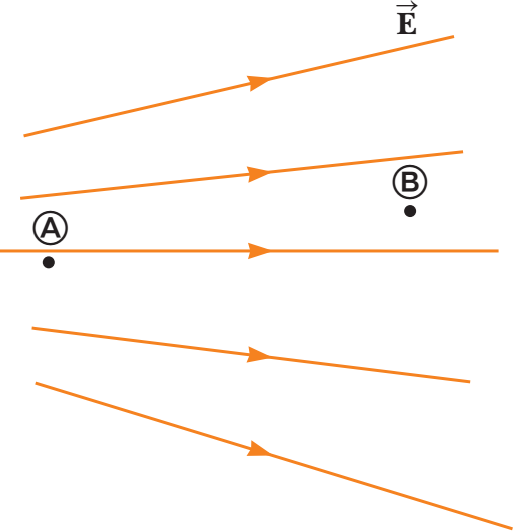Khi một electron mang điện tích nguyên tố − _e_ chuyển động dưới tác dụng của điện trường, đi qua đoạn đường có hiệu điện thế bằng 1V, ta nói rằng electron đã thu được thêm động năng bằng 1 _**electron-volt**_ :
1 _eV_ = 1,6×10−19 _C_ ⋅1 _V_ = 1,6×10−19 _J_
(25.5)
_**Câu hỏi 25.1:**_ Hai điểm A và B nằm trong một điện trường như hình 25.1. (i) Hiệu điện thế ∆ _V_ = _VB_ − _VA_ có giá trị như thế nào?
(a) dương (b) âm (c) bằng không. (ii) Một điện tích âm ban đầu nằm tại A, sau đó di chuyển đến vị trí B. Sự biến thiên của thế
năng ∆ _U_ có giá trị như thế nào? Lựa chọn trong các khả năng như phần trước.

##  Hiệu điện thế trong điện trường đều

_Hình 25.1: Hai điện tích_
_điểm trong điện trường_
Ta tiến hành khảo sát một điện trường đều, theo đó các đường sức điện trường hướng song song và đều đặn như miêu tả trên hình 25.2a. Từ phương trình (25.3) suy ra được hiệu điện thế giữa hai điểm A và B nằm trên cùng một đường sức điện trường:
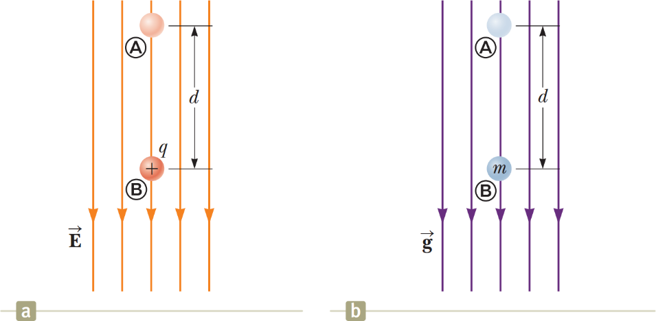
_Hình 25.2: (a) Hạt mang điện tích q chuyển động dọc theo đường sức điện trường đều (b) Hạt khối lượng m rơi trong trường trọng lực đều._

_B A_

( _B_ )

∫
∆ _V_ = _V_ − _V_
= − _E_ ⋅ _ds_ ⋅ cos(00 ) = −
( _A_ ) ( _A_ ) ( _A_ )

_E_ ⋅ _ds_

Trong điện trường đều _E_ có độ lớn không đổi nên có thể đưa ra ngoài dấu tích phân:
( _B_ )
∆ _V_ = − _E_ ∫ _ds_
( _A_ )
∆ _V_ = − _Ed_
(25.6)
Dấu “–“ ở đây nói rằng, điện thế tại B thấp hơn điện thế tại A:
_sức điện trường luôn hướng theo chiều suy giảm của điện thế_.
_VB_ < _VA_. Như vậy, _các đường_
Khi một điện tích _q_ di chuyển từ A đến B, thế năng của hạt trong điện trường thay đổi một lượng bằng

∆ _U_ = _q_ ∆ _V_ = − _qEd_

(25.7)

Có nghĩa nếu hạt mang điện tích dương:
_q_ > 0,
thế năng sẽ giảm:
∆ _U_ < 0.
Nói cách khác,
khi một điện tích dương di chuyển xuôi theo chiều của đường sức điện trường, thế năng của nó sẽ giảm. Như hình 25.2a miêu tả, nếu ban đầu hạt mang điện tích dương _q_ thả tự do từ
trạng thái đứng yên, nó sẽ chịu tác dụng một lực hướng xuống dưới, bắt đầu đi xuống
và tăng tốc. Hạt dần thu động năng từ chính sự suy giảm của thế năng. Đó là minh chứng rõ ràng cho định luật bảo toàn năng lượng.
Hình 25.2b miêu tả hình ảnh tương tự, khi một hạt khối lượng _m_ rơi tự do trong trường hấp dẫn gần mặt đất. Hạt cũng chịu tác dụng của trọng lực hướng xuống và tăng tốc. Động năng tích luỹ tự sự suy giảm của thế năng trọng trường.
Phép so sánh nói trên giữa hạt mang điện tích dương trong điện trường với hạt chuyển động dưới trường trọng lực rất hữu ích cho việc hình dung về các hiện tượng tĩnh điện. Chỉ
một điểm lưu ý rằng: khối lượng thì luôn dương, nhưng điện tích có thể dương, cũng có thể âm.
Với trường hợp điện tích âm, khi hạt di chuyển theo chiều của đường sức điện trường, thế năng của hạt sẽ tăng, thay vì giảm. Nếu ban đầu hạt đứng yên, nó sẽ tăng tốc về phía ngược chiều của đường sức.
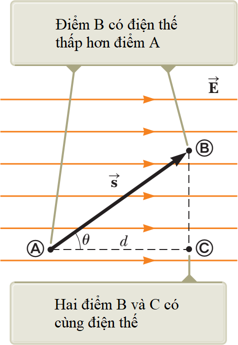Ta khảo sát trường hợp tổng quát hơn, khi hạt mang điện tích di chuyển từ vị trí A đến vị trí B trong điện trường đều, nhưng không nằm trên cùng một đường sức như hình 25.3. Lúc này hiệu điện thế giữa A và B bằng:
( _B_ )
∆ _V_ = _VB_ − _VA_ = − ∫
( _A_ ) ( _A_ )
(25.8)
Ở đây vector của điện trường đều có thể đưa ra ngoài dấu
tích phân. Độ biến thiên của thế năng:
∆ _U_ = _q_ ∆ _V_ = − _qE_ ⋅ _s_
Tích vô hướng (25.8) có thể tính qua hình học:
∆ _V_ = _VB_ − _VA_ = − _Ed_
(25.9)
Mặt khác hiệu điện thế giữa hai điểm A và C nằm trên cùng một đường sức:
_Hình 25.3: Hạt mang điện tích chuyển động không_

_V_ − _V_

= − _Ed_
_song song với đường sức_
_C A của điện trường đều_
Từ đây suy ra rằng _VB_ = _VC_ . Tổng quát lên có thể thấy rằng,
_mọi điểm nằm trên cùng một mặt phẳng vuông góc với đường sức điện trường đều có cùng một điện thế_. Ta gọi mặt phẳng chứa tất cả các điểm có cùng điện thế như vậy là một _**mặt đẳng thế**_. Đối với điện trường đều, họ các mặt đẳng thế cấu thành từ những mặt phẳng song song với nhau và cùng vuông góc với các đường sức điện trường.

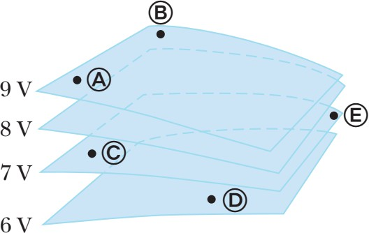

_Hình 25.4: Các mặt đẳng thế_
_**Câu hỏi 25.2:**_ Các điểm được đánh dấu trên hình 25.4 nằm trên các mặt đẳng thế. Hãy sắp xếp công thực hiện của điện trường lên một điện tích dương theo thứ tự giảm dần, khi điện tích này di chuyển từ A sang B, từ B sang C, từ C sang D và từ D sang E.

### 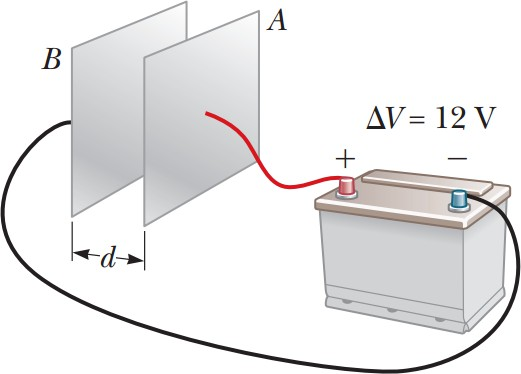Bài tập mẫu 25.1: Điện trường giữa hai bản phẳng song song tích điện trái dấu

Một ắc-quy hiệu điện thế 12V mắc vào hai bản phẳng đặt song song như hình 25.5. Khoảng cách giữa hai
bản _d_ = 0,3cm, đủ nhỏ để xem rằng điện trường giữa
hai bản là đều. Tính cường độ điện trường giữa hai bản phẳng.

### Giải:

Dùng công thức (25.6), có thể tính cường độ điện trường giữa hai bản phẳng song song:
_Hình 25.5: Hai bản phẳng song song nối vào nguồn điện_
_E_ = =

_d_

12 _V_
0,3×10−2 _m_
= 4×103 _V_ / _m_

### Bài tập mẫu 25.2: Chuyển động của hạt proton trong điện trường đều

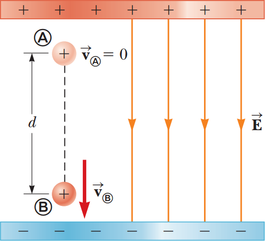Một proton được thả ra từ trạng thái đứng yên tại vị trí A trong một điện trường đều có độ lớn 8,0 ×104 V/m (hình 25.6). Proton di chuyển đến
điểm B cách đó một đoạn _d_ = 0,50 m dọc theo
hướng của điện trường _E_ . Tìm tốc độ của proton sau đoạn đường đó.

### Giải:

**Khái niệm.** Hình dung rằng hạt proton rơi xuống tựa như đang ở trong một trường trọng lực. Trong bài tập này, hạt cũng chịu tác dụng một gia tốc không đổi bởi lực điện trường.
**Phân loại.** Do hệ không tương tác với bên ngoài nên ta có thể quy vấn đề về chủ đề bảo toàn năng lượng.
_Hình 25.6: Proton tăng tốc theo hướng của điện trường_
**Phân tích.** Áp dụng định luật bảo toàn năng lượng cho điểm A và điểm B:
∆ _K_ \+ ∆ _U_ = 0
Thế biểu thức của động năng và thế năng tại A và B tương ứng:
 1 _mv_ 2 − 0  + _e_ ∆ _V_ = 0
 2 
 
Từ đó suy ra vận tốc _v_ đồng thời tính ∆ _V_ theo công thức (25.6):
_v_ = = =
=
= 2,8 ×106 _m_ / _s_
**Nhận định.** Điện thế giảm theo chiều chuyển động của proton, ∆ _V_ < 0, kéo theo sự suy giảm của thế năng: ∆ _U_ < 0\. Để cân bằng sự suy giảm này, proton lại tích luỹ động năng trong chuyển động có gia tốc, tuân theo định luật bảo toàn năng lượng.

##  Điện thế và thế năng tạo bởi điện tích điểm

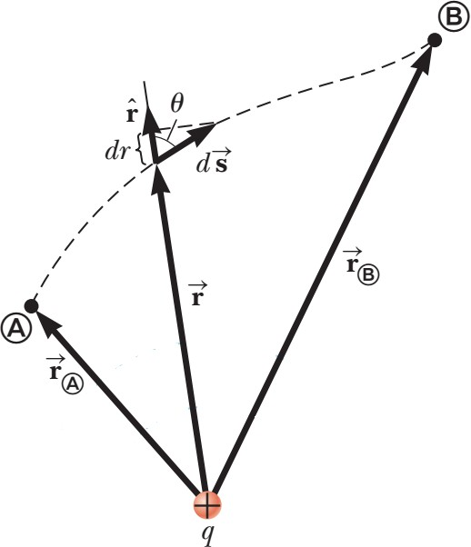Từ trình bày ở chương 23, ta đã biết rằng một điện
tích điểm _q_ > 0 tạo ra trong không gian xung quanh một
điện trường đối xứng xuyên tâm với những đường sức hướng ra ngoài. Hiệu điện thế giữa hai điểm A và B bất kì (hình 25.7) có thể tính theo công thức (25.3):
( _B_ )
_VB_ − _VA_ = − ∫
( _A_ )
Vector cường độ điện trường điện tích điểm có dạng
đối với điện trường của

Thế vào thu được
 _VB_ − _VA_ = −

( _A_ )

_Hình 25.7: Tính hiệu điện thế giữa hai điểm bất kì trong điện trường đối xứng xuyên tâm_
Lưu ý rằng gốc thế năng lấy ở trạng thái hai điện tích cách xa nhau vô cùng. Nếu _q_ 1, _q_ 2 cùng
dấu, chúng có sức mạnh đẩy nhau ra xa nhất có thể, chứng tỏ hệ có mang năng lượng _U_ > 0.
Ngược lại nếu _q_ 1, _q_ 2 trái dấu, cần phải bổ sung một năng lượng nhờ một lực bên ngoài mới
tách chúng ra xa được, chứng tỏ hệ mang năng lượng âm. Nếu biện luận theo hướng cho rằng
điện tích _q_ 1 nằm trong điện trường do _q_ 2 tạo ra, ta cũng đi đến kết quả như (25.13).

##  Mối liên hệ giữa điện trường và điện thế

Công thức (25.3) viết lại dưới dạng vi phân

 _dV_ = − _E_ ⋅ _ds_

cho ta giá trị của hiệu điện thế nếu biết trước điện trường

(25.15)

tại các điểm trong không gian.

Có nghĩa _thành phần Ex của vector cường độ điện trường bằng đạo hàm riêng của điện thế_
_theo biến x đảo dấu_. Ta cũng thu được kết luận tương tự đối với thành phần theo _y_ và _z_ ,
viết thành bộ đầy đủ:

_E_ = − ∂ _V_ , _E_

_x_ ∂ _x y_

= − ∂ _V_ , _E_
∂ _y z_
= − ∂ _V_

∂ _z_

(25.16)
Hình chiếu của vector tự như thế:
theo hướng của vector _l_ bất kì cũng được tính theo cách tương
_E_ =− _dV_
_l dl_
Xét hai điểm lân cận nằm trên cùng một mặt đẳng thế, hiệu điện thế giữa hai điểm này:
_dV_ = 0. Do vậy, hình chiếu của vector
theo phương tiếp tuyến với mặt đẳng thế cũng bằng
không. Nói cách khác, _vector cường độ điện trường thế_.
_luôn hướng vuông góc với mặt đẳng_
Hình 25.11 miêu tả họ các mặt đẳng thế trong các trường hợp khác nhau: điện trường đều, điện trường sinh ra bởi điện tích điểm và điện trường tạo bởi lưỡng cực điện. Trong tất cả các trường hợp, các mặt đẳng thế luôn vuông góc với những đường sức điện trường tại giao điểm:

  * Trên mục 25.2 ta đã phân tích được rằng, họ các mặt đẳng thế trong điện trường đều là những mặt phẳng song song, cố nhiên vuông góc với đường sức điện trường.

  * Ở mục 25.3 ta cũng làm sáng tỏ rằng, điện thế tạo bởi điện tích điểm chỉ phụ thuộc vào khoảng cách đến điện tích điểm, nên họ các mặt đẳng thế là những mặt cầu, giao nhau vuông góc với đường sức đối xứng xuyên tâm.

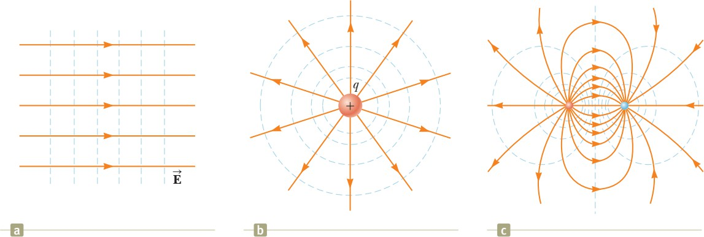

_Hình 25.11: Họ các mặt đẳng thế trong các trường hợp: (a) điện trường đều (b) điện trường của điện tích điểm (c) điện trường tạo bởi lưỡng cực điện_
Hãy thử suy vector (25.11):
của điện trường tạo bởi điện tích điểm từ biểu thức của điện thế

##  Điện thế sinh ra bởi sự phân bố điện tích liên tục

Ở mục 25.3, chúng ta tính được điện thế sinh ra bởi tập hợp các điện tích điểm rời rạc. Mục này trình bày phương pháp tính điện thế sinh ra bởi sự phân bố điện tích liên tục, tức vật tích điện có kích thước đáng kể. Có hai phương pháp tiến hành: phương pháp chia nhỏ và phương pháp dùng định lý Gauss.

### Phương pháp chia nhỏ

Ta chia vật tích điện có kích thước lớn nói trên thành những phần rất nhỏ, nhỏ đến mức có thể xem mỗi phần như thế là một điện tích điểm. Đối với mỗi điện tích điểm vừa cắt ra ấy, ta đã có thể áp dụng công thức (25.11) để tính điện thế _dV_ do nó tạo ra tại điểm P cần khảo sát:

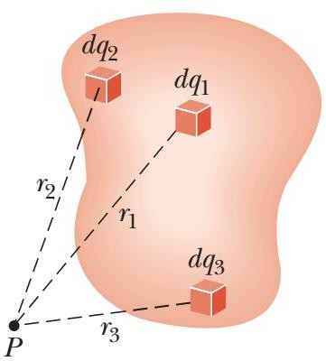

_Hình 25.12: Tính điện thế sinh ra bởi sự phân bố_

_dq_

_dV ke r_

(25.18)
_điện tích liên tục_
trong đó _r_ là khoảng cách từ phần nhỏ đang xét đến điểm P. Điện thế do vật sinh ra tại điểm P là sự tổng hợp của tất cả các phần nhỏ trên toàn bộ vật tích điện:

_V_ = ∑ _dV_ =

∫ _dV_ = _ke_ ∫

__dq_ r_

(25.19)

_**Cần lưu ý ở phương pháp này rằng: gốc lấy điện thế**_ ( _V_ = 0) _**nằm ở xa vô cùng**_ (∞).

### Phương pháp dùng định lý Gauss

Đối với những hệ tích điện mang tính đối xứng, ta có thể dùng định lý Gauss để tính điện
trường trước. Sau đó dùng công thức () để tính điện thế:
(O)

_V_ = ∫

(P)
trong đó gốc lấy điện thế ( _V_ = 0)
có thể quy ước tại một điểm O nào đó.

### 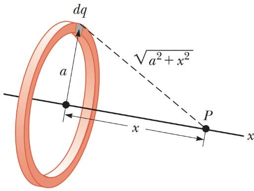Bài tập mẫu 25.4: Điện thế tạo bởi vành tròn tích điện đều

  1. Tìm biểu thức của điện thế tại điểm P nằm trên trục đối xứng của một vành tròn bán kính _a_ với điện tích _Q_ phân bố đều, cách tâm vành tròn một

đoạn _x_.

### Giải:

Chia vành tròn ra rất nhiều phần nhỏ, mỗi phần có điện tích _dq_ nhỏ đến mức có thể xem như điện tích điểm. Áp dụng công thức (20.20), ta có thể tính điện thế tại điểm P:
_Hình 25.13: Tính điện thế tại điểm nằm trên trục của vành tròn tích điện đều_
_V_ = _ke_ ∫ _r_
Để ý rằng điểm P nằm cách đều tất cả các phần của vành tròn, do vậy tích phân trên dễ dàng chuyển thành:
_V_ = _ke dq r_
Tích phân trên thể hiện tổng toàn bộ điện tích chứa trên vành. Còn khoảng cách _r_ có
thể biểu diễn thành _r_ =
_V_ = _keQ_

  2. Tìm biểu thức của cường độ điện trường tại P.

### Giải:

Do tính chất đối xứng, có thể kết luận rằng vector cường độ điện trường
tại điểm P
phải hướng dọc theo trục x. Nói cách khác _E_ chỉ có thành phần theo (25.16) giữa cường độ điện trường và thế năng:
_x_. Từ mối liên hệ
_E_ = − _dV_
= − _k Q d_  1  =
_ke x Q_
_x dx_

_e_  

 

( _a_ 2 + _x_ 2 )3/2

### 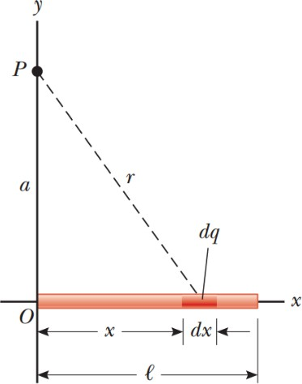Bài tập mẫu 25.5: Điện thế tạo bởi thanh tích điện đều

Một thanh có chiều dài _l_ đặt dọc theo trục _x_ như hình vẽ.
Thanh có điện tích _Q_ phân bố đều với mật độ dài λ. Tính
điện thế tại điểm P nằm trên trục _y_ cách đầu thanh một
đoạn bằng _a_.

### Giải:

Điện thế tại P được tạo bởi các phần điện tích phân bố khắp chiều dài thanh. Xét một đoạn _dx_ rất nhỏ trên thanh, mang
điện tích _dq_ = λ _dx_ đủ nhỏ để có thể xem như điện tích điểm.
Điện thế do điện tích điểm _dq_ nói trên tạo ra tại P:
_Hình 25.14: Tính điện thế tạo bởi thanh tích_
_dV_ = _ke_
_dq_ = _k r e_
λ _dx_

_điện đều_

Điện thế do rất nhiều điện tích điểm như thế trên toàn bộ thanh tạo ra tại P là tích phân:
_l_
_V_ = ∫ _ke_
0
λ _dx_
Theo đó cận tích phân lấy từ
_x_ = 0 cho đến
_x_ = _l_.
Để ý rằng

_l_

_ke_ và λ = _Q_ / _l_
_dx Q_
là những số không đổi, có thể cho ra ngoài dấu tích phân:
_l_
_V_ = _ke_ λ ∫

0

= _ke a_ 2 \+ _x_ 2
ln(x+
_l_
_a_ 2 \+ _x_ 2 )
0
= __Q__  _l_ \+ _a_ 2 \+ _l_ 2 
_ke l_ ln  _a_ 
 

##  Điện thế tạo bởi vật dẫn tích điện

Từ chương 24, ta biết rằng đối với _vật dẫn điện ở trạng thái cân bằng, điện tích chỉ phân bố trên bề mặt vật dẫn_. Ngoài ra ta cũng biết rằng, _điện trường chỉ tồn tại bên ngoài vật dẫn và vuông góc với bề mặt vật dẫn. Bên trong vật dẫn điện trường hoàn toàn bị triệt tiêu_.
Chương này ta tiếp tục bàn đến vật dẫn điện về phương diện điện thế. Áp dụng công thức (25.3) cho hai điểm A và B bất kì nằm trong hoặc trên bề mặt vật dẫn, ta có:
( _B_ )

_VB_ − _VA_ = − ∫

( _A_ )
Như vậy _mọi điểm thuộc vật dẫn đều có điện thế bằng nhau_.
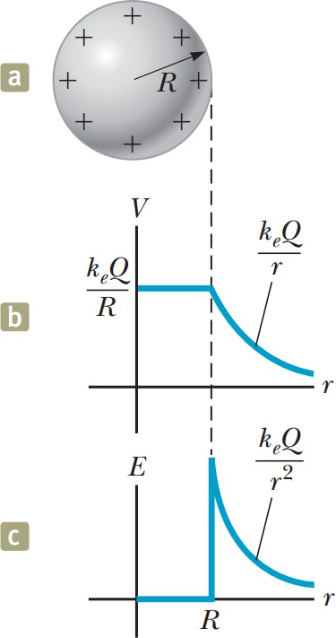Hình 25.15 miêu tả điện thế tại các điểm bên trong và bên ngoài quả cầu làm bằng vật liệu dẫn điện. Theo trình bày ở chương 24, việc áp dụng định lý Gauss cho ra kết quả rằng: điện trường bên ngoài quả cầu tích điện có dạng y hệt như điện trường tạo bởi điện tích điểm:

_E_ = _k_

_q_

_e r_ 2

Do đó điện thế tại một điểm bất kì nằm ngoài quả cầu cũng sẽ có dạng như điện thế sinh ra bởi điện tích điểm đặt tại tâm quả cầu:
_V_ = _k q_
_e r_
Từ đó suy ra điện thế ngay trên bề mặt quả cầu tích điện:

_V_ = _k q_

_e R_

(25.20)

với _R_ là bán kính quả cầu. Trong trường hợp quả cầu làm bằng vật liệu dẫn điện, biểu thức (25.20) cũng chính là điện thế tại mọi điểm thuộc quả cầu. Hình 25.15b diễn tả điều đó bằng đoạn nằm ngang tương ứng với các điểm bên trong quả cầu.

### Bài tập mẫu 25.6: Hai quả cầu tích điện nối nhau

_Hình 25.15: (a) vật dẫn hình cầu (b) điện thế (c) điện trường_
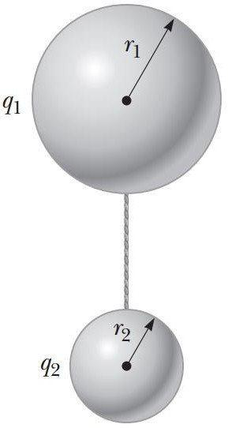Hai vật dẫn hình cầu có bán kính lần lượt bằng _r_ 1 và _r_ 2 ban đầu
đặt cách xa nhau. Sau đó chúng được nối với nhau nhờ sợi dây dẫn điện như hình 25.16. Khi hệ cân bằng, điện tích trên mỗi quả
cầu lần lượt bằng _q_ 1 và _q_ 2 , phân bố đều trên mỗi bề mặt. Tìm tỉ
số của cường độ điện trường trên bề mặt của hai quả cầu này.

### Giải:

Do hai quả cầu đặt cách nhau đủ xa, sự ảnh hưởng lẫn nhau về điện trường là không đáng kể, dẫn đến điện tích mỗi bên vẫn phân bố đều trên mỗi bề mặt và điện trường trên mỗi quả cầu vẫn giữ được nguyên tính đối xứng.
Việc nối hai quả cầu bằng dây dẫn làm cho điện thế cả hai bằng nhau:
_V_ = _k_ _q_ _1_ = _k_ _q_ _2_
_Hình 25.16: Hai quả cầu dẫn điện nối với nhau_
_r_ 1 _r_ 2
hay:
_q_ 1 = _r_ 1 (1)
_q_ 2 _r_ 2
Cường độ điện trường trên bề mặt mỗi quả cầu có độ lớn:
_E_ 1 = _k_
_q_ 1 , _E_

_e r_ 2 2

= _k q_ 2
_e r_ 2
1 2
Lấy tỉ số của cường độ điện trường:

2

_1_ _1 2_

2

2 2 1

Thế (1) vào thu được:
_E r r_ 2 _r_
_1_ = _1 2_ = _2_
_E r r_ 2 _r_
2 2 1 1
Từ kết quả thu được có thể thấy rằng, khi hai quả cầu nối nhau bằng dây dẫn điện, điện trường trên bề mặt của quả cầu nhỏ thì lớn hơn điện trường trên bề mặt quả cầu lớn.

### Vật dẫn rỗng ruột

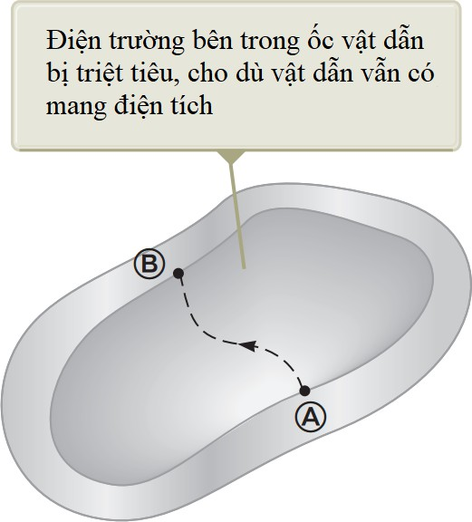Vật dẫn rỗng ruột có thể miêu tả như hình 25.17. Với loại vật dẫn hết sức đặc biệt này, ta sẽ chứng minh rằng _điện trường bên trong phần rỗng của vật dẫn phải luôn luôn bằng không, dù điện trường bên ngoài có thay đổi thế nào đi nữa_! Thực vậy, xét hai điểm A và B bất kì thuộc thành bên trong sát phần rỗng, theo (25.3) ta có:
( _B_ )
_VB_ − _VA_ = − ∫
( _A_ )
Nhưng đối với vật dẫn bất kì ta cũng đã chứng minh rằng
điện thế tại mọi điểm trong nó đều bằng nhau: _VA_ = _VB_ .
Nên vector cường độ điện trường buộc phải bằng không.
Vật dẫn rỗng ruột dưới dạng những hộp có vỏ bằng kim loại có nhiều ứng dụng trong việc cách ly các vật bên trong khỏi ảnh hưởng của điện trường ngoài.

### Tia lửa điện

_Hình 25.17: Vật dẫn rỗng ruột_
Tia lửa điện thường quan sát thấy ở gần vật dẫn điện cao thế. Khi điện trường gần vật dẫn đủ lớn, các electron tự do, vốn phát sinh do sự ion hoá ngẫu nhiên của phân tử khí, sẽ được gia tốc và bị đẩy xa khỏi phân tử mẹ. Chúng chuyển động nhanh và va chạm với nhiều
phân tử khí xung quanh, làm phát sinh thêm rất nhiều sự ion hoá thứ cấp, kéo theo sự xuất hiện càng lúc càng nhiều electron tự do khác. Các electron này sau đó tái kết hợp với những ion phân tử, di chuyển từ trạng thái tự do sang trạng thái liên kết ở mức năng lượng thấp hơn làm phát ra năng lượng dưới dạng ánh sáng. Đó chính là tia lửa điện.
Ở những phần nhọn của vật dẫn, điện tích tập trung nhiều hơn và sinh ra điện trường lớn hơn so với những phần khác. Do đó tia lửa điện thường hay xuất hiện ở những điểm nhọn này.
Tia lửa điện có thể được quan sát rõ hơn nhờ máy quay tử ngoại

##  Thí nghiệm giọt dầu Millikan

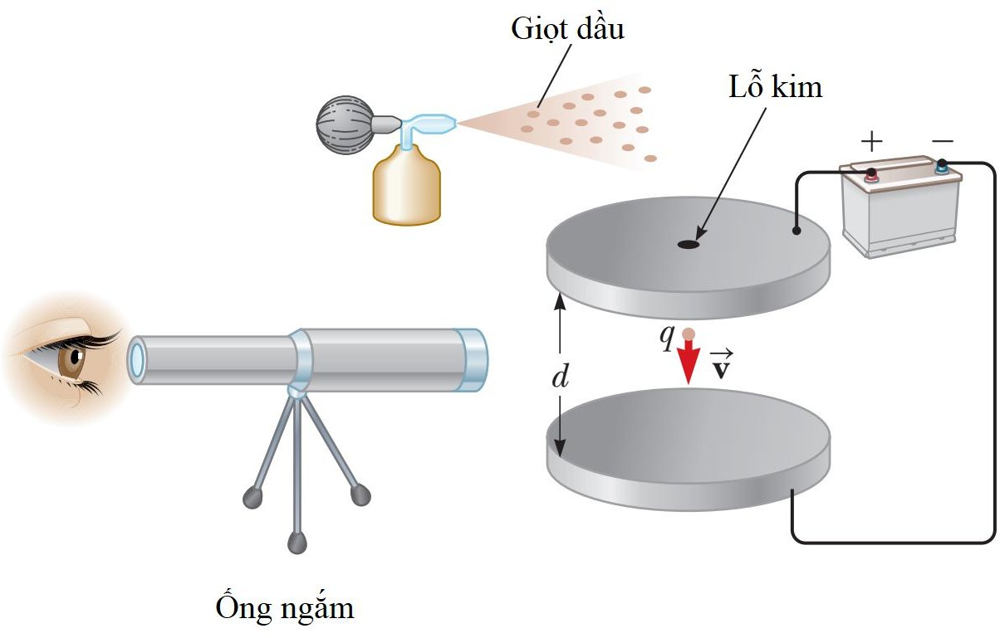

_Hình 25.18: Thí nghiệm giọt dầu Millikan_
Trong giai đoạn 1909-1913, Robert Millikan đã tiến hành phép đo điện tích của electron, xác định giá trị của điện tích nguyên tố _e_. Thiết bị thí nghiệm được mô tả như hình 25.18. Bộ phận chính của thiết bị gồm hai đĩa kim loại đặt song song, đấu vào hai cực của ắc quy để tạo ra điện trường giữa chúng. Millikan dùng bình phun sương phun những giọt dầu li ti vào khoảng trống giữa hai đĩa, đồng thời rọi x-quang làm ion hoá không khí, khiến cho các electron được giải phóng và dính vào những giọt dầu. Những giọt dầu được chiếu sáng, hiện giữa ống kính quan sát như những ngôi sao hiện giữa trời đêm.
_Hình 25.21: Bộ lọc bụi tĩnh điện_

**Khái niệm và nguyên lý**

# Câu hỏi lý thuyết chương 25

  1. Phân biệt hai khái niệm điện thế và thế năng.

  2. Hãy mô tả mặt đẳng thế trong điện trường tạo bởi một dây tích điện dài vô hạn và của một mặt cầu tích điện đều.

  3. Khi hai hạt mang điện tích điểm đặt xa nhau vô cùng, thế năng của hệ được quy ước bằng không. Khi đưa các hạt tiến lại gần nhau, thế năng của hệ mang giá trị dương nếu hai điện tích cùng dấu, mang giá trị âm nếu hai điện tích trái dấu. Hãy giải thích tại sao như vậy.

# Bài tập chương 25

  1. Hai bản phẳng đặt song song cách nhau 5,33 mm, đặt dưới hiệu điện thế 600 V.

1. Tính cường độ điện trường giữa hai bản phẳng.

2. Tìm lực tác dụng lên một electron đang nằm trong điện trường này.

3. Để di chuyển một electron từ vị trí cách bản dương 2,90 mm đến bản âm cần thực hiện một công bằng bao nhiêu?

ĐS: (a) 1,13×105 N/C (b) 1,8×10−14 N (c) 4,37 ×10−17 J

  2. Một proton được gia tốc từ trạng thái đứng yên bằng hiệu điện thế 120 V. Tính tốc độ mà nó thu được sau khi gia tốc.

ĐS: 1,52 ×105 m/s

  3. 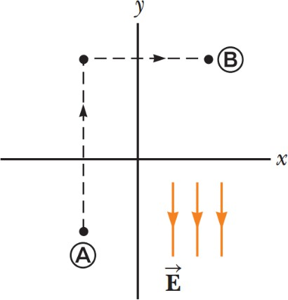Một điện trường đều có cường độ 325 V/m hướng theo chiều âm của trục _y_ như hình vẽ. Tính hiệu điện thế _VB_ − _VA_ giữa hai điểm A(-0,2 ;-0,3) và B(0,4 ;0,5). Gợi ý: lấy tích phân đường theo đường đứt nét như hình vẽ.

ĐS: +260 V

  4. Khi một electron chuyển động song song theo trục _x_ từ vị

trí

_x_ = 0
đến vị trí
_x_ = 2 cm, tốc độ của nó suy giảm từ
3,7 ×106 m/s xuống còn 1, 4 ×105 m/s.

  1. Tính hiệu điện thế giữa hai điểm nói trên

  2. Điểm nào có điện thế lớn hơn? ĐS: (a) -38,9 V

_Hình bài 3_

  5. Hai điện tích điểm được bố trí cách nhau _d_ = 2 cm như hình vẽ. Tính điện thế tại điểm A cách đều các điện tích một khoảng _d_ và tại điểm B nằm chính giữa hai điện tích.

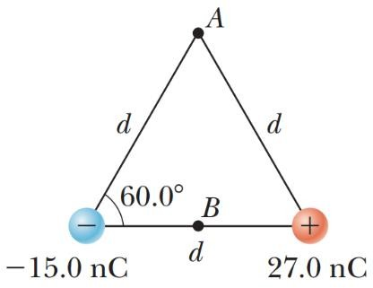ĐS: _VA_ = 5,39 kV, _VA_ = 10,8kV
_Hình bài 5_

  6. 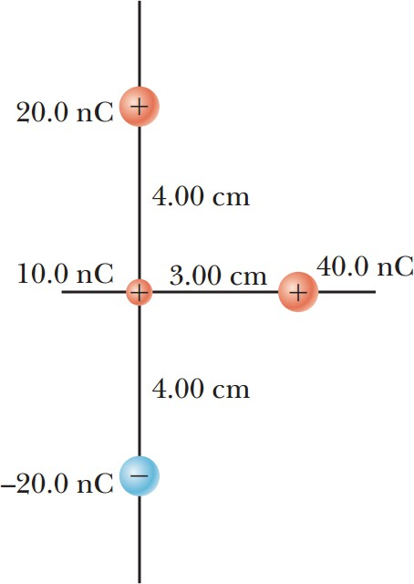Ba điện tích điểm có giá trị lần lượt bằng 20 nC, 10 nC và - 20 nC được gắn cố định trên một trục thẳng đứng như hình vẽ.

1. Tính thế năng của hệ ba điện tích gắn cố định nói trên.

2. Đặt thêm hạt có điện tích 40 nC và khối lượng

2 ×10−13
kg vào vị trí như hình vẽ. Hạt này bị đẩy và chuyển động ra xa do tương tác với ba điện tích cố định. Tính vận tốc của hạt khi nó bị đẩy tới xa vô cùng.
ĐS: (a)
−4,5×10−5 J (b) 3, 46×104 m/s

  7. Hai điện tích điểm đặt cách nhau biết _Q_ = 5 nC. Hãy tính:

1. Điện thế tại A.

2. Điện thế tại B.

3. Hiệu điện thế giữa B và A.

_d_ = 2 cm như hình vẽ. Cho
_Hình bài 6_
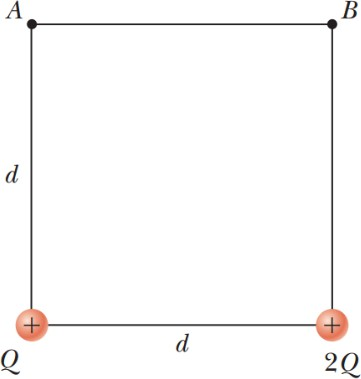
_Hình bài 7_
ĐS: (a) _VA_ = 5, 43 kV (b) _VB_ = 6,08 kV (c)
∆ _V_ = 658 V

  8. Tại một vị trí P nào đó gần điện tích điểm có cường độ điện trường bằng 500 V/m và điện thế -3 kV. Hãy tính :

1. Khoảng cách giữa điểm P và điện tích điểm.

2. Độ lớn của điện tích điểm. ĐS: (a) 6 m (b) -2 µC

  9. Bốn hạt có cùng điện tích _Q_ đặt trên bốn góc của hình vuông có cạnh bằng _a_. Hãy tính:

1. Điện thế ở tâm của hình vuông.

2. Công cần thực hiện để đưa một hạt điện tích _q_ từ xa vô cùng về tâm của hình vuông.

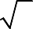 _Q_

ĐS: (a) 4 2 _ke a_
_qQ_
(b) 4 2 _ke a_

  10. Năm 1911, Rutherford cùng hai trợ lý Geiger và Marsden đã tiến hành thí nghiệm tán xạ

tia alpha trên nguyên tử vàng. Mỗi hạt alpha có điện tích bằng +2 _e_ và khối lượng
6,64 ×10−27 kg. Kết quả thí nghiệm chỉ ra rằng, hầu hết khối lượng của nguyên tử gần như tập trung vào hạt nhân với kích thước rất nhỏ, được bao quanh bởi các quỹ đạo electron.
Bắn một hạt alpha từ khoảng cách xa hướng thẳng tới hạt nhân vàng với điện tích +79 _e_.
Tốc độ ban đầu của alpha bằng 2,00×107 m/s. Hạt alpha có khả năng tiến lại gần nhất so
với hạt nhân vàng một khoảng bằng bao nhiêu? Cho rằng hạt nhân vàng luôn nằm cố định.
ĐS: 2,74 ×10−14 m

  11. Dựa vào độ thị sự phụ thuộc của điện thế vào toạ độ _V_ ( _x_ ), hãy vẽ đồ thị sự phụ thuộc

của thành phần _x_ của cường độ điện trường theo toạ độ _Ex_ ( _x_ ).

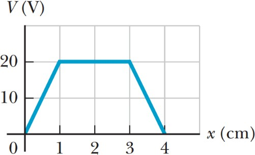

_Hình bài 11_

  12. Trong phạm vi từ _x_ = 0 đến _x_ = 6, 00 m, điện thế có dạng hàm số _V_ = _a_ \+ _bx_ , với

_a_ = 10, 0 V và _b_ = 7, 00 V/m. Hãy xác định :

  1. Điện thế tại _x_ = 0, _x_ = 3, 00 và _x_ = 6, 00 m.

  2. Độ lớn và hướng của điện trường tại _x_ = 0, _x_ = 3, 00 và _x_ = 6, 00 m.

ĐS: (a) 10V, -11V và -32V (b) 7 N/C tại mọi điểm _x_ > 0

  13. Trên một vùng không gian nhất định nào đó, điện thế có dạng hàm số

_V_ = 5 _x_ − 3 _x_ 2 _y_ \+ 2 _yz_ 2.

  1. Tìm hàm số biểu diễn các thành phần _Ex_ , _Ey_ , _Ez_ của vector cường độ điện trường

  2. Tính cường độ điện trường tại điểm P có toạ độ (1, 00;0; −2, 00) m.

ĐS: (a) (b) 7,07 N/C

  14. Một thanh tích điện đều dài 14 cm được uốn cong thành nửa cung tròn như hình vẽ. Tổng điện tích trên thanh bằng -7,5 µC. Tính điện thế tại tâm O của cung tròn.

_Hình bài 14_
ĐS: −1,51×106 V

  15. Một dây tích điện đều với mật độ điện dài λ được uốn thành dạng như hình vẽ. Hãy tính điện thế tại điểm O.

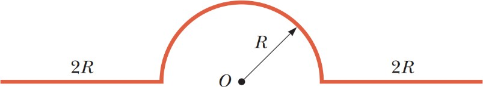

ĐS:
_ke_ λ(π + 2ln 3)
_Hình bài 15_

  16. Một vật dẫn hình cầu có bán kính 14 cm và điện tích 26 µC. Tính cường độ điện trường và điện thế tại điểm cách tâm vật dẫn:

1. _r_ = 10 cm

2. _r_ = 20 cm

3. _r_ =14 cm

ĐS: (a) 1, 67 ×106 V (b) 1,17 ×106 V (c) 1, 67 ×106 V

  17. 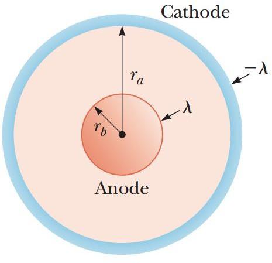Ống Geiger-Mueller có cấu tạo gồm anode và cathode từ hai ống kim loại hình trụ lồng vào nhau như hình vẽ.

Anode có bán kính _rB_ và tích điện với mật độ dài λ.
Cathode có bán kính _rA_ và tích điện với mật độ dài −λ.

  1. Chứng tỏ rằng hiệu điện thế giữa anode và cathode có dạng:

∆ _V_ = 2 _k_ λ ln  _rA_ 

_e_  _r_ 

 _B_ 

_Hình bài 17_

  2. Chứng tỏ rằng cường độ điện trường phụ thuộc vào khoảng cách _r_ đến trục đối xứng theo biểu thức:

_E_ = ∆ _V_ 1

ln( _rA_ / r _B_ ) _r_