# Public_147

Nội dung của chương này đề cập đến các ảnh được tạo thành khi chùm tia sáng gặp các bề mặt ngăn cách giữa hai môi trường. Các ảnh được tạo ra do sự phản xạ hoặc khúc xạ gây bởi các bề mặt này. Chúng ta có thể thiết kế các gương và thấu kính để tạo ra các ảnh có các đặc điểm như mong muốn. Trong chương này, ánh
sáng được thể hiện gần đúng như các tia và giả thiết rằng ánh sáng truyền đi theo đường thẳng. Đầu tiên chúng ta xem xét quá trình tạo ảnh bởi các loại gương và thấu kính và xác định vị trí cũng như kích thước của ảnh. Sau đó chúng ta sẽ kết hợp các gương và thấu kính để tạo ra các thiết bị quang học hữu ích như kính hiển vi và kính thiên văn.

## Ảnh tạo bởi gương phẳng

Xét một nguồn sáng điểm đặt ở O trước một gương phẳng và cách gương một đoạn _p_ như trong hình vẽ. Khoảng cách _p_ được gọi là khoảng cách vật. Chùm sáng phân kỳ từ nguồn đến gương và bị phản xạ bởi gương tạo ra chùm tia phản xạ cũng là chùm tia phân kỳ. Đường kéo dài (dường đứt nét trong hình) của chùm tia phản xạ giao nhau ở điểm _I_. Chùm tia phản xạ dường như được phát ra từ điểm _I_ ở sau gương. Điểm _I_ được gọi là ảnh của vật ở
_O_. Khoảng cách _q_ từ _I_ đến gương được gọi là khoảng cách ảnh.
Một ảnh tạo bởi giao điểm của các tia sáng gọi là ảnh thật và một ảnh tạo bởi đường kéo dài của các tia sáng gọi là ảnh ảo.
_Hình 36.1_
Ảnh của một vật tạo bởi gương phẳng luôn là ảnh ảo. Một ảnh thật có thể hứng được trên màn ảnh, còn ảnh ảo thì không.
Để xác định ảnh của một vật có kích thước, ta cần xác định ảnh của tất cả các điểm trên vật. Mặc dù có vô hạn tia sáng đi từ một điểm trên vật, nhưng chúng ta chỉ cần xét hai tia sáng phát ra từ điểm này và vẽ các tia phản xạ tương ứng nhờ định luật phản xạ ánh sáng để xác định vị trí ảnh. Trong hình 36.2, ảnh của điểm _P_ trên vật được xác định nhờ hai tia: tia _PQ_ và _PR_. Do hai tam giác _PQR_ và _P'QR_ bằng nhau nên _PQ_ = _P'Q_ , vì vậy |𝑝| = |𝑞|. Do đó ảnh tạo bởi gương phẳng của một vật đối xứng với vật qua gương.
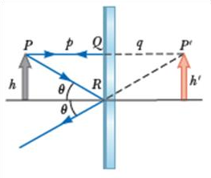Hình 36.2 cũng chỉ ra rằng chiều cao _h_ của vật bằng với chiều cao _h’_ của ảnh. Độ phóng đại ảnh của một vật được định nghĩa như sau:

𝑀 =

𝑐ℎ𝑖ề𝑢 𝑐𝑎𝑜 ả𝑛ℎ ℎ′
=
𝑐ℎ𝑖ề𝑢 𝑐𝑎𝑜 𝑣ậ𝑡 ℎ
(36.1)
Định nghĩa này cũng sẽ được dùng cho tất cả các loại gương và thấu kính. _M_ sẽ có giá trị dương khi ảnh và vật cùng chiều, _M_ sẽ có giá trị âm khi ảnh và vật ngược chiều. Với gương
_Hình 36.2_
phẳng 𝑀 = +1.
Bổ sung câu hỏi 36.1 vì tất cả các câu Quick Quiz đều có khả năng ra đề thi trắc nghiệm.

### 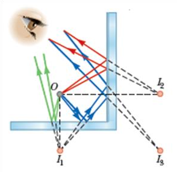Bài tập mẫu 36.1: Các ảnh tạo bởi hai gương.

Hai gương phẳng được đặt vuông góc nhau như hình 36.3 và vật được đặt ở _O_. Xác định các ảnh được tạo ra.

### Giải:

Ảnh của vật qua gương 1 là _I_ 1 và qua gương 2 là _I_ 2\. Ảnh _I_ 3 là ảnh của _I_ 1 qua gương 2 và cũng là ảnh của _I_ 2 qua gương 1.

_Hình 36.3_

Bổ sung phần ứng dụng trong gương chiếu hậu của ô tô (như trong giáo trình gốc).

## Ảnh tạo bởi gương cầu

Có nhiều loại gương cong khác nhau nhưng ở đây chúng ta chỉ khảo sát gương có bề mặt là một phần của mặt cầu (thường là một chỏm cầu), gọi là gương cầu.
Trong hình 36.4, tâm _C_ của mặt cầu chứa gương gọi là tâm của gương, bán kính _R_ của mặt cầu này gọi là bán kính của gương. Đường thẳng qua _C_ và _V_ ( _V_ là điểm chính giữa của gương gọi là đỉnh gương) gọi là trục chính của gương. Nếu mặt phản xạ của gương là mặt lõm thì gọi là gương cầu lõm và nếu mặt phản xạ của gương là mặt lồi thì gọi là gương cầu lồi.

### Gương cầu lõm

Xét một nguồn sáng điểm đặt trước gương tại một điểm _O_ tùy ý trên trục chính (Hình 36.5). Hai tia sáng phân kỳ từ _O_ tới gương cho hai tia phản xạ giao nhau tại ảnh _I,_ rồi chúng phân kỳ từ _I_ như
thể có một nguồn sáng tại đó. Ảnh _I_ này là ảnh thật.
Trong chương này chúng ta chỉ xét các tia sáng đi từ vật và tạo một góc nhỏ

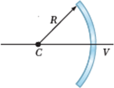

_Hình 36.4_

Gương

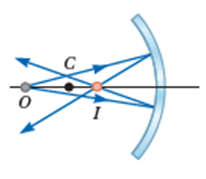

_Hình 36.5_

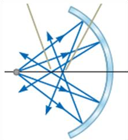với trục chính (điều kiện tương điểm). Tất các tia này đều cho tia phản xạ qua một điểm duy nhất và làm cho ảnh của vật rõ nét. Các tia xa trục chính cho các tia phản xạ hội tụ tại các điểm khác nhau trên trục chính, tạo ra một ảnh mờ (Hình 36.6). Hiệu ứng này gọi là cầu sai.

2

Hình 36.7 cho phép chúng ta tính được khoảng cách ảnh _q_ khi biết khoảng cách vật _p_ và bán kính _R_ của gương. Các khoảng cách _p_ và _q_ là đo từ điểm _V_. Các tia sáng trong hình xuất phát từ đỉnh của vật: một tia qua _C_ cho tia phản xạ truyền ngược lại và một tia tới gương tại _V_ cho tia phản xạ đối xứng tia tới qua trục chính.
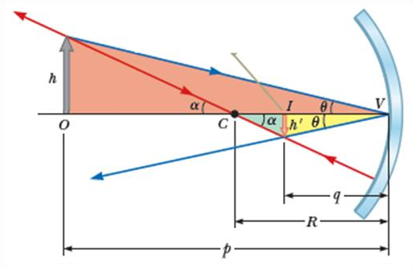Từ hình vẽ ta có: 𝑡𝑎𝑛𝜃 = ℎ/𝑝 và 𝑡𝑎𝑛𝜃 =
−ℎ′/𝑞 (ℎ′ < 0 vì ảnh ngược chiều với vật). Độ phóng đại ảnh
ℎ′ 𝑞
𝑀 = = − ℎ 𝑝
(36.2)
Mặt khác ta cũng có:
−ℎ′
𝑡𝑎𝑛𝛼 =
𝑅 − 𝑞
𝑣à 𝑡𝑎𝑛𝛼 =

ℎ

𝑝 − 𝑅
Suy ra:
ℎ′ 𝑅 − 𝑞
= −
ℎ 𝑝 − 𝑅
(36.3)
_Hình 36.7_
Từ 36.2 và 36.3 ta được:
Suy ra:

𝑅 − 𝑞 𝑞

= 

𝑝 − 𝑅 𝑝

1 1 2  +  =
𝑝 𝑞 𝑅

(36.4)

Phương trình 36.4 gọi là phương trình gương cầu.
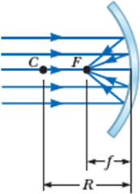Nếu vật ở rất xa gương, nghĩa là _p_ rất lớn so với _R_ thì 1/𝑝 ≈ 0 và phương trình 36.4 cho 𝑞 ≈ 𝑅/2. Nghĩa là khi vật ở rất xa gương thì ảnh ở vị trí trung điểm của đoạn _CV_ như hình 36.8. Điểm ảnh đặc biệt này gọi là tiêu điểm _F_ và khoảng cách ảnh này gọi là tiêu cự _f_ , trong đó

𝑅

𝑓 =
2
(36.5)
Tiêu cự _f_ là một thông số đặc biệt của gương và được dùng để so sánh gương này với gương khác. Dùng _f_ phương trình 36.4 được viết lại thành:
_Hình 36.8_
1 1 1  +  = 

𝑝 𝑞 𝑓

(36.6)

### Gương cầu lồi

Hình 36.9 cho thấy ảnh của vật ở trước gương là một ảnh ảo và luôn cùng chiều với vật nhưng nhỏ hơn vật.
Các phương trình 36.2, 36.4 và 36.6 sử dụng được cho cả gương cầu lõm và gương cầu lồi, nhưng cần tuân theo quy ước về dấu theo bảng 36.1.

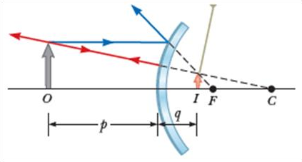

_Hình 36.9_

_Bảng 36.1- Quy ước dấu cho gương cầu_

| Đại lượng | Dương khi | Âm khi |
| --- | --- | --- |
| P | Vật ở trước gương (vật thật) | Vật ở sau gương (vật ảo) |
| Q | Ảnh ở trước gương (ảnh thật) | Ảnh ở sau gương (ảnh ảo) |
| h’ | Ảnh cùng chiều với vật | Ảnh ngược chiều với vật |
| fvàR | Gương là gương lõm | Gương là gương lồi |
| M | Ảnh cùng chiều với vật | Ảnh ngược chiều với vật |

 

### Các tia sáng đặc biệt

Vị trí và kích thước của ảnh tạo bởi gương có thể được xác định bằng hình vẽ và có thể dùng để kiểm tra các kết quả tính toán bằng các công thức. Việc vẽ hình trở nên đơn giản bằng cách sử dụng hai trong ba tia sáng xuất phát từ một điểm trên vật (thường là đỉnh của vật) theo các phương truyền đặc biệt theo từng loại gương như sau:

  * Tia tới song song với trục chính cho tia phản xạ qua tiêu điểm _F (_ hoặc có phương qua tiêu điểm _F_ ).

  * Tia tới qua tiêu điểm _F_ (hoặc có phương qua tiêu điểm _F_ ) cho tia phản xạ song song với trục chính.

  * Tia tới gương tại tâm _C_ (hoặc có phương qua tâm _C_ ) cho tia phản xạ truyền ngược lại theo phương của tia tới.

Giao điểm của hai trong ba tia trên xác định vị trí ảnh.
Đối với gương cầu lõm, khi cho vật từ xa gương tiến đến _F_ thì ảnh thật (ngược chiều với vật) sẽ tiến ra xa gương và càng lớn dần. Khi vật ở tại _F,_ ảnh ở xa vô cùng. Khi vật ở giữa _F_ và gương thì ảnh là ảo, cùng chiều với vật, lớn hơn vật và cứ lớn dần lên.
Đối với gương cầu lồi, ảnh luôn là ảo, cùng chiều và nhỏ hơn vật. Khi vật tiến về phía gương thì ảnh lớn dần và tiến về phía gương.
Bổ sung câu hỏi 36.2 và 36.3 vì tất cả các câu Quick Quiz đều có khả năng ra đề thi trắc nghiệm.

### Bài tập mẫu 36.2: Một gương cầu có tiêu cự 10,0 cm.

Một gương cầu có tiêu cự 10,0 cm .
(A) Xác định vị trí và mô tả ảnh của một vật đặt cách gương 25 cm.
(B)Xác định vị trí và mô tả ảnh của một vật đặt cách gương 10 cm.

### Giải:

(A) Theo công thức gương cầu:
1 1 1  +  =
𝑝 𝑞 𝑓
=> 𝑞 =
𝑝𝑓
𝑝 − 𝑓
25.10
=
25 − 10
= 16,7 𝑐𝑚
Độ phóng đại ảnh:
𝑞
𝑀 = −
𝑝
= −0,667
Kết luận: Ảnh thu được là ảnh thật, nhỏ hơn vật và ngược chiều với vật. (B)
1 1 1  +  =
𝑝 𝑞 𝑓
=> 𝑞 =
𝑝𝑓
𝑝 − 𝑓
10.10
= → ∞
10 − 10
Kết luận: Ảnh ở xa vô cực, nghĩa là chùm tia xuất phát từ vật đến gương cho chùm tia phản xạ song song nhau.
Bổ sung thêm bài tập mẫu 36.4 như trong giáo trình gốc

## Ảnh tạo bởi sự khúc xạ

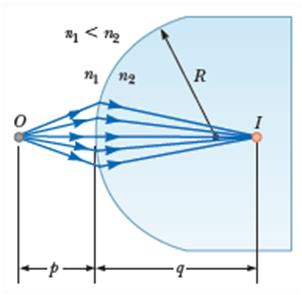Xét hai môi trường trong suốt có chiết suất 𝑛1 và 𝑛2 và ngăn cách nhau bởi mặt cầu có bán kính _R_ (Hình 36.16). Giả sử nguồn sáng điểm đặt ở _O_ trong môi trường có chiết suất 𝑛1. Một chùm sáng từ _O_ khúc xạ ở mặt cầu và hội tụ ở _I,_ là ảnh của nguồn.
Với một tia sáng từ _O_ khúc xạ qua _I_ (Hình 36.17), định luật Snell cho
𝑛1 𝑠𝑖𝑛𝜃1 = 𝑛2 𝑠𝑖𝑛𝜃2
Với các góc 𝜃 nhỏ sao cho có thể sử dung gần đúng 𝑠𝑖𝑛𝜃 ≈ 𝜃 (góc 𝜃 tính theo radian) thì phương trình trên có thể viết lại thành

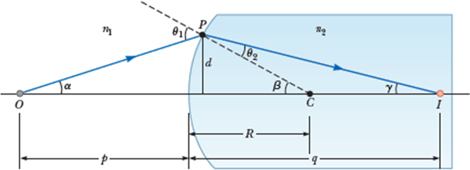

𝑛1𝜃1 = 𝑛2𝜃2

Theo hình vẽ ta cũng có

𝜃1 = 𝛼 + 𝛽 𝑣à 𝛽 = 𝜃2 \+ 𝛾

Kết hợp các phương trình trên để khử 𝜃1 và 𝜃2 thì thu được
𝑛1𝛼 + 𝑛2𝛾 = (𝑛2 − 𝑛1)𝛽 (36.7)
Sử dụng các tam giác trong hình vẽ chúng ta cũng thu được các kết quả
𝑑
𝑡𝑎𝑛𝛼 ≈ 𝛼 =
𝑝
𝑑
; 𝑡𝑎𝑛𝛽 ≈ 𝛽 =
𝑅

𝑑

𝑣à 𝑡𝑎𝑛𝛾 ≈ 𝛾 = 

𝑞

Thay các biểu thức này vào (36.7) rồi rút gọn thì được
𝑛1
+
𝑝
𝑛2
𝑞
𝑛2 − 𝑛1
=
𝑅
(36.8)
Kết quả này không phụ thuộc 𝛼 (với 𝛼 nhỏ) nên tất cả các tia sáng đều hội tụ tại cùng một điểm ảnh _I_.
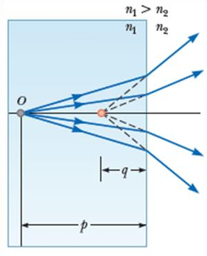Để cho thuận tiện khi xét các trường hợp khác nhau, chúng ta gọi phía mặt ngăn cách chứa chùm sáng tới là phía trước và phía bên kia gọi là phía sau. Ngược với ảnh tạo bởi gương, ảnh thực tạo bởi các tia khúc xạ xuất hiện ở phía sau mặt ngăn cách nên quy ước về dấu cho _q_ và _R sẽ_ ngược với quy ước dấu cho gương.

### Sự khúc xạ qua các bề mặt phẳng

Nếu bề mặt khúc xạ là phẳng thì 𝑅 → ∞ và phương trình 36.8 trở thành

𝑛1

𝑝

𝑛2
= −
𝑞
(36.9)

6

Phương trình (36.9) cho thấy _q_ và _p_ ngược dấu nhau nên ảnh và vật ở cùng phía so với bề mặt khúc xạ như minh họa ở hình 36.18, nghĩa là ảnh thu được là ảnh ảo.
Bổ sung câu hỏi 36.4 và 36.5 vì tất cả các câu Quick Quiz đều có khả năng ra đề thi trắc nghiệm.

### Bài tập mẫu 36.7: Một con cá đang bơi ở độ sâu _d_ so với mặt nước của một hồ nước.

Một con cá đang bơi ở độ sâu _d_ so với mặt nước của một hồ nước.

  1. Một người quan sát con cá theo hướng vuông góc với mặt nước sẽ thấy con cá ở độ sâu biểu kiến bằng bao nhiêu?

### Giải:

Từ phương trình (36.9), suy ra

𝑞 = −

𝑛2
𝑛1
𝑝 = −
1,00
1,33
𝑑 = −0,752 𝑑
𝑞 < 0 nên ảnh là ảo và người sẽ thấy con cá ở độ sâu biểu kiến khoảng bằng 3/4 độ sâu thực sự (Hình 36.20a).

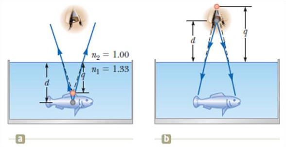

_Hình 36.20_

  2. Nếu mặt của người quan sát cách mặt nước một đoạn _d_ thì con cá sẽ thấy mặt người cách mặt nước một đoạn biểu kiến bằng bao nhiêu?

### Giải:

Phương trình 36.9 cho

𝑞 = −

𝑛2
𝑛1
𝑝 = −
1,33
1,00
𝑑 = −1,33 𝑑
Ảnh của mặt người là ảo, nghĩa là ảnh trong môi trường không khí trên mặt nước (Hình 36.20b).

  3. Nếu con cá có chiều cao thực sự là _h_ (đo từ vây trên đến vây dưới của con cá) thì chiều cao biểu kiến của con cá mà người quan sát nhìn thấy bằng bao nhiêu so với _h_?

### Giải:

Ảnh của vây trên và vây dưới của con cá ở các vị trí
𝑞1 = −0,752 𝑑 𝑣à 𝑞2 = −0,752 (𝑑 + ℎ)
Chiều cao biểu kiến của con cá là
ℎ′ = 𝑞1 − 𝑞2 = 0,752 ℎ
Vì vậy chiều cao biểu kiến của con cá chỉ bằng khoảng 3/4 chiều cao thực của con cá.

## Ảnh tạo bởi thấu kính mỏng

Thấu kính thường được dùng để tạo ảnh bởi sự khúc xạ trong các hệ thống quang học của các thiết bị như máy ảnh, kính hiển vi, kính viễn vọng. Với thấu kính, ánh sáng sẽ khúc xạ ở cả hai bề mặt của thấu kính và ảnh do sự khúc xạ ở bề mặt thứ nhất của thấu kính sẽ trở thành vật đối với mặt thứ hai. Chúng ta sẽ xem xét thấu kính dày trước rồi cho độ dày của thấu kính xấp xỉ bằng không để có kết quả cho thấu kính mỏng.
Xét một thấu kính đặt trong không khí, thấu kính có chiết suất _n_ và được giới hạn bởi hai mặt cầu có bán kính là 𝑅1 và 𝑅2 như ở hình 36.21. Một vật được đặt ở _O_ sẽ cho ảnh tạo bởi bề mặt 1 ở _I_ 1 xác định bởi 𝑞1 thỏa phương trình

1

𝑝1

𝑛
+
𝑞1
𝑛 − 1
=
𝑅1
(36.10)
Nếu ảnh là ảo (như trong hình 36.21a) thì 𝑞1 < 0 và nếu ảnh là thật (như trong hình 36.21b) thì 𝑞1 > 0.
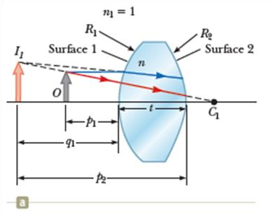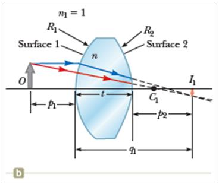

_Hình 36.21_

Đối với bề mặt thứ hai, vật và ảnh xác định bởi 𝑝2 và 𝑞2 thỏa phương trình

𝑛

𝑝2

1
+
𝑞2
1 − 𝑛
=
𝑅2
(36.11)
Gọi _t_ là độ dày của thấu kính thì 𝑝2 = −𝑞1 \+ 𝑡. Đối với thấu kính mỏng (bề dày rất nhỏ so với các bán kính là 𝑅1 và 𝑅2) thì có thể bỏ qua _t_ nên 𝑝2 = −𝑞1. Phương trình 36.11 trở thành
𝑛
−
𝑞1
1
+
𝑞2
1 − 𝑛
=
𝑅2
(36.12)
Kết hợp hai phương trình 36.10 và 36.12 chúng ta thu được
1 1 1 1
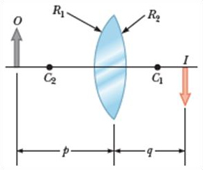+ = (𝑛 − 1) ( − ) (36.13)

𝑝1

𝑞2

𝑅1

𝑅2
Với thấu kính mỏng, gọi _p_ và _q_ lần lượt là khoảng cách ảnh và khoảng cách vật như hình 36.22 thì phương trình 36.13 được viết lại thành
1 1 1 1
 +  = (𝑛 − 1) ( − ) (36.14)

𝑝 𝑞

𝑅1

𝑅2
Tiêu cự _f_ của một thấu kính mỏng là khoảng cách ảnh của vật ở xa vô cùng. Theo định nghĩa này chúng ta thu được công thức để xác định _f_ là
_Hình 36.22_
1 1 1
 = (𝑛 − 1) ( − ) (36.15)
𝑓 𝑅1 𝑅2
Chúng ta có thể viết phương trình 26.14 theo _f_ như sau
1 1 1  +  = 
𝑝 𝑞 𝑓
(36.16)
Phương trình 36.16 được gọi là phương trình thấu kính mỏng.
Một thấu kính có hai tiêu điểm 𝐹1 , 𝐹2 và hai tiêu điểm này có cùng khoảng cách tới thấu kính. Có hai loại thấu kính: thấu kính hội tụ và thấu kính phân kỳ. Hình 36.23 là một số hình dạng của hai loại thấu kính này.

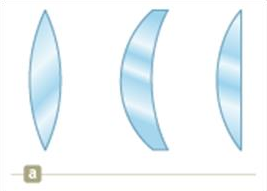

_Hình 36.23. (a) Thấu kính hội tụ. (b) Thấu kính phân kỳ Bảng 36.2 \- Quy ước dấu cho thấu kính._

| Đại lượng | Dương khi | Âm khi |
| --- | --- | --- |
| p | Vật ở trước thấu kính (vật thật) | Vật ở sau thấu kính (vật ảo) |
| q | Ảnh ở sau thấu kính (ảnh thật) | Ảnh ở trước thấu kính (ảnh ảo) |
| h’ | Ảnh cùng chiều với vật | Ảnh ngược chiều với vật |
| R1vàR2 | Tâm của mặt cầu ở sau thấu kính | Tâm của mặt cầu ở trước thấu kính |
| f | Thấu kính hội tụ | Thấu kính phân kỳ |

 

### Độ phóng đại ảnh.

ℎ′ 𝑞

𝑀 = = −  ℎ 𝑝
(36.17)

  * Khi 𝑀 > 0 thì ảnh cùng chiều với vật, ảnh và vật ở cùng phía so với thấu kính.

  * Khi 𝑀 < 0 thì ảnh ngược chiều với vật, ảnh và vật ở hai phía so với thấu kính.

### Các tia sáng đặc biệt

Để dựng ảnh của vật qua thấu kính cho thuận tiện, chúng ta vẽ hai trong ba tia sáng xuất phát từ đỉnh của vật đến thấu theo các phương đặc biệt sau:

### Đối với thấu kính hội tụ

  * Tia sáng tới thấu kính song song với trục chính, tia khúc xạ qua thấu kính đi qua tiêu điểm ở sau thấu kính.

  * Tia sáng tới qua tiêu điểm (hoặc có phương qua tiêu điểm) ở trước thấu kính, tia khúc xạ qua thấu kính song song với trục chính.

  * Tia sáng tới qua tâm của thấu kính cho tia khúc xạ truyền thẳng.

### Đối với thấu kính phân kỳ

### 

  * Tia sáng tới thấu kính song song với trục chính, tia khúc xạ qua thấu kính có phương đi qua tiêu điểm ở trước thấu kính.

  * Tia sáng tới có phương qua tiêu điểm ở sau thấu kính, tia khúc xạ qua thấu kính song song với trục chính.

  * Tia sáng tới qua tâm của thấu kính cho tia khúc xạ truyền thẳng.

_Hình 36.22. Ảnh của vật qua thấu kính mỏng_
Chỉnh kích thước của hình lớn lên Đánh số sai hình (không đúng thứ tự)

### Bài tập mẫu 36.8: Một thấu kính hội tụ có tiêu cự 10,0 cm.

  1. Một vật đặt cách thấu kính 30,0 cm. Tìm vị trí ảnh và mô tả ảnh. Vẽ hình.

### Giải:

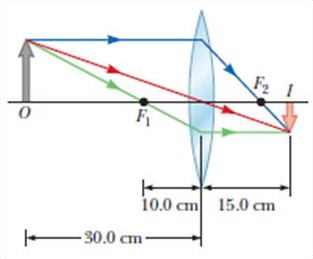Từ phương trình thấu kính
Suy ra:
1 1 1  +  = 
𝑝 𝑞 𝑓

𝑞 =

𝑝. 𝑓
𝑝 − 𝑓
30.10
=
30 − 10
= 15 𝑐𝑚
Độ phóng đại ảnh:
𝑞
𝑀 = −
𝑝
15 𝑐𝑚
= −
30 𝑐𝑚
= −0,5
Ảnh của vật là ảnh thật ở sau thấu kính, ngược chiều với vật, cao bằng 0,5 lần vật.

  2. Một vật đặt cách thấu kính 10,0 cm. Tìm vị trí ảnh và mô tả ảnh.

### Giải:

Tương tự câu a,

𝑞 =

𝑝. 𝑓
𝑝 − 𝑓
10.10
=
10 − 10
=> 𝑞 → ∞
Ảnh ở xa vô cùng so với thấu kính

  3. Một vật đặt cách thấu kính 5,0 cm. Tìm vị trí ảnh và mô tả ảnh. Vẽ hình.

### Giải:

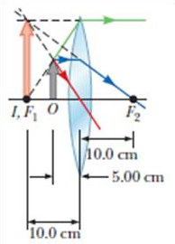Từ phương trình thấu kính, suy ra:

𝑞 =

Độ phóng đại ảnh:
𝑝. 𝑓
𝑝 − 𝑓
5.10
=
5 − 10
= −10 𝑐𝑚
𝑞
𝑀 = −
𝑝

−10 𝑐𝑚

= − = 2

5 𝑐𝑚

Ảnh của vật là ảnh ảo, cùng chiều với vật, cao bằng hai lần vật.
Bổ sung bài tập mẫu 36.9 đối với thấu kính phân kỳ như trong giáo trình gốc

### Hệ thấu kính mỏng.

Giả sử vật được đặt trước hệ gồm hai thấu kính. Ảnh của vật được xác định theo trình tự sau:

  * Xác định ảnh của vật tạo ra bởi thấu kính thứ nhất như là khi không có thấu kính thứ hai.

  * Ảnh tạo ra bởi thấu kính thứ nhất là vật của thấu kính thứ hai. Nếu vật này ở sau thấu kính thứ hai thì vật này là vật ảo (nghĩa là 𝑝 < 0).

Ảnh tạo bởi thấu kính thứ hai là ảnh tạo bởi hệ thống hai thấu kính trên. Độ phóng đại ảnh của hệ hai thấu kính:
𝑀 = 𝑀1. 𝑀2 (36.18)
Cách thức xác định ảnh như trên cũng được sử dụng cho hệ gồm nhiều hơn hai thấu kính.
Trong trường hợp hệ hai thấu kính được đặt sát nhau thì ảnh của vật tạo bởi hệ giống như ảnh tạo bởi một thấu kính có tiêu cự _f_ thỏa phương trình:
trong đó 𝑓1 và 𝑓2 là tiêu cự của hai thấu kính.

### Bài tập mẫu 36.10:

1 1
 =
𝑓 𝑓1
1
+
𝑓2
(36.19)
Hai thấu kính hội tụ mỏng có tiêu cự lần lượt là 𝑓1 = 10,0 𝑐𝑚 và 𝑓2 = 20,0 𝑐𝑚 được đặt cách nhau 20 cm. Một vật ở bên trái thấu kính thứ nhất và cách thấu kính này 30 cm. Tìm vị trí và độ phóng đại của ảnh tạo ra bởi hệ hai thấu kính.

### Giải:

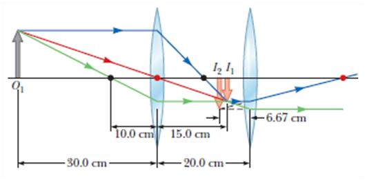Vị trí của ảnh tạo ra bởi thấu kính thứ nhất:

𝑞1 = 𝑝

𝑝1𝑓1

− 𝑓
30.10
=
30 − 10
1 1
= 15 𝑐𝑚
Độ phóng đại ảnh này bằng:
𝑞1
𝑀1 = − 𝑝 = −0,5
Vật của thấu kính thứ hai (là ảnh trên) có khoảng cách vật là:
_Hình 36.30. Ví dụ_
𝑝2 = 𝑡 − 𝑞1 = 20 𝑐𝑚 − 15 𝑐𝑚 = 5 𝑐𝑚
Vị trí của ảnh tạo ra bởi thấu kính thứ hai:

𝑞2 = 𝑝

𝑝2𝑓2

− 𝑓
5.20
= = −6,67 𝑐𝑚
5 − 20

2 2

Độ phóng đại ảnh này bằng:

𝑞2

6,67𝑐𝑚

𝑀2 = − 𝑝 = −

= 1,33
5𝑐𝑚
Độ phóng đại của ảnh tạo ra bởi hệ hai thấu kính:
𝑀 = 𝑀1. 𝑀2 = −0,667
Nghĩa là ảnh tạo ra bởi hệ ở trước thấu kính thứ hai, ngược chiều với vật và nhỏ hơn vật.

## Quang sai

Các kết quả phân tích của chúng ta về gương và thấu kính được thực hiện với điều kiện các tia sáng tạo với trục chính một góc nhỏ (điều kiện tương điểm) và thấu kính là mỏng. Dưới các điều kiện này, mọi tia sáng đi từ một nguồn điểm đều hội tụ tại một điểm nên ảnh thu được sẽ sắc nét. Khi các điều kiện này không được thỏa, ảnh sẽ không hoàn hảo.
Để phân tích chính xác về ảnh, chúng ta cần dùng định luật Snell để xác định sự phản xạ và khúc xạ cho mỗi tia sáng khi bị phản xạ hoặc khúc xạ ở các bề mặt. Theo cách thực hiện này, một điểm trên vật sẽ không tương ứng một điểm ảnh duy nhất và như vậy ảnh bị nhòe. Sự sai lệch của ảnh thực tế so với ảnh dự đoán (nhờ các kết quả thu được ở các nội dung trước) được gọi là quang sai.

### Các loại quang sai Cầu sai

Quang sai loại này xảy ra do tiêu điểm ứng với chùm tia sáng tới càng xa trục chính của thấu kính (hoặc gương) sẽ khác với tiêu điểm ứng với chùm tia sáng tới đi gần trục chính như hình minh họa 36.31 và 36.8. Nguyên nhân gây ra cầu sai là do sử dụng các thấu kính(hoặc gương) có bề mặt hình cầu.
Nhiều máy ảnh có khẩu độ điều chỉnh được để thay đổi cường độ sáng và giảm bớt cầu sai. Bằng cách giảm khẩu độ, ảnh thu được sẽ rõ nét nhưng cần tăng thời gian phơi sáng.
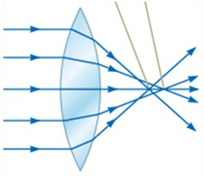 _Hình 36.31_
Đối với gương, để giảm cầu sai thì dùng gương parabol thay cho gương cầu.

### Sắc sai

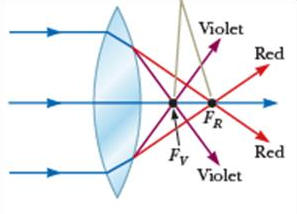Sắc sai xảy do chiết suất của môi trường trong suốt phụ thuộc vào bước sóng ánh sáng. Vì vậy khi sử dụng ánh sáng trắng, tia màu tím bị khúc xạ mạnh hơn tia màu đỏ. Điều này dẫn đến kết quả là tiêu cự thấu kính giảm dần đối với ánh sáng có màu từ đỏ đến tím như hình 36.32.
Sắc sai làm mờ ảnh. Để giảm sắc sai, có thể dùng kết hợp một thấu kính hội tụ và một thấu kính phân kỳ làm
bằng hai loại thủy tinh có chiết suất khác nhau.

## Máy ảnh

Máy ảnh là một thiết bị quang học đơn giản được mô tả như hình 36.33. Máy ảnh gồm một buồng tối, một thấu kính hội tụ để tạo ra ảnh thật và một bộ phận nhạy sáng (để lưu ảnh) được điều chỉnh ở đúng vị trí của ảnh.
Máy ảnh sẽ lưu ảnh trên phim hoặc được số hóa để lưu thông tin về ảnh vào một thẻ nhớ (máy ảnh kỹ thuật số). Bằng cách thay đổi khoảng cách từ thấu kính đến bộ phận lưu ảnh cho phù hợp chúng ta sẽ thu được ảnh rõ nét của vật.
Chưa nhắc đến khẩu độ

## Mắt

_Hình 36.32_

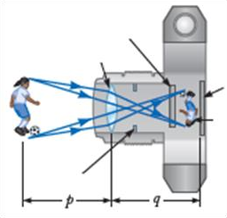

_Hình 36.33: Máy ảnh kỹ thuật số_
Giống như máy ảnh, mắt hội tụ áng sáng và tạo ra ảnh rõ nét. Mắt điều chỉnh lượng sáng đi vào và tạo ảnh bằng một cơ chế rất phức tạp, chính xác và hiệu quả hơn rất nhiều so

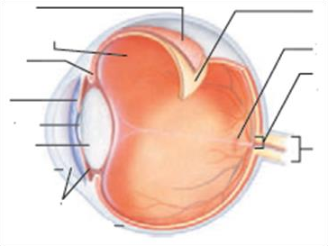

_Hình 36.34: Các thành phần cơ bản của mắt_
với một máy ảnh tinh vi. Mắt thực sự là một kỳ quan sinh lý học.Hình 36.34 trình bày các thành phần cơ bản của mắt.
Giác mạc là một màng mỏng cứng và trong suốt cho phép ánh sáng đi vào mắt. Lòng đen điều chỉnh lượng ánh sáng vào mắt bằng cách mở rộng ra khi gặp ánh sáng yếu hoặc thu hẹp lại khi gặp ánh sáng mạnh. Hệ thống giác mạc và thủy tinh thể hội tụ ánh sáng vào võng mạc, nơi đây gồm hàng triệu tế bào cảm thụ ánh sáng. Khi bị ánh sáng kích thích, các tế bào này sẽ gửi các xung về não nhờ các dây thần kinh thị giác giúp chúng ta cảm nhận được vật. Ảnh của vật được cảm nhận rõ khi ảnh này hiện ra ở võng mạc.
Khi cần nhìn một vật, hình dạng của thủy tinh thể được thay đổi (tiêu cự của thủy tinh thể thay đổi theo) cho phù hợp nhờ cơ vòng. Quá trình này gọi là sự điều tiết. Do khả năng điều tiết bị hạn chế nên mắt chỉ thấy rõ vật khi vật được đặt trong một khoảng giới hạn gọi là giới hạn nhìn rõ của mắt. Điểm gần mắt nhất của giới hạn nhìn rõ gọi là điểm cực cận và điểm xa mắt nhất gọi là điểm cực viễn. Người có mắt bình thường thì điểm cực cận cách mắt trung bình khoảng 25 cm và điểm cực viễn ở xa vô cùng. Tuy nhiên khi người càng lớn tuổi khoảng cách từ cực cận đến mắt sẽ tăng.
Có hai loại tế bào cảm thụ ánh sáng: tế bào hình que và tế bào hình nón. Tế bào hình que rất nhạy cảm với ánh sáng giúp chúng ta nhìn trong tối nhưng không phân biệt được màu sắc. Tế bào hình nón nhạy cảm với các bước sóng khác nhau của ánh sáng. Tế bào hình nón được chia thành ba loại: đỏ, xanh lá cây và xanh dương. Nếu hai loại tế bào hình nón đỏ và xanh là cây kích thích đồng thời, bộ não sẽ hiểu là màu vàng. Nếu cả ba loại tế bào hình nón đều bị kích thích đồng thời bởi các ánh sáng đỏ, xanh lá cây và xanh dương thì bộ não sẽ hiểu là màu trắng. cả ba loại tế bào hình nón đều bị kích thích đồng thời bởi các ánh sáng với mọi màu sắc khác nhauthì bộ não cũng sẽ hiểu là màu trắng.

### Các tật của mắt Viễn thị

### 

Người bị viễn thị có thể nhìn rõ các vật ở xa nhưng không thể nhìn rõ các vật ở gần. Điểm cực cận của mắt người bị viễn thị ở xa hơn so với người có mắt bình thường. Khi nhìn các vật ở gần, khả năng khúc xạ của giác mạc và thủy tinh thể không đủ để hội tụ ánh sáng trên võng mạc (Hình 36.37a). Tật này có thể khắc phục bằng cách đeo kính hội tụ (Hình 36.37b) để hội tụ ánh sáng trên võng mạc.

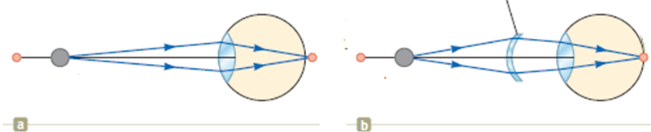

_Hình 36.37_

### Cận thị

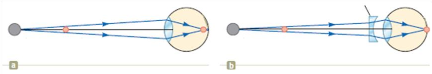

_Hình 36.38_

Người bị cận thị có thể nhìn rõ các vật ở gần nhưng không thể nhìn rõ các vật ở xa. Điểm cực viễn của mắt người bị cận thị không ở xa vô cực (như mắt bình thường) và có thể cách mắt nhỏ hơn 1m. Tiêu cự lớn nhất của mắt cận thị không đủ để tạo ra ảnh rõ nét của vật ở xa trên võng mạc mà ở trước võng mạc nên mắt không nhìn rõ được vật (Hình 36.38a). Tật này có thể khắc phục bằng cách đeo kính phân kỳ (Hình 36.38b) giúp điểm hội tụ ở trên võng mạc.
ss