# Public_150

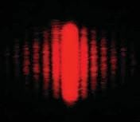Trong chương 37 chúng ta đã định nghĩa nhiễu xạ một cách không mấy chặt chẽ là sự loe ra của ánh sáng xuất

phát từ một khe hẹp. Tuy nhiên, không đơn giản chỉ là loe ra vì ánh sáng còn tạo nên một bức tranh giao thoa gọi là vân nhiễu xạ. Thí dụ, ánh sáng đơn sắc từ một nguồn ở xa vô cực (hay một lazer) đi qua một khe hẹp và sau đó được hứng bằng một màn quan sát, chúng sẽ tạo nên một bức tranh nhiễu xạ trên

màn như trong hình 38.1. Bức tranh này bao gồm một dải sáng trung tâm mạnh, rộng (gọi là cực đại trung tâm) được bao quanh bởi một dải hẹp và yếu hơn (gọi là cực đại thứ cấp) và một loạt các dải tối xen kẽ.

## Nhiễu xạ ánh sáng

_**Hình 38.1:**_ Hình ảnh nhiễu xạ hiện trên một màn quan sát khi ánh sáng đến màn, sau khi đi qua một khe hẹp dọc. Quá trình nhiễu xạ làm cho ánh sáng loe ra vuông góc với chiều dài của khe.

Sự nhiễu xạ ánh sáng không giới hạn trong trường hợp khi ánh sáng đi qua một khoảng trống hẹp mà nó còn xảy ra khi ánh sáng đi qua một cạnh (mép) của đối tượng, chẳng hạn như hình 38.2. Chú ý rằng, các đường cực đại và cực tiểu chạy dọc gần như song song với nhau để tạo nên bức tranh dọc theo mép trái. Một lần nữa, chúng ta thấy hình ảnh các vân sáng và tối, giống như hình ảnh giao thoa trong chương 37.

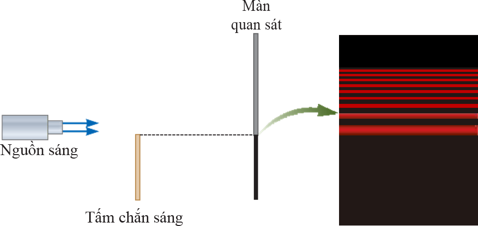

_**Hình 38.2:**_ Ảnh nhiễu xạ qua cạnh của một vật.

Ánh sáng có bước sóng tương đương hoặc lớn hơn chiều rộng của một khe hẹp sẽ lan truyền mọi hướng trước khi đi qua khe. Hiện tượng này gọi là nhiễu xạ ánh sáng. Điều này

chỉ ra rằng ánh sáng lan truyền hướng qua khe hẹp đến được cả những khu vực đáng ra tạo thành vùng tối nếu như ánh sáng truyền thẳng.

_Phân loại:_ Gọi L, d là khoảng cách từ vân nhiễu xạ đến màn quan sát và nguồn sáng.

Ta có hai loại nhiễu xạ:

  * Nếu L, d là hữu hạn thì sóng phát ra từ S là sóng cầu: nhiễu xạ của sóng cầu được gọi là nhiễu xạ Fresnel

  * Nếu L, d là vô hạn thì sóng phát ra từ S là sóng phẳng: nhiễu xạ của sóng phẳng được gọi là nhiễu xạ Fraunhofer.

#### Chấm sáng Fresnel

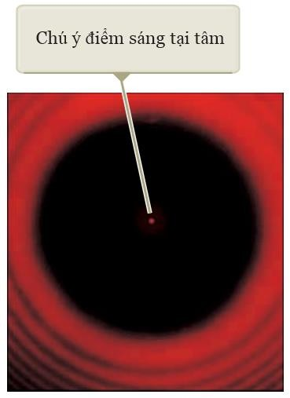Hình 38.3 cho thấy một mẫu nhiễu xạ kết hợp với bóng của một đồng xu. Một điểm sáng xuất hiện ở trung tâm, và các đường viền hình tròn mở rộng ra ngoài từ mép của bóng đồng xu. Chúng ta có thể giải thích điểm sáng trung tâm bằng cách sử dụng lý thuyết sóng ánh sáng và dự đoán xuất hiện cực đại giao thoa tại vị trí này. Từ quan điểm của tia quang học (trong đó ánh sáng được xem là tia di chuyển theo đường thẳng), chúng ta dự đoán tại tâm của ảnh nhiễu xạ là một bóng tối vì màn quan sát được che chắn hoàn toàn bởi đồng xu.

Quan điểm của Newton là quan điểm thịnh hành trong giới khoa học Pháp thời bấy giờ. Sau đó mới đến Fresnel, một kỹ sư quân đội trẻ theo đuổi sự đam mê của mình đối với quang học đến nỗi sao

nhãng cả nhiệm vụ quân đội. Fresnel tin tưởng vào thuyết sóng ánh sáng và gửi một bài báo cho Viện Hàn Lâm khoa học để mô tả những thí nghiệm của mình và cách giải thích những thí nghiệm ấy bằng thuyết sóng.

_**Hình 38.3:**_ Ảnh nhiễu xạ của một đồng xu. Chú ý đến những vòng nhiễu xạ đồng tâm và chấm sáng Fresnel tại tâm của ảnh nhiễu xạ.

Năm 1819 Viện Hàn Lâm mà đa số những người ủng hộ Newton nghĩ rằng để thách thức quan điểm sóng đã tổ chức một cuộc thi tranh giải về đề tài nhiễu xạ, Fresnel đã thắng. Tuy nhiên, những người ủng hộ Newton vẫn không chịu nghe theo mà cũng không chịu im lặng. Một trong những người ấy là Poisson, nếu lý thuyết Fresnel đúng thì sóng sáng sẽ nhiễu xạ vào vùng bóng tối của quả cầu khi chúng đi qua mép của quả cầu và tạo thành một chấm sáng tại tâm điểm của bóng tối đó. Trước sự ngạc nhiên của Poisson, vị trí này đã được quan sát bởi Dominique Arago ngay sau đó. Do đó, dự đoán của Poisson đã củng cố lý thuyết sóng hơn là bác bỏ nó.

  1. **Nhiễu xạ Fraunhofer**

Giả sử màn quan sát được đặt rất xa khe hẹp và các tia sáng tới khe là song song nhau (hình 38.4). Trong mô hình này, hình ảnh thu được trên màn quan sát được gọi là mẫu nhiễu xạ Fraunhofer.

Nhiễu xạ ám chỉ tới hoạt động chung của sóng khi chúng đi qua một khe hẹp. Trên thực tế, ảnh được thấy trên màn quan sát thực sự là ảnh giao thoa. Sự giao thoa giữa các phần của ánh sáng tới chiếu lên các khu vực khác nhau của khe. Một vân sáng được quan sát dọc theo trục chính (θ = 0), các vân sáng và tối được quan sát xen kẽ hai bên của vân sáng trung tâm.

| 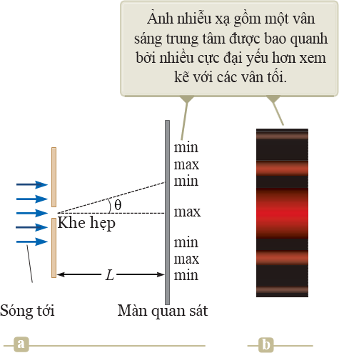 | Hình 38.4:(a) Hình học để phân tíchnhiễu xạ Fraunhofer qua một khe,(b) Ảnh nhiễu xạ Fraunhofer. |
| --- | --- |

 

#### Nhiễu xạ qua một khe hẹp

Độ rộng hữu hạn của khe là điều kiện cho nhiễu xạ Fraunhofer. Theo nguyên lý Huygens, từng phần của khe hẹp đóng vai trò như một nguồn của sóng ánh sáng. Do đó, ánh sáng từ một phần của khe có thể giao thoa với ánh sáng từ một phần khác. Cường độ sáng sau cùng quan sát trên màn hình tùy thuộc vào hướng θ. Dựa vào những phân tích trên, hình ảnh nhiễu xạ thực sự là một ảnh giao thoa, trong đó các nguồn sáng khác nhau là các phần khác nhau của cùng một khe.

Để phân tích hình ảnh nhiễu xạ, chúng ta chia khe thành hai đới có độ rộng bằng nhau a2 , như hình 38.5. Lưu ý rằng tất cả các sóng rời khỏi khe đều cùng pha, xét các tia 1 và 3. Tuy nhiên, tất cả sóng tới cùng pha khi chúng ló ra khỏi khe hẹp thì sóng 1 lan truyền xa hơn

sóng 3 một đoạn bằng với hiệu quang lộ: a sin θ , trong đó: a là độ rộng của khe. Tương tự,

2

chúng ta có thể lặp lại cách phân tích trên cho từng cặp tia xuất phát từ những điểm tương ứng

| 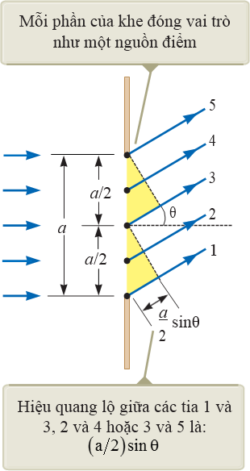 | Hình 38.5:Nhiễu xạ qua một khe hẹp,
khiL a chúng ta có thể xem gần
đúng các tia1, 2, 3, 4, 5 song song với nhau, làm một góc θ với trục chính
giữa. |
| --- | --- |

 

Biết trước độ rộng khe a và bước sóng λ, phương trình (38.1) cho chúng ta góc θ ứng với vân tối thứ nhất nằm trên và dưới trục chính giữa.

Bây giờ chúng ta chia khe thành bốn đới bằng nhau có độ rộng a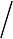4 . Hiệu lộ trình giữa

mỗi cặp tia xuất phát từ những điểm tương ứng trong hai đới kề nhau bằng a sin θ . Trong

4

trường hợp như vậy hiệu quang lộ bằng λ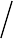2 nên chúng ta có:

a sin λ λ

 θ = ±  → sin θ = ±2 

4 2 a

Tương tự, khi chia khe thành sáu đới bằng nhau có độ rộng a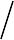6 thì vân tối xuất hiện trên màn quan sát khi:

sin θ = ±3 λ

a

#### Giải:

Dựa vào phương trình (38.1), độ lớn của góc nhiễu xạ θ ứng với các cực tiểu nhiễu xạ sẽ giảm khi tăng độ rộng của khe, do đó ảnh nhiễu xạ sẽ bị thu hẹp lại.
λ λ 580.10−9 −4

2 y1

= 2 Lsin θ

= 2 ±L

a

= 2L

a

= 2.2.

3.10−3

= 7, 73.10 m = 0, 773 mm

Cần chú ý rằng giá trị này lớn hơn nhiều lần so với độ rộng của khe.

#### Sự phân bố cường độ ảnh nhiễu xạ qua một khe

Khi chú ý đến những hiệu ứng nhiễu xạ, sự biến thiên cường độ ảnh giao thoa qua một khe được tính theo công thức:

###  _sin(πasinθ λ)_ 2

### 

I = Imax 

###   
πa sin θλ 

(38.2)

 

trong đó, Imax là giá trị lớn nhất của cường độ tại tâm của bức tranh nhiễu xạ tương ứng với

θ= 0, λ là bước sóng của ánh sáng chiếu đến khe hẹp. Từ điều kiện cường độ cực tiểu:
πa sinθtối
λ

= mπ

λ

sinθtối = m a , với m = ±1, ±2, ±3

| 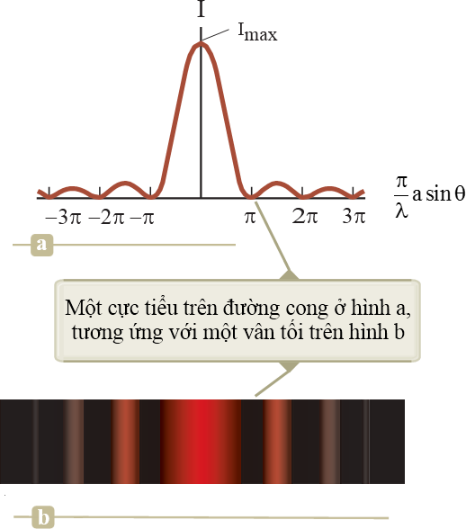 | Hình 38.6:(a) Đồ thị biểu diễn sự phụ
thuộc cường độ sáng I so với (π λ)a sin θ cho nhiễuxạ Fraunhofer qua một khe, (b) Ảnh nhiễu xạ Fraunhofer. |
| --- | --- |

 

#### Nhiễu xạ qua hai khe

Trong những thí nghiệm hai khe của chương 37, chúng ta đã cho rằng các khe rất hẹp so với bước sóng của ánh sáng dọi đến hai khe ( a λ ). Với những khe hẹp như thes cực đại chính giữa của ảnh nhiễu xạ của từng khe bao phủ toàn bộ màn quan sát. Hơn nữa sự giao

thoa của áng sáng từ hai khe tạo nên những vân có cường độ xấp xỉ bằng nhau. Tuy nhiên, trong thực tế với ánh sáng khả kiến điều kiện ( a λ ) không phải bao giờ cũng thỏa mãn. Với những khe tương đối rộng, sự giao thoa của áng sáng từ hai khe tạo nên những vân sáng mà cường độ không phải tất cả đều bằng nhau. Thực tế là cường độ của chúng bị thay đổi do nhiễu xạ của ánh sáng qua mỗi khe.

#### Phương trình biểu diễn cường độ của ảnh nhiễu xạ qua hai khe hẹp

#### Sự phân bố cường độ ảnh nhiễu xạ qua hai khe

Ảnh nhiễu xạ của hai khe, mô tả bởi phương trình (38.3) và được thể hiện trong hình

38.7. Đường màu xanh nét đứt là ảnh nhiễu xạ qua một khe hẹp. Đường cong màu nâu là do giao thoa qua hai khe hẹp, thành phần này sẽ tạo ra tất cả các đỉnh cùng độ cao (cường độ). Chiều cao các đỉnh không đồng đều do thành phần nhiễu xạ qua mỗi khe (thừa số trong dấu ngoặc vuông).

Phương trình (37.2) cho biết điều kiện để xảy ra cực đại giao thoa là: dsin θ = mλ , trong đó: d là khoảng cách giữa hai khe. Phương trình (38.1) cho biết cực tiểu nhiễu xạ đầu

tiên xảy ra khi asin θ = λ , trong đó a là độ rộng của mỗi khe. Chia phương trình (37.2) cho

phương trình (38.1) (với m = 1) cho phép chúng ta xác định cực đại giao thoa đầu tiên trùng với cực tiểu nhiễu xạ đầu tiên:

dsin θ = mλ ⇒
asin θ λ

d = m a

(38.4)

  * Điều kiện cho cực đại giao thoa: dsin θ = mλ

  * Điều kiện cho cực tiểu nhiễu xạ đầu tiên: a sin θ = λ

Như vậy, cường độ sáng ở cực đại thứ 1, 2, 3… rất nhỏ hơn so với cường độ sáng của cực đại chính giữa nên trong trường hợp nhiễu xạ qua nhiều khe ta chỉ xét trong vân giữa nhiễu xạ.

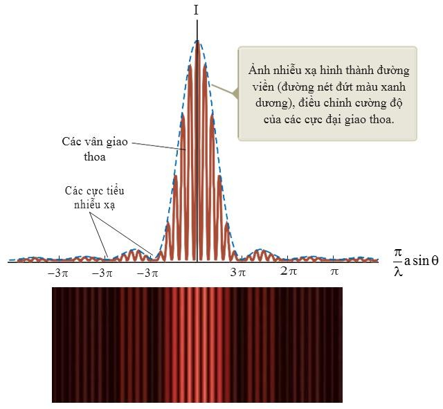

_**Hình 38.7:**_ Cường độ sáng của ảnh nhiễu xạ qua nhiều khe hẹp.

#### Năng suất phân giải

Khả năng của các hệ thống quang học để phân biệt giữa các nguồn ở gần nhau bị giới hạn do bản chất sóng của ánh sáng. Thực chất, các ảnh qua thấu kính đều là ảnh nhiễu xạ, điều này rất quan trọng khi chúng ta muốn phân biệt hai nguồn điểm ở xa mà khoảng cách góc giữa chúng rất nhỏ. Hình 38.8 cho thấy hai nguồn sáng cách xa một khe hẹp có độ rộng là a. Nếu hai nguồn sáng đủ xa để giữ cho các cực đại trung tâm không chồng lấn lên nhau thì ảnh có thể phân biệt được (hình 38.8a). Ngược lại, nếu hai nguồn sáng ở gần nhau thì hai cực đại trung tâm chồng lấn lên nhau và ảnh không phân giải được vì nhiễu xạ (hình 38.8b).

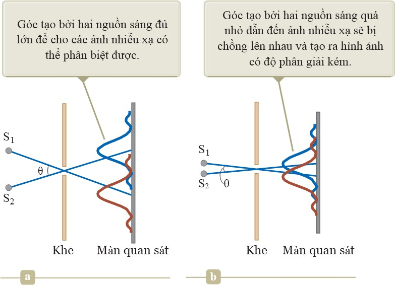

_**Hình 38.8:**_ Hai nguồn điểm cách xa một khe hẹp tạo ra hình ảnh nhiễu xạ:

(a) Ảnh phân giải được, (b) Ảnh không phân giải được.

#### Tiêu chuẩn Rayleigh

Trong hình 38.9 cho thấy khoảng cách góc của hai nguồn điểm có giá trị sao cho cực đại chính giữa của ảnh nhiễu xạ của nguồn này rơi đúng vào cực tiểu thứ nhất của bức tranh nhiễu xạ của nguồn kia. Điều kiện giới hạn này được gọi là tiêu chuẩn Rayleigh về khả năng phân giải.

Theo tiêu chuẩn Rayleigh, chúng ta có thể xác định sự tách biệt góc tối thiểu θmin giữa hai nguồn sáng tại khe trong hình 38.8 (hình ảnh đã được phân giải). Phương trình 38.1 chỉ ra rằng cực tiểu đầu tiên của ảnh nhiễu xạ một khe thỏa điều kiện:

sin θ= λ

a

Khi ảnh được phân giải thì khoảng cách góc giữa các nguồn lớn hơn θmin , chúng ta sẽ có thể phân ly hai nguồn ấy, còn nếu nó nhỏ hơn quá nhiều thì không thể phân ly được. Các nguồn cũng phải có độ sáng tương đối bằng nhau thì mới có thể dùng tiêu chuẩn Rayleigh. Thêm vào đó chúng ta thừa nhận điều kiện nhìn phải lý tưởng.

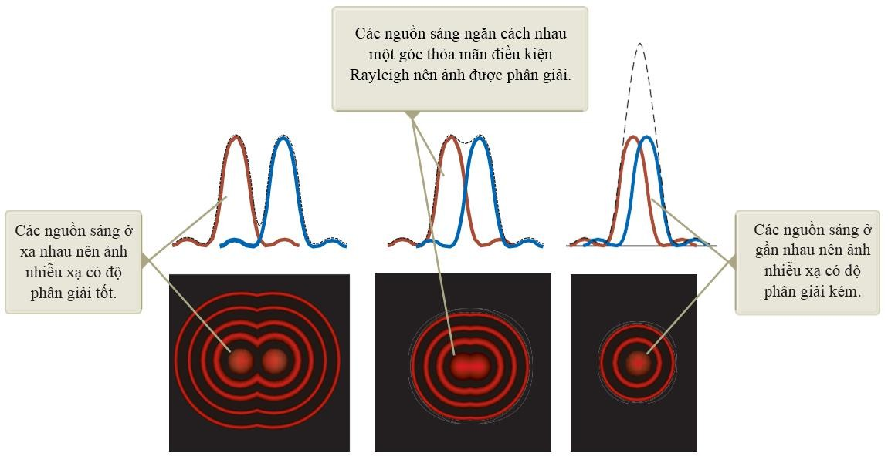

_**Hình 38.9:**_ Hình ảnh nhiễu xạ của hai nguồn (đường nét liền) và ảnh tổng hợp (đường nét đứt) khi thay đổi khoảng cách góc giữa các nguồn khi ánh sáng truyền qua một khẩu độ tròn.

Đường nét đứt là tổng hợp từ hai đường cong nét liền.

Khi các nguồn sáng ở xa nhau thì ảnh được phân giải tốt. Các đường cong liền nét là các ảnh nhiễu xạ riêng biệt còn các đường đứt nét là ảnh sau cùng (hình 38.9a).

Các nguồn sáng chia cách nhau bởi một góc thỏa mãn tiêu chuẩn Rayleigh thì ảnh được phân giải. Các đường cong liền nét là ảnh nhiễu xạ riêng biệt. Các đường đứt nét là ảnh sau cùng (hình 38.9b).

Các nguồn sáng gần nhau thì ảnh không được phân giải. Các đường liền nét là ảnh nhiễu xạ riêng biệt. Các đường đứt nét là ảnh sau cùng và ảnh trông giống như một nguồn duy nhất (hình 38.8c).

Hình ảnh sao Diêm Vương và Mặt trăng Charon như trên hình 38.11 là một ví dụ về độ phân giải. Nếu như dùng kính thiên văn Trái đất thì sẽ không phân biệt được mà phải cần dùng đến kính viễn vọng Hubble mới có thể phân giải rõ ràng hai vật.

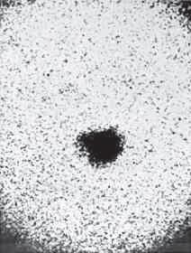 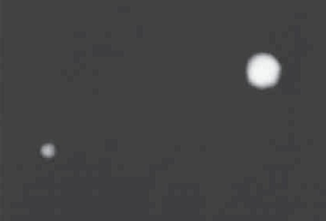
_**Hình 38.11:**_ Hình ảnh sao Diêm Vương và Mặt Trăng Charon.

## Cách tử Nhiễu xạ

#### Nhiễu xạ qua cách tử

Cách tử nhiễu xạ, một dụng cụ dùng cho việc phân tích các nguồn sáng, là hệ thống gồm N khe hẹp giống hệt nhau với độ rộng của mỗi khe là a, khoảng cách giữa hai khe liền kề là d, được đặt cách đều nhau với khoảng cách giữa hai khe liên tiếp là  (chu kỳ của cách tử). Cách tử có cấu tạo rất tinh vi, trên mỗi milimet chiều dài có đến hàng trăm khe. Một cách tử truyền qua có thể được tạo ra bằng cách cắt các rãnh (khe) song song trên một tấm kính bằng máy khắc có độ chính xác cao. Khoảng cách giữa các rãnh trong suốt đối với ánh sáng vì vậy đóng vai trò như các khe riêng biệt. Một cách tử phản xạ có thể được tạo ra bằng cách cắt các rãnh song song trên bề mặt của một vật liệu phản xạ. Sự phản xạ của ánh sáng từ các khoảng không gian giữa các rãnh rõ hơn là sự phản xạ từ các rãnh được khắc vào bên trong vật liệu. Vì vậy, các khoảng không gian giữa các rãnh đóng vai trò giống như là các nguồn sáng phản xạ song song giống như các khe trong một cách tử truyền qua. Công nghệ hiện nay có thể sản xuất các cách tử có các khe rất nhỏ. Ví dụ: một cách tử điển hình được khắc với

5000 khe/cm có độ rộng mỗi khe d = (1 / 5000)cm = 2.10−4 cm.

Một phần của một cách tử nhiễu xạ được minh họa trong hình 38.12. Một sóng phẳng tới từ bên trái, vuông góc với mặt phẳng cách tử. Hình dạng thu được trên màn nằm bên phải mặt cách tử là kết quả của các hiệu ứng giao thoa và nhiễu xạ được kết hợp.

_Chú ý:_ Cách tử nhiễu xạ là một cách tử giao thoa. Giống với dạng nhiễu xạ, cách tử nhiễu xạ là một thuật ngữ sai nhưng được dùng nhiều trong ngôn ngữ vật lý. Cách tử nhiễu xạ phụ thuộc vào sự nhiễu xạ trên cùng phương khi hai khe lan truyền ánh sáng rộng ra để ánh sáng từ các khe khác nhau có thể giao thoa. Sẽ là chính xác hơn nếu gọi thiết bị này là cách tử giao thoa, nhưng cách tử nhiễu xạ lại là tên được sử dụng.

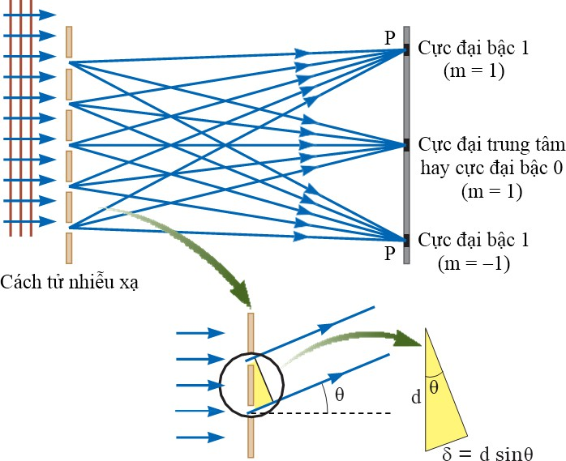 _ **Hình 38.12:**_ Nhiễu xạ qua cách tử. Khoảng cách giữa các khe là d, hiệu quang lộ của hai tia sáng từ hai khe liền kề là dsin θ.

Sóng từ tất cả các khe đồng pha nhau khi chúng ra khỏi các khe. Đối với một hướng bất kỳ θ được xác định từ phương ngang, tuy nhiên, các sóng di chuyển những quãng đường khác nhau trước khi đập vào màn. Cần chú ý trên hình 38.12 rằng hiệu lộ trình δ giữa các tia từ hai khe kề nhau bất kỳ bằng dsin θ. Nếu sự khác nhau của quãng đường di chuyển này bằng với một bước sóng hoặc một số nguyên lần bước sóng thì sóng từ tất cả các khe sẽ đồng pha nhau tại màn và sẽ tạo thành một vân sáng. Vì vậy, điều kiện để đạt được cực đại trong hình dạng giao thoa tại góc θ là

### dsinθsáng = mλ, với m = 0, ±1, ±2, ±3

(38.7)

Công thức này có thể được sử dụng để tính bước sóng nếu biết được độ rộng khe d và góc θ . Nếu bức xạ tới bao gồm nhiều bước sóng thì cực đại bậc m đối với mỗi bước sóng

xảy ra tại một góc xác định. Tất cả các bước sóng tại θ= 0 , tương ứng với m = 0 là cực đại

bậc 0 (cực đại trung tâm). Cực đại bậc nhất (m = 1) được xác định tại góc thoả mãn mối liên

hệ sinθ = λ d , cực đại bậc hai (m = 2) được xác định tại một góc θ lớn hơn và tương

tự cho các cực đại bậc cao hơn. Khi các giá trị d nhỏ điển hình trong một cách tử nhiễu xạ thì góc θsáng lớn, giống như ví dụ 38.5.

#### Sự phân bố cường độ qua cách tử nhiễu xạ

Sự phân bố cường độ đối với một cách tử nhiễu xạ đạt được khi sử dụng một nguồn đơn sắc được chỉ ra trong hình 38.13. Chú ý độ sắc nét của cực đại trung tâm và độ rộng của các vùng tối được so sánh với các vân sáng rộng đặc trưng của dạng giao thoa hai khe (xem hình 37.6). Bên cạnh đó cũng có thể tham khảo hình 37.7 để thấy rằng độ rộng của cực đại cường độ giảm khi số khe tăng lên. Bởi vì cực đại bậc trung tâm rất sắc nét, chúng sáng hơn nhiều cực đại giao thoa hai khe.

| 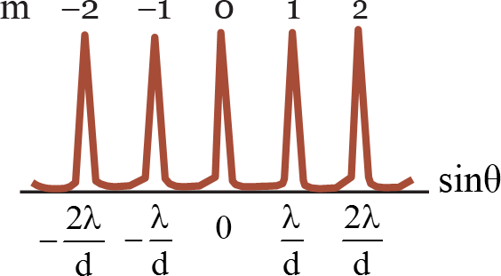 | Hình 38.13:Đồ thị biểu diễn sự phụ thuộc
củacường độ theo sinθ của cách tử nhiễu xạ. Cực đại trung tâm, bậc một,
bậc hai được biểu diễn. |
| --- | --- |

 

Đặc điểm của quang phổ cách tử:

  * Quang phổ của cách tử chỉ có một vài giá trị.

  * Trong quang phổ của lăng kính thì tia tím bị lệch ít nhất, tia đỏ bị lệch nhiều nhất.

  * So với quang phổ của lăng kính thì quang phổ của cách tử có các vệt vào phân bố đều đặn hơn.

_**Câu hỏi 38.1:**_ Ánh sáng cực tím có bước sóng 350 nm đập vào một cách tử nhiễu xạ có độ
rộng khe d và hình thành một dạng giao thoa trên màn ở khoảng cách L. Các góc
sáng
cực đại giao thoa có giá trị lớn. Các vị trí của vân sáng được đánh dấu trên màn. Bây giờ ánh sáng đỏ có bước sóng 700 nm được sử dụng với một cách tử nhiễu xạ để tạo thành một dạng nhiễu xạ khác trên màn. Các vân sáng của dạng nhiễu xạ này sẽ được cố định tại các vị trí đánh dấu trên màn hay không nếu:

  1. Màn được di chuyển tới khoảng cách 2L từ cách tử nhiễu xạ.

  2. Màn được di chuyển tới khoảng cách L/2 từ cách tử nhiễu xạ.

  3. Cách tử nhiễu xạ được thay thế bằng một khe có độ rộng 2d.

  4. Cách tử nhiễu xạ được thay thế bằng một khe có độ rộng d/2.

  5. Không gì thay đổi?

_**Câu hỏi 38.2:**_ Đĩa compact là một cách tử nhiễu xạ. Ánh sáng phản xạ từ bề mặt của một đĩa compact bao gồm nhiều màu như trên hình 38.14. Các màu và cường độ của chúng phụ thuộc vào hướng của CD so với mắt và so với nguồn sáng. Giải thích hiện tượng này.

#### Trả lời:

Bề mặt của một CD có một rãnh hình xoắn ốc (các rãnh kề nhau có khoảng cách là 1 μm). Vì vậy, bề mặt đĩa đóng vai trò như một cách tử nhiễu xạ. Ánh sáng phản xạ từ các vùng giữa các khe hẹp này chỉ giao thoa chồng chập trên những hướng cụ thể phụ thuộc vào bước sóng và hướng của ánh sáng tới. Các phần khác nhau của đĩa CD đóng vai trò như cách tử nhiễu xạ đối với ánh sáng trắng và truyền đi các màu khác nhau, theo các hướng

_**Hình 38.14:**_ Các vạch rất mảnh, mỗi vạch có độ rộng 1 μm, trên đĩa compact laser tác dụng như một cách tử nhiễu xạ

khác nhau. Các màu khác nhau được nhìn thấy trên một phần nào đó của đĩa sẽ thay đổi khi nguồn sáng, trong trường hợp này là CD, hoặc khi thay đổi hướng nhìn. Sự thay đổi hướng nhìn làm cho góc tới hay góc của ánh sáng nhiễu xạ bị thay đổi.

#### Bài tập mẫu 38.2:

Ánh sáng đơn sắc từ một laser heli-neon (λ = 632,8 nm) chiếu vuông góc vào một cách tử nhiễu xạ có 6000 khe trên một centimet. Tìm các góc ứng với cực đại bậc nhất và bậc hai.

#### Giải:

Quan sát hình 38.12 và tưởng tượng rằng ánh sáng tới từ bên trái phát ra từ laser heli- neon. Chúng ta hãy xác định các giá trị thích hợp của góc θ đối với cực đại giao thoa.
Khoảng cách giữa các khe là nghịch đảo của số khe trên mỗi centimet:

d = 1

6000

cm = 1,667.10−4 cm = 1667 nm

Giải phương trình (38.7) đối với sinθ và cực địa bậc nhất ứng với m = 1 để tìm giá trị của góc θ1:
sin θ = 1.λ = 632,8 nm ⇒ θ = 22,310
1 d 1667 nm 1
Lặp lại đối với cực đại bậc hai (m = 2):
sin θ = 2.λ = 2.632,8 nm ⇒ θ = 49, 410
2 d 1667 nm 2
_**Mở rộng:**_ Điều gì sẽ thay đổi nếu cực đại bậc ba cần được xác định? Có thể xác định được không?
_Trả lời:_ Với m = 3 thì sinθ3 = 1,139. Vì sinθ luôn nhỏ hơn 1, kết quả này không phải
là một kết quả hợp lí. Vì vậy, chỉ các cực đại trung tâm, bậc nhất và bậc hai có thể được xác định trong trường hợp này.

#### Một số ứng dụng của cách tử nhiễu xạ

  1. **Phổ kế cách tử nhiễu xạ**

Hình vẽ của một thiết bị đơn giản được sử dụng để đo các góc trong một dạng nhiễu xạ được chỉ ra trên hình 38.15. Thiết bị này là một phổ kế cách tử nhiễu xạ. Ánh sáng di chuyển qua một khe, và một chùm ánh sáng được chuẩn trực chiếu vào cách tử. Ánh sáng nhiễu xạ rời khỏi cách tử tại các góc thoả mãn phương trình (38.7) và một kính viễn vọng được sử dụng để quan sát ảnh của khe. Bước sóng có thể được xác định bằng việc đo lường các góc chính xác tại đó ảnh của khe xuất hiện tại các góc khác nhau.

Phổ kế này là một thiết bị được sử dụng trong phổ kế nguyên tử, trong đó ánh sáng từ một nguyên tử được phân tích để tìm các thành phần bước sóng. Các thành phần bước sóng

có thể được sử dụng nhận dạng nguyên tử. Các phổ nguyên tử sẽ được khảo sát trong chương 42 của phần mở rộng của giáo trình này.

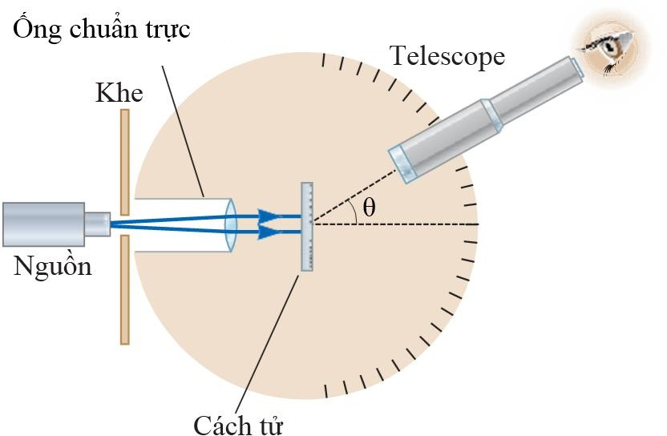

_**Hình 38.15:**_ Quang phổ kế cách tử nhiễu xạ.

#### Van cách tử nhiễu xạ

Ứng dụng khác của các cách tử nhiễu xạ là van ánh sáng cách tử − grating light valve (GLV), thiết bị này cạnh tranh với các thiết bị micromirror số (DMDs). GLV là một microchip silicon được lắp vào một dãy băng silicon nitride song song được phủ một lớp bạc mỏng (hình 38.16). Mỗi dãy dài xấp xỉ 20 μm, rộng 5 μm và được tách biệt với lớp silicon bởi một lớp không khí có độ dày là bậc của 100 nm . Khi không có điện thế, tất cả các dãy ở cùng mức nhau. Trong trường hợp này, dãy băng đóng vai trò như một bề mặt phẳng, phản xạ ánh sáng tới.

**Hình 38.16:** Một phần nhỏ của van ánh sáng cách tử. Băng phản chiếu xen kẽ ở các mức hoạt động khác nhau như một cách tử nhiễu xạ, cung cấp khả năng điều khiển tốc độ rất cao của hướng ánh sáng đến một thiết bị kỹ thuật số.

Khi có điện thế áp vào giữa một dãy băng và điện cực trên lớp silicon, một lực điện xuất hiện kéo dãy băng hạ xuống, gần hơn với lớp silicon. Các dãy băng có thể được luân phiên kéo xuống trong khi các khoảng không gian giữa chúng được nâng cao. Vì vậy, các dãy băng đóng vai trò như một cách tử nhiễu xạ mà ở đó sự giao thoa tăng cường đối với một bước sóng ánh sáng cụ thể có thể được hướng vào một màn hoặc các hệ hiển thị quang học

khác. Nếu ba thiết bị − một cho ánh sáng đỏ, một cho ánh sáng xanh da trời, và một cho ánh sáng xanh lá cây – được sử dụng thì việc hiển thị toàn màu có thể thực hiện.

Bên cạnh việc sử dụng trong hiển thị video, GLV còn được ứng dụng trong công nghệ cảm biến điều hướng quang học laser, việc in thương mại từ máy tính thành tấm, và các loại thiết bị chụp ảnh khác.

#### Hologram − Kỹ thuật chụp ảnh giao thoa Lazer

Một ứng dụng thú vị khác của cách tử nhiễu xạ là phương pháp toàn ảnh (holography), sử dụng trong việc tạo ảnh ba chiều của vật. Nguyên lý vật lý của phương pháp toàn ảnh được phát triển bởi Dennis Gabor (1900-1979) vào năm 1948 và giúp ông giành giải Nobel Vật lý vào năm 1971. Sự yêu cầu về ánh sáng kết hợp cho phương pháp toàn ảnh đã trì hoãn thành phương pháp tạo ảnh của Gabor cho đến khi laser được phát triển vào những năm 1960. Hình

38.17 cho thấy một ảnh toàn ký (ảnh ba chiều – hologram) nhìn từ hai vị trí khác nhau và đặc tính ba chiều của ảnh. Lưu ý sự khác nhau khi nhìn ảnh thông qua kính khuếch đại trong các hình 38.17a và 38.17b.

**Hình 38.17:** Bảng mạch được hiển thị ở hai chế độ xem khác nhau.

Hình 38.18 cho thấy cách mà một hologram được tạo ra. Ánh sáng từ nguồn laser được tách thành hai phần bởi một gương mạ bạc tại B. Một phần của chùm tia phản xạ từ vật được chụp ảnh và đập vào một phim ảnh. Phần còn lại của chùm tia bị phân kỳ bởi kính L2, phản xạ từ các gương M1 và M2, và cuối cùng đập vào phim. Hai chùm tia chồng chập lên nhau để tạo thành một dạng giao thoa cực kỳ phức tạp trên phim. Dạng giao thoa này có thể được tạo ra chỉ khi mối quan hệ về pha của hai sóng là hằng số thông qua sự phơi sáng của phim. Điều kiện này đạt được bằng việc chiếu vào màn hình chùm ánh sáng thông qua một pinhole hoặc sử dụng bức xạ laser kết hợp. Hologram thu nhận không chỉ cường độ của ánh sáng tán xạ từ vật (giống như trong phương pháp chụp ảnh truyền thống), mà còn ghi nhận sự khác biệt về pha giữa chùm tia tham chiếu (reference light) và chùm tia tán xạ từ vật. Do bởi sự khác nhau về pha này, một dạng giao thoa được hình thành và tạo thành ảnh mà trong đó tất cả thông tin ba chiều được bảo toàn.

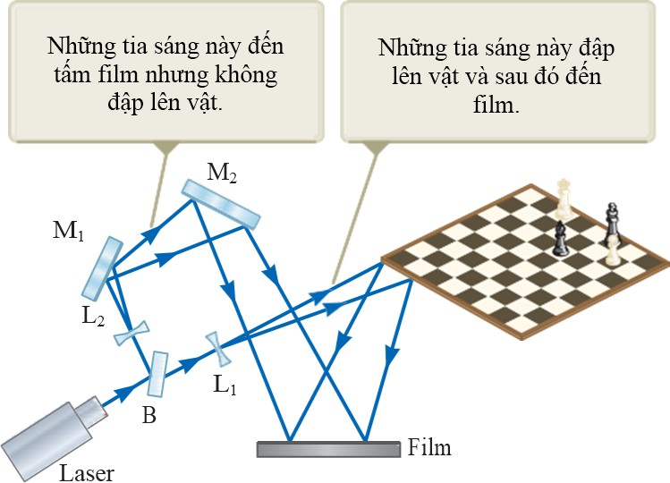
_**Hình 38.18:**_ Phương pháp chụp ảnh Hologram.

Trong một ảnh được chụp bằng phương pháp bình thường, môt kính được sử dụng để hội tụ ảnh để mỗi điểm trên vật tương ứng với một điểm trên ảnh. Chú ý rằng kính không được sử dụng trong hình 38.18 để hội tụ ánh sáng lên phim. Vì vậy, ánh sáng từ mỗi điểm trên vật sẽ xuất hiện tại tất cả các điểm trên phim. Vì vậy, mỗi vùng của phim trong đó hologram được ghi nhận sẽ chứa đựng thông tin về tất cả các điểm được chiếu trên vật, điều này sẽ đưa đến một kết quả đáng chú ý: nếu một vùng nhỏ của hologram được cắt ra từ phim, ảnh hoàn chỉnh của vật có thể được tạo ra từ phần nhỏ này. (Chất lượng của ảnh bị giảm xuống nhưng một ảnh hoàn chỉnh được tạo thành).

Một hologram được quan sát tốt nhất bằng việc cho chùm ánh sáng kết hợp di chuyển qua một tấm phim giống như quan sát ngược lại dọc theo hướng từ đó chùm ánh sáng được phát ra. Hình ảnh giao thoa trên phim đóng vai trò như là một cách tử nhiễu xạ. Hình 38.19 cho thấy 2 tia sáng đập vào và di chuyển qua phim. Đối với mỗi tia, các tia m = 0 và m = ±1 trên hình ảnh nhiễu xạ cho thấy xuất hiện từ bên phải của phim. Các tia m = +1 hội tụ để tạo thành một ảnh thực của màn và đây không phải là được quan sát một cách bình thường. Bằng việc mở rộng các tia sáng tương ứng với m = −1 về phía sau phim, sẽ xuất hiện một ảnh ảo tại đó và ánh sáng tới từ đó sẽ giống với ánh sáng tới từ vật thật khi phim được phơi sáng. Ảnh này là ảnh được nhìn thấy khi quan sát thông qua phim toàn ảnh (holographic film).

Phương pháp toàn ảnh có một vài ứng dụng. Chúng ta có thể có một hologram trên thẻ tín dụng. Loại hologram đặc biệt này được gọi là _rainbow hologram_ và được thiết kế để được quan sát trong ánh sáng trắng được phản xạ.

#### Nhiễu xạ của tia X bởi các tinh thể

Về nguyên tắc, bước sóng của bất kỳ sóng điện từ có thể được xác định nếu có một cách tử thích hợp (các rãnh được chia nhỏ ở mức độ bước sóng). Tia X, được khám phá bởi

Wilhelm Roentgen (1845−1923) vào năm 1895, là sóng điện từ có bước sóng rất ngắn (ở mức 0,1 nm). Sẽ không thể tạo một cách tử có khoảng cách giữa các khe nhỏ đến mức đó bằng quá trình cắt được miêu tả ở phần mở đầu của phần 38.4. Tuy nhiên, khoảng cách ở mức độ nguyên tử trong vật rắn lại vào khoảng 0,1 nm. Năm 1913, Max von Laue (1879−1960) đề nghị rằng mạng nguyên tử bình thường trong tinh thể có thể đóng vai trò như một cách tử nhiễu xạ ba chiều đối với tia X. Những thí nghiệm sau đó đã chứng minh dự đoán này. Hình dạng nhiễu xạ từ tinh thể trông phức tạp do bởi tính chất ba chiều của cấu trúc tinh thể. Tuy nhiên, sự nhiễu xạ tia X đã chứng minh là một phương pháp hiệu quả trong việc giải thích các cấu trúc này và trong việc nghiên cứu cấu trúc vật chất.

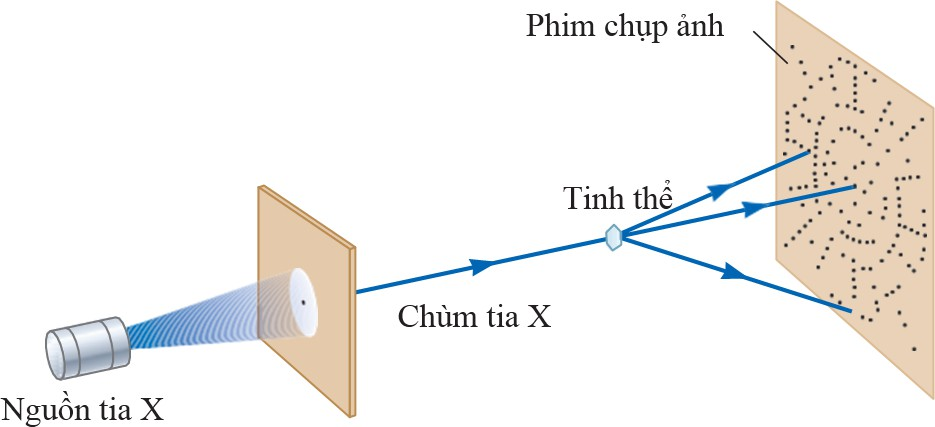

_**Hình 38.20:**_ Nhiễu xạ tia X qua tinh thể.

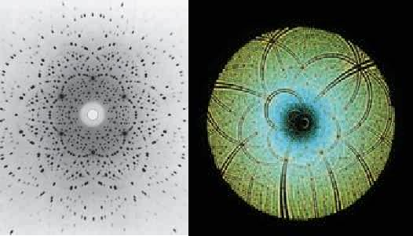Hình 38.20 cho thấy một bố trí thực nghiệm trong việc quan sát nhiễu xạ tia X từ một tinh thể. Một chùm tia X đơn sắc được chuẩn trực chiếu vào một tinh thể. Các chùm tia nhiễu xạ có cường độ mạnh trong các hướng xác định, tương ứng với sự giao thoa tăng cường từ các sóng phản xạ từ các lớp của nguyên tử trong tinh thể. Các chùm tia nhiễu xạ, có thể được ghi nhận bằng một tấm phim, tạo thành một mảng các vết được gọi là hình dạng Laue giống như trên hình 38.21a. Cấu trúc tinh thể có thể được xác định bằng việc phân tích vị trí và cường độ của các vết khác nhau trên hình ảnh nhiễu xạ này. Hình 38.21b cho thấy hình ảnh Laue từ tinh thể enzyme, sử dụng một phạm vi rộng lớn các bước sóng để hình ảnh này được tạo ra.

_**Hình 38.21:**_ (a) Ảnh Laue tinh thể đơn của nguyên tố Be, (b) Ảnh Laue của enzym Rubisco.

Sự sắp xếp của các nguyên tử trong một tinh thể muối natriclorua (NaCl) được chỉ ra trên hình 38.22. Mỗi ô đơn vị (khối hình học lặp lại trong tinh thể) là một hình lập phương có độ dài cạnh là a. Một sự khảo sát cẩn thận cấu trúc NaCl cho thấy rằng các ion nằm trên các mặt phằng rời rạc (phần được bôi đen trên hình 38.22). Bây giờ giả sử rằng chùm tia X tới hợp thành một góc θ với một trong các mặt phẳng được chỉ ra trên hình

38.23. Chùm tia có thể được phản xạ từ cả mặt phẳng trên và mặt phẳng dưới nhưng chùm tia phản xạ từ mặt phẳng dưới di chuyển xa hơn chùm tia phản xạ từ mặt phẳng trên. Sự khác nhau của quãng đường hiệu dụng là 2dsin θ . Hai chùm tia giao thoa tăng cường nhau khi sự khác nhau của quãng đường bằng với số nguyên lần bước sóng λ. Kết quả giống như vậy vẫn đúng khi ánh sáng phản xạ từ một tập hợp toàn bộ các mặt

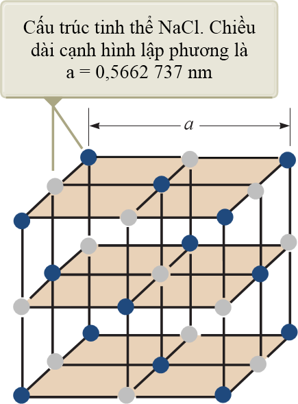
_**Hình 38.22:**_ Cấu trúc lập thể của NaCl.

phẳng song song. Vì vậy, điều kiện để có giao thoa tăng cường (cực đại trên chùm tia phản xạ) là

2dsin θ = mλ, với m = 1, 2,3 (38.8)

Điều kiện này còn gọi là **định luật Bragg,** được đặt theo tên W. L. Bragg (1890−1971), người đầu tiên rút ra được mối liên hệ này. Nếu bước sóng và góc nhiễu xạ được đo, phương trình (38.8) có thể được sử dụng để tính khoảng các giữa các mặt phẳng nguyên tử.

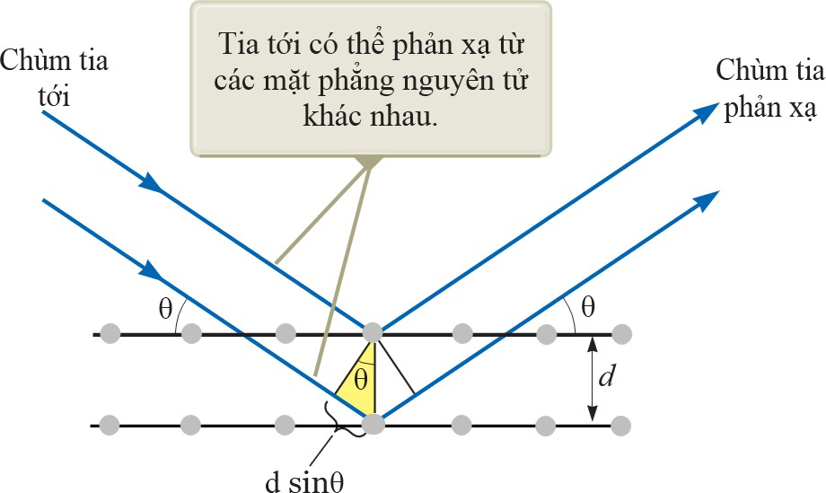

_**Hình 38.23:**_ Một chùm tia X tới chịu sự nhiễu xạ bởi cấu trúc trong tinh thể.

## Sự phân cực của sóng ánh sáng

#### Ánh sáng không phân cực

Trong chương 34, chúng ta đã miêu tả tính chất theo phương ngang của ánh sáng và tất cả các sóng điện từ. Sự phân cực, được thảo luận trong phần này, là bằng chứng cho tính chất ngang của sóng ánh sáng.

Một chùm ánh sáng bình thường chứa đựng một số lượng lớn các sóng được phát ra bởi các nguyên tử của nguồn sáng. Mỗi nguyên tử tạo ra một sóng có hướng cụ thể của vector điện

trường E , tương ứng với hướng của sự dao động nguyên tử. Hướng của sự phân cực của mỗi sóng riêng lẻ được

định nghĩa là hướng mà theo đó điện trường đang dao động. Trong hình

_**Hình 38.24:**_ Sự phân cực của sóng ánh sáng.

38.24, hướng này nằm dọc theo trục y _._ Tất cả các sóng điện từ riêng lẻ chuyển động dọc theo

phương x có vector

song song với mặt phẳng yz _,_ nhưng vector

này có thể hợp thành

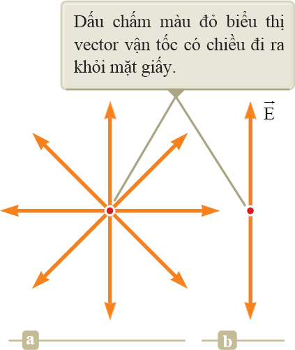một góc bất kỳ so với trục y _._ Bởi vì sự dao động xảy ra theo tất cả các hướng, vì vậy sóng điện từ sau cùng là chồng chập của sóng dao động từ nhiều hướng. Kết quả là một chùm sáng không phân cực, được chỉ ra trên hình 38.25a. Hướng lan truyền của sóng trong hình này vuông góc với mặt phẳng của trang giấy. Các mũi tên cho thấy một số hướng của vector điện trường của các sóng riêng lẻ tạo thành sóng tổng hợp. Tại một điểm bất kỳ và trong một thời gian ngắn, tất cả các vector điện trường riêng lẻ này sẽ tổng hợp lại để tạo thành vector điện trường tổng.

_**Hình 38.25:**_ (a) Ánh sáng không phân cực được biểu diễn theo hướng truyền. Điện trường ngang dao động theo mọi hướng có xác suất bằng nhau, (b) Một chùm ánh sáng phân cực ban đầu với điện trường dao động theo phương thẳng đứng.
Như được chú ý trong mục 34.3, một sóng được xem là phân cực tuyến tính nếu như

vector điện trường được tao thành dao động theo cùng hướng tại một điểm bất kỳ tại mọi

lúc như được chỉ ra trên hình 38.25b. (Ngoài ra, vector này còn được miêu tả như bị phân cực

phẳng hoặc đơn giản chỉ là bị phân cực). Mặt phẳng được tạo thành bởi và hướng lan truyền

được gọi là mặt phẳng lan truyền của sóng. Nếu sóng trong hình 38.24 đại diện cho sóng được tạo thành từ tất cả các sóng đơn, mặt phẳng phân cực là mặt phẳng xy _._

Một chùm tia phân cực tuyến tính có thể đạt được từ một chùm tia không phân cực bằng việc bỏ đi tất cả các sóng từ chùm tia ngoại trừ các sóng có vector điện trường dao động trong một mặt phẳng đơn. Bây giờ, chúng ta sẽ thảo luận bốn quá trình được sử dụng để tạo ra ánh sáng phân cực từ ánh sáng không phân cực.

#### Sự phân cực bằng sự hấp thụ có chọn lọc

Kỹ thuật thông thường nhất dùng để tạo ra ánh sáng phân cực là sử dụng một vật liệu có tính truyền sóng. Điện trường của sóng truyền qua này dao động trong một mặt phẳng song song với một hướng xác định. Bên cạnh đó, vật liệu được sử dụng này sẽ hấp thụ sóng có điện trường dao động theo các hướng khác.

Năm 1938, E. H. Land (1909−1991) đã phát hiện một loại vật liệu mà sau đó ông ấy gọi là _Polaroid_. Vật liệu này phân cực ánh sáng thông qua sự hấp thụ có chọn lọc. Vật liệu này được chế tạo thành các tấm hydrocarbon chuỗi dài và mỏng. Các tấm này được kéo căng trong suốt quá trình sản xuất để các phân tử chuỗi dài được căng chỉnh thẳng hàng. Sau khi nhúng các tấm hydrocarbon này vào dung dịch chứa iốt, các phân tử trở thành các vật dẫn điện tốt. Sự dẫn điện xảy ra chủ yếu dọc theo các chuỗi hydrocarbon bởi vì các electron có thể di chuyển một cách dễ dàng dọc theo các chuỗi. Nếu ánh sáng có vector điện trường song song với các chuỗi chiếu vào vật liệu, điện trường gia tốc các electron dọc theo các chuỗi và năng lương được hấp thụ từ bức xạ. Vì vậy, ánh sáng không truyền qua vật liệu. Ánh sáng có vector điện trường vuông góc với các chuỗi truyền qua vật liệu bởi vì các electron không thể di chuyển từ phân tử này tới phân tử khác. Vì vậy, khi ánh sáng không phân cực chiếu vào vật liệu, ánh sáng thoát ra bị phân cực vuông góc với các chuỗi phân tử.

Thông thường hướng vuông góc với các chuỗi phân tử được xem như là trục truyền

qua. Trong một kính phân cực lý tưởng, tất cả ánh sáng với song song với trục truyền qua

thì được truyền qua và tất cả ánh sáng với vuông góc với trục truyền qua thì bị hấp thụ.

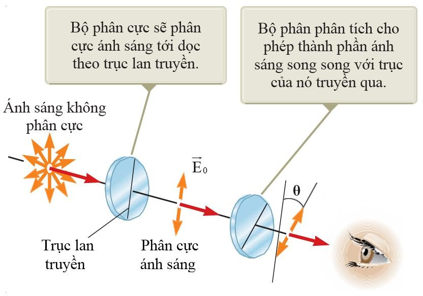 _ **Hình 38.26:**_ Phân cực ánh sáng bằng phương pháp hấp thụ chọn lọc.

Hình 38.26 thể hiện một chùm ánh sáng không phân cực chiếu vào một tấm phân cực đầu tiên, gọi là kính phân cực. Bởi vì trục truyền qua được định hướng theo phương thẳng đứng trong hình, ánh sáng truyền qua tấm phân cực này sẽ bị phân cực thoe phương thẳng đứng. Tấm phân cực thứ hai, được gọi là thiết bị phân tích, chắn chùm tia. Trong hình 38.26, trục truyền qua của thiết bị phân tích được đặt tại một góc θ so với trục phân cực. Vector điện

trường của chùm tia truyền qua đầu tiên là

E0 . Thành phần

vuông góc với trục phân tích

sẽ bị hấp thụ hoàn toàn. Thành phần song song với trục phân tích, truyền qua thiết bị phân

tích, là E0 cosθ. Bởi vì cường độ của chùm tia truyền qua thay đổi như là bình phương của

biên độ nên có thể kết luận rằng cường độ I của chùm tia phân cực truyền qua thiết bị phân tích thay đổi như sau,

ở đây,

Imax

I = I cos2 θ (38.9)

là cường độ của chùm tia phân cực chiếu vào thiết bị phân tích. Công thức này,

được biết đến là quy luật Malus, áp dụng đối với hai vật liệu phân cực bất kỳ có các trục truyền qua hợp với nhau thành một góc θ. Công thức này cho thấy rằng cường độ của chùm tia truyền qua đạt cực đại khi các trục truyền qua song song ( θ= 0 hoÆc 1800 ) và bằng không (hấp thụ hoàn toàn bởi thiết bị phân tích) khi các trục truyền qua vuông góc với nhau. Sự thay đổi trong cường độ truyền qua này thông qua một cặp các tấm phân cực được minh hoạ trong hình

38.27. Bởi vì giá trị trung bình của cos2 θ = 1 2 , cường độ của ánh sáng không phân cực ban

đầu bị giảm bởi một hệ số của 1/2 khi ánh sáng truyền qua một kính phân cực lý tưởng.

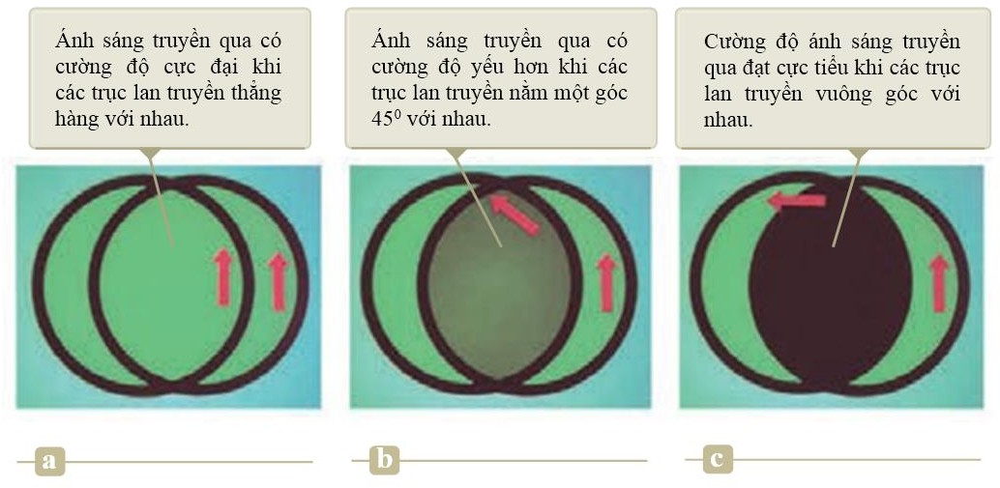
_**Hình 38.27:**_ Cường độ ánh sáng truyền qua hai bản phân cực phụ thuộc vào tính định hướng tương đối của các trục lan truyền. Mũi tên màu đỏ biểu thị trục truyền của các bản phân cực.

#### Sự phân cực bằng sự phản xạ

Khi một chùm ánh sáng không phân cực bị phản xạ từ một bề mặt, sự phân cực của ánh sáng phản xạ phụ thuộc vào góc tới. Nếu góc tới là 00 thì chùm tia phản xạ không phân cực. Đối với các góc tới khác ánh sáng phản xạ sẽ bị phân cực đến một mức độ nào đó, và đối với một góc tới cụ thể, ánh sáng phản xạ sẽ bị phân cực hoàn toàn. Chúng ta hãy khảo sát sự phản xạ tại góc đặc biệt đó.

Giả sử một chùm sáng không phân cực chiếu vào một bề mặt như minh hoạ trong hình

38.28a. Mỗi vector điện trường có thể được phân tích thành hai thành phần: một song song với bề mặt (và vuông góc với trang giấy như trong hình 38.28, được thể hiện bởi các chấm) và phần còn lại (được minh hoạ bởi các mũi tên màu cam) vuông góc với cả thành phần đầu tiên và với hướng lan truyền sóng. Vì vậy, sự phân cực của toàn bộ chùm tia có thể được diễn tả bởi hai thành phần điện trường theo các hướng này. Thành phần song song được minh hoạ bởi các chấm, phản xạ mạnh hơn nhiều so với thành phần còn lại được thể hiện bởi các dấu mũi tên, tạo ra một chùm tia phản xạ phân cực không hoàn toàn. Hơn nữa, chùm tia khúc xạ cũng bị phân cực không hoàn toàn.

Bây giờ giả sử rằng góc tới θ1 thay đổi đến khi góc giữa chùm tia phản xạ và chùm tia khúc xạ là 900 như được minh hoạ trên hình 38.28b. Tại góc tới này, chùm tia phản xạ bị phân cực hoàn toàn (với vector điện trường song song với bề mặt) và chùm tia khúc xạ vẫn bị phân cực không hoàn toàn. Góc tới tại đó sự phân cực này xảy ra được gọi là góc phân cực θp.

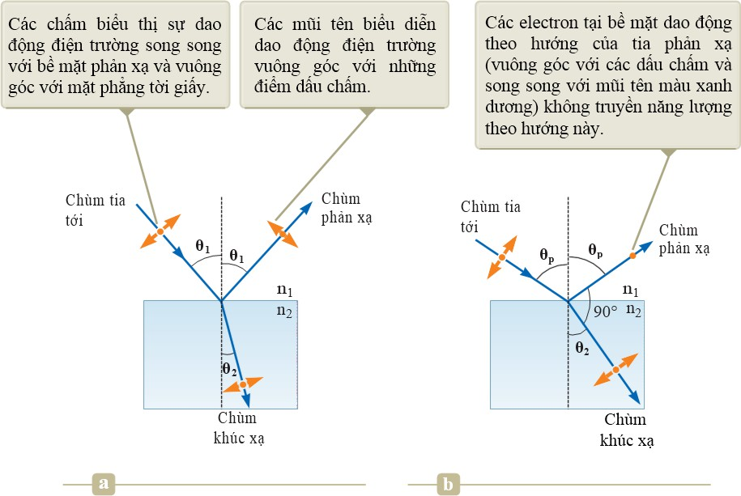
_**Hình 38.28:**_ (a) Phân cực một phần, (b) Phân cực toàn phần.

# Tóm tắt chương 38

