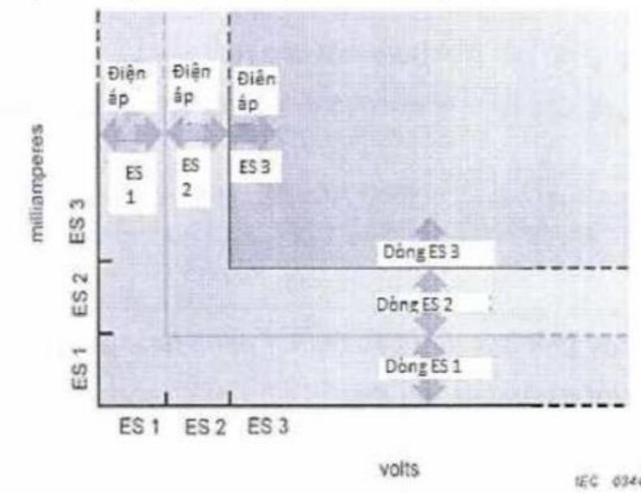
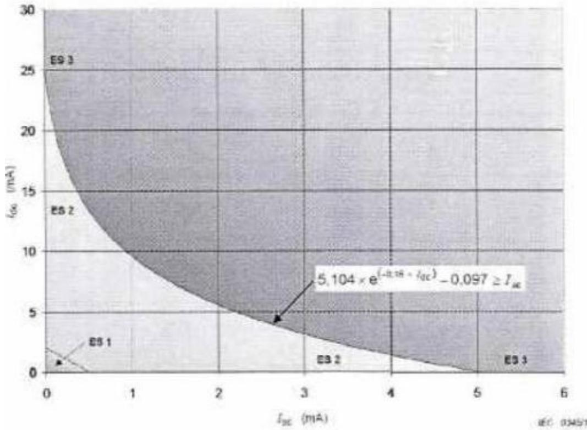

# Public_286

# 1. Phân loại nguồn năng lượng điện

# 1.1 ES1

# 1.1.1 Khái niệm

ES1 là nguồn năng lượng điện loại 1, được xác định theo mức điện áp và dòng điện không vượt quá các giới hạn an toàn quy định. Đây là cấp độ năng lượng điện có mức rủi ro thấp nhất trong các phân loại ES.

# 1.1.2 Điều kiện áp dụng

Nguồn điện được phân loại là ES1 khi:

- Không vượt quá giới hạn ES1 trong các tình huống:

o Điều kiện hoạt động bình thường.   
o Điều kiện hoạt động bất thường.   
o Điều kiện xảy ra lỗi đơn của một bộ phận, thiết bị hoặc vật liệu cách điện không đóng vai trò là biện pháp bảo vệ chính.

- Không vượt quá giới hạn ES2 trong điều kiện lỗi đơn của biện pháp bảo vệ cơ bản.

# 1.2 ES2

# 1.2.1 Khái niệm

ES2 là nguồn năng lượng điện loại 2, có mức rủi ro cao hơn ES1, được phân loại dựa trên điện áp và dòng điện tiếp xúc vượt quá giới hạn an toàn của ES1.

# 1.2.2 Điều kiện áp dụng

Nguồn điện được phân loại là ES2 khi:

- Cả điện áp tiếp xúc tiềm năng và dòng điện tiếp xúc đều vượt quá giới hạn cho ES1; và

- Trong các tình huống:

o Điều kiện hoạt động bình thường.   
o Điều kiện hoạt động bất thường.   
o Các điều kiện lỗi đơn.

Ngoài ra, nguồn cũng có thể được xếp vào ES2 nếu chỉ một trong hai thông số (điện áp hoặc dòng điện tiếp xúc) vượt quá giới hạn của ES1 nhưng vẫn không vượt quá giới hạn cho ES2.

# 1.3.1 Khái niệm

ES3 là nguồn năng lượng điện loại 3, có mức rủi ro cao nhất trong các phân loại ES. Đây là nguồn điện tiềm ẩn nguy hiểm, cần có các biện pháp bảo vệ nghiêm ngặt.

# 1.3.2 Điều kiện áp dụng

Nguồn điện được phân loại là ES3 khi:

- Cả điện áp tiếp xúc tiềm năng và dòng điện tiếp xúc đều vượt quá giới hạn cho ES2.

- Áp dụng trong các trường hợp hệ thống hoặc thiết bị hoạt động với mức điện áp cao, dòng điện lớn, có khả năng gây nguy hiểm trực tiếp cho con người nếu không có biện pháp bảo vệ an toàn.

# 2. Giới hạn nguồn năng lượng điện của các mạch ES1 và ES2

# 2.1 Tổng quan

Các giới hạn quy định trong [2] là so với đất hoặc so với một bộ phận có thể tiếp cận được.

CHÚ THÍCH: Trong [2] ,thuật ngữ "điện áp" có nghĩa là “điện áp tiếp xúc tiềm năng”. Tương tự, thuật ngữ “dòng điện” có nghĩa là “dòng điện tiếp xúc”.

> **Hình chú thích:** a diagram of the voltage and current in a circuit

  
[Hình 1] - Hình minh họa các giới hạn ES về điện áp và dòng điện

Đối với bất kỳ điện áp nào trong giới hạn điện áp, sẽ không có giới hạn cho dòng điện. Tương tự như vậy đối với bất kỳ dòng điện nào trong giới hạn dòng điện, sẽ không có giới hạn nào đối với điện áp, xem [Hình 21].

2.2 Các giới hạn điện áp và dòng điện ở trạng thái ổn định

Cấp nguồn năng lượng điện được xác định từ cả điện áp và dòng điện trong điều kiện hoạt động bình thường, điều kiện hoạt động bất thường và điều kiện sự cố đơn lẻ (xem [Bảng 1]).

Các giá trị là giá trị tối đa mà nguồn có thể phân phối. Trạng thái ổn định được coi là được thiết lập khi các giá trị điện áp hoặc dòng điện duy trì trong 2 s hoặc lâu hơn, nếu không thì áp dụng các giới hạn của các trường hợp Giới hạn điện dung, Giới hạn xung đơn, Giới hạn cho các xung lặp lại nếu thích hợp

[Bảng 1] - Giới hạn nguồn năng lượng điện cho ES1 và ES2 ở trạng thái ổn định

<table><tr><td rowspan=2 colspan=1>Nguonnanglrong</td><td rowspan=1 colspan=2>Cac gioi han cho ES1</td><td rowspan=1 colspan=2>Cac gioi han choES2</td><td rowspan=2 colspan=1>ES3</td></tr><tr><td rowspan=1 colspan=1>Dien ap</td><td rowspan=1 colspan=1>Dong diena, c</td><td rowspan=1 colspan=1>Dien ap</td><td rowspan=1 colspan=1>Dongaienb.e</td></tr><tr><td rowspan=1 colspan=1>d.c</td><td rowspan=1 colspan=1>60 V</td><td rowspan=1 colspan=1>2 mA</td><td rowspan=1 colspan=1>120 V</td><td rowspan=1 colspan=1>25 mA</td><td rowspan=5 colspan=1>&gt;ES2</td></tr><tr><td rowspan=1 colspan=1>a.c nhohon hoacbang 1kHz</td><td rowspan=1 colspan=1>30 V r.m.s.42.4 V dinh</td><td rowspan=3 colspan=1>0.5 mA r.m.s0,707 mA dinh</td><td rowspan=1 colspan=1>50V r.m.s.70,7 Vdinh</td><td rowspan=3 colspan=1>5 mAr.m.s.7,07 mAdinh</td></tr><tr><td rowspan=1 colspan=1>a.c lonhon 1kHz vanhó honhoacbang 100kHz</td><td rowspan=1 colspan=1>30 V r.m.s. + 0,4 f</td><td rowspan=1 colspan=1>50 Vr.m.s. +0,9f</td></tr><tr><td rowspan=1 colspan=1>a.c l6nhon 100kHz</td><td rowspan=1 colspan=1>70 V r.m.s.</td><td rowspan=1 colspan=1>140 Vr.m.s.</td></tr><tr><td rowspan=1 colspan=1>Ket hopla.c va d.c</td><td rowspan=1 colspan=1>UdcV/60 +UacVr.m.s/30 ≤1UdcV/60 +UacVdinh/42,4 ≤ 1JlacmAdinh/0,707 ≤1</td><td rowspan=1 colspan=1>ldcmA/2 +lacmAr.m.s/0,5 ≤ 1ldcmA/2 +UacVdinh/42,4 ≤ 1JlacmAdinh/0,707 ≤1</td><td rowspan=1 colspan=1>Xem[Hinh 23]</td><td rowspan=1 colspan=1>Xem[Hinh 22]</td></tr><tr><td rowspan=1 colspan=6>Cong thtrc duoi day nhu mot ham cua tan só c6 thé duoc cac nha thiét ké quantam cho cac nguon nang luong dién hinh sin</td></tr><tr><td rowspan=1 colspan=1>Nguonnanglrong</td><td rowspan=1 colspan=2>Cac gioi han cho ES1Dong diener.m.s.</td><td rowspan=1 colspan=2>Cac gioi han choES2Dong diener.m.s.</td><td rowspan=1 colspan=1>ES3</td></tr><tr><td rowspan=1 colspan=1>a.c nhohon hoac</td><td rowspan=1 colspan=2>0.5 mA</td><td rowspan=1 colspan=2>5 mA</td><td rowspan=1 colspan=1>&gt;ES2</td></tr></table>

<table><tr><td>bang 1 kHz</td><td rowspan="2"></td><td rowspan="2">5 mA + 0,95 fe</td><td rowspan="2"></td></tr><tr><td>a.c 1on hon 1 kHz va nhó hon 0.5 mA x fd hoac bang 100</td></tr><tr><td>kHz a.c lon hon 100 kHz</td><td>50 mAd</td><td>100 mAe</td><td></td></tr></table>

<table><tr><td>f tinh bang kHz. Gia tri dinh phai duoc sur dung cho dien ap va dong dien khong hinh sin. Gia</td></tr><tr><td>Tham khao [5.7] ve phep do dien ap tiép xuc tiem nang va dong dien tiep xuc. a Dong dien duoc do bang cach sur dung mang do duoc quy dinh trong Hinh 4,</td></tr><tr><td>IEC 60990:1999. b Dong dien duoc do bang mang do quy dinh trong Hinh 5, IEC 60990:1999</td></tr><tr><td> Doi voi dang sóng hinh sin va mot chieu, dong dien c6 thé duoc do bang dien</td></tr><tr><td>tro 2000 Ω. d Tren 22 kHz, khu vuc tiép can duoc gioi han ó 1 cm².</td></tr><tr><td>e Trén 36 kHz, khu vuc tiép can duoc gioi han δ 1 cm².</td></tr></table>

Trong điều kiện hoạt động bình thường, điều kiện hoạt động bất thường và điều kiện sự cố đơn (ngoại trừ lỗi bảo vệ), điện áp tiếp xúc hoặc dòng điện tiếp xúc phải được đo từ tất cả các bộ phận dẫn điện có thể tiếp cận được không nối đất. Dòng điện cảm ứng (dòng điện a và dòng điện b trong [Bảng 4]) phải được đo theo 5.1.1 và 6.2.1 của IEC 60990:1999.

Trong các điều kiện sự cố đơn lẻ của biện pháp bảo vệ cơ bản hoặc biện pháp bảo vệ bổ sung, bao gồm 6.2.2.1 của IEC 60990:1999, điện áp tiếp xúc hoặc dòng điện tiếp xúc phải được đo từ tất cả các bộ phận dẫn điện có thể tiếp cận được không nối đất. Dòng điện cảm ứng (dòng điện b trong [Bảng 4]) phải được đo bằng mạng được quy định trong Hình 5 của IEC 60990:1999.

> **Hình chú thích:** a graph shows the temperature and pressure of a gas

  
[Hình 2] - Các giá trị cực đại cho kết hợp dòng a.c. và dòng d.c

> **Hình chú thích:** a graph shows the temperature and pressure of a gas

  
[Hình 3] - Các giá trị cực đại cho kết hợp điện áp a.c và điện áp d.c

# 2.3 Giới hạn điện dung

Khi nguồn năng lượng điện là một tụ điện, nguồn năng lượng này được phân loại theo cả điện áp tích và điện dung.

Điện dung là giá trị danh định của tụ điện cộng với dung sai quy định.

Các giới hạn ES1 và ES2 cho các giá trị điện dung khác nhau được liệt kê trong [Bảng 5].

CHÚ THÍCH 1: Các giá trị điện dung cho ES2 được lấy từ Bảng A.2 của IEC/TS 61201:2007.

CHÚ THÍCH 2: Các giá trị ES1 được tính bằng cách chia các giá trị từ Bảng A.2 của IEC/TS 61201:2007 cho 2.

[Bảng 2] - Giới hạn nguồn năng lượng điện đối với tụ điện tích điện   

<table><tr><td rowspan=1 colspan=1>C (nF)</td><td rowspan=1 colspan=1>ES1 (U dinh V)</td><td rowspan=1 colspan=1>ES2 (U dinh V)</td><td rowspan=1 colspan=1>ES3 (U dinh V)</td></tr><tr><td rowspan=1 colspan=1>300 hoac 16n hon</td><td rowspan=1 colspan=1>60</td><td rowspan=1 colspan=1>120</td><td rowspan=1 colspan=1>ES2</td></tr><tr><td rowspan=1 colspan=1>170</td><td rowspan=1 colspan=1>75</td><td rowspan=1 colspan=1>150</td><td rowspan=14 colspan=1></td></tr><tr><td rowspan=1 colspan=1>91</td><td rowspan=1 colspan=1>100</td><td rowspan=1 colspan=1>200</td></tr><tr><td rowspan=1 colspan=1>61</td><td rowspan=1 colspan=1>125</td><td rowspan=1 colspan=1>250</td></tr><tr><td rowspan=1 colspan=1>41</td><td rowspan=1 colspan=1>150</td><td rowspan=1 colspan=1>300</td></tr><tr><td rowspan=1 colspan=1>28</td><td rowspan=1 colspan=1>200</td><td rowspan=1 colspan=1>400</td></tr><tr><td rowspan=1 colspan=1>18</td><td rowspan=1 colspan=1>250</td><td rowspan=1 colspan=1>500</td></tr><tr><td rowspan=1 colspan=1>12</td><td rowspan=1 colspan=1>350</td><td rowspan=1 colspan=1>700</td></tr><tr><td rowspan=1 colspan=1>8.0</td><td rowspan=1 colspan=1>500</td><td rowspan=1 colspan=1>1 000</td></tr><tr><td rowspan=1 colspan=1>4.0</td><td rowspan=1 colspan=1>1000</td><td rowspan=1 colspan=1>2 000</td></tr><tr><td rowspan=1 colspan=1>1.6</td><td rowspan=1 colspan=1>2 500</td><td rowspan=1 colspan=1>5 000</td></tr><tr><td rowspan=1 colspan=1>0,8</td><td rowspan=1 colspan=1>5000</td><td rowspan=1 colspan=1>1 0000</td></tr><tr><td rowspan=1 colspan=1>0.4</td><td rowspan=1 colspan=1>10 000</td><td rowspan=1 colspan=1>20 000</td></tr><tr><td rowspan=1 colspan=1>0,2</td><td rowspan=1 colspan=1>20 000</td><td rowspan=1 colspan=1>40 000</td></tr><tr><td rowspan=1 colspan=1>0,133 hoäc nhó hon</td><td rowspan=1 colspan=1>25 000</td><td rowspan=1 colspan=1>50 000</td></tr><tr><td rowspan=1 colspan=4>Phep noi suy tuvén tinh c6 thé duoc sur dung gita hai diém gan nhat.</td></tr></table>

# 2.4 Giới hạn xung đơn

Trong trường hợp nguồn năng lượng điện là một xung đơn lẻ, nguồn năng lượng được phân loại theo cả điện áp và thời gian hoặc theo cả dòng điện và thời gian. Các giá trị được nêu trong [Bảng 6] và [Bảng 7]. Nếu điện áp vượt quá giới hạn, thì dòng điện không được vượt quá giới hạn. Nếu dòng điện vượt quá giới hạn, điện áp không được vượt quá giới hạn. Dòng điện được đo theo [5.7]. Đối với các xung lặp lại, xem [5.2.2.5].

Đối với xung có thời gian lên đến $1 0 \mathrm { m s }$ , áp dụng giới hạn điện áp hoặc dòng điện trong $1 0 \mathrm { m s }$ .

Nếu phát hiện nhiều hơn một xung trong khoảng thời gian 3 s, thì nguồn năng lượng điện được coi là xung lặp lại và áp dụng các giới hạn của [5.2.2.5].

CHÚ THÍCH 1: Các giới hạn xung được tính theo IEC/TS 60479-1:2005. Hình 22 và Bảng 10.

CHÚ THÍCH 2: Cáo xung đơn này không bao gồm quá độ.

CHÚ THÍCH 3: Khoảng thời gian xung được coi là khoảng thời gian khi điện áp hoặc dòng điện vượt quá giới hạn ES1.

[Bảng 3] - Giới hạn điện áp cho các xung đơn   

<table><tr><td rowspan=1 colspan=1>Khoang thoi gian</td><td rowspan=1 colspan=3>Khoang thoi gianMurc nguon nang luong dien</td></tr><tr><td rowspan=1 colspan=1>xung den (ms)</td><td rowspan=1 colspan=1>ES1 (U dinh V)</td><td rowspan=1 colspan=1>ES2 (U dinh V)</td><td rowspan=1 colspan=1>ES3(U dinh V)</td></tr><tr><td rowspan=1 colspan=1>10</td><td rowspan=6 colspan=1>60</td><td rowspan=1 colspan=1>196</td><td rowspan=6 colspan=1>ES2</td></tr><tr><td rowspan=1 colspan=1>20</td><td rowspan=1 colspan=1>178</td></tr><tr><td rowspan=1 colspan=1>50</td><td rowspan=1 colspan=1>150</td></tr><tr><td rowspan=1 colspan=1>80</td><td rowspan=1 colspan=1>135</td></tr><tr><td rowspan=1 colspan=1>100</td><td rowspan=1 colspan=1>129</td></tr><tr><td rowspan=1 colspan=1>200 va lón hon</td><td rowspan=1 colspan=1>120</td></tr></table>

Nếu khoảng thời gian nằm giữa các giá trị trong hai hàng bất kỳ, thì giá trị ES2 của Uđỉnh trong hàng dưới sẽ được sử dụng hoặc có thể sử dụng phép nội suy tuyến tính giữa hai hàng liền kề bất kỳ với giá trị điện áp đỉnh được tính toán làm tròn xuống giá trị gần nhất tính theo V.

Nếu điện áp đỉnh cho ES2 nằm giữa các giá trị trong hai hàng bất kỳ, giá trị của khoảng thời gian trong hàng trên có thể được sử dụng hoặc có thể sử dụng phép nội suy tuyến tính giữa hai hàng liền kề bết kỳ với khoảng thời gian tính toán được làm tròn xuống giá trị gần nhất tính theo ms.

[Bảng 4] - Giới hạn dòng điện cho các xung đơn   

<table><tr><td rowspan=2 colspan=1>xung dén (ms)</td><td rowspan=1 colspan=3>Khoang thoi gianMirc nguon nang luong dien</td></tr><tr><td rowspan=1 colspan=1>ES1 (I dinh mA)</td><td rowspan=1 colspan=1>ES2 (I dinh mA)</td><td rowspan=1 colspan=1>ES3 (I dinh mA)</td></tr><tr><td rowspan=1 colspan=1>10</td><td rowspan=8 colspan=1>2</td><td rowspan=1 colspan=1>200</td><td rowspan=8 colspan=1>ES2</td></tr><tr><td rowspan=1 colspan=1>20</td><td rowspan=1 colspan=1>153</td></tr><tr><td rowspan=1 colspan=1>50</td><td rowspan=1 colspan=1>107</td></tr><tr><td rowspan=1 colspan=1>100</td><td rowspan=1 colspan=1>81</td></tr><tr><td rowspan=1 colspan=1>200</td><td rowspan=1 colspan=1>62</td></tr><tr><td rowspan=1 colspan=1>500</td><td rowspan=1 colspan=1>43</td></tr><tr><td rowspan=1 colspan=1>1 000</td><td rowspan=1 colspan=1>33</td></tr><tr><td rowspan=1 colspan=1>2 000 va lon hon</td><td rowspan=1 colspan=1>25</td></tr></table>

Nếu khoảng thời gian nằm giữa các giá trị trong hai hàng bất kỳ, giá trị ES2 của Iđỉnh ở hàng bên dưới sẽ được sử dụng hoặc phép nội suy tuyến tính có thể được sử dụng giũa hai hàng liền kề bất kỳ với giá trị tính toán được làm tròn xuống giá trị gần nhất tính theo mA.

Nếu dòng điện đỉnh cho ES2 nằm giữa các giá trị trong hai hàng bất kỳ, thì giá trị của khoảng thời gian trong hàng trên có thể được sử dụng hoặc phép nội suy tuyến tính có thể được sử dụng giữa hai hàng liền kề bất kỳ với khoảng thời gian tính toán được làm tròn xuống giá trị gần nhất tính theo ms.

# 2.5 Giới hạn cho các xung lặp lại

Ngoại trừ các xung được đề cập trong [Phụ lục H], phân cấp nguồn năng lượng điện xung lặp lại được xác định từ điện áp khả dụng hoặc dòng điện khả dụng (xem [Bảng 8]). Nếu điện áp vượt quá giới hạn, thì dòng điện không được vượt quá giới hạn. Nếu dòng điện vượt quá giới hạn, điện áp không được vượt quá giới hạn. Dòng điện được đo theo [5.7].

[Bảng 5] - Giới hạn nguồn năng lượng điện đối với các xung lặp lại   

<table><tr><td rowspan=1 colspan=1>Thoi gian tat xung</td><td rowspan=1 colspan=1></td><td rowspan=1 colspan=1>ES1</td><td rowspan=1 colspan=1>ES2</td><td rowspan=1 colspan=1>ES3</td></tr><tr><td rowspan=2 colspan=1>Nho hon 3 s</td><td rowspan=1 colspan=1>Dong dien</td><td rowspan=1 colspan=1>0,707 mA dinh</td><td rowspan=1 colspan=1>7,07 mA dinh</td><td rowspan=4 colspan=1>ES2</td></tr><tr><td rowspan=1 colspan=1>Dien ap</td><td rowspan=1 colspan=1>42.4 V dinh</td><td rowspan=1 colspan=1>70,7 V dinh</td></tr><tr><td rowspan=2 colspan=1>3 s hoäc lon hon</td><td rowspan=1 colspan=1>Dong dien</td><td rowspan=2 colspan=1>Xem [5.2.2.4]</td><td rowspan=2 colspan=1>Xem [5.2 2.4]</td></tr><tr><td rowspan=1 colspan=1>Dien ap</td></tr></table>

# 2.6 Tín hiệu đổ chuông

Trong trường hợp nguồn năng lượng điện là tín hiệu đổ chuông mạng điện thoại tương tự như được định nghĩa trong [Phụ lục H], loại nguồn năng lượng được coi là ES2.

# 2.7 Tín hiệu âm thanh

Đối với nguồn năng lượng điện bao $\mathrm { g } \dot { \hat { \mathrm { o } } } \mathrm { m }$ tín hiệu âm thanh, xem Điều [E.1].
