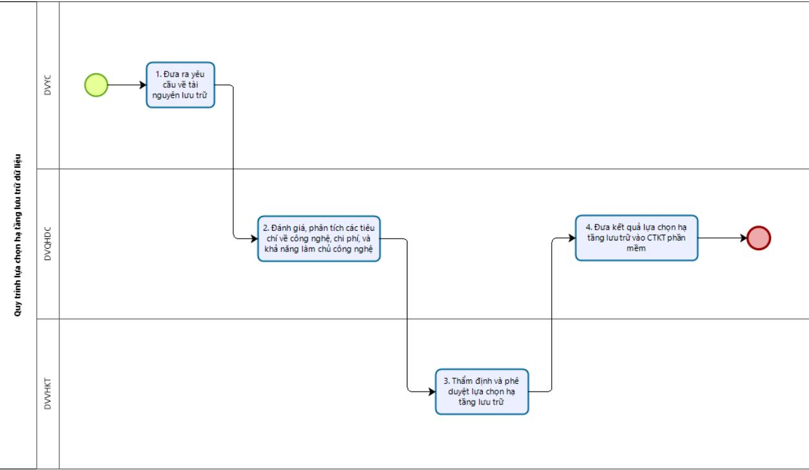

# Public_320

1. Quan điểm, mục đích $^ +$ Quan điểm:

✓ Đơn vị cần tuân thủ việc đánh giá đầy đủ qua các bước với các tiêu chí được nêu và căn cứ vào kết quả đánh giá để ra quyết định lựa chọn công nghệ phù hợp với yêu cầu.   
✓ Quy trình này hỗ trợ đưa ra căn cứ lựa chọn công trong các chỉ tiêu kỹ thuật cho các dự án mua sắm, đầu tư tài nguyên lưu trữ mới.   
✓ Các đơn vị có trách nhiệm cung cấp use cases thường xuyên để quy trình này được cập nhật các tri thức mới. Đánh giá liên tục để đánh giá mức độ phù hợp với thực tế.

$^ +$ Mục đích: Quy trình này nhằm quy định thống nhất phương pháp lựa chọn hạ tầng lưu trữ dữ liệu tại các đơn vị.

# 2. Phạm vi, đối tượng áp dụng

Phạm vi: Áp dụng cho hoạt động đánh giá, lựa chọn hạ tầng lưu trữ dữ liệu. Đối tượng áp dụng: Các cơ quan, đơn vị trong Tập đoàn

3. Tài liệu liên quan

<table><tr><td rowspan=1 colspan=1>TT</td><td rowspan=1 colspan=1>Tai lieu</td><td rowspan=1 colspan=1>Ngay ban hanh</td></tr><tr><td rowspan=1 colspan=1>1</td><td rowspan=1 colspan=1>Bó tiéu chuan Luu tru va Van hanh dur liéuTC.CNVTQD.CNTT.40</td><td rowspan=1 colspan=1>3/2021</td></tr><tr><td rowspan=1 colspan=1>2</td><td rowspan=1 colspan=1>Quy dinh xay dung va ap dung chi tieu ky thuat cho san phäm hang hóa phuc vu hoat dong cua Tap doan CNVTQDma hiéu 3208/QyD-CNVTQD-VTNet</td><td rowspan=1 colspan=1>9/2020</td></tr><tr><td rowspan=1 colspan=1>3</td><td rowspan=1 colspan=1>Guideline dinh co cap phat tai nguyen CNTT mä hiéuGL.CNVTQD.CNTT.18.514</td><td rowspan=1 colspan=1>09/2021</td></tr></table>

4. Giải thích thuật ngữ và từ viết tắt Thuật ngữ o Dữ liệu (Data): là thông tin được máy tính lưu trữ, xử lý hoặc truy xuất theo yêu cầu của người dùng hoặc theo tiến trình hoạt động của máy tính.

o Hạ tầng lưu trữ dữ liệu: gồm hệ thống vật lý và logic có nhiệm vụ quản lý và lưu trữ dữ liệu có thể bao gồm SAN (Storage Area Network), NAS (Network Attached Storage), DAS (Direct Attached System), Object Storage và (SDS) Software Define Storage.   
o Retention: Lưu giữ dữ liệu đảm bảo luôn sẵn sàng phục vụ nhu cầu truy xuất của dữ liệu ngay khi có yêu cầu.   
o Archive: Lưu trữ dữ liệu lâu dài. Khi lưu trữ lâu dài, dữ liệu được chuyển từ phân vùng lưu trữ tốc độ truy xuất cao sang phân vùng có hiệu năng thấp hơn. Khi dữ liệu chuyển từ giai đoạn “Retention” sang “Archive” được còn được gọi là “backup offline”.   
o Backup dự phòng: Là việc sao lưu dữ liệu để dự phòng khi có sự cố xảy ra, dữ liệu vẫn đảm bảo tính sẵn sàng phục vụ cho nghiệp vụ.   
o Node: Một máy tính/ máy chủ vật lý lưu trữ và xử lý dữ liệu như một phần của cơ sở dữ liệu phân tán.

Từ viết tắt

<table><tr><td rowspan=1 colspan=1>STT</td><td rowspan=1 colspan=1> Thuat ngir va tir viet tat</td><td rowspan=1 colspan=1>Giai thich</td></tr><tr><td rowspan=1 colspan=1>1.</td><td rowspan=1 colspan=1>CSDL</td><td rowspan=1 colspan=1>Co so dur lieu</td></tr><tr><td rowspan=1 colspan=1>2.</td><td rowspan=1 colspan=1>RDBMS</td><td rowspan=1 colspan=1>Relational Database Management System (Hé quantri CSDL quan he)</td></tr><tr><td rowspan=1 colspan=1>3.</td><td rowspan=1 colspan=1>NoSQL</td><td rowspan=1 colspan=1>Non Relational hoäc Not Only SQL: La loai DBMSdanh cho du liéu có cáu truc linh hoat</td></tr><tr><td rowspan=1 colspan=1>4.</td><td rowspan=1 colspan=1>CNTT</td><td rowspan=1 colspan=1>Cong nghé thong tin</td></tr><tr><td rowspan=1 colspan=1>5.</td><td rowspan=1 colspan=1>QHDC</td><td rowspan=1 colspan=1>Quy hoach dinh co</td></tr><tr><td rowspan=1 colspan=1>6.</td><td rowspan=1 colspan=1>VHKT</td><td rowspan=1 colspan=1>Van hanh khai thac</td></tr></table>

# 5. Nội dung quy trình lựa chọn Hạ tầng lưu trữ dữ liệu

• Sự kiện bắt đầu và kết thúc

Sự kiện bắt đầu: Khi có nhu cầu đầu tư hạ tầng lưu trữ dữ liệu mới. Sự kiện kết thúc: Lựa chọn được hạ tầng lưu trữ dữ liệu phù hợp cho nhu cầu, đưa vào CTKT phục vụ các dự án quy hoạch định cỡ và mua sắm tài nguyên hạ tầng lưu trữ dữ liệu mới. Đầu vào: Khi có yêu cầu mua sắm, đầu tư tài nguyên hạ tầng lưu trữ mới.

Đầu ra: Loại hạ tầng lưu trữ phù hợp với nhu cầu nghiệp vụ và tối ưu chi phí, tài nguyên và nỗ lực vận hành khai thác.

• Lưu đồ tổng thể quy trình • Diễn giải chi tiết • Vai trò của các bên liên quan

> **Hình chú thích:** a flow diagram showing the process for a project

<table><tr><td rowspan=1 colspan=1>Buroc</td><td rowspan=1 colspan=1>Hoatdongchinh</td><td rowspan=1 colspan=1>Cong viec thuc hien</td><td rowspan=1 colspan=1>Phu trachthuc hien</td><td rowspan=1 colspan=1>Dau vao</td><td rowspan=1 colspan=1>Dau ra</td></tr><tr><td rowspan=1 colspan=1>1.</td><td rowspan=1 colspan=1>Phan tich,danh giacac   tieuchi congnghe velua  chon</td><td rowspan=1 colspan=1>Khi có nhu cäu däu tur tainguyén luu tru du liéu turcac don vi có yéu cau, donvi QHDC thuc hién phantich, danh gia theo cac tieuchi cong nghé sau:1  Kien truc luu trur</td><td rowspan=1 colspan=1>Don viyeu cauDon viQHDC</td><td rowspan=1 colspan=1>Phantichyeu_ cau véha tang candau tu</td><td rowspan=1 colspan=1>Cacnhandinh    veloai     hatang phuhop   Voitumg tieuchi sau khi</td></tr></table>

<table><tr><td rowspan=1 colspan=1></td><td rowspan=1 colspan=1>san phamva chi phi</td><td rowspan=1 colspan=1>tai cac cong dong congnghe trén thé gioi.Xem xét chi phi cho 1 donvi luu trur trén tirng loai hatang dé chon loai toi uu veTCO.</td><td rowspan=1 colspan=1></td><td rowspan=1 colspan=1>bao    caocong nghécua don viva     Tapdoan.Cac nguonthong   tindang    tincay.</td><td rowspan=1 colspan=1>chi ve chiphi    vamuc   dpho biencua   sanpham.</td></tr><tr><td rowspan=4 colspan=1>4</td><td rowspan=4 colspan=1>Danh gianang  lurclam   chusan pham,cac    sanphamDBMS vahé   dieuhanh  htro</td><td rowspan=4 colspan=1>Don vi trién khai cai dat vaDon vi van hanh ha tangluu tru danh gia nang luclam chu san phäm. Uu tiénchon sän pham ma doi duán am hiéu va thanh thaonhat va van hanh don gian,it 10i. Truong hop la ha tang luutrur moi thi cän phai códanh gia thir nghiep truockhi ra quyét dinh lua chon.Biéu mau danh gia luachon tur Buóc 1,2,3,4 xemtrong Phu luc 04.</td><td rowspan=4 colspan=1>DVQHDC</td><td rowspan=1 colspan=1>Cac    usecases  doidu anda</td><td rowspan=4 colspan=1>Ket  qualua  chonha   tangluru    trurduoc Lanhdao don viQHDC vaLanh daodon vi vanhanhhatang  luutrur   pheduyet.</td></tr><tr><td rowspan=1 colspan=1>trien khai</td></tr><tr><td rowspan=1 colspan=1>hoac thamkhao tr cacdon      vikhac.Bien  ban</td></tr><tr><td rowspan=1 colspan=1>danh  giakét qua thurnghiep theocac tieu chicong ngheduoc   uutien.</td></tr><tr><td rowspan=1 colspan=1>5</td><td rowspan=1 colspan=1>Xay dungCTKTvéHatanglru trur</td><td rowspan=1 colspan=1>Doi dur an dua dua két qualua chon ha tang luu tru óBuóc 4 vao CTKT mua säm dau tu moi ha tang luutrur theo QD 3208/QyD-CNVTQD-VTNet.</td><td rowspan=1 colspan=1>DVQHDC</td><td rowspan=1 colspan=1>Can cur vaokét qua phéduyétlrachon    hatang luu trur</td><td rowspan=1 colspan=1>CTKThatang  luutru</td></tr></table>

<table><tr><td rowspan=1 colspan=1>STT</td><td rowspan=1 colspan=1>Hoat d@ng chinh</td><td rowspan=1 colspan=1>DV yeu cau</td><td rowspan=1 colspan=1>DVQHDC</td><td rowspan=1 colspan=1>DV VHKTha tang luutrur</td></tr></table>

<table><tr><td rowspan=1 colspan=1>1.</td><td rowspan=1 colspan=1>Dua ra yéu cau vé tai nguyén luu tru</td><td rowspan=1 colspan=1>A/R</td><td rowspan=1 colspan=1></td><td rowspan=1 colspan=1></td></tr><tr><td rowspan=1 colspan=1>2.</td><td rowspan=1 colspan=1>Danh gia, phan tich cac tieu chi vecong nghé, chi phi, va kha näng lamchu cong nghé</td><td rowspan=1 colspan=1>I</td><td rowspan=1 colspan=1>A/R</td><td rowspan=1 colspan=1>R</td></tr><tr><td rowspan=1 colspan=1>3.</td><td rowspan=1 colspan=1>Thäm dinh va phé duyét lua chon ha tang luru tru</td><td rowspan=1 colspan=1>R</td><td rowspan=1 colspan=1>A</td><td rowspan=1 colspan=1>R</td></tr><tr><td rowspan=1 colspan=1>4.</td><td rowspan=1 colspan=1> Dua két qua lua chon ha tang luu truvao CTKT phan mém</td><td rowspan=1 colspan=1>I</td><td rowspan=1 colspan=1>A/R</td><td rowspan=1 colspan=1>C</td></tr></table>

Giải thích:   

<table><tr><td rowspan=1 colspan=1>Chir viet tat</td><td rowspan=1 colspan=1>Y nghia</td></tr><tr><td rowspan=1 colspan=1>A</td><td rowspan=1 colspan=1>Don vi/vai tro chiu trach nhiem giai trinh két qua cua hoat dong</td></tr><tr><td rowspan=1 colspan=1>R</td><td rowspan=1 colspan=1>Don vi/vai tro chiu trach nhiém thuc hien hoat dong</td></tr><tr><td rowspan=1 colspan=1>S</td><td rowspan=1 colspan=1>Don vi/vai tro cung cáp nguon luc va hö tro thuc hien hoat dong</td></tr><tr><td rowspan=1 colspan=1>C</td><td rowspan=1 colspan=1>Don vi/vai tro cung cap thong tin va tu van hö trog truoc va trong quatrinh thuc hién hoat dong</td></tr><tr><td rowspan=1 colspan=1>I</td><td rowspan=1 colspan=1> Don vi/vai tro duoc thong bao/cung cap thong tin sau khi hoat dongduoc thuc hién</td></tr></table>

# 6. Tiêu chí, chỉ số đánh giá việc thực hiện quy trình

<table><tr><td rowspan=1 colspan=1>Miéu ta KPI</td><td rowspan=1 colspan=1>Cong thirc tinh: Ti lé tuan thu quy trinh = Tong so du an co bao cao luachon ha tang luu tri dung quy trinh truoc khi xay dung CTKT/ Tong sódu an.Cach tinh: Hang quy don vi chiu trach nhiem ra soat va lay só luong trénhé thóng dé tinh ti lé.</td></tr><tr><td rowspan=1 colspan=1>Muc dich KPI</td><td rowspan=1 colspan=1>Quan ly viéc tuan thu quy trinh.</td></tr><tr><td rowspan=1 colspan=1>NguongKPImuc tieu</td><td rowspan=1 colspan=1> &gt;=90% (Kiem tra thu nghiem sau 3 thang sau dó se dieu chinh nguongKPI theo thuc té)</td></tr><tr><td rowspan=1 colspan=1>Don vi chiutrachnhiémthuc hien KPI</td><td rowspan=1 colspan=1>DV QHDC</td></tr></table>

<table><tr><td>Don vi ra soat viéc thuc hien KPI</td><td>Bó phan Quan tri du liéu</td></tr></table>

# 7. Phụ lục đính kèm
