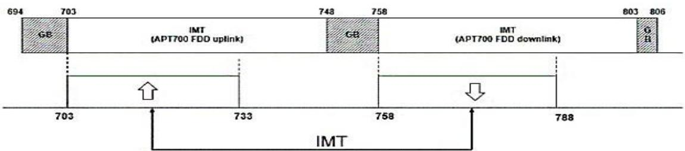
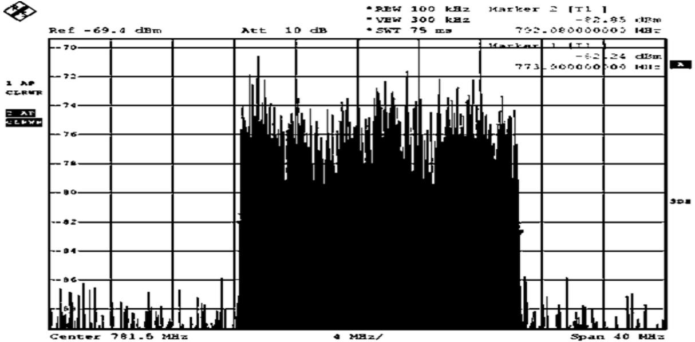
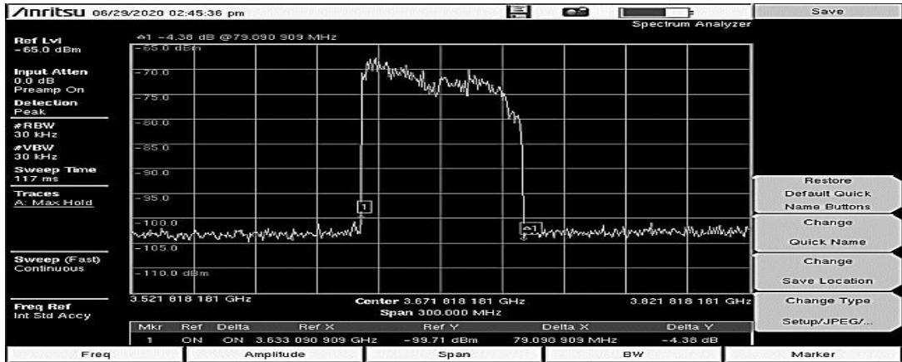

# Public_327

# 1. Mạng di động 5g tại việt nam

# 1.1 Mô hình hạ tầng mạng 5G tại Việt Nam

- Liên quan đến triển khai thương mại hóa 5G, hiện nay trên thế giới đang có $2 \mathrm { m } \hat { \mathrm { o } }$ hình 5G được triển khai là 5G phụ thuộc NSA (Non StandAlone) và 5G độc lập SA (StandAlone). Trong đó, số đông các nhà mạng triển khai mô hình “5G phụ thuộc” NSA. Đây là mô hình sử dụng chung hạ tầng mạng truy nhập và mạng lõi sẵn có của mạng 4G, qua đó tận dụng thiết bị, vùng phủ hiện có, giúp giảm chi phí và rút ngắn thời gian triển khai, nhưng nhược điểm là chưa giải quyết được yêu cầu độ trễ cực thấp và đáp ứng số lượng kết nối đồng thời cực lớn trong cùng một phạm vi.

Với nhà mạng Việt Nam, đa phần đang sử dụng hạ tầng 5G phụ thuộc vào mạng 4G để tận dụng việc triển khai nhanh, phủ tốt hơn so với mạng 5G độc lập.

Hiện nay các nhà mạng Việt Nam chủ yếu xây dựng mô hình hạ tầng mạng 5G theo hướng kiến trúc 5G NSA trên nền các dải băng tần số được quy hoạch bởi Cục Tần số vô tuyến điện.

Với Mạng 5G của Viettel đang được nghiên cứu theo hướng kết hợp cả 2 mô hình kiến trúc SA và NSA. Theo đó, SA sẽ triển khai ở nơi có dịch vụ nhu cầu như xe tự lái, dịch vụ IoT, dịch vụ thông minh…, đáp ứng các nhu cầu cá thể hóa. Trên mạng lưới của Viettel đã triển khai SA ngay từ thời điểm thử nghiệm mạng 5G (tại Hà Nam, Hà Nội, Đà Nẵng…).

# 1.2 Các băng tần số 5G tại Việt Nam

Theo bản phát hành 15 của 3GPP, các băng tần cho 5G NR đã được chỉ định và TS 38.104 mục 5.2 cung cấp danh sách các băng tần mà 5G NR có thể hoạt động. FR1 và FR2 là các phân loại băng tần cơ bản cho 5G-NR. Chúng có thể được phân loại thêm thành ba dải:

Băng song công phân chia theo tần số (FDD) Băng song công phân chia theo thời gian (TDD) Băng tần bổ sung: Băng tần đường xuống bổ sung (SDL) & băng tần đường lên bổ sung (SUL)

# 1.2.1 Băng tần hoạt động cho thiết bị đầu cuối mạng thông tin di động 5G NSA tại Việt Nam.

- Băng tần hoạt động được quy định trong Quy chuẩn QCVN 129: 2021/BTTTT đối với các thiết bị đầu cuối mạng thông tin di động 5G NSA hoạt động trên toàn bộ hoặc một trong các bộ băng tần kết hợp quy định tại Bảng 1 và tuân thủ quy định về quản lý, sử dụng tần số vô tuyến điện tại Việt Nam.

- BẢNG 1.CÁC BĂNG TẦN SỐ THIẾT BỊ ĐÂU CUỐI 5G NSA.

<table><tr><td rowspan=3 colspan=1>STT</td><td rowspan=3 colspan=1>Bq bangtanket hop</td><td rowspan=3 colspan=1>Bang tanE-UTRA/5G</td><td rowspan=1 colspan=1>Bang tan hurong len UL</td><td rowspan=1 colspan=1>Bang tan huong xuong DL</td></tr><tr><td rowspan=1 colspan=1>BS thu/UE phat</td><td rowspan=1 colspan=1>BSphat/UEthu</td></tr><tr><td rowspan=1 colspan=1>FUL,low-FUL,high(MHz)</td><td rowspan=1 colspan=1>FDL,low-FDLhigh(MHz)</td></tr><tr><td rowspan=2 colspan=1>1</td><td rowspan=2 colspan=1>DC_1_n40</td><td rowspan=1 colspan=1>1</td><td rowspan=1 colspan=1>1920÷1980</td><td rowspan=1 colspan=1>2110÷2170</td></tr><tr><td rowspan=1 colspan=1>n40</td><td rowspan=1 colspan=1>2300÷2400</td><td rowspan=1 colspan=1>2300÷2400</td></tr><tr><td rowspan=2 colspan=1>2</td><td rowspan=2 colspan=1>DC_1_n41</td><td rowspan=1 colspan=1>1</td><td rowspan=1 colspan=1>1920÷1980</td><td rowspan=1 colspan=1>2110÷2170</td></tr><tr><td rowspan=1 colspan=1>n41</td><td rowspan=1 colspan=1>2 496÷ 2 690</td><td rowspan=1 colspan=1>2 496÷2 690</td></tr><tr><td rowspan=2 colspan=1>3</td><td rowspan=2 colspan=1>DC_3_n40</td><td rowspan=1 colspan=1>3</td><td rowspan=1 colspan=1>1710÷1785</td><td rowspan=1 colspan=1>1805÷1880</td></tr><tr><td rowspan=1 colspan=1>n40</td><td rowspan=1 colspan=1>2300÷2400</td><td rowspan=1 colspan=1>2300÷2400</td></tr><tr><td rowspan=2 colspan=1>4</td><td rowspan=2 colspan=1>DC_3_n41</td><td rowspan=1 colspan=1>3</td><td rowspan=1 colspan=1>1710÷1785</td><td rowspan=1 colspan=1>1805÷1880</td></tr><tr><td rowspan=1 colspan=1>n41</td><td rowspan=1 colspan=1>2 496÷2 690</td><td rowspan=1 colspan=1>2 496÷2 690</td></tr><tr><td rowspan=2 colspan=1>5</td><td rowspan=2 colspan=1>DC_8_n40</td><td rowspan=1 colspan=1>8</td><td rowspan=1 colspan=1>880÷915</td><td rowspan=1 colspan=1>925÷960</td></tr><tr><td rowspan=1 colspan=1>n40</td><td rowspan=1 colspan=1>2300÷2400</td><td rowspan=1 colspan=1>2300÷2400</td></tr><tr><td rowspan=2 colspan=1>6</td><td rowspan=2 colspan=1>DC_8_n41</td><td rowspan=1 colspan=1>8</td><td rowspan=1 colspan=1>880÷915</td><td rowspan=1 colspan=1>925 ÷960</td></tr><tr><td rowspan=1 colspan=1>n41</td><td rowspan=1 colspan=1>2 496÷ 2 690</td><td rowspan=1 colspan=1>2 496÷2 690</td></tr><tr><td rowspan=2 colspan=1>7</td><td rowspan=2 colspan=1>DC_28_n40</td><td rowspan=1 colspan=1>28</td><td rowspan=1 colspan=1>703 ÷ 733</td><td rowspan=1 colspan=1>758 ÷ 788</td></tr><tr><td rowspan=1 colspan=1>n40</td><td rowspan=1 colspan=1>2300÷2400</td><td rowspan=1 colspan=1>2300÷2400</td></tr><tr><td rowspan=2 colspan=1>8</td><td rowspan=2 colspan=1>DC_28_n41</td><td rowspan=1 colspan=1>28</td><td rowspan=1 colspan=1>703÷733</td><td rowspan=1 colspan=1>758÷788</td></tr><tr><td rowspan=1 colspan=1>n41</td><td rowspan=1 colspan=1>2 496÷ 2 690</td><td rowspan=1 colspan=1>2 496÷ 2 690</td></tr></table>

# 1.2.2 Băng tần hoạt động cho thiết bị đầu cuối mạng thông tin di động 5G SA tại Việt Nam.

Băng tần hoạt động được quy định trong Quy chuẩn QCVN 127:2021/BTTTT đối với các thiết bị đầu cuối mạng thông tin di động 5G SA hoạt động trên toàn bộ hoặc một trong các bộ băng tần kết hợp quy định tại Bảng 2 và tuân thủ quy định về quản lý, sử dụng tần số vô tuyến điện tại Việt Nam.

- BẢNG 2. CÁC BĂNG TẦN SỐ THIẾT BỊ ĐẦU CUỐI 5G SA   

<table><tr><td rowspan=1 colspan=1>STT</td><td rowspan=1 colspan=1>Bang tan5G</td><td rowspan=1 colspan=1>Bangtan huong lenUL BS thu/UEphat FUL.low-FUL,high (MHz)</td><td rowspan=1 colspan=1>Bang tan huong xuong DLBS phat/UE thuFDL,low -FDL,high (MHz)</td><td rowspan=1 colspan=1>Chedsongcong</td><td rowspan=1 colspan=1>Phanloai</td></tr><tr><td rowspan=1 colspan=1>1</td><td rowspan=1 colspan=1>nl</td><td rowspan=1 colspan=1>1920 ÷ 1 980</td><td rowspan=1 colspan=1>2 110 ÷ 2170</td><td rowspan=5 colspan=1>FDD</td><td rowspan=9 colspan=1>FR1</td></tr><tr><td rowspan=1 colspan=1>2</td><td rowspan=1 colspan=1>m3</td><td rowspan=1 colspan=1>1710÷1785</td><td rowspan=1 colspan=1>1 805 ÷ 1 880</td></tr><tr><td rowspan=1 colspan=1>3</td><td rowspan=1 colspan=1>n5</td><td rowspan=1 colspan=1>824-835</td><td rowspan=1 colspan=1>869 ÷ 880</td></tr><tr><td rowspan=1 colspan=1>4</td><td rowspan=1 colspan=1>n8</td><td rowspan=1 colspan=1>880-915</td><td rowspan=1 colspan=1>925 - 960</td></tr><tr><td rowspan=1 colspan=1>5</td><td rowspan=1 colspan=1>n28</td><td rowspan=1 colspan=1>703- 733</td><td rowspan=1 colspan=1>758 ÷ 788</td></tr><tr><td rowspan=1 colspan=1>6</td><td rowspan=1 colspan=1>n40</td><td rowspan=1 colspan=1>2 300 ÷ 2 400</td><td rowspan=1 colspan=1>2 300 ÷2 400</td><td rowspan=4 colspan=1>TDD</td></tr><tr><td rowspan=1 colspan=1>7</td><td rowspan=1 colspan=1>n41</td><td rowspan=1 colspan=1>2 496 ÷ 2 690</td><td rowspan=1 colspan=1>2 496 ÷ 2690</td></tr><tr><td rowspan=1 colspan=1>8</td><td rowspan=1 colspan=1>n77</td><td rowspan=1 colspan=1>3300÷4200</td><td rowspan=1 colspan=1>3300÷4200</td></tr><tr><td rowspan=1 colspan=1>9</td><td rowspan=1 colspan=1>n78</td><td rowspan=1 colspan=1>3300÷3800</td><td rowspan=1 colspan=1>3300÷3800</td></tr><tr><td rowspan=1 colspan=1>10</td><td rowspan=1 colspan=1>n258</td><td rowspan=1 colspan=1>24 250÷ 27 500</td><td rowspan=1 colspan=1>24 250 ÷ 27 500</td><td rowspan=1 colspan=1>TDD</td><td rowspan=1 colspan=1>FR2</td></tr></table>

Các thiết bị điện thoại di động mạng thông tin di động 5G SA phải đảm bảo hoạt động tối thiểu trong tất cả các băng tần n1, n3, n28, n41, n77, n78.

# 1.2.3 Băng tần hoạt động của thiết bị trạm $\mathbf { g } \hat { \mathbf { 0 } } \mathbf { c }$ thông tin di $\mathbf { d } { \hat { \mathbf { 0 } } } \mathbf { n } \mathbf { g } \ 5 \mathbf { G }$ tại Việt Nam.

Băng tần hoạt động được quy định trong Quy chuẩn QCVN 128:2021/BTTTT đối với các thiết bị trạm gốc thông tin di động 5G hoạt động trên toàn bộ hoặc một trong các băng tần được quy định tại Bảng 3.

- BẢNG 3. CÁC BĂNG TẦN SỐ TRẠM BTS 5G.

<table><tr><td rowspan=1 colspan=1>STT</td><td rowspan=1 colspan=1>Bangtan</td><td rowspan=1 colspan=1>Bang tan huronglen ULBS thu/UE phatFULlow-FuLhigh(MHz)</td><td rowspan=1 colspan=1>Bang tan hurongxuong DLBS phat/UE thuFDLIow-FDL.tigh(MHz)</td><td rowspan=1 colspan=1>Che dosongcong</td></tr><tr><td rowspan=1 colspan=1>1</td><td rowspan=1 colspan=1>nl</td><td rowspan=1 colspan=1>1920 ÷ 1980</td><td rowspan=1 colspan=1>2110 ÷ 2170</td><td rowspan=1 colspan=1>FDD</td></tr><tr><td rowspan=1 colspan=1>2</td><td rowspan=1 colspan=1>m3</td><td rowspan=1 colspan=1>1710 ÷ 1785</td><td rowspan=1 colspan=1>1805 ÷ 1880</td><td rowspan=1 colspan=1>FDD</td></tr><tr><td rowspan=1 colspan=1>3</td><td rowspan=1 colspan=1>n5</td><td rowspan=1 colspan=1>824 ÷ 835</td><td rowspan=1 colspan=1>869 ÷ 880</td><td rowspan=1 colspan=1>FDD</td></tr><tr><td rowspan=1 colspan=1>4</td><td rowspan=1 colspan=1>n8</td><td rowspan=1 colspan=1>880  915</td><td rowspan=1 colspan=1>925 ÷ 960</td><td rowspan=1 colspan=1>FDD</td></tr><tr><td rowspan=1 colspan=1>5</td><td rowspan=1 colspan=1>n28</td><td rowspan=1 colspan=1>703 ÷ 733</td><td rowspan=1 colspan=1>758 ÷ 788</td><td rowspan=1 colspan=1>FDD</td></tr><tr><td rowspan=1 colspan=1>6</td><td rowspan=1 colspan=1>n40</td><td rowspan=1 colspan=1>2300 ÷ 2400</td><td rowspan=1 colspan=1>2300 + 2400</td><td rowspan=1 colspan=1>TDD</td></tr><tr><td rowspan=1 colspan=1>7</td><td rowspan=1 colspan=1>n41</td><td rowspan=1 colspan=1>2500 ÷ 2690</td><td rowspan=1 colspan=1>2500 ÷ 2690</td><td rowspan=1 colspan=1>TDD</td></tr><tr><td rowspan=1 colspan=1>9</td><td rowspan=1 colspan=1>n258</td><td rowspan=1 colspan=1>24250 + 27500</td><td rowspan=1 colspan=1>24250 + 27500</td><td rowspan=1 colspan=1>TDD</td></tr></table>

# 1.3 Một số kết quả đo phổ tần số 5G

- Nhóm tác giả đã tiến hành khảo sát, đo kiểm phổ tần số của các dải tần được quy hoạch tại một số địa điểm của Hà Nội, Đà Nẵng và TP HCM để làm cơ sở tiến tới nghiên cứu, thiết $\mathrm { k } \acute { \mathrm { e } }$ thiết bị gây nhiễu 5G.

# 1.3.1 Băng 28 (n28-700APT)

- Băng tần n28-700APT với chế độ song công phân chia theo tần số (FDD) là đoạn băng tần được giải phóng sau số hóa truyền hình và được đánh giá là băng tần quý giá đáp ứng cho nhu cầu phát triển của thông tin di động tại nhiều quốc gia trong đó có Việt Nam (Hình 3).

> **Hình chú thích:** a diagram of the tmux protocol

  
Hình 3. Quy hoạch phổ tần băng n28 (IMT)   
Hình 4. Phân chia phổ tần băng n28.

Đoạn băng tần $( 7 0 3 \div 7 3 3 )$ MHz được dành làm băng tần đường lên, phân chia thành 03 khối là B1, B2 và B3, mỗi khối có độ rộng 10 MHz. Đoạn băng tần $( 7 5 8 \div 7 8 8 )$ MHz được dành làm băng tần đường xuống, phân chia thành 03 khối là B1’, $\mathbf { B } \boldsymbol { 2 } ^ { \flat }$ và $_ { \mathrm { B 3 } } ,$ , mỗi khối có độ rộng 10 MHz, được phân chia trong Hình 4.

<table><tr><td>694</td><td>703</td><td>713</td><td></td><td>723</td><td>733</td><td></td><td>758</td><td>768</td><td></td><td>778</td><td>788</td><td></td></tr><tr><td></td><td></td><td>B</td><td></td><td>B</td><td>B</td><td></td><td></td><td>B</td><td>B</td><td></td><td>B</td><td></td></tr></table>

- Hiện nay, Viettel đang thử nghiệm 4G/5G, kết quả đo được cho trong Hình

5.

> **Hình chú thích:** a graph showing the power level of the signal

  
Hình 5. Đoạn băng 773 MHz đến ${ 7 9 2 } \mathrm { M H z }$ Viettel đang thử nghiệm (ngày đo 28/2/2024 tại 80 Trần Quốc Hoàn, Hà Nội)

# 1.3.2 Băng 40 (n40)

Băng tần này được phân chia thành 3 khối song công phân chia theo thời gian (TDD) mỗi khối có độ rộng 30 MHz. TDD có nghĩa là cùng một băng tần được sử dụng cho cả truyền dẫn đường lên (UL) và đường xuống (DL), nhưng không phải cùng một lúc. Thay vào đó, thời gian được chia thành các khe thời gian hoặc khung thời gian cụ thể để truyền UL và DL (Hình 6).

Hình 6. Phân chia phổ tần băng n40   

<table><tr><td colspan="2">2300 2330</td><td colspan="2">2360 2390</td></tr><tr><td>A1</td><td>A2</td><td>A3</td><td>2400MHz</td></tr><tr><td>(30 MHz)</td><td>(30 MHz)</td><td>(30 MHz)</td><td></td></tr></table>

Băng tần này đang được thử nghiệm cho mạng 5G, Viettel đang thử nghiệm cho đoạn băng A3 (Hình 7).

> **Hình chú thích:** a graph showing the time of day and the number of people

Hình 7. Đoạn băng 2350 MHz đến 2390 MHz Viettel đang thử nghiệm (ngày đo 28/2/2024 tại 80 Trần Quốc Hoàn, Hà Nội ).

# 1.3.3 Băng 41 (n41)

- Băng tần 2500 – 2690 MHz được phân chia làm 2 khối TDD là B1 có độ rộng 100 MHz và B2 có độ rộng là 90 MHz

Băng tần này được dùng để thử nghiệm 5G, Viettel đang phát triển 5G gNodeB trong dải băng tần này.

- Ngày 8/3/2024, Viettel chính thức đấu giá thành công khối B1 băng tần này để triển khai 5G.

# 1.3.4 Băng 77/78 (n77, n78)

Băng tần 3600 - 3980 MHz được phân chia thành 04 khối băng tần theo phương thức truyền dẫn TDD.

Hình 9. Phân chia phổ tần băng n77/78   

<table><tr><td>3560MHz</td><td>3600</td><td>3700</td><td>3800</td><td>3900</td><td>3980</td><td>4000MHz</td></tr><tr><td></td><td></td><td>C C</td><td></td><td>C</td><td>C</td><td></td></tr></table>

Khối C1 có độ rộng 100 MHz, từ tần số 3600 MHz đến 3700 MHz;   
Khối C2 có độ rộng 100 MHz, từ tần số 3700 MHz đến $3 8 0 0 \mathrm { M H z }$ ;   
Khối C3 có độ rộng 100 MHz, từ tần số 3800 MHz đến $3 9 0 0 \mathrm { M H z }$ ;   
Khối C4 có độ rộng 80 MHz, từ tần số 3900 MHz đến 3980 MHz.

- Ngày 19/3/2024, VNPT đã chính thức đấu giá thành công khối C2. Ngày 9/7/2024, MobiFone đấu giá thành công khối C3 của băng tần này. Ngoài ra nhà mạng Viettel cũng có giấy phép thử nghiệm tại dải băng tần này (Hình 10).

> **Hình chú thích:** a computer screen showing the data from a device

  
Hình 10. Phổ tần thử nghiệm 5G Viettel dải tần 3700 MHz (ngày đo 29/6/2024)

Tại Việt Nam băng tần n40 (2300 MHz đến 2400 MHz), n41 (2500 MHz đến 2690 MHz) và n77 (3700 MHz đến 4200 MHz) được Cục Tần số vô tuyến điện quy hoạch cho cấu Hình 5G NR TDD và xây dựng lộ trình đấu giá khai thác các băng tần trên. Hiện nay đang được Vinaphone, Viettel và MobiFone đang thử nghiệm trên các băng tần này.

Đến thời điểm hiện tại (tháng 8 năm 2024) đã có ba nhà mạng là Viettel, Vinaphone, Mobiphone đã đấu giá thành công lần lượt băng tần 2500 MHz đến 2600 MHz, băng tần 3700 MHz đến 3800 MHz, băng tần 3800 MHz đến 3900 MHz.

# 1.4 Đánh giá và lựa chọn giải pháp nghiên cứu thiết kế, chế tạo thiết bị gây nhiễu thông tin di động 5G

- Hiện nay các nhà mạng đang thử nghiệm 5G, do vậy địa điểm đo thường không cố định, kết quả đo được chỉ đánh giá một số thông số kỹ thuật chính như phạm vi phủ sóng, băng thông, cường độ và dạng phổ. Tại các đoạn băng tần được quy hoạch cho 4G, 5G, kết quả đo cho thấy phổ tần số 4G và 5G là tương đồng và băng thông 5G rộng hơn nhưng phạm vi phủ sóng hẹp hơn do đó có thể áp dụng giải pháp gây nhiễu 4G để thực hiện đối với 5G.

- Nhằm đáp ứng yêu cầu nghiệp vụ trong tình hình mới, việc đặt ra mục tiêu nghiên cứu, thiết kế thiết bị gây nhiễu thông tin di động dùng sóng 5G mang tính đón đầu là một nhiệm vụ quan trọng có tính thời sự, tính khoa học thực nghiệm và đem lại hiệu quả kinh tế cũng như hiệu quả tác chiến cao. Trong [1], nhóm tác giả đã đề cập đến một số nguy cơ và giải pháp gây nhiễu thông tin di động 5G như sau:

• Gây nhiễu thông thường. • Gây nhiễu giả mạo. • Gây nhiễu ngẫu nhiên. • Gây nhiễu nhảy tần

• Gây nhiễu kênh điều khiển

Qua khảo sát các thiết bị phổ biến và đang được sử dụng, nhóm tác giả nhận thấy hầu hết các thiết bị gây nhiễu thông tin di động nhập ngoại chủ yếu sử dụng giải pháp gây nhiễu thông thường.

Có thể nhận xét về các thiết bị sử dụng giải pháp gây nhiễu thông thường như sau:

Ưu điểm là gây nhiễu triệt để trong băng tần số được thiết kế, quá trình chế tạo dễ dàng hơn, quá trình vận hành đơn giản, việc bảo trì, bảo dưỡng và giá thành phù hợp với điều kiện của Việt Nam;

Nhược điểm của thiết bị dạng này là các dải tần gây nhiễu cố định, khó điều chỉnh, khi các nhà cung cấp dịch vụ di động triển khai trên các băng tần mới, thiết bị gây nhiễu cần phải thiết kế chế tạo lại hoặc nâng cấp bổ sung theo các dải tần này.

Đã có đánh giá khi gây nhiễu đạt tỉ lệ Jammer / Signal tới một giá trị nhất định (với đường uplink là 5 dB) là hệ thống 5G sẽ bị ngắt kết nối và kết quả thử nghiệm gây nhiễu thông thường với mức công suất 53 dBm là có thể ngắt liên lạc kết nối được điện thoại di động với khoảng cách gây nhiễu hàng trăm mét.

# 2. PHÂN TÍCH VÀ THIẾT KẾ HỆ THỐNG

# 2.1 Mục tiêu đặt ra và sơ đồ khối hệ thống

Mục tiêu nghiên cứu, thiết kế thiết bị gây nhiễu thông tin di động 5G ở tần $\mathrm { s } \hat { 0 } < 6 \mathrm { G H z }$ đã được nhóm tác giả đề xuất tại [1], tuân theo quy hoạch phổ tần số và thực tế đang được các nhà mạng thử nghiệm triển khai dùng cho 5G là 758-788 MHz, 2300-2400 MHz, 2500-2600 MHz, 2600-2690 MHz và 3700-3800

- MHz đồng thời tích hợp gây nhiễu cả sóng thông tin di động 2G, 3G và 4G - Như đã phân tích, lựa chọn giải pháp gây nhiễu tại phần I, nhóm thực hiện tiến hành chế tạo thiết bị gây nhiễu thông thường. Đây là một trong những hình thức tấn công gây nhiễu mà trong đó toàn bộ phổ của tín hiệu mục tiêu bị gây nhiễu bằng cách phát tín hiệu nhiễu với băng thông lớn hơn so với băng thông của tín hiệu di động. Về kỹ thuật thực hiện gây nhiễu thông tin di động 5G được thực hiện theo phương pháp gây nhiễu thông thường cũng tương tự như thực hiện đối với gây nhiễu mạng 2G, 3G, 4G tuy nhiên băng thông cần gây nhiễu rộng hơn, tần số gây nhiễu cao hơn.

# 2.2 Sơ đồ khối thiết bị

Thiết bị gây nhiễu thông tin di động 5G có 5 băng tần cần thực hiện chế tạo mới là băng n28, n40, n41 (chia hai khối băng tần n41A và n41B) và n77 và tích hợp các khối gây nhiễu 2G, 3G, 4G.

Trên cơ sở lựa chọn giải pháp gây nhiễu, nhóm tác giả đã nghiên cứu thiết kế, xây dựng sơ đồ khối của thiết bị như Hình 11.

> **Hình chú thích:** the block diagram of the data processing system

Hình 11. Sơ đồ khối thiết bị gây nhiễu thông tin di động 5G tích hợp gây nhiễu các dải tần số 2G, 3G, 4G

Thành phần các khối thiết bị gây nhiễu 5G như sau [1]:

Khối nguồn hạ áp. Khối tạo dao động. Khối điều chỉnh điện áp quét.   
Khối điều khiển dao động bằng điện áp. Khối khuếch đại đệm.   
• Khối khuếch đại công suất. Khối bức xạ RF.

Thiết bị làm việc trong các chế độ gây nhiễu đường xuống dowlink của các dải tần số ${ 7 0 0 } \mathrm { M H z }$ , 900 MHz, 1800 MHz, 2100 MHz và các dải tần 2300 MHz, 2500 MHz, 2600 MHz và $3 7 0 0 \mathrm { M H z }$ .

Có thể lựa chọn thực hiện gây nhiễu từng dải tần hoặc gây nhiễu đồng thời tất cả các dải tần số. Công suất gây nhiễu đối với các băng tần số 5G là 5 W, 2G, 3G, 4G là 10 W với sai $5 \hat { 0 } \pm 1 0 \%$ .

# 3. MỘT SỐ KẾT QUẢ THỬ NGHIỆM

3.1 Kết quả đo các dải tần số gây nhiễu

Thực hiện đo tại Phòng thí nghiệm 80 Trần Quốc Hoàn có kích thước dài $2 0 \mathrm { m }$ , $\mathrm { r } \mathrm { 0 n g } 6 \mathrm { m }$ , diện tích $1 2 0 ~ \mathrm { m } 2$ và phòng họp ở Phạm Văn Đồng, kích thước dài $1 6 \mathrm { m }$ , rộng 8 m, diện tích $1 2 8 ~ \mathrm { m } 2$ .

Thiết bị gây nhiễu được kết nối với máy phân tích phổ tín hiệu thông qua một bộ phối hợp trở kháng $5 0 ~ \Omega$ để bảo đảm an toàn cho máy phân tích phổ, các thiết bị này được nối với nhau qua cáp cao tần có dải tần phù hợp với dải tần số cần đo.

Phương tiện đo sử dụng $\mathrm { d } \acute { \mathrm { e } }$ thử nghiệm: Máy phân tích phổ tín hiệu ESPI của R&S.

<table><tr><td rowspan=2 colspan=1>STT</td><td rowspan=2 colspan=1>Cac dai tan s6 lam viecua thiet bi gaynhieu thong tin di dong 5G</td><td rowspan=1 colspan=2>Tan so lam viec theo thietké (MHz)</td><td rowspan=1 colspan=2>Tan só lam viec theo két qua do (MHz)</td></tr><tr><td rowspan=1 colspan=1>Dau dai</td><td rowspan=1 colspan=1>Cuoi dai</td><td rowspan=1 colspan=1>Dau dai</td><td rowspan=1 colspan=1>Cuoi dai</td></tr><tr><td rowspan=1 colspan=1>1</td><td rowspan=1 colspan=1>Bang B28/ n28 (DL)</td><td rowspan=1 colspan=1>758</td><td rowspan=1 colspan=1>788</td><td rowspan=1 colspan=1>757,5</td><td rowspan=1 colspan=1>788,4</td></tr><tr><td rowspan=1 colspan=1>2</td><td rowspan=1 colspan=1>Bang 900 GSM (DL)</td><td rowspan=1 colspan=1>925</td><td rowspan=1 colspan=1>960</td><td rowspan=1 colspan=1>924,4</td><td rowspan=1 colspan=1>960,4</td></tr><tr><td rowspan=1 colspan=1>3</td><td rowspan=1 colspan=1>Bang B3 (DL)</td><td rowspan=1 colspan=1>1805</td><td rowspan=1 colspan=1>1880</td><td rowspan=1 colspan=1>2109</td><td rowspan=1 colspan=1>217,5</td></tr><tr><td rowspan=1 colspan=1>4</td><td rowspan=1 colspan=1>Bang B1 (DL)</td><td rowspan=1 colspan=1>2110</td><td rowspan=1 colspan=1>2170</td><td rowspan=1 colspan=1>2109</td><td rowspan=1 colspan=1>217,5</td></tr><tr><td rowspan=1 colspan=1>5</td><td rowspan=1 colspan=1>Bang B40/ n40</td><td rowspan=1 colspan=1>2300</td><td rowspan=1 colspan=1>2400</td><td rowspan=1 colspan=1>2299,5</td><td rowspan=1 colspan=1>2400,2</td></tr><tr><td rowspan=2 colspan=1>7</td><td rowspan=2 colspan=1>Bang B41/ n41</td><td rowspan=1 colspan=1>2500</td><td rowspan=1 colspan=1>2600</td><td rowspan=1 colspan=1>2499,5</td><td rowspan=1 colspan=1>2600,4</td></tr><tr><td rowspan=1 colspan=1>2600</td><td rowspan=1 colspan=1>2700</td><td rowspan=1 colspan=1>2599</td><td rowspan=1 colspan=1>2700,5</td></tr><tr><td rowspan=1 colspan=1>8</td><td rowspan=1 colspan=1>Bang n77</td><td rowspan=1 colspan=1>3700</td><td rowspan=1 colspan=1>3800</td><td rowspan=1 colspan=1>3699</td><td rowspan=1 colspan=1>3801</td></tr></table>

- Kết quả đo phổ các tần số thể hiện trên máy phân tích tín hiệu cho trong bảng 4 và Hình 12 từ Hình 12a đến Hình 12h.

# 3.2 Kết quả đo công suất gây nhiễu trên từng dải tần số

- Phương tiện đo sử dụng để thử nghiệm:

• Thiết bị gây nhiễu 5G;   
• Cáp cao tần RG58/ 50 Ω; SMA (M) – N (M); Bộ suy hao 30 dB (Agilent); Cảm biến E9301B (Agilent); Máy đo công suất N1913A.

- BẢNG 5. KẾT QUẢ ĐO CÔNG SUẤT GÂY NHIỄU   

<table><tr><td rowspan=2 colspan=1>Däi tan só (MHz)</td><td rowspan=1 colspan=2>Cong suat(W)</td></tr><tr><td rowspan=1 colspan=1>Theo thiet ke</td><td rowspan=1 colspan=1>Thurc te</td></tr><tr><td rowspan=1 colspan=1>757÷788</td><td rowspan=1 colspan=1>5±10%</td><td rowspan=1 colspan=1>5,35</td></tr><tr><td rowspan=1 colspan=1>925÷960</td><td rowspan=1 colspan=1>10 ± 10%</td><td rowspan=1 colspan=1>10,42</td></tr><tr><td rowspan=1 colspan=1>1805 ÷ 1880</td><td rowspan=1 colspan=1>10 ± 10%</td><td rowspan=1 colspan=1>10,52</td></tr><tr><td rowspan=1 colspan=1>2110÷2170</td><td rowspan=1 colspan=1>10±10%</td><td rowspan=1 colspan=1>10,38</td></tr><tr><td rowspan=1 colspan=1>2300÷2400</td><td rowspan=1 colspan=1>5±10%</td><td rowspan=1 colspan=1>5,48</td></tr><tr><td rowspan=1 colspan=1>2500÷2600</td><td rowspan=1 colspan=1>5±10%</td><td rowspan=1 colspan=1>5,45</td></tr><tr><td rowspan=1 colspan=1>2600÷2700</td><td rowspan=1 colspan=1>5±10%</td><td rowspan=1 colspan=1>5,42</td></tr><tr><td rowspan=1 colspan=1>3700÷3800</td><td rowspan=1 colspan=1>5±10%</td><td rowspan=1 colspan=1>5,95</td></tr></table>

3.3 Kết quả đo độ ổn định hoạt động của thiết bị theo thời gian.

Phương tiện đo sử dụng để thử nghiệm: • Đồng hồ đo nhiệt độ không tiếp xúc PT-3LF;

• Đồng hồ đo công suất cao tần 5000-XT với sensor $7 0 2 2 ~ \mathrm { k } \hat { \mathrm { e } } \mathrm { t }$ nối máy tính cài phần mềm VPM3; Thiết bị thu đo phân tích hiệu ESPI (R&S);   
Cáp cao tần LM400 trở kháng $5 0 \ \Omega$ .

BẢNG 6: KẾT QUẢ THỬ NGHIỆM ĐỘ ỔN ĐỊNH (TẦN SỐ VÀ CÔNG SUẤT) GÂY NHIỄU THEO THỜI GIAN

<table><tr><td rowspan=1 colspan=1>TT</td><td rowspan=1 colspan=1>Chi tieu ky thuat</td><td rowspan=1 colspan=1>Don vi do</td><td rowspan=1 colspan=1>Bat dau hoatdong</td><td rowspan=1 colspan=1>Ket quaAsau</td><td rowspan=1 colspan=1>Ket quadsau8h</td><td rowspan=1 colspan=1>Ket qua do sau 24h</td></tr><tr><td rowspan=1 colspan=1></td><td rowspan=1 colspan=1>Nhiet do hoat dong</td><td rowspan=1 colspan=1>0C</td><td rowspan=1 colspan=1>25</td><td rowspan=1 colspan=1>48,5</td><td rowspan=1 colspan=1>49,2</td><td rowspan=1 colspan=1>50</td></tr><tr><td rowspan=1 colspan=1>2</td><td rowspan=1 colspan=1>Dai tan so</td><td rowspan=1 colspan=1></td><td rowspan=1 colspan=1></td><td rowspan=1 colspan=1></td><td rowspan=1 colspan=1></td><td rowspan=1 colspan=1></td></tr><tr><td rowspan=1 colspan=1>2.1</td><td rowspan=1 colspan=1>Bang 1</td><td rowspan=1 colspan=1></td><td rowspan=1 colspan=1></td><td rowspan=1 colspan=1></td><td rowspan=1 colspan=1></td><td rowspan=1 colspan=1></td></tr><tr><td rowspan=3 colspan=1>2.1.1</td><td rowspan=1 colspan=1>Tan s6</td><td rowspan=1 colspan=1>MHz</td><td rowspan=1 colspan=1>2298</td><td rowspan=1 colspan=1>2298</td><td rowspan=1 colspan=1>2296</td><td rowspan=1 colspan=1>2295</td></tr><tr><td rowspan=1 colspan=1></td><td rowspan=1 colspan=1></td><td rowspan=1 colspan=1>广</td><td rowspan=1 colspan=1>÷</td><td rowspan=1 colspan=1>÷</td><td rowspan=1 colspan=1>÷</td></tr><tr><td rowspan=1 colspan=1></td><td rowspan=1 colspan=1></td><td rowspan=1 colspan=1>2402</td><td rowspan=1 colspan=1>2403</td><td rowspan=1 colspan=1>2404</td><td rowspan=1 colspan=1>2405</td></tr><tr><td rowspan=1 colspan=1>2.1.2</td><td rowspan=1 colspan=1>Cong suat</td><td rowspan=1 colspan=1>W</td><td rowspan=1 colspan=1>54</td><td rowspan=1 colspan=1>5</td><td rowspan=1 colspan=1>49</td><td rowspan=1 colspan=1>485</td></tr><tr><td rowspan=1 colspan=1>2.2</td><td rowspan=1 colspan=1>Bang 2</td><td rowspan=1 colspan=1></td><td rowspan=1 colspan=1></td><td rowspan=1 colspan=1></td><td rowspan=1 colspan=1></td><td rowspan=1 colspan=1></td></tr><tr><td rowspan=3 colspan=1>2.2.1</td><td rowspan=1 colspan=1>Tan s6</td><td rowspan=1 colspan=1>MHz</td><td rowspan=1 colspan=1>2497</td><td rowspan=1 colspan=1>2498</td><td rowspan=1 colspan=1>2498</td><td rowspan=1 colspan=1>2497</td></tr><tr><td rowspan=1 colspan=1></td><td rowspan=1 colspan=1></td><td rowspan=1 colspan=1>广</td><td rowspan=1 colspan=1>÷</td><td rowspan=1 colspan=1>÷</td><td rowspan=1 colspan=1>÷</td></tr><tr><td rowspan=1 colspan=1></td><td rowspan=1 colspan=1></td><td rowspan=1 colspan=1>2601</td><td rowspan=1 colspan=1>2602</td><td rowspan=1 colspan=1>2603</td><td rowspan=1 colspan=1>2604</td></tr><tr><td rowspan=1 colspan=1>2.2.2</td><td rowspan=1 colspan=1>Cong suat</td><td rowspan=1 colspan=1>W</td><td rowspan=1 colspan=1>5.3</td><td rowspan=1 colspan=1>485</td><td rowspan=1 colspan=1>48</td><td rowspan=1 colspan=1>4,75</td></tr><tr><td rowspan=1 colspan=1>2.3</td><td rowspan=1 colspan=1>Bang 3</td><td rowspan=1 colspan=1></td><td rowspan=1 colspan=1></td><td rowspan=1 colspan=1></td><td rowspan=1 colspan=1></td><td rowspan=1 colspan=1></td></tr><tr><td rowspan=3 colspan=1>2.3.1</td><td rowspan=1 colspan=1>Tan s6</td><td rowspan=1 colspan=1>MHz</td><td rowspan=1 colspan=1>2596</td><td rowspan=1 colspan=1>2596</td><td rowspan=1 colspan=1>2595</td><td rowspan=1 colspan=1>2594</td></tr><tr><td rowspan=1 colspan=1></td><td rowspan=1 colspan=1></td><td rowspan=1 colspan=1>÷</td><td rowspan=1 colspan=1></td><td rowspan=1 colspan=1></td><td rowspan=1 colspan=1></td></tr><tr><td rowspan=1 colspan=1></td><td rowspan=1 colspan=1></td><td rowspan=1 colspan=1>2692</td><td rowspan=1 colspan=1>2694</td><td rowspan=1 colspan=1>2695</td><td rowspan=1 colspan=1>2696</td></tr><tr><td rowspan=1 colspan=1>2.3.2</td><td rowspan=1 colspan=1>Cong suat</td><td rowspan=1 colspan=1>W</td><td rowspan=1 colspan=1>53</td><td rowspan=1 colspan=1>5.05</td><td rowspan=1 colspan=1>46</td><td rowspan=1 colspan=1>46</td></tr><tr><td rowspan=1 colspan=1>2.4</td><td rowspan=1 colspan=1>Bang4</td><td rowspan=1 colspan=1></td><td rowspan=1 colspan=1></td><td rowspan=1 colspan=1></td><td rowspan=1 colspan=1></td><td rowspan=1 colspan=1></td></tr><tr><td rowspan=3 colspan=1>2.4.1</td><td rowspan=1 colspan=1>Tan s6</td><td rowspan=1 colspan=1>MHz</td><td rowspan=1 colspan=1>3694</td><td rowspan=1 colspan=1>3695</td><td rowspan=1 colspan=1>3695</td><td rowspan=1 colspan=1>3695</td></tr><tr><td rowspan=1 colspan=1></td><td rowspan=1 colspan=1></td><td rowspan=1 colspan=1>·</td><td rowspan=1 colspan=1>÷</td><td rowspan=1 colspan=1>÷</td><td rowspan=1 colspan=1>÷</td></tr><tr><td rowspan=1 colspan=1></td><td rowspan=1 colspan=1></td><td rowspan=1 colspan=1>3803</td><td rowspan=1 colspan=1>3804</td><td rowspan=1 colspan=1>3805</td><td rowspan=1 colspan=1>3805</td></tr><tr><td rowspan=1 colspan=1>2.4.2</td><td rowspan=1 colspan=1>Cong suat</td><td rowspan=1 colspan=1>W</td><td rowspan=1 colspan=1>5,1</td><td rowspan=1 colspan=1>48</td><td rowspan=1 colspan=1>4,75</td><td rowspan=1 colspan=1>4,75</td></tr><tr><td rowspan=1 colspan=1>2.5</td><td rowspan=1 colspan=1>Bang 5</td><td rowspan=1 colspan=1></td><td rowspan=1 colspan=1></td><td rowspan=1 colspan=1></td><td rowspan=1 colspan=1></td><td rowspan=1 colspan=1></td></tr><tr><td rowspan=2 colspan=1>2.5.1</td><td rowspan=1 colspan=1>Tan s6</td><td rowspan=1 colspan=1>MHz</td><td rowspan=1 colspan=1>923 ÷</td><td rowspan=1 colspan=1>923-+</td><td rowspan=1 colspan=1>923 ÷</td><td rowspan=1 colspan=1>923 ÷</td></tr><tr><td rowspan=1 colspan=1></td><td rowspan=1 colspan=1></td><td rowspan=1 colspan=1>963</td><td rowspan=1 colspan=1>964</td><td rowspan=1 colspan=1>965</td><td rowspan=1 colspan=1>965</td></tr><tr><td rowspan=1 colspan=1>2.5.2</td><td rowspan=1 colspan=1>Cong suat</td><td rowspan=1 colspan=1>W</td><td rowspan=1 colspan=1>10.9</td><td rowspan=1 colspan=1>10,6</td><td rowspan=1 colspan=1>10.3</td><td rowspan=1 colspan=1>10,2</td></tr><tr><td rowspan=1 colspan=1>2.6</td><td rowspan=1 colspan=1>Bang6</td><td rowspan=1 colspan=1></td><td rowspan=1 colspan=1></td><td rowspan=1 colspan=1></td><td rowspan=1 colspan=1></td><td rowspan=1 colspan=1></td></tr><tr><td rowspan=2 colspan=1>2.6.1</td><td rowspan=1 colspan=1>Tan s6</td><td rowspan=1 colspan=1>MHz</td><td rowspan=1 colspan=1>1803</td><td rowspan=1 colspan=1>1802</td><td rowspan=1 colspan=1>1801</td><td rowspan=1 colspan=1>1801</td></tr><tr><td rowspan=1 colspan=1></td><td rowspan=1 colspan=1></td><td rowspan=1 colspan=1>÷</td><td rowspan=1 colspan=1>÷</td><td rowspan=1 colspan=1>÷</td><td rowspan=1 colspan=1>÷</td></tr></table>

<table><tr><td rowspan=1 colspan=1>TT</td><td rowspan=1 colspan=1>Chi tieu ky thuat</td><td rowspan=1 colspan=1>Don vi do</td><td rowspan=1 colspan=1>Bat dau hoatdong</td><td rowspan=1 colspan=1>Ket quadsau4h</td><td rowspan=1 colspan=1>Ket quadsau8h</td><td rowspan=1 colspan=1>Ket qua do sau 24h</td></tr><tr><td rowspan=1 colspan=1></td><td rowspan=1 colspan=1></td><td rowspan=1 colspan=1></td><td rowspan=1 colspan=1>1883</td><td rowspan=1 colspan=1>1884</td><td rowspan=1 colspan=1>1885</td><td rowspan=1 colspan=1>1886</td></tr><tr><td rowspan=1 colspan=1>2.6.2</td><td rowspan=1 colspan=1>Cong suat</td><td rowspan=1 colspan=1>W</td><td rowspan=1 colspan=1>10,8</td><td rowspan=1 colspan=1>10,2</td><td rowspan=1 colspan=1>9.5</td><td rowspan=1 colspan=1>9.5</td></tr><tr><td rowspan=1 colspan=1>2.7</td><td rowspan=1 colspan=1>Bang 7</td><td rowspan=1 colspan=1></td><td rowspan=1 colspan=1></td><td rowspan=1 colspan=1></td><td rowspan=1 colspan=1></td><td rowspan=1 colspan=1></td></tr><tr><td rowspan=3 colspan=1>2.7.1</td><td rowspan=1 colspan=1>Tan s6</td><td rowspan=1 colspan=1>MHz</td><td rowspan=1 colspan=1>2107</td><td rowspan=1 colspan=1>2107</td><td rowspan=1 colspan=1>2106</td><td rowspan=1 colspan=1>2105</td></tr><tr><td rowspan=1 colspan=1></td><td rowspan=1 colspan=1></td><td rowspan=1 colspan=1>广</td><td rowspan=1 colspan=1>÷</td><td rowspan=1 colspan=1>÷</td><td rowspan=1 colspan=1>÷</td></tr><tr><td rowspan=1 colspan=1></td><td rowspan=1 colspan=1></td><td rowspan=1 colspan=1>2172</td><td rowspan=1 colspan=1>2173</td><td rowspan=1 colspan=1>2174</td><td rowspan=1 colspan=1>2174</td></tr><tr><td rowspan=1 colspan=1>2.7.2</td><td rowspan=1 colspan=1>Cong suat</td><td rowspan=1 colspan=1>W</td><td rowspan=1 colspan=1>10,7</td><td rowspan=1 colspan=1>10.1</td><td rowspan=1 colspan=1>9.7</td><td rowspan=1 colspan=1>97</td></tr><tr><td rowspan=1 colspan=1>2.8</td><td rowspan=1 colspan=1>Bang 8</td><td rowspan=1 colspan=1></td><td rowspan=1 colspan=1></td><td rowspan=1 colspan=1></td><td rowspan=1 colspan=1></td><td rowspan=1 colspan=1></td></tr><tr><td rowspan=2 colspan=1>2.8.1</td><td rowspan=1 colspan=1>Tan s6</td><td rowspan=1 colspan=1>MHz</td><td rowspan=1 colspan=1>757 ÷</td><td rowspan=1 colspan=1>756÷</td><td rowspan=1 colspan=1>754÷</td><td rowspan=1 colspan=1>754÷</td></tr><tr><td rowspan=1 colspan=1></td><td rowspan=1 colspan=1></td><td rowspan=1 colspan=1>789</td><td rowspan=1 colspan=1>789</td><td rowspan=1 colspan=1>790</td><td rowspan=1 colspan=1>790</td></tr><tr><td rowspan=1 colspan=1>2.8.2</td><td rowspan=1 colspan=1>Cong suat</td><td rowspan=1 colspan=1>W</td><td rowspan=1 colspan=1>5.3</td><td rowspan=1 colspan=1>51</td><td rowspan=1 colspan=1>5</td><td rowspan=1 colspan=1>5</td></tr></table>

# 3.4 Đánh giá kết quả

Cả 2 địa điểm thử nghiệm, sau khi thiết bị gây nhiễu thông tin di động 5G hoạt động, các thiết bị điện thoại đều báo trạng thái không dịch vụ, đạt yêu cầu đặt ra tại nghiên cứu [1].

- Bước đầu, đây là thiết bị gây nhiễu điện thoại di động 5G đầu tiên được nghiên cứu và thiết kế ở trong ngành Công an, nhóm tác giả đã làm chủ kỹ thuật thiết kế chế tạo thiết bị phá sóng di động phù hợp với điều kiện các dải tần số 5G ở Việt Nam.
