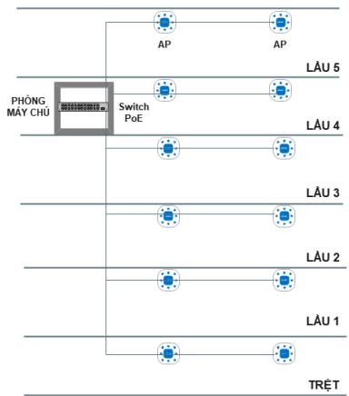

# Public_338

# 1. THÔNG TIN CHUNG

Hệ thống: Hệ thống mạng Wi-Fi Đơn vị: Trụ Sở Chính - Tổng Công ty Cổ phần Bảo Minh Địa điểm triển khai: 26 Tôn Thất Đạm, phường Sài Sòn, TP.HCM

# 2. MỤC ĐÍCH SỬ DỤNG:

Mục đích sử dụng:

Hỗ trợ hoạt động vận hành nội bộ: kết nối mạng cho nhân viên văn phòng, truy cập hệ thống nội bộ vào các ứng dụng Đảm bảo hoạt động họp trực tuyến ổn định (MS Teams, Zoom, ...) Đảm bảo kết nối Internet liên tục phục vụ cho công việc Cung cấp Wi-Fi cho đối tác, khách hàng: giới thiệu sản phẩm bảo hiểm mới, chính sách, quyền lợi bảo hiểm qua trang chào (captive portal).

# 3. YÊU CẦU ĐỐI VỚI HỆ THỐNG MẠNG WI-FI

Danh sách bố trí thiết bị Wi-Fi Access Point (AP):

<table><tr><td rowspan=1 colspan=1>Thiet bi</td><td rowspan=1 colspan=1>T6ng</td><td rowspan=1 colspan=1>Tang Tret</td><td rowspan=1 colspan=1>Tang1</td><td rowspan=1 colspan=1>Tang 2</td><td rowspan=1 colspan=1>Tang 3</td><td rowspan=1 colspan=1>Tang 4</td><td rowspan=1 colspan=1>Tang 5</td></tr><tr><td rowspan=1 colspan=1>AP</td><td rowspan=1 colspan=1>12</td><td rowspan=1 colspan=1>02</td><td rowspan=1 colspan=1>02</td><td rowspan=1 colspan=1>02</td><td rowspan=1 colspan=1>02</td><td rowspan=1 colspan=1>02</td><td rowspan=1 colspan=1>02</td></tr><tr><td rowspan=1 colspan=1>Switch PoE</td><td rowspan=1 colspan=1>01</td><td rowspan=1 colspan=1>0</td><td rowspan=1 colspan=1>0</td><td rowspan=1 colspan=1>0</td><td rowspan=1 colspan=1>0</td><td rowspan=1 colspan=1>01</td><td rowspan=1 colspan=1>0</td></tr></table>

Diễn giải:

- Mỗi tầng $\mathrm { b } \hat { \mathsf { o } } \mathrm { t r i } 0 2$ thiết bị Access Point (AP), tổng là 12 thiết bị AP. Thiết bị Switch PoE lắp đặt tại phòng máy chủ, số lượng 01 bộ.

# 4. YÊU CẦU GIẢI PHÁP

Mô hình hệ thống: Hệ thống Wi-Fi

> **Hình chú thích:** a diagram of the lau and lau2

Yêu cầu chung:

Tần số (2.4GHz, 5GHz/6GHz) - Các chuẩn Wi-Fi: 802.11a/b/g/n/ac/ax (Wi-Fi 6/6E)

- Cơ chế bảo mật tiên tiến: mật khẩu, SSID, bảo mật WPA2/WPA3.

- Yêu cầu hỗ trợ xác thực truy cập: $8 0 2 . 1 X +$ RADIUS cho người dùng nội bộ; captive portal cho khách.

- Có hỗ trợ QoS, MAC Filtering, Port Forwarding - Yêu cầu độ phủ sóng: phủ toàn bộ khu vực làm việc tại các tầng của tòa nhà.

- Yêu cầu có khảo sát và thiết kế heatmap mật độ và cường độ sóng Wi-Fi.

- Yêu cầu có thiết kế hệ thống mạng, VLAN, IP Address cho nhân sự và khách.

- Yêu cầu hiệu suất kết nối: hỗ trợ đồng thời nhiều thiết bị, tối thiểu 75 thiết bị/AP.

- Yêu cầu chuẩn Wi-Fi mới: sử dụng chuẩn Wi-Fi 5 (802.11ac) trở lên, ưu tiên Wi-Fi 6/6E (802.11ax) để tối ưu tải lớn.

Hỗ trợ phân tích tần số/kênh: tránh nhiễu chồng kênh giữa các AP.

- Yêu cầu quản lý tập trung: Controller Wi-Fi hoặc quản lý trên nền tảng cloud.

- Yêu cầu hỗ trợ Captive Portal: có trang chào khi khách hàng kết nối (logo thương hiệu, thông tin, form khảo sát…).

- Phân quyền quản trị viên: theo phân cấp Admin, User, … - Yêu cầu nguồn điện cung cấp cho thiết bị: thiết bị hỗ trợ PoE với mức công suất đủ để đáp ứng năng lực của thiết bị Wi-Fi.

Bảng danh mục thiết bị:

<table><tr><td rowspan=1 colspan=1>STT</td><td rowspan=1 colspan=1>Ten Thiet Bi</td><td rowspan=1 colspan=1>Donvi</td><td rowspan=1 colspan=1>S6Luong</td><td rowspan=1 colspan=1>Ghi chu</td></tr><tr><td rowspan=1 colspan=1></td><td rowspan=1 colspan=1>THIET BI WI-FI</td><td rowspan=1 colspan=1></td><td rowspan=1 colspan=1></td><td rowspan=1 colspan=1></td></tr><tr><td rowspan=1 colspan=1>1</td><td rowspan=1 colspan=1>Thiét bi Access Point (AP):</td><td rowspan=1 colspan=1>Cai</td><td rowspan=1 colspan=1>12</td><td rowspan=2 colspan=1></td></tr><tr><td rowspan=1 colspan=1>2</td><td rowspan=1 colspan=1>Thiét bi chuyén mach Switch PoE:</td><td rowspan=1 colspan=1>Cai</td><td rowspan=1 colspan=1>01</td></tr><tr><td rowspan=1 colspan=1>3</td><td rowspan=1 colspan=1>Phu kien lap dat</td><td rowspan=1 colspan=1>G6i</td><td rowspan=1 colspan=1>01</td><td rowspan=1 colspan=1></td></tr></table>

Giải pháp kỹ thuật:

Cung cấp giải pháp hệ thống Wi-Fi phù hợp với yêu cầu của Bảo Minh, bao gồm:

- Kết quả khảo sát.

Tài liệu giải pháp đề xuất có thể hiện đầy đủ các nội dung:

• Giải pháp tổng thể.   
• Mô tả về công nghệ. Mô tả các chức năng cơ bản và nâng cao của hệ thống. Mô tả sơ đồ kết nối với hệ thống mạng của Bảo Minh. Bố trí vị trí thiết bị. Giản đồ heatmap thể hiện cường độ công suất sóng Wi-Fi theo các băng tần. Danh sách thiết bị. Mô tả biện pháp thi công đảm bảo hạn chế ảnh hưởng đến hoạt động sản xuất kinh doanh của Bảo Minh. Cung cấp đầu mối HTKT.

Tài liệu hướng dẫn cài đặt, sử dụng.

# 5. YÊU CẦU THIẾT BỊ

Yêu cầu:

Thông số kỹ thuật thiết bị có xác nhận của hãng sản xuất.

<table><tr><td>STT</td><td>Ten Thiet Bi</td><td>Thong so ky thuat</td></tr><tr><td>I</td><td colspan="2">THIET B! HE THONG WI-FI</td></tr><tr><td>1</td><td>Thiét bi Access Point (AP)</td><td>Thiet bi Accsess Point (AP): H tro bang tan 802.11ax/n (Wi-Fi 6) MIMO: ≥ 2x2 5GHz/2.4GHz Tóc d@ toi da: ≥ 1.5 Gbps Giao dién: ≥ 1 GbE Base-T S6 luong thiét bi truy cap: ≥ 75 Do loi antenna: ≥ 4.9/5.7 dBi Cong suat phat tói da: ≥ 20 dBm Nguon PoE: ≥ PoE 802.3af (class 3) Lap dat: gan tran, treo tuong</td></tr><tr><td>2</td><td>Thiét bi chuyén mach Switch PoE</td><td>Thiét bi chuyén mach Switch PoE: Thiét bi Switch có giam sat 24 port RJ45 10/100/1000 class 4 PoE 04 SFP/SFP+ Bang thong: ≥ 80 Mpps Dung luong: ≥ 100 Gbps</td></tr><tr><td>II</td><td colspan="2">Cong suat PoE: ≥ 180 Watt VAT TU &amp; NHAN CONG</td></tr></table>

<table><tr><td rowspan=1 colspan=1>1</td><td rowspan=1 colspan=1>Phu kien lap dattu rack</td><td rowspan=1 colspan=1>- Cung cap day du vat tur, cap CAT6 lap dat, phu kien day du.</td></tr><tr><td rowspan=1 colspan=1>2</td><td rowspan=1 colspan=1>Dich vu triénkhai</td><td rowspan=1 colspan=1>- Lap dat- Cai dat, toi uu, nghiém thu, ban giao- Huong dän van hanh hé thóng</td></tr></table>

Ghi chú: cấu hình yêu cầu bên trên là tối thiểu bắt buộc, giải pháp có thể đề xuất tương đương hoặc cao hơn.

# 6. YÊU CẦU PHƯƠNG ÁN THỰC HIỆN

Tiến độ thực hiện

Tổng thời gian thực hiện dự kiến 12 tuần, trong đó:

- Thời gian thực hiện các thủ tục đầu tư, mua sắm: dự kiến 2 tuần. - Thời gian ký hợp đồng và triển khai: dự kiến 11 tuần, trong trường hợp có sẵn hàng hóa thì thời gian triển khai có thể rút ngắn lại. Yêu cầu: Nhà thầu chủ động đề xuất thời gian và tiến độ triển khai nhưng không vượt quá 10 tuần kể từ ngày có hiệu lực hợp đồng triển khai.

Các bước thực hiện chi tiết:

Thực hiện các thủ tục đầu tư.   
Tiến hành ký hợp đồng.   
Nhận bàn giao hàng hóa: giao thiết bị đến Công ty (VPTSC).   
Lắp đặt, cấu hình thiết bị.   
Kiểm tra và nghiệm thu hệ thống:   
• Kiểm tra hoạt động thiết bị. Hướng dẫn sử dụng. Nghiệm thu.

Bàn giao đưa vào sử dụng.

# 7. YÊU CẦU BẢO HÀNH

- Đối với các thiết bị chính: thiết bị mới $100 \%$ , yêu cầu bảo hành tối thiểu 60 tháng (từ ngày nghiệm thu bàn giao đưa vào sử dụng).   
Đối với công tác thi công: yêu cầu bảo hành tối thiểu 12 tháng (từ ngày nghiệm thu bàn giao đưa vào sử dụng).   
- Cam kết hỗ trợ kỹ thuật, bảo hành và cung cấp linh kiện, phụ kiện thay thế trong vòng 05 năm của hãng sản xuất hoặc Trung tâm bảo hành.

8. YÊU CẦU HỒ SƠ

Đơn vị tham gia chào giá cung cấp hệ thống Wi-Fi cần chuẩn bị đầy đủ các loại hồ sơ bao $\mathrm { g } \dot { \hat { \mathrm { o } } } \mathrm { m }$ :

(1). Tư cách hợp lệ của nhà thầu:

Có đăng ký thành lập, hoạt động do cơ quan có thẩm quyền của nước mà nhà thầu đang hoạt động cấp.   
Không đang trong quá trình giải thể; không bị kết luận đang lâm vào tình trạng phá sản hoặc nợ không có khả năng chi trả theo quy định của pháp luật   
Không đang trong thời gian bị cấm tham gia hoạt động đấu thầu theo quy định của pháp luật về đấu thầu.   
Đã đăng ký trên Hệ thống mạng đấu thầu quốc gia và còn hiệu lực hoạt động.   
Giấy chứng nhận đăng ký kinh doanh kiêm mã số thuế.

(2). Năng lực tài chính: Có Báo cáo tài chính đã được kiểm toán trong 03 năm: 2022, 2023, 2024 - Có Bản kê khai năng lực tài chính trong 03 năm: 2022, 2023, 2024

(3). Năng lực kinh nghiệm:

Đã từng tư vấn, triển khai các gói thầu trong lĩnh vực có liên quan: Công trình tiêu biểu trong lĩnh vực điện nhẹ ELV.   
Giấy chứng nhận Hệ thống quản lý chất lượng phù hợp theo tiêu chuẩn TCVN ISO 9001:2015

(4). Năng lực nhân sự

Có đủ các phòng ban chức năng phù hợp với lĩnh vực sản xuất kinh doanh chính.

(5). Năng lực triển khai các dự án - Lĩnh vực: Cung cấp lắp đặt hệ thống điện nhẹ.

Thời gian: từ năm 2020 đến năm 2024 với các hợp đồng/công trình tiêu biểu trong lĩnh vực hệ thống điện nhẹ. giá trị hợp đồng: từ 100.000.000 VNĐ đến 2.000.000.000 VNĐ

(6). Thư quan tâm gói thầu (7). Bảng chào giá

Ghi chú:

- Nhà thầu tham gia chào giá phải khảo sát thực tế trước khi báo giá.

- Đơn giá dự thầu phải được đưa về giá tổng hợp sau thuế (Bao gồm tất cả các chi phí cho việc cung cấp thiết bị, vật tư và triển khai, bàn giao đưa vào sử dụng).
