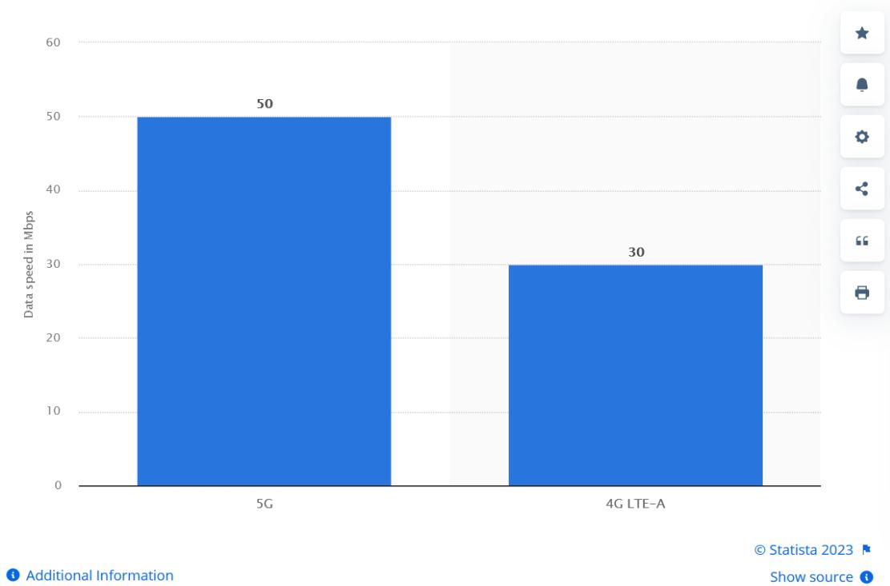

# Public_340

# 1. Tên dự thảo Thông tư

Tên Thông tư: Thông tư Sửa đổi 1:2023 QCVN 81:2019/BTTTT “Quy chuẩn kỹ thuật quốc gia về chất lượng dịch vụ truy nhập Internet trên mạng viễn thông di động mặt đất”.

# 2. Đặt vấn đề

- Về tình hình cung cấp dịch vụ Internet 4G: Mạng thông tin di động mặt đất 4G hiện đã phủ sóng rộng hầu hết khắp các tỉnh, thành trong cả nước. Dịch vụ truy nhập Internet di động 4G đã trở thành dịch vụ phổ biến và được đông đảo khách hàng lựa chọn (theo thống kê của Cục Viễn thông, tính đến tháng 4/2023, số lượng thuê bao băng rộng di động đạt xấp xỉ 84 triệu thuê bao).

- Băng tần đã cấp phép cho các nhà mạng:

- Về thực trạng chất lượng dịch vụ Internet 4G: Tháng 8/2019, Bộ Thông tin và Truyền thông đã ban hành Quy chuẩn kỹ thuật quốc gia QCVN 81:2019/BTTTT “Quy chuẩn kỹ thuật quốc gia về chất lượng dịch vụ truy nhập Internet trên mạng viễn thông di động mặt đất”. Quy chuẩn quy định, các doanh nghiệp cung cấp dịch vụ phải công bố vùng cung cấp dịch vụ dưới dạng bản đồ số và các giá trị tốc độ tải xuống tối thiểu $\mathrm { ( V d \mathrm { _ { m i n } } ) }$ , tốc độ tải xuống trung bình $\mathrm { ( V _ { d } ) }$ , tốc độ tải lên trung bình $\mathrm { ( V _ { u } ) }$ trong vùng cung cấp dịch vụ. Định kỳ hàng quý Cục Viễn thông triển khai đo kiểm chất lượng dịch vụ truy nhập Internet 4G phục vụ công tác quản lý nhà nước về chất lượng dịch vụ để so sánh, đánh giá với mức doanh nghiệp công bố. Giá trị doanh nghiệp hiện đang công bố như sau:

<table>
  
  <tbody>
    <tr>
      <td></td>
      <td></td>
      <td></td>
      <td></td>
      <td></td>
      <td></td>
      <td></td>
      <td></td>
      <td></td>
      <td></td>
      <td></td>
      <td></td>
      <td></td>
      <td></td>
      <td></td>
      <td></td>
      <td></td>
      <td></td>
      <td></td>
      <td></td>
      <td></td>
    </tr>
    <tr>
      <td></td>
      <td></td>
      <td></td>
      <td></td>
      <td></td>
      <td></td>
      <td></td>
      <td></td>
      <td></td>
      <td></td>
      <td></td>
      <td></td>
      <td></td>
      <td></td>
      <td></td>
      <td></td>
      <td></td>
      <td></td>
      <td></td>
      <td></td>
      <td></td>
    </tr>
    <tr>
      <td></td>
      <td></td>
      <td></td>
      <td></td>
      <td></td>
      <td></td>
      <td></td>
      <td></td>
      <td></td>
      <td></td>
      <td></td>
      <td></td>
      <td></td>
      <td></td>
      <td></td>
      <td></td>
      <td></td>
      <td></td>
      <td></td>
      <td></td>
      <td></td>
    </tr>
    <tr>
      <td></td>
      <td></td>
      <td></td>
      <td></td>
      <td></td>
      <td></td>
      <td></td>
      <td></td>
      <td></td>
      <td></td>
      <td></td>
      <td></td>
      <td></td>
      <td></td>
      <td></td>
      <td></td>
      <td></td>
      <td></td>
      <td></td>
      <td></td>
      <td></td>
    </tr>
    <tr>
      <td></td>
      <td></td>
      <td></td>
      <td></td>
      <td></td>
      <td></td>
      <td></td>
      <td></td>
      <td></td>
      <td></td>
      <td></td>
      <td></td>
      <td></td>
      <td></td>
      <td></td>
      <td></td>
      <td></td>
      <td></td>
      <td></td>
      <td></td>
      <td></td>
    </tr>
    <tr>
      <td></td>
      <td></td>
      <td></td>
      <td></td>
      <td></td>
      <td></td>
      <td></td>
      <td></td>
      <td></td>
      <td></td>
      <td></td>
      <td></td>
      <td></td>
      <td></td>
      <td></td>
      <td></td>
      <td></td>
      <td></td>
      <td></td>
      <td></td>
      <td></td>
    </tr>
    <tr>
      <td></td>
      <td></td>
      <td></td>
      <td></td>
      <td></td>
      <td></td>
      <td></td>
      <td></td>
      <td></td>
      <td></td>
      <td></td>
      <td></td>
      <td></td>
      <td></td>
      <td></td>
      <td></td>
      <td></td>
      <td></td>
      <td></td>
      <td></td>
      <td></td>
    </tr>
  </tbody>
</table>

<table>
  
  <tbody>
    <tr>
      <td></td>
      <td></td>
      <td></td>
    </tr>
    <tr>
      <td></td>
      <td></td>
      <td></td>
    </tr>
  </tbody>
</table>

- So sánh tốc độ công bố của doanh nghiệp với tốc độ thực tế theo kết quả đo kiểm của Cục, thống kê (tháng 5/2023) từ công cụ I-speed (Bộ TTTT), công cụ Speedtest (Ookla) đều cho thấy các giá trị tốc độ tải dữ liệu mà doanh nghiệp công bố là rất thấp. Kết quả đo kiểm, thống kê cụ thể như sau:

<table>
  
  <tbody>
    <tr>
      <td></td>
      <td></td>
      <td></td>
      <td></td>
    </tr>
    <tr>
      <td></td>
      <td></td>
      <td></td>
      <td></td>
    </tr>
  </tbody>
</table>

Từ hiện trạng về băng tần được cấp phép (băng tần cho 4G, băng tần cấp phép cho công nghệ 2G, 3G tái sử dụng cho 4G), kết quả đo kiểm định kỳ hàng năm của Cục Viễn thông, tham khảo kết quả đo kiểm của ứng dụng I-speed (Bộ TTTT) và kết quả đo kiểm của ứng dụng Speedtest (Ookla) cho thấy: Doanh nghiệp cam kết giá trị tốc độ tải chỉ bằng khoảng $40 \%$ giá trị tốc độ tải thực tế của mạng lưới. Để thúc đẩy doanh nghiệp nâng cao chất lượng dịch vụ, tăng tính cạnh tranh giữa các doanh nghiệp, tăng thứ hạng quốc tế, thuê bao nhận thức được thực tế chất lượng dịch vụ thì việc tương cường quản lý chất lượng đối với dịch vụ Internet 4G trên cơ sở sửa đổi QCVN 81:2019/BTTTT là cần thiết.

- Nội dung sửa đổi chính: $+ \mathbf { B } \hat { \boldsymbol { 0 } }$ sung quy định tốc độ tối thiểu đối với dịch vụ Internet 4G.

<table>
  
  <tbody>
    <tr>
      <td></td>
      <td></td>
      <td></td>
      <td></td>
      <td></td>
      <td></td>
      <td></td>
      <td></td>
      <td></td>
      <td></td>
      <td></td>
      <td></td>
      <td></td>
      <td></td>
      <td></td>
      <td></td>
      <td></td>
      <td></td>
      <td></td>
      <td></td>
      <td></td>
      <td></td>
      <td></td>
      <td></td>
      <td></td>
      <td></td>
      <td></td>
      <td></td>
      <td></td>
      <td></td>
      <td></td>
      <td></td>
      <td></td>
      <td></td>
      <td></td>
      <td></td>
      <td></td>
      <td></td>
      <td></td>
      <td></td>
    </tr>
    <tr>
      <td></td>
      <td></td>
      <td></td>
      <td></td>
      <td></td>
      <td></td>
      <td></td>
      <td></td>
      <td></td>
      <td></td>
      <td></td>
      <td></td>
      <td></td>
      <td></td>
      <td></td>
      <td></td>
      <td></td>
      <td></td>
      <td></td>
      <td></td>
      <td></td>
      <td></td>
      <td></td>
      <td></td>
      <td></td>
      <td></td>
      <td></td>
      <td></td>
      <td></td>
      <td></td>
      <td></td>
      <td></td>
      <td></td>
      <td></td>
      <td></td>
      <td></td>
      <td></td>
      <td></td>
      <td></td>
      <td></td>
    </tr>
    <tr>
      <td></td>
      <td></td>
      <td></td>
      <td></td>
      <td></td>
      <td></td>
      <td></td>
      <td></td>
      <td></td>
      <td></td>
      <td></td>
      <td></td>
      <td></td>
      <td></td>
      <td></td>
      <td></td>
      <td></td>
      <td></td>
      <td></td>
      <td></td>
      <td></td>
      <td></td>
      <td></td>
      <td></td>
      <td></td>
      <td></td>
      <td></td>
      <td></td>
      <td></td>
      <td></td>
      <td></td>
      <td></td>
      <td></td>
      <td></td>
      <td></td>
      <td></td>
      <td></td>
      <td></td>
      <td></td>
      <td></td>
    </tr>
    <tr>
      <td></td>
      <td></td>
      <td></td>
      <td></td>
      <td></td>
      <td></td>
      <td></td>
      <td></td>
      <td></td>
      <td></td>
      <td></td>
      <td></td>
      <td></td>
      <td></td>
      <td></td>
      <td></td>
      <td></td>
      <td></td>
      <td></td>
      <td></td>
      <td></td>
      <td></td>
      <td></td>
      <td></td>
      <td></td>
      <td></td>
      <td></td>
      <td></td>
      <td></td>
      <td></td>
      <td></td>
      <td></td>
      <td></td>
      <td></td>
      <td></td>
      <td></td>
      <td></td>
      <td></td>
      <td></td>
      <td></td>
    </tr>
    <tr>
      <td></td>
      <td></td>
      <td></td>
      <td></td>
      <td></td>
      <td></td>
      <td></td>
      <td></td>
      <td></td>
      <td></td>
      <td></td>
      <td></td>
      <td></td>
      <td></td>
      <td></td>
      <td></td>
      <td></td>
      <td></td>
      <td></td>
      <td></td>
      <td></td>
      <td></td>
      <td></td>
      <td></td>
      <td></td>
      <td></td>
      <td></td>
      <td></td>
      <td></td>
      <td></td>
      <td></td>
      <td></td>
      <td></td>
      <td></td>
      <td></td>
      <td></td>
      <td></td>
      <td></td>
      <td></td>
      <td></td>
    </tr>
    <tr>
      <td></td>
      <td></td>
      <td></td>
      <td></td>
      <td></td>
      <td></td>
      <td></td>
      <td></td>
      <td></td>
      <td></td>
      <td></td>
      <td></td>
      <td></td>
      <td></td>
      <td></td>
      <td></td>
      <td></td>
      <td></td>
      <td></td>
      <td></td>
      <td></td>
      <td></td>
      <td></td>
      <td></td>
      <td></td>
      <td></td>
      <td></td>
      <td></td>
      <td></td>
      <td></td>
      <td></td>
      <td></td>
      <td></td>
      <td></td>
      <td></td>
      <td></td>
      <td></td>
      <td></td>
      <td></td>
      <td></td>
    </tr>
    <tr>
      <td></td>
      <td></td>
      <td></td>
      <td></td>
      <td></td>
      <td></td>
      <td></td>
      <td></td>
      <td></td>
      <td></td>
      <td></td>
      <td></td>
      <td></td>
      <td></td>
      <td></td>
      <td></td>
      <td></td>
      <td></td>
      <td></td>
      <td></td>
      <td></td>
      <td></td>
      <td></td>
      <td></td>
      <td></td>
      <td></td>
      <td></td>
      <td></td>
      <td></td>
      <td></td>
      <td></td>
      <td></td>
      <td></td>
      <td></td>
      <td></td>
      <td></td>
      <td></td>
      <td></td>
      <td></td>
      <td></td>
    </tr>
    <tr>
      <td></td>
      <td></td>
      <td></td>
      <td></td>
      <td></td>
      <td></td>
      <td></td>
      <td></td>
      <td></td>
      <td></td>
      <td></td>
      <td></td>
      <td></td>
      <td></td>
      <td></td>
      <td></td>
      <td></td>
      <td></td>
      <td></td>
      <td></td>
      <td></td>
      <td></td>
      <td></td>
      <td></td>
      <td></td>
      <td></td>
      <td></td>
      <td></td>
      <td></td>
      <td></td>
      <td></td>
      <td></td>
      <td></td>
      <td></td>
      <td></td>
      <td></td>
      <td></td>
      <td></td>
      <td></td>
      <td></td>
    </tr>
    <tr>
      <td></td>
      <td></td>
      <td></td>
      <td></td>
      <td></td>
      <td></td>
      <td></td>
      <td></td>
      <td></td>
      <td></td>
      <td></td>
      <td></td>
      <td></td>
      <td></td>
      <td></td>
      <td></td>
      <td></td>
      <td></td>
      <td></td>
      <td></td>
      <td></td>
      <td></td>
      <td></td>
      <td></td>
      <td></td>
      <td></td>
      <td></td>
      <td></td>
      <td></td>
      <td></td>
      <td></td>
      <td></td>
      <td></td>
      <td></td>
      <td></td>
      <td></td>
      <td></td>
      <td></td>
      <td></td>
      <td></td>
    </tr>
    <tr>
      <td></td>
      <td></td>
      <td></td>
      <td></td>
      <td></td>
      <td></td>
      <td></td>
      <td></td>
      <td></td>
      <td></td>
      <td></td>
      <td></td>
      <td></td>
      <td></td>
      <td></td>
      <td></td>
      <td></td>
      <td></td>
      <td></td>
      <td></td>
      <td></td>
      <td></td>
      <td></td>
      <td></td>
      <td></td>
      <td></td>
      <td></td>
      <td></td>
      <td></td>
      <td></td>
      <td></td>
      <td></td>
      <td></td>
      <td></td>
      <td></td>
      <td></td>
      <td></td>
      <td></td>
      <td></td>
      <td></td>
    </tr>
    <tr>
      <td></td>
      <td></td>
      <td></td>
      <td></td>
      <td></td>
      <td></td>
      <td></td>
      <td></td>
      <td></td>
      <td></td>
      <td></td>
      <td></td>
      <td></td>
      <td></td>
      <td></td>
      <td></td>
      <td></td>
      <td></td>
      <td></td>
      <td></td>
      <td></td>
      <td></td>
      <td></td>
      <td></td>
      <td></td>
      <td></td>
      <td></td>
      <td></td>
      <td></td>
      <td></td>
      <td></td>
      <td></td>
      <td></td>
      <td></td>
      <td></td>
      <td></td>
      <td></td>
      <td></td>
      <td></td>
      <td></td>
    </tr>
    <tr>
      <td></td>
      <td></td>
      <td></td>
      <td></td>
      <td></td>
      <td></td>
      <td></td>
      <td></td>
      <td></td>
      <td></td>
      <td></td>
      <td></td>
      <td></td>
      <td></td>
      <td></td>
      <td></td>
      <td></td>
      <td></td>
      <td></td>
      <td></td>
      <td></td>
      <td></td>
      <td></td>
      <td></td>
      <td></td>
      <td></td>
      <td></td>
      <td></td>
      <td></td>
      <td></td>
      <td></td>
      <td></td>
      <td></td>
      <td></td>
      <td></td>
      <td></td>
      <td></td>
      <td></td>
      <td></td>
      <td></td>
    </tr>
    <tr>
      <td></td>
      <td></td>
      <td></td>
      <td></td>
      <td></td>
      <td></td>
      <td></td>
      <td></td>
      <td></td>
      <td></td>
      <td></td>
      <td></td>
      <td></td>
      <td></td>
      <td></td>
      <td></td>
      <td></td>
      <td></td>
      <td></td>
      <td></td>
      <td></td>
      <td></td>
      <td></td>
      <td></td>
      <td></td>
      <td></td>
      <td></td>
      <td></td>
      <td></td>
      <td></td>
      <td></td>
      <td></td>
      <td></td>
      <td></td>
      <td></td>
      <td></td>
      <td></td>
      <td></td>
      <td></td>
      <td></td>
    </tr>
    <tr>
      <td></td>
      <td></td>
      <td></td>
      <td></td>
      <td></td>
      <td></td>
      <td></td>
      <td></td>
      <td></td>
      <td></td>
      <td></td>
      <td></td>
      <td></td>
      <td></td>
      <td></td>
      <td></td>
      <td></td>
      <td></td>
      <td></td>
      <td></td>
      <td></td>
      <td></td>
      <td></td>
      <td></td>
      <td></td>
      <td></td>
      <td></td>
      <td></td>
      <td></td>
      <td></td>
      <td></td>
      <td></td>
      <td></td>
      <td></td>
      <td></td>
      <td></td>
      <td></td>
      <td></td>
      <td></td>
      <td></td>
    </tr>
    <tr>
      <td></td>
      <td></td>
      <td></td>
      <td></td>
      <td></td>
      <td></td>
      <td></td>
      <td></td>
      <td></td>
      <td></td>
      <td></td>
      <td></td>
      <td></td>
      <td></td>
      <td></td>
      <td></td>
      <td></td>
      <td></td>
      <td></td>
      <td></td>
      <td></td>
      <td></td>
      <td></td>
      <td></td>
      <td></td>
      <td></td>
      <td></td>
      <td></td>
      <td></td>
      <td></td>
      <td></td>
      <td></td>
      <td></td>
      <td></td>
      <td></td>
      <td></td>
      <td></td>
      <td></td>
      <td></td>
      <td></td>
    </tr>
  </tbody>
</table>

$+ \mathbf { B } \hat { \boldsymbol { 0 } }$ sung quy định tốc độ tối thiểu đối với dịch vụ Internet 3G.

3. Sở cứ sửa đổi QCVN 81:2019/BTTTT

# 3.1 Luật, nghị định, Nghị quyết/ QĐ của Chính phủ, của Bộ (nếu có)

- Nghị quyết của Bộ Chính trị số 52-NQ/TW ngày 27/9/2019 về một số chủ trương, chính sách chủ động tham gia cuộc cách mạng công nghiệp lần thứ tư: “Một số mục tiêu cụ thể đến năm 2025: Duy trì xếp hạng về chỉ số đổi mới sáng tạo toàn cầu (GII) thuộc 3 nước dẫn đầu ASEAN. Xây dựng được hạ tầng số đạt trình độ tiên tiến của khu vực ASEAN; Internet băng thông rộng phủ $100 \%$ các xã. Kinh tế số chiếm khoảng $20 \%$ GDP; năng suất lao động tăng bình quân trên $7 \%$ /năm. Một số mục tiêu cụ thể đến năm 2030: Duy trì xếp hạng về chỉ số Đổi mới sáng tạo toàn cầu (GII) thuộc nhóm 40 nước dẫn đầu thế giới. Mạng di động 5G phủ sóng toàn quốc; mọi người dân được truy cập Internet băng thông rộng với chi phí thấp.

- Nghị quyết số 17/NQ-CP ngày 07/3/2019 của Chính phủ về một số nhiệm vụ, giải pháp trọng tâm phát triển chính phủ điện tử giai đoạn 2019-2020, định hướng đến 2025. Theo đó, để xây dựng nền tảng công nghệ phát triển Chính phủ điện tử phù hợp với xu thế phát triển Chính phủ điện tử trên thế giới cần: “Nghiên cứu, đề xuất giải pháp hỗ trợ doanh nghiệp viễn thông xây dựng và nâng cao năng lực mạng lưới viễn thông của Việt Nam, làm nền tảng phát triển hệ sinh thái số và đáp ứng cho các dịch vụ mới; nâng cao chất lượng dịch vụ, đặc biệt là tốc độ Internet, sử dụng hiệu quả băng tần mạng di động 4G, 5G, mở rộng vùng phủ sóng di động 4G, 5G; nâng cao tốc độ mạng cố định băng rộng; điều chỉnh chính sách khuyến khích nội địa hóa để hỗ trợ sản xuất các sản phẩm nội địa như thiết bị mạng, thiết bị đầu cuối thông minh có giá thành phù hợp với điều kiện Việt Nam để tăng tỷ lệ người sử dụng và khả năng truy cập các thiết bị thông minh”.

- Quyết định 749/QĐ-TTg của Thủ tướng Chính phủ ban hành Chương trình Chuyển đổi số quốc gia đến năm 2025, tầm nhìn 2030, tại mục IV.3 Điều 1 về các giải pháp tạo nền móng chuyển đổi số quy định: “b. Quy hoạch lại băng tần, phát triển hạ tầng mạng di động 5G; nâng cấp mạng di động 4G; sớm thương mại hóa mạng di động 5G; triển khai các giải pháp để phổ cập điện thoại di động thông minh tại Việt Nam; xây dựng quy định và lộ trình yêu cầu tích hợp công nghệ 4G, 5G đối với các sản phẩm điện thoại di động và các thiết bị Internet vạn vật (IoT) được sản xuất và nhập khẩu để lưu thông trên thị trường trong nước”.

- Quyết định 32/2012/QĐ-TTg ngày 27/7/2012 của Thủ tướng Chính phủ về phê duyệt quy hoạch phát triển viễn thông quốc gia đến năm 2020, tại Khoản 4 Mục II về định hướng phát triển công nghệ “Từ năm 2020 xem xét việc sắp xếp lại các băng tần hiện dùng cho hệ thống thông tin di động thế hệ thứ 2, phát thanh, truyền hình tương tự mặt đất để sử dụng cho hệ thống thông tin di động thế hệ tiếp theo”.

<table>
  
  <tbody>
    <tr>
      <td></td>
      <td></td>
      <td></td>
      <td></td>
      <td></td>
      <td></td>
      <td></td>
      <td></td>
      <td></td>
      <td></td>
      <td></td>
      <td></td>
      <td></td>
      <td></td>
      <td></td>
      <td></td>
      <td></td>
      <td></td>
      <td></td>
      <td></td>
      <td></td>
      <td></td>
      <td></td>
      <td></td>
      <td></td>
      <td></td>
      <td></td>
      <td></td>
      <td></td>
      <td></td>
      <td></td>
      <td></td>
      <td></td>
      <td></td>
      <td></td>
      <td></td>
      <td></td>
      <td></td>
      <td></td>
      <td></td>
      <td></td>
      <td></td>
    </tr>
    <tr>
      <td></td>
      <td></td>
      <td></td>
      <td></td>
      <td></td>
      <td></td>
      <td></td>
      <td></td>
      <td></td>
      <td></td>
      <td></td>
      <td></td>
      <td></td>
      <td></td>
      <td></td>
      <td></td>
      <td></td>
      <td></td>
      <td></td>
      <td></td>
      <td></td>
      <td></td>
      <td></td>
      <td></td>
      <td></td>
      <td></td>
      <td></td>
      <td></td>
      <td></td>
      <td></td>
      <td></td>
      <td></td>
      <td></td>
      <td></td>
      <td></td>
      <td></td>
      <td></td>
      <td></td>
      <td></td>
      <td></td>
      <td></td>
      <td></td>
    </tr>
    <tr>
      <td></td>
      <td></td>
      <td></td>
      <td></td>
      <td></td>
      <td></td>
      <td></td>
      <td></td>
      <td></td>
      <td></td>
      <td></td>
      <td></td>
      <td></td>
      <td></td>
      <td></td>
      <td></td>
      <td></td>
      <td></td>
      <td></td>
      <td></td>
      <td></td>
      <td></td>
      <td></td>
      <td></td>
      <td></td>
      <td></td>
      <td></td>
      <td></td>
      <td></td>
      <td></td>
      <td></td>
      <td></td>
      <td></td>
      <td></td>
      <td></td>
      <td></td>
      <td></td>
      <td></td>
      <td></td>
      <td></td>
      <td></td>
      <td></td>
    </tr>
    <tr>
      <td></td>
      <td></td>
      <td></td>
      <td></td>
      <td></td>
      <td></td>
      <td></td>
      <td></td>
      <td></td>
      <td></td>
      <td></td>
      <td></td>
      <td></td>
      <td></td>
      <td></td>
      <td></td>
      <td></td>
      <td></td>
      <td></td>
      <td></td>
      <td></td>
      <td></td>
      <td></td>
      <td></td>
      <td></td>
      <td></td>
      <td></td>
      <td></td>
      <td></td>
      <td></td>
      <td></td>
      <td></td>
      <td></td>
      <td></td>
      <td></td>
      <td></td>
      <td></td>
      <td></td>
      <td></td>
      <td></td>
      <td></td>
      <td></td>
    </tr>
    <tr>
      <td></td>
      <td></td>
      <td></td>
      <td></td>
      <td></td>
      <td></td>
      <td></td>
      <td></td>
      <td></td>
      <td></td>
      <td></td>
      <td></td>
      <td></td>
      <td></td>
      <td></td>
      <td></td>
      <td></td>
      <td></td>
      <td></td>
      <td></td>
      <td></td>
      <td></td>
      <td></td>
      <td></td>
      <td></td>
      <td></td>
      <td></td>
      <td></td>
      <td></td>
      <td></td>
      <td></td>
      <td></td>
      <td></td>
      <td></td>
      <td></td>
      <td></td>
      <td></td>
      <td></td>
      <td></td>
      <td></td>
      <td></td>
      <td></td>
    </tr>
    <tr>
      <td></td>
      <td></td>
      <td></td>
      <td></td>
      <td></td>
      <td></td>
      <td></td>
      <td></td>
      <td></td>
      <td></td>
      <td></td>
      <td></td>
      <td></td>
      <td></td>
      <td></td>
      <td></td>
      <td></td>
      <td></td>
      <td></td>
      <td></td>
      <td></td>
      <td></td>
      <td></td>
      <td></td>
      <td></td>
      <td></td>
      <td></td>
      <td></td>
      <td></td>
      <td></td>
      <td></td>
      <td></td>
      <td></td>
      <td></td>
      <td></td>
      <td></td>
      <td></td>
      <td></td>
      <td></td>
      <td></td>
      <td></td>
      <td></td>
    </tr>
    <tr>
      <td></td>
      <td></td>
      <td></td>
      <td></td>
      <td></td>
      <td></td>
      <td></td>
      <td></td>
      <td></td>
      <td></td>
      <td></td>
      <td></td>
      <td></td>
      <td></td>
      <td></td>
      <td></td>
      <td></td>
      <td></td>
      <td></td>
      <td></td>
      <td></td>
      <td></td>
      <td></td>
      <td></td>
      <td></td>
      <td></td>
      <td></td>
      <td></td>
      <td></td>
      <td></td>
      <td></td>
      <td></td>
      <td></td>
      <td></td>
      <td></td>
      <td></td>
      <td></td>
      <td></td>
      <td></td>
      <td></td>
      <td></td>
      <td></td>
    </tr>
    <tr>
      <td></td>
      <td></td>
      <td></td>
      <td></td>
      <td></td>
      <td></td>
      <td></td>
      <td></td>
      <td></td>
      <td></td>
      <td></td>
      <td></td>
      <td></td>
      <td></td>
      <td></td>
      <td></td>
      <td></td>
      <td></td>
      <td></td>
      <td></td>
      <td></td>
      <td></td>
      <td></td>
      <td></td>
      <td></td>
      <td></td>
      <td></td>
      <td></td>
      <td></td>
      <td></td>
      <td></td>
      <td></td>
      <td></td>
      <td></td>
      <td></td>
      <td></td>
      <td></td>
      <td></td>
      <td></td>
      <td></td>
      <td></td>
      <td></td>
    </tr>
    <tr>
      <td></td>
      <td></td>
      <td></td>
      <td></td>
      <td></td>
      <td></td>
      <td></td>
      <td></td>
      <td></td>
      <td></td>
      <td></td>
      <td></td>
      <td></td>
      <td></td>
      <td></td>
      <td></td>
      <td></td>
      <td></td>
      <td></td>
      <td></td>
      <td></td>
      <td></td>
      <td></td>
      <td></td>
      <td></td>
      <td></td>
      <td></td>
      <td></td>
      <td></td>
      <td></td>
      <td></td>
      <td></td>
      <td></td>
      <td></td>
      <td></td>
      <td></td>
      <td></td>
      <td></td>
      <td></td>
      <td></td>
      <td></td>
      <td></td>
    </tr>
    <tr>
      <td></td>
      <td></td>
      <td></td>
      <td></td>
      <td></td>
      <td></td>
      <td></td>
      <td></td>
      <td></td>
      <td></td>
      <td></td>
      <td></td>
      <td></td>
      <td></td>
      <td></td>
      <td></td>
      <td></td>
      <td></td>
      <td></td>
      <td></td>
      <td></td>
      <td></td>
      <td></td>
      <td></td>
      <td></td>
      <td></td>
      <td></td>
      <td></td>
      <td></td>
      <td></td>
      <td></td>
      <td></td>
      <td></td>
      <td></td>
      <td></td>
      <td></td>
      <td></td>
      <td></td>
      <td></td>
      <td></td>
      <td></td>
      <td></td>
    </tr>
    <tr>
      <td></td>
      <td></td>
      <td></td>
      <td></td>
      <td></td>
      <td></td>
      <td></td>
      <td></td>
      <td></td>
      <td></td>
      <td></td>
      <td></td>
      <td></td>
      <td></td>
      <td></td>
      <td></td>
      <td></td>
      <td></td>
      <td></td>
      <td></td>
      <td></td>
      <td></td>
      <td></td>
      <td></td>
      <td></td>
      <td></td>
      <td></td>
      <td></td>
      <td></td>
      <td></td>
      <td></td>
      <td></td>
      <td></td>
      <td></td>
      <td></td>
      <td></td>
      <td></td>
      <td></td>
      <td></td>
      <td></td>
      <td></td>
      <td></td>
    </tr>
    <tr>
      <td></td>
      <td></td>
      <td></td>
      <td></td>
      <td></td>
      <td></td>
      <td></td>
      <td></td>
      <td></td>
      <td></td>
      <td></td>
      <td></td>
      <td></td>
      <td></td>
      <td></td>
      <td></td>
      <td></td>
      <td></td>
      <td></td>
      <td></td>
      <td></td>
      <td></td>
      <td></td>
      <td></td>
      <td></td>
      <td></td>
      <td></td>
      <td></td>
      <td></td>
      <td></td>
      <td></td>
      <td></td>
      <td></td>
      <td></td>
      <td></td>
      <td></td>
      <td></td>
      <td></td>
      <td></td>
      <td></td>
      <td></td>
      <td></td>
    </tr>
    <tr>
      <td></td>
      <td></td>
      <td></td>
      <td></td>
      <td></td>
      <td></td>
      <td></td>
      <td></td>
      <td></td>
      <td></td>
      <td></td>
      <td></td>
      <td></td>
      <td></td>
      <td></td>
      <td></td>
      <td></td>
      <td></td>
      <td></td>
      <td></td>
      <td></td>
      <td></td>
      <td></td>
      <td></td>
      <td></td>
      <td></td>
      <td></td>
      <td></td>
      <td></td>
      <td></td>
      <td></td>
      <td></td>
      <td></td>
      <td></td>
      <td></td>
      <td></td>
      <td></td>
      <td></td>
      <td></td>
      <td></td>
      <td></td>
      <td></td>
    </tr>
    <tr>
      <td></td>
      <td></td>
      <td></td>
      <td></td>
      <td></td>
      <td></td>
      <td></td>
      <td></td>
      <td></td>
      <td></td>
      <td></td>
      <td></td>
      <td></td>
      <td></td>
      <td></td>
      <td></td>
      <td></td>
      <td></td>
      <td></td>
      <td></td>
      <td></td>
      <td></td>
      <td></td>
      <td></td>
      <td></td>
      <td></td>
      <td></td>
      <td></td>
      <td></td>
      <td></td>
      <td></td>
      <td></td>
      <td></td>
      <td></td>
      <td></td>
      <td></td>
      <td></td>
      <td></td>
      <td></td>
      <td></td>
      <td></td>
      <td></td>
    </tr>
    <tr>
      <td></td>
      <td></td>
      <td></td>
      <td></td>
      <td></td>
      <td></td>
      <td></td>
      <td></td>
      <td></td>
      <td></td>
      <td></td>
      <td></td>
      <td></td>
      <td></td>
      <td></td>
      <td></td>
      <td></td>
      <td></td>
      <td></td>
      <td></td>
      <td></td>
      <td></td>
      <td></td>
      <td></td>
      <td></td>
      <td></td>
      <td></td>
      <td></td>
      <td></td>
      <td></td>
      <td></td>
      <td></td>
      <td></td>
      <td></td>
      <td></td>
      <td></td>
      <td></td>
      <td></td>
      <td></td>
      <td></td>
      <td></td>
      <td></td>
    </tr>
    <tr>
      <td></td>
      <td></td>
      <td></td>
      <td></td>
      <td></td>
      <td></td>
      <td></td>
      <td></td>
      <td></td>
      <td></td>
      <td></td>
      <td></td>
      <td></td>
      <td></td>
      <td></td>
      <td></td>
      <td></td>
      <td></td>
      <td></td>
      <td></td>
      <td></td>
      <td></td>
      <td></td>
      <td></td>
      <td></td>
      <td></td>
      <td></td>
      <td></td>
      <td></td>
      <td></td>
      <td></td>
      <td></td>
      <td></td>
      <td></td>
      <td></td>
      <td></td>
      <td></td>
      <td></td>
      <td></td>
      <td></td>
      <td></td>
      <td></td>
    </tr>
    <tr>
      <td></td>
      <td></td>
      <td></td>
      <td></td>
      <td></td>
      <td></td>
      <td></td>
      <td></td>
      <td></td>
      <td></td>
      <td></td>
      <td></td>
      <td></td>
      <td></td>
      <td></td>
      <td></td>
      <td></td>
      <td></td>
      <td></td>
      <td></td>
      <td></td>
      <td></td>
      <td></td>
      <td></td>
      <td></td>
      <td></td>
      <td></td>
      <td></td>
      <td></td>
      <td></td>
      <td></td>
      <td></td>
      <td></td>
      <td></td>
      <td></td>
      <td></td>
      <td></td>
      <td></td>
      <td></td>
      <td></td>
      <td></td>
      <td></td>
    </tr>
    <tr>
      <td></td>
      <td></td>
      <td></td>
      <td></td>
      <td></td>
      <td></td>
      <td></td>
      <td></td>
      <td></td>
      <td></td>
      <td></td>
      <td></td>
      <td></td>
      <td></td>
      <td></td>
      <td></td>
      <td></td>
      <td></td>
      <td></td>
      <td></td>
      <td></td>
      <td></td>
      <td></td>
      <td></td>
      <td></td>
      <td></td>
      <td></td>
      <td></td>
      <td></td>
      <td></td>
      <td></td>
      <td></td>
      <td></td>
      <td></td>
      <td></td>
      <td></td>
      <td></td>
      <td></td>
      <td></td>
      <td></td>
      <td></td>
      <td></td>
    </tr>
    <tr>
      <td></td>
      <td></td>
      <td></td>
      <td></td>
      <td></td>
      <td></td>
      <td></td>
      <td></td>
      <td></td>
      <td></td>
      <td></td>
      <td></td>
      <td></td>
      <td></td>
      <td></td>
      <td></td>
      <td></td>
      <td></td>
      <td></td>
      <td></td>
      <td></td>
      <td></td>
      <td></td>
      <td></td>
      <td></td>
      <td></td>
      <td></td>
      <td></td>
      <td></td>
      <td></td>
      <td></td>
      <td></td>
      <td></td>
      <td></td>
      <td></td>
      <td></td>
      <td></td>
      <td></td>
      <td></td>
      <td></td>
      <td></td>
      <td></td>
    </tr>
  </tbody>
</table>

- Theo Quy hoạch Phổ tần số quốc gia tại Quyết định 71/2013/QĐ-TTg, được sửa đổi bởi các quyết định 02/2017/QĐ-TTg, quyết định 38/2021/QĐ-TTg, các băng 900/1900MHZ được dành cho Hệ thống IMT, cụ thể tại Phụ lục Quyết định 02/2017/QĐ-TTg: “VTN8: Các băng tần 806-845 MHz; 851-915 MHz; 925-960 MHz; 1710-1785 MHz và 1805-1880 MHz được dành cho các hệ thống thông tin di động IMT. Trong trường hợp cần thiết, cơ quan quản lý sẽ điều chỉnh các đoạn băng tần cụ thể trong các quy hoạch băng tần có liên quan. Không phát triển mới hệ thống vô tuyến điện thuộc nghiệp vụ Cố định, Di động trên băng tần 806-824 MHz, 851-869 MHz. Các tổ chức, cá nhân hiện đang sử dụng các hệ thống vô tuyến điện hoạt động trong băng tần 806-824 MHz, 851-869 MHz phải có kế hoạch chuyển đổi theo thông báo của Bộ Thông tin và Truyền thông. Riêng các hệ thống phục vụ mục đích an ninh được tiếp tục sử dụng các băng tần 806-821 MHz, 851- 866 MHz đến khi có hệ thống thay thế”.

- Luật Viễn thông Điều 35, Điều 36 quy định về nguyên tắc và điều kiện cấp giấy phép kinh doanh dịch vụ viễn thông quy định việc cấp, cấp mới giấy phép viễn thông trong trường hợp có liên quan đến sử dụng tài nguyên viễn thông thì chỉ được xét cấp phép nếu việc phân bổ tài nguyên viễn thông là khả thi, theo đúng quy hoạch được phê duyệt.

# 3.2 Nghiên cứu quy định/hiện trạng quốc tế liên quan đến tốc độ Internet băng rộng di động

- Hướng dẫn của ITU: Quản lý chất lượng dịch vụ thông thường dựa trên việc tiêu chuẩn hóa, thiết lập các chỉ tiêu đặc trưng, quan trọng đối với dịch vụ cần quản lý. Theo thống kê của ITU, $82 \%$ trong tổng số 193 nước1 đo kiểm QoS với các chỉ tiêu phổ biến như Mức tín hiệu vô tuyến, Tốc độ tải lên, tải xuống, Trễ truy nhập dịch vụ…

- Một số quốc gia Châu Âu: Tổ chức các nhà quản lý thông tin điện tử của Châu Âu (BEREC) đã ban hành Hướng dẫn về quản lý chất lượng dịch vụ trong đó có quản lý chất lượng Internet, đặc biệt là khía cạnh quản lý lưu lượng của các ISP. Việc quản lý lưu lượng của các ISP phân loại theo các nhóm khác nhau, mỗi nhóm là tập hợp các dịch vụ, ứng dụng có yêu cầu về QoS tương đương nhau. ISP trong quản lý lưu lượng có thể được áp dụng các biện pháp khác nhau giữa các nhóm nhưng trong cùng một nhóm thì không phân biệt đối xử. ISP không được chặn, làm giảm tốc độ một ứng dụng, dịch vụ cụ thể. Theo khảo sát của $\mathrm { E C C } ^ { 2 }$ , một số quốc gia châu Âu có quy định về tốc độ tải dữ liệu đối với từng công nghệ khi cấp phép băng tần, cụ thể Đảo Crypus (30 Mbit/s), Cộng hòa Czech (5 Mbit/s), Iceland (10 Mbit/s), Ý (2 Mbit/s), Lithuania (4 Mbit/s), Na Uy (2 Mbit/s).

<table>
  
  <tbody>
    <tr>
      <td></td>
      <td></td>
      <td></td>
      <td></td>
      <td></td>
      <td></td>
      <td></td>
      <td></td>
      <td></td>
      <td></td>
      <td></td>
      <td></td>
      <td></td>
      <td></td>
      <td></td>
      <td></td>
      <td></td>
      <td></td>
      <td></td>
      <td></td>
      <td></td>
      <td></td>
      <td></td>
      <td></td>
      <td></td>
      <td></td>
      <td></td>
      <td></td>
      <td></td>
      <td></td>
      <td></td>
      <td></td>
      <td></td>
      <td></td>
      <td></td>
      <td></td>
      <td></td>
      <td></td>
      <td></td>
      <td></td>
      <td></td>
      <td></td>
    </tr>
    <tr>
      <td></td>
      <td></td>
      <td></td>
      <td></td>
      <td></td>
      <td></td>
      <td></td>
      <td></td>
      <td></td>
      <td></td>
      <td></td>
      <td></td>
      <td></td>
      <td></td>
      <td></td>
      <td></td>
      <td></td>
      <td></td>
      <td></td>
      <td></td>
      <td></td>
      <td></td>
      <td></td>
      <td></td>
      <td></td>
      <td></td>
      <td></td>
      <td></td>
      <td></td>
      <td></td>
      <td></td>
      <td></td>
      <td></td>
      <td></td>
      <td></td>
      <td></td>
      <td></td>
      <td></td>
      <td></td>
      <td></td>
      <td></td>
      <td></td>
    </tr>
    <tr>
      <td></td>
      <td></td>
      <td></td>
      <td></td>
      <td></td>
      <td></td>
      <td></td>
      <td></td>
      <td></td>
      <td></td>
      <td></td>
      <td></td>
      <td></td>
      <td></td>
      <td></td>
      <td></td>
      <td></td>
      <td></td>
      <td></td>
      <td></td>
      <td></td>
      <td></td>
      <td></td>
      <td></td>
      <td></td>
      <td></td>
      <td></td>
      <td></td>
      <td></td>
      <td></td>
      <td></td>
      <td></td>
      <td></td>
      <td></td>
      <td></td>
      <td></td>
      <td></td>
      <td></td>
      <td></td>
      <td></td>
      <td></td>
      <td></td>
    </tr>
    <tr>
      <td></td>
      <td></td>
      <td></td>
      <td></td>
      <td></td>
      <td></td>
      <td></td>
      <td></td>
      <td></td>
      <td></td>
      <td></td>
      <td></td>
      <td></td>
      <td></td>
      <td></td>
      <td></td>
      <td></td>
      <td></td>
      <td></td>
      <td></td>
      <td></td>
      <td></td>
      <td></td>
      <td></td>
      <td></td>
      <td></td>
      <td></td>
      <td></td>
      <td></td>
      <td></td>
      <td></td>
      <td></td>
      <td></td>
      <td></td>
      <td></td>
      <td></td>
      <td></td>
      <td></td>
      <td></td>
      <td></td>
      <td></td>
      <td></td>
    </tr>
    <tr>
      <td></td>
      <td></td>
      <td></td>
      <td></td>
      <td></td>
      <td></td>
      <td></td>
      <td></td>
      <td></td>
      <td></td>
      <td></td>
      <td></td>
      <td></td>
      <td></td>
      <td></td>
      <td></td>
      <td></td>
      <td></td>
      <td></td>
      <td></td>
      <td></td>
      <td></td>
      <td></td>
      <td></td>
      <td></td>
      <td></td>
      <td></td>
      <td></td>
      <td></td>
      <td></td>
      <td></td>
      <td></td>
      <td></td>
      <td></td>
      <td></td>
      <td></td>
      <td></td>
      <td></td>
      <td></td>
      <td></td>
      <td></td>
      <td></td>
    </tr>
    <tr>
      <td></td>
      <td></td>
      <td></td>
      <td></td>
      <td></td>
      <td></td>
      <td></td>
      <td></td>
      <td></td>
      <td></td>
      <td></td>
      <td></td>
      <td></td>
      <td></td>
      <td></td>
      <td></td>
      <td></td>
      <td></td>
      <td></td>
      <td></td>
      <td></td>
      <td></td>
      <td></td>
      <td></td>
      <td></td>
      <td></td>
      <td></td>
      <td></td>
      <td></td>
      <td></td>
      <td></td>
      <td></td>
      <td></td>
      <td></td>
      <td></td>
      <td></td>
      <td></td>
      <td></td>
      <td></td>
      <td></td>
      <td></td>
      <td></td>
    </tr>
    <tr>
      <td></td>
      <td></td>
      <td></td>
      <td></td>
      <td></td>
      <td></td>
      <td></td>
      <td></td>
      <td></td>
      <td></td>
      <td></td>
      <td></td>
      <td></td>
      <td></td>
      <td></td>
      <td></td>
      <td></td>
      <td></td>
      <td></td>
      <td></td>
      <td></td>
      <td></td>
      <td></td>
      <td></td>
      <td></td>
      <td></td>
      <td></td>
      <td></td>
      <td></td>
      <td></td>
      <td></td>
      <td></td>
      <td></td>
      <td></td>
      <td></td>
      <td></td>
      <td></td>
      <td></td>
      <td></td>
      <td></td>
      <td></td>
      <td></td>
    </tr>
    <tr>
      <td></td>
      <td></td>
      <td></td>
      <td></td>
      <td></td>
      <td></td>
      <td></td>
      <td></td>
      <td></td>
      <td></td>
      <td></td>
      <td></td>
      <td></td>
      <td></td>
      <td></td>
      <td></td>
      <td></td>
      <td></td>
      <td></td>
      <td></td>
      <td></td>
      <td></td>
      <td></td>
      <td></td>
      <td></td>
      <td></td>
      <td></td>
      <td></td>
      <td></td>
      <td></td>
      <td></td>
      <td></td>
      <td></td>
      <td></td>
      <td></td>
      <td></td>
      <td></td>
      <td></td>
      <td></td>
      <td></td>
      <td></td>
      <td></td>
    </tr>
    <tr>
      <td></td>
      <td></td>
      <td></td>
      <td></td>
      <td></td>
      <td></td>
      <td></td>
      <td></td>
      <td></td>
      <td></td>
      <td></td>
      <td></td>
      <td></td>
      <td></td>
      <td></td>
      <td></td>
      <td></td>
      <td></td>
      <td></td>
      <td></td>
      <td></td>
      <td></td>
      <td></td>
      <td></td>
      <td></td>
      <td></td>
      <td></td>
      <td></td>
      <td></td>
      <td></td>
      <td></td>
      <td></td>
      <td></td>
      <td></td>
      <td></td>
      <td></td>
      <td></td>
      <td></td>
      <td></td>
      <td></td>
      <td></td>
      <td></td>
    </tr>
    <tr>
      <td></td>
      <td></td>
      <td></td>
      <td></td>
      <td></td>
      <td></td>
      <td></td>
      <td></td>
      <td></td>
      <td></td>
      <td></td>
      <td></td>
      <td></td>
      <td></td>
      <td></td>
      <td></td>
      <td></td>
      <td></td>
      <td></td>
      <td></td>
      <td></td>
      <td></td>
      <td></td>
      <td></td>
      <td></td>
      <td></td>
      <td></td>
      <td></td>
      <td></td>
      <td></td>
      <td></td>
      <td></td>
      <td></td>
      <td></td>
      <td></td>
      <td></td>
      <td></td>
      <td></td>
      <td></td>
      <td></td>
      <td></td>
      <td></td>
    </tr>
    <tr>
      <td></td>
      <td></td>
      <td></td>
      <td></td>
      <td></td>
      <td></td>
      <td></td>
      <td></td>
      <td></td>
      <td></td>
      <td></td>
      <td></td>
      <td></td>
      <td></td>
      <td></td>
      <td></td>
      <td></td>
      <td></td>
      <td></td>
      <td></td>
      <td></td>
      <td></td>
      <td></td>
      <td></td>
      <td></td>
      <td></td>
      <td></td>
      <td></td>
      <td></td>
      <td></td>
      <td></td>
      <td></td>
      <td></td>
      <td></td>
      <td></td>
      <td></td>
      <td></td>
      <td></td>
      <td></td>
      <td></td>
      <td></td>
      <td></td>
    </tr>
    <tr>
      <td></td>
      <td></td>
      <td></td>
      <td></td>
      <td></td>
      <td></td>
      <td></td>
      <td></td>
      <td></td>
      <td></td>
      <td></td>
      <td></td>
      <td></td>
      <td></td>
      <td></td>
      <td></td>
      <td></td>
      <td></td>
      <td></td>
      <td></td>
      <td></td>
      <td></td>
      <td></td>
      <td></td>
      <td></td>
      <td></td>
      <td></td>
      <td></td>
      <td></td>
      <td></td>
      <td></td>
      <td></td>
      <td></td>
      <td></td>
      <td></td>
      <td></td>
      <td></td>
      <td></td>
      <td></td>
      <td></td>
      <td></td>
      <td></td>
    </tr>
    <tr>
      <td></td>
      <td></td>
      <td></td>
      <td></td>
      <td></td>
      <td></td>
      <td></td>
      <td></td>
      <td></td>
      <td></td>
      <td></td>
      <td></td>
      <td></td>
      <td></td>
      <td></td>
      <td></td>
      <td></td>
      <td></td>
      <td></td>
      <td></td>
      <td></td>
      <td></td>
      <td></td>
      <td></td>
      <td></td>
      <td></td>
      <td></td>
      <td></td>
      <td></td>
      <td></td>
      <td></td>
      <td></td>
      <td></td>
      <td></td>
      <td></td>
      <td></td>
      <td></td>
      <td></td>
      <td></td>
      <td></td>
      <td></td>
      <td></td>
    </tr>
    <tr>
      <td></td>
      <td></td>
      <td></td>
      <td></td>
      <td></td>
      <td></td>
      <td></td>
      <td></td>
      <td></td>
      <td></td>
      <td></td>
      <td></td>
      <td></td>
      <td></td>
      <td></td>
      <td></td>
      <td></td>
      <td></td>
      <td></td>
      <td></td>
      <td></td>
      <td></td>
      <td></td>
      <td></td>
      <td></td>
      <td></td>
      <td></td>
      <td></td>
      <td></td>
      <td></td>
      <td></td>
      <td></td>
      <td></td>
      <td></td>
      <td></td>
      <td></td>
      <td></td>
      <td></td>
      <td></td>
      <td></td>
      <td></td>
      <td></td>
    </tr>
    <tr>
      <td></td>
      <td></td>
      <td></td>
      <td></td>
      <td></td>
      <td></td>
      <td></td>
      <td></td>
      <td></td>
      <td></td>
      <td></td>
      <td></td>
      <td></td>
      <td></td>
      <td></td>
      <td></td>
      <td></td>
      <td></td>
      <td></td>
      <td></td>
      <td></td>
      <td></td>
      <td></td>
      <td></td>
      <td></td>
      <td></td>
      <td></td>
      <td></td>
      <td></td>
      <td></td>
      <td></td>
      <td></td>
      <td></td>
      <td></td>
      <td></td>
      <td></td>
      <td></td>
      <td></td>
      <td></td>
      <td></td>
      <td></td>
      <td></td>
    </tr>
    <tr>
      <td></td>
      <td></td>
      <td></td>
      <td></td>
      <td></td>
      <td></td>
      <td></td>
      <td></td>
      <td></td>
      <td></td>
      <td></td>
      <td></td>
      <td></td>
      <td></td>
      <td></td>
      <td></td>
      <td></td>
      <td></td>
      <td></td>
      <td></td>
      <td></td>
      <td></td>
      <td></td>
      <td></td>
      <td></td>
      <td></td>
      <td></td>
      <td></td>
      <td></td>
      <td></td>
      <td></td>
      <td></td>
      <td></td>
      <td></td>
      <td></td>
      <td></td>
      <td></td>
      <td></td>
      <td></td>
      <td></td>
      <td></td>
      <td></td>
    </tr>
    <tr>
      <td></td>
      <td></td>
      <td></td>
      <td></td>
      <td></td>
      <td></td>
      <td></td>
      <td></td>
      <td></td>
      <td></td>
      <td></td>
      <td></td>
      <td></td>
      <td></td>
      <td></td>
      <td></td>
      <td></td>
      <td></td>
      <td></td>
      <td></td>
      <td></td>
      <td></td>
      <td></td>
      <td></td>
      <td></td>
      <td></td>
      <td></td>
      <td></td>
      <td></td>
      <td></td>
      <td></td>
      <td></td>
      <td></td>
      <td></td>
      <td></td>
      <td></td>
      <td></td>
      <td></td>
      <td></td>
      <td></td>
      <td></td>
      <td></td>
    </tr>
    <tr>
      <td></td>
      <td></td>
      <td></td>
      <td></td>
      <td></td>
      <td></td>
      <td></td>
      <td></td>
      <td></td>
      <td></td>
      <td></td>
      <td></td>
      <td></td>
      <td></td>
      <td></td>
      <td></td>
      <td></td>
      <td></td>
      <td></td>
      <td></td>
      <td></td>
      <td></td>
      <td></td>
      <td></td>
      <td></td>
      <td></td>
      <td></td>
      <td></td>
      <td></td>
      <td></td>
      <td></td>
      <td></td>
      <td></td>
      <td></td>
      <td></td>
      <td></td>
      <td></td>
      <td></td>
      <td></td>
      <td></td>
      <td></td>
      <td></td>
    </tr>
    <tr>
      <td></td>
      <td></td>
      <td></td>
      <td></td>
      <td></td>
      <td></td>
      <td></td>
      <td></td>
      <td></td>
      <td></td>
      <td></td>
      <td></td>
      <td></td>
      <td></td>
      <td></td>
      <td></td>
      <td></td>
      <td></td>
      <td></td>
      <td></td>
      <td></td>
      <td></td>
      <td></td>
      <td></td>
      <td></td>
      <td></td>
      <td></td>
      <td></td>
      <td></td>
      <td></td>
      <td></td>
      <td></td>
      <td></td>
      <td></td>
      <td></td>
      <td></td>
      <td></td>
      <td></td>
      <td></td>
      <td></td>
      <td></td>
      <td></td>
    </tr>
    <tr>
      <td></td>
      <td></td>
      <td></td>
      <td></td>
      <td></td>
      <td></td>
      <td></td>
      <td></td>
      <td></td>
      <td></td>
      <td></td>
      <td></td>
      <td></td>
      <td></td>
      <td></td>
      <td></td>
      <td></td>
      <td></td>
      <td></td>
      <td></td>
      <td></td>
      <td></td>
      <td></td>
      <td></td>
      <td></td>
      <td></td>
      <td></td>
      <td></td>
      <td></td>
      <td></td>
      <td></td>
      <td></td>
      <td></td>
      <td></td>
      <td></td>
      <td></td>
      <td></td>
      <td></td>
      <td></td>
      <td></td>
      <td></td>
      <td></td>
    </tr>
  </tbody>
</table>

- FCC – Mỹ: Cơ quan quản lý Viễn thông FCC (Mỹ) quy định tốc độ tải tối thiểu download là 25 Mbit; upload là: 3 Mbit/s. Tuy quy định như vậy nhưng từ hoạt động online thực tế của người dùng, FCC có quan điểm như sau: Tốc độ tối thiểu cần bóc tách để tương đồng với mỗi hoạt động trên Internet, theo đó: 25 Mbit/s là Tốc độ tối thiểu đối với hoạt động online ngày này, gồm Làm việc từ xa (Telecommuting) và online video (Streaming Ultra HD 4K Video).

- Thái Lan: Yêu cầu các doanh nghiệp phải đảm bảo tốc độ tối thiểu hướng xuống đạt 2,5 Mbit/s, hướng lên: 500 kbit/s đối với dịch vụ truy nhập Internet 4G.

- Malaysia: Yêu cầu băng rộng di động tối thiểu 35 Mbps như tại $\mathrm { K } \acute { \mathrm { e } }$ hoạch Hạ tầng số quốc gia.

- Singapore: Ban hành tiêu chuẩn về chất lượng dịch vụ truy nhập Internet 4G, tiêu chuẩn chỉ quy định về mức tín hiệu thu vô tuyến và không quy định giá trị tải dữ liệu.

- Banglades: Quy định về tốc độ hướng xuống tối thiểu của các nhà mạng phải đạt 7 Mbit/s, hướng lên 1 Mbit/s.

- Ấn Độ: Ban hành tiêu chuẩn về chất lượng dịch vụ truy nhập Internet 4G và yêu cầu doanh nghiệp tự công bố tốc độ tải dữ liệu tương tự như Việt Nam hiện đang thực hiện.

- Arap Saudi: Ban hành các tham số kỹ thuật cần thực hiện đo kiểm đối với dịch vụ truy nhập Internet 4G. Doanh nghiệp tự công bố giá trị tốc độ tải dữ liệu trên website.

- UAE: Yêu cầu tốc độ tải tối thiểu hướng xuống của các nhà mạng phải đạt 20 Mbit/s, hướng lên 15 Mbit/s đối với trình duyệt HTTP.

- Pakistan: Yêu cầu tốc độ tối thiểu hướng xuống đạt của các nhà mạng phải đạt 4 Mbit/s.

- Số liệu thống kê từ công ty Statista là công ty quốc tế chuyên về nghiên cứu thị trường cho thấy: tốc độ download băng rộng tối thiểu thực tế năm 2022 của toàn cầu:

$+$ Băng rộng 5G: 50 Mbit/s;   
$+$ Băng rộng 4G: 30 Mbit/s.

$\bigcirc$ $\mathrm { S } \acute { \boldsymbol { \mathrm { o } } } \mathrm { \ l i e u } ^ { 3 }$ từ United Nations ESCAP (Economic and Social Commission for Asia and Pacific) cho thấy tốc độ download băng rộng di động trung bình của Asia và Pacific như sau:

  
Minimum data speeds of 5G and 4G technology in 2022 (in Mbps)

$^ +$ Khu vực Châu Á và Thái Bình Dương: 31 Mbit/s.   
$^ +$ Khu vực Đông Nam Á: 20 Mbit/s.   
$^ +$ Khu vực Bắc Trung Á: 18 Mbit/s.   
$^ +$ Khu vực Đông và Đông Bắc Á: 73 Mbit/s.   
$^ +$ Khu vực Nam và Tây Nam Á: 15 Mbit/s.

3.3 Lựa chọn quy định làm cơ sở cho việc sửa đổi QCVN 81:2019/BTTTT

Tổng quát hóa các thông tin khảo sát cho thấy một số điểm chính như sau: - Có 02 hướng quản lý về tốc độ truy nhập Internet 4G: + Một là, không quy định giá trị tốc độ cụ thể và yêu cầu doanh nghiệp tự công bố (tương tự như QCVN 81:2019/BTTTTT hiện đang quy định).

$+ \mathrm { H a i l a }$ , quy định giá trị tốc độ tải tối thiểu, yêu cầu doanh nghiệp đáp ứng (giá trị quy định dải rộng từ 2 Mbit/s tới 30 Mbit/s); QCVN 81:2014/BTTTT về chất lượng dịch vụ Internet 3G quy định tốc độ tối thiểu 01 Mbit/s.

- QCVN 81:2019/BTTTT hiện không quy định giá trị cụ thể về tốc độ tải dữ liệu mà yêu cầu tự công bố nhằm nhằm tạo động lực cạnh tranh giữa các doanh nghiệp, nâng cao chất lượng. Tuy nhiên hiệu quả thực tế triển khai áp dụng của quy định như vậy chưa tương xứng với năng lực cung cấp thực tế của doanh nghiệp.

- Với các băng tần hiện tại và khi các điều kiện đã đầy đủ trong thời gian tới, các doanh nghiệp di động sẽ tiếp tục có thêm được các băng tần mới như 2,3 GHz để phục vụ triển khai băng rộng 4G thì việc tốc độ băng rộng di động sẽ còn cao hơn nữa so với hiện tại là điều hoàn toàn hợp lý.

- Tốc độ tối thiểu thực tế đối với băng rộng 4G của toàn cầu: 30 Mbit/s.

- Tốc độ trung bình thực tế đối với băng rộng di động nói chung của khu vực Châu Á và Thái Bình Dương: 31 Mbit/s.

Do vậy, cần thiết có những nghiên cứu, đánh giá, tìm hiểu thông tin phù hợp để quy định mức giá trị tốc độ tải cụ thể đối với dịch vụ truy nhập Internet 3G và 4G.

# 4. Giải thích nội dung sửa đổi QCVN 81:2019/BTTTT

# 4.1 Cách thức xây dựng

Cách thức xây dựng dự thảo Thông tư Sửa đổi 1:2023 QCVN 81:2019/BTTTT tuân thủ các quy định tại Luật ban hành văn bản quy phạm pháp luật và Thông tư số 13/2019/TT-BTTTT ngày 22 tháng 11 năm 2019 của Bộ Thông tin và Truyền thông quy định hoạt động xây dựng quy chuẩn kỹ thuật quốc gia, tiêu chuẩn quốc gia, tiêu chuẩn cơ sở thuộc lĩnh vực quản lý của Bộ Thông tin và Truyền thông, bao gồm các nội dung:

Tổ chức nghiên cứu, xây dựng dự thảo Thông tư Sửa đổi 1:2023 QCVN 81:2019/BTTTT;   
Tổ chức các hội thảo, lấy ý kiến của chuyên gia và các tổ chức, cá nhân có liên quan đối với dự thảo Thông tư Sửa đổi 1:2023 QCVN 81:2019/BTTTT;

- Lấy ý kiến góp ý của các cơ quan, tổ chức, cá nhân có liên quan và lấy ý kiến trên Cổng thông tin điện tử của Chính phủ, Cổng thông tin điện tử của Bộ Thông tin và Truyền thông;

Tổ chức thẩm định và thực hiện các thủ tục ban hành Thông tư 1:2023 QCVN 81:2019/BTTTT.

# 4.2 Về hình thức trình bày

Dự thảo Thông tư Sửa đổi 1:2023 QCVN 81:2019/BTTTT được trình bày theo đúng quy định của Luật ban hành văn bản quy phạm pháp luật và tham khảo hướng dẫn về việc trình bày và thể hiện nội dung quy chuẩn quy định tại Phụ lục số V ban hành kèm theo Thông tư số 13/2019/TT-BTTTT ngày 22 tháng 11 năm 2019 của Bộ Thông tin và Truyền thông.

# 4.3 Tên dự thảo Thông tư

Nhóm chủ trì biên soạn đề xuất tên dự thảo Thông tư là: Thông tư Sửa đổi 1:2023 QCVN 81:2019/BTTTT chất lượng dịch vụ truy nhập Internet trên mạng viễn thông di động mặt đất.

# 4.4 Nội dung dự thảo Thông tư

# 5. Bảng đối chiếu nội dung sửa đổi, bổ sung với QCVN 81:2019/BTTTT

<table>
  
  <tbody>
    <tr>
      <td></td>
      <td></td>
      <td></td>
      <td></td>
      <td></td>
    </tr>
    <tr>
      <td></td>
      <td></td>
      <td></td>
      <td></td>
      <td></td>
    </tr>
  </tbody>
</table>

6. Khuyến nghị áp dụng Thông tư Sửa đổi 1:2023 QCVN 81:2019/BTTTT (nếu có)   

# 7. Kết quả đo kiểm của Cục

# THỐNG KÊ KẾT QUẢ ĐO KIỂM TRA VỀ CHẤT LƯỢNG DỊCH VỤ VIỄN THÔNG 7.1 Tập đoàn Bưu Chính Viễn thông Việt Nam

7.1.1 Dịch vụ truy nhập Internet 3G   

<table>
  
  <tbody>
    <tr>
      <td>Điều 1:</td>
      <td>Quy định về sửa đổi, bổ sung một số nội dung của Quy chuẩn kỹ thuật quốc gia về chất lượng dịch vụ truy nhập Internet trên mạng viễn thông di động mặt đất tại Phụ lục kèm theo.</td>
    </tr>
    <tr>
      <td>Điều 2:</td>
      <td>Quy định thời điểm có hiệu lực thi hành của Thông tư Sửa đổi 1:2023 QCVN 81:2019/BTTTT.</td>
    </tr>
    <tr>
      <td>Điều 3:</td>
      <td>Quy định về trách nhiệm thi hành Thông tư của cá nhân, tổ chức.</td>
    </tr>
    <tr>
      <td>QCVN Sửa đổi 1:2023 QCVN 81:2019/BTTTT:</td>
      <td>QCVN Sửa đổi 1:2023 QCVN 81:2019/BTTTT kèm theo Thông tư quy định các nội dung cụ thể được sửa đổi, bổ sung của Quy chuẩn kỹ thuật quốc gia về chất lượng dịch vụ truy nhập Internet trên mạng viễn thông di động mặt đất như: bổ sung …..</td>
    </tr>
  </tbody>
</table>

<table>
  
  <tbody>
    <tr>
      <td>STT</td>
      <td>QCVN 81:2019/BTTT</td>
      <td>Nội dung sửa đổi</td>
      <td>Lý do</td>
    </tr>
    <tr>
      <td>1</td>
      <td>Điều 1, khoản 1.4, điểm 1.4.3 tại “Vùng cung cấp dịch”</td>
      <td>Điều 1, khoản 1.4, điểm 1.4.3 tại “Vùng cung cấp dịch vụ” Vùng cung cấp dịch vụ là vùng</td>
      <td>Với vùng 3G: giá trị 1 Mbit/s đã được doanh nghiệp cam</td>
    </tr>
  </tbody>
</table>

# 7.1.2 Dịch vụ truy nhập Internet 4G

# 7.2 Tổng công ty Viễn thông Mobifone

7.2.1 Dịch vụ truy nhập Internet 3G   

<table>
  
  <tbody>
    <tr>
      <td>STT</td>
      <td>QCVN 81:2019/BTTT</td>
      <td>Nội dung sửa đổi</td>
      <td>Lý do</td>
    </tr>
    <tr>
      <td></td>
      <td>Vùng cung cấp dịch vụ là vùng địa lý mà DNCCDV công bố về khả năng sử dụng dịch vụ truy nhập Internet trên mạng viễn thông di động mặt đất theo mức chất lượng được quy định tại mục 2.1 của quy chuẩn này. Vùng cung cấp dịch vụ bao gồm: - Vùng cung cấp dịch vụ truy nhập Internet trên mạng viễn thông di động mặt đất sử dụng công nghệ truy nhập vô tuyến WCDMA. - Vùng cung cấp dịch vụ truy nhập Internet trên mạng viễn thông di động mặt đất sử dụng công nghệ truy nhập vô tuyến LTE, LTE-A và các phiên bản tiếp theo.</td>
      <td>địa lý mà DNCCDV công bố về khả năng sử dụng dịch vụ truy nhập Internet trên mạng viễn thông di động mặt đất theo mức chất lượng được quy định tại mục 2.1 của quy chuẩn này. Vùng cung cấp dịch vụ bao gồm: - Vùng cung cấp dịch vụ truy nhập Internet trên mạng viễn thông di động mặt đất sử dụng công nghệ truy nhập vô tuyến WCDMA có tốc độ tải xuống tối thiểu là 01 Mbit/s. - Vùng cung cấp dịch vụ truy nhập Internet trên mạng viễn thông di động mặt đất sử dụng công nghệ truy nhập vô tuyến LTE, LTE-A có tốc độ tải xuống tối thiểu là 40 Mbit/s.”</td>
      <td>kết khi cấp phép thiết lập mạng và dịch vụ 3G; QCVN 81:2014/BTTTT về chất lượng dịch vụ Internet 3G quy định tốc độ tối thiểu 01 Mbit/s. Với Vùng 4G: QCVN 81:2019/BTTTT yêu cầu Doanh nghiệp công bố giá trị tải lên, tải xuống trung bình, tải xuống tối thiểu. Qua thực tế đo kiểm của Cục Viễn thông, tham khảo thêm kết quả của một số tổ chức đo kiểm độc lập thì giá trị doanh nghiệp công bố thấp hơn năng lực mạng nhiều lần. Cụ thể tốc độ tải trung bình tải xuống các doanh nghiệp đạt từ 32 – 60 Mbit/s, trong khi doanh nghiệp chỉ công bố 5 Mbit/s cho hướng xuống.</td>
    </tr>
    <tr>
      <td>2</td>
      <td>Điều 1, khoản 1.4, điểm 1.4.4 “Vmin”</td>
      <td>Bãi bỏ</td>
      <td>Đã được quy định giá trị cụ thể trong từng Vùng cung cấp</td>
    </tr>
  </tbody>
</table>

# 7.2.2 Dịch vụ truy nhập Internet 4G

# 7.3 Tập đoàn Công nghiệp – Viễn thông Quân đội

7.3.1 Dịch vụ truy nhập Internet 3G:

<table>
  
  <tbody>
    <tr>
      <td>STT</td>
      <td>QCVN 81:2019/BTTT</td>
      <td>Nội dung sửa đổi</td>
      <td>Lý do</td>
    </tr>
    <tr>
      <td></td>
      <td></td>
      <td></td>
      <td>dịch vụ</td>
    </tr>
    <tr>
      <td>3</td>
      <td>Điều 1, khoản 1.5 tại “Chữ viết tắt”</td>
      <td>Bãi bỏ cụm từ viết tắt “EDGE”; “GSM”; “PDP”; “PDN”; “RSCP”; “RSRP”;.</td>
      <td>Phù hợp với nội dung dự thảo sửa đổi</td>
    </tr>
    <tr>
      <td>4</td>
      <td>Điều 2, khoản 2.1, điểm 2.1.5 tại “Tốc độ tải dữ liệu” Chỉ tiêu - Tốc độ tải dữ liệu trung bình: Pd ≥ Vd và Pu ≥ Vu - Tỷ lệ (%) số mẫu có tốc độ tải xuống lớn hơn hoặc bằng Vdmin trong từng vùng cung cấp dịch vụ:  95%.</td>
      <td>Điều 2, khoản 2.1, điểm 2.1.5 tại “Tốc độ tải dữ liệu” Chỉ tiêu - Tốc độ tải dữ liệu trung bình: Pd ≥ Vd và Pu ≥ Vu - Tỷ lệ (%) số mẫu có tốc độ tải xuống lớn hơn hoặc bằng tốc độ tải xuống tối thiểu trong từng vùng cung cấp dịch vụ:  95%.</td>
      <td>Phù hợp với nội dung dự thảo sửa đổi</td>
    </tr>
  </tbody>
</table>

<table>
  
  <tbody>
    <tr>
      <td>TT</td>
      <td>Chỉ tiêu chất lượng dịch vụ</td>
      <td>QCVN 81:2014/ BTTTT</td>
      <td>2016</td>
      <td>2017</td>
      <td>2018</td>
      <td>2019</td>
      <td></td>
      <td></td>
      <td>Chỉ tiêu</td>
      <td>QCVN 81:2019/ BTTTT</td>
      <td>2020</td>
      <td></td>
    </tr>
    <tr>
      <td></td>
      <td></td>
      <td></td>
      <td>Hà Nội, Bắc Ninh, Đà Nẵng, Quảng Nam, Hồ Chí Minh, Bình Dương</td>
      <td>Hải Phòng, Hải Dương, Đắk Lắk, Đắk Nông, Bình Thuận, Bà Rịa Vũng Tàu</td>
      <td>Thái Nguyên, Lạng Sơn, Quảng Bình, Quảng Trị, Tiền Giang, Bến Tre</td>
      <td>Vĩnh Long, Cần Thơ</td>
      <td>Hưng Yên, Hải Phòng</td>
      <td>Phú Yên Bình Định</td>
      <td></td>
      <td></td>
      <td>Lào Cài, Lai Châu</td>
      <td>Tây Ninh, Bình Phước</td>
    </tr>
    <tr>
      <td>1</td>
      <td>Độ sẵn sàng của mạng vô tuyến</td>
      <td> 95</td>
      <td>99,36%</td>
      <td>98,48%</td>
      <td>99,72%</td>
      <td>100%</td>
      <td>100%</td>
      <td>99,96%</td>
      <td>Độ sẵn sàng của mạng vô tuyến</td>
      <td> </td>
      <td>97,02%</td>
      <td>99,58%</td>
    </tr>
    <tr>
      <td>2</td>
      <td>Tỷ lệ truy nhập thành công dịch vụ</td>
      <td> </td>
      <td>100%</td>
      <td>99,79%</td>
      <td>99,93%</td>
      <td>100%</td>
      <td>100%</td>
      <td>99,94%</td>
      <td>Tỷ lệ truy nhập không thành công dịch vụ</td>
      <td> </td>
      <td>0%</td>
      <td>0%</td>
    </tr>
    <tr>
      <td>3</td>
      <td>Thời gian trễ truy nhập dịch vụ trung bình</td>
      <td> 10 giây</td>
      <td>1,83 giây</td>
      <td>1,26 giây</td>
      <td>1,85 giây</td>
      <td>1,88 giây</td>
      <td>1,68 giây</td>
      <td>1,23 giây</td>
      <td>Thời gian trễ trung bình truy nhập dịch vụ</td>
      <td>  giây</td>
      <td>3,09 giây</td>
      <td>3,79 giây</td>
    </tr>
    <tr>
      <td>4</td>
      <td>Tỷ lệ truyền tải dữ liệu bị rơi</td>
      <td> 10</td>
      <td>0,75%</td>
      <td>0,02%</td>
      <td>0,04%</td>
      <td>0%</td>
      <td>0%</td>
      <td>0%</td>
      <td>Tỷ lệ truyền tải dữ liệu bị rơi</td>
      <td> </td>
      <td>0%</td>
      <td>0%</td>
    </tr>
    <tr>
      <td>5</td>
      <td>Tốc độ tải dữ liệu</td>
      <td></td>
      <td></td>
      <td></td>
      <td></td>
      <td></td>
      <td></td>
      <td></td>
      <td>Tốc độ tải dữ liệu trung bình</td>
      <td></td>
      <td></td>
      <td></td>
    </tr>
    <tr>
      <td>5.1.</td>
      <td>Tốc độ tải xuống trung bình</td>
      <td> 1 Mbit/s</td>
      <td>8,42 Mbit/s</td>
      <td>6,91 Mbit/s</td>
      <td>8,61 Mbit/s</td>
      <td>10,81 Mbit/s</td>
      <td>6,29 Mbit/s</td>
      <td>11,27 Mbit/s</td>
      <td>Tốc độ tải xuống trung bình</td>
      <td> Vd</td>
      <td>5,58 Mbit/s</td>
      <td>12,25 Mbit/s</td>
    </tr>
  </tbody>
</table>

# 7.3.2 Dịch vụ truy nhập Internet 4G:

<table>
  
  <tbody>
    <tr>
      <td>5.2.</td>
      <td>Tốc độ tải lên trung bình</td>
      <td> 256 kbit/s</td>
      <td>1,20 Mbit/s</td>
      <td>1,95 Mbit/s</td>
      <td>2,37 Mbit/s</td>
      <td>2,16 Mbit/s</td>
      <td>2,09 Mbit/s</td>
      <td>2,57 Mbit/s</td>
      <td>Tốc độ tải lên trung bình</td>
      <td> Vu</td>
      <td>2,29 Mbit/s</td>
      <td>2,41 Mbit/s</td>
    </tr>
    <tr>
      <td>5.3.</td>
      <td>Tỷ lệ (%) số mẫu có tốc độ tải xuống lớn hơn hoặc bằng 1 Mbit/s trong vùng lõi</td>
      <td> 95</td>
      <td>95,50%</td>
      <td>93,24%</td>
      <td>99,40%</td>
      <td>100%</td>
      <td>98,77%</td>
      <td>99,67%</td>
      <td>Tỷ lệ (%) số mẫu có tốc độ tải xuống lớn hơn hoặc bằng Vdmin trong vùng cung cấp dịch vụ WCDMA</td>
      <td> </td>
      <td>98,43%</td>
      <td>99,21%</td>
    </tr>
  </tbody>
</table>

<table>
  
  <tbody>
    <tr>
      <td>TT</td>
      <td>Chỉ tiêu chất lượng dịch vụ</td>
      <td>QCVN 81:2019/ BTTTT</td>
      <td>2020</td>
      <td></td>
      <td>2021</td>
      <td></td>
    </tr>
    <tr>
      <td></td>
      <td></td>
      <td></td>
      <td>Hà Nội, Hải Phòng</td>
      <td>Hưng Yên, Hải Dương</td>
      <td>Thái Nguyên</td>
      <td>Bắc Giang</td>
    </tr>
    <tr>
      <td>1</td>
      <td>Độ sẵn sàng của mạng vô tuyến</td>
      <td> 95</td>
      <td>99,99%</td>
      <td>99,96%</td>
      <td>98,45%</td>
      <td>99,98%</td>
    </tr>
    <tr>
      <td>2</td>
      <td>Tỷ lệ truy nhập không thành công dịch vụ</td>
      <td> 5</td>
      <td>0%</td>
      <td>0%</td>
      <td>0%</td>
      <td>0%</td>
    </tr>
    <tr>
      <td>3</td>
      <td>Thời gian trễ trung bình truy nhập dịch vụ</td>
      <td> 5 giây</td>
      <td>1,98%</td>
      <td>1,52 giây</td>
      <td>1,76%</td>
      <td>1,79 giây</td>
    </tr>
    <tr>
      <td>4</td>
      <td>Tỷ lệ truyền tải dữ liệu bị rơi</td>
      <td> 5</td>
      <td>0%</td>
      <td>0%</td>
      <td>0%</td>
      <td>0%</td>
    </tr>
    <tr>
      <td>5</td>
      <td>Tốc độ tải dữ liệu trung bình</td>
      <td></td>
      <td></td>
      <td></td>
      <td></td>
      <td></td>
    </tr>
    <tr>
      <td>5.1.</td>
      <td>Tốc độ tải xuống trung bình</td>
      <td> 16 Mbit/s</td>
      <td>41,30 Mbit/s</td>
      <td>39,95 Mbit/s</td>
      <td>26,19 Mbit/s</td>
      <td>23,30 Mbit/s</td>
    </tr>
    <tr>
      <td>5.2.</td>
      <td>Tốc độ tải lên trung bình</td>
      <td> 8 Mbit/s</td>
      <td>26,17 Mbit/s</td>
      <td>35,40 Mbit/s</td>
      <td>29,40 Mbit/s</td>
      <td>32,40 Mbit/s</td>
    </tr>
    <tr>
      <td>5.3.</td>
      <td>Tỷ lệ (%) số mẫu có tốc độ tải xuống lớn hơn hoặc bằng Vdmin trong vùng cung cấp dịch vụ LTE/LTE-A</td>
      <td> 95</td>
      <td>100%</td>
      <td>98,78%</td>
      <td>95,23%</td>
      <td>97,09%</td>
    </tr>
  </tbody>
</table>
