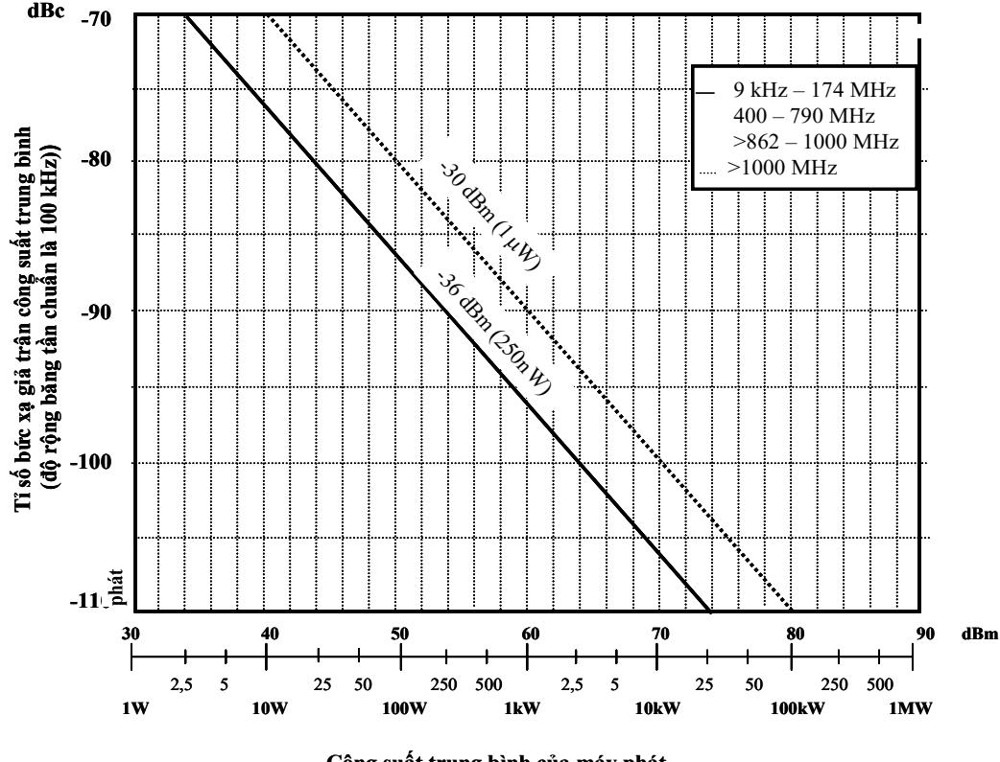
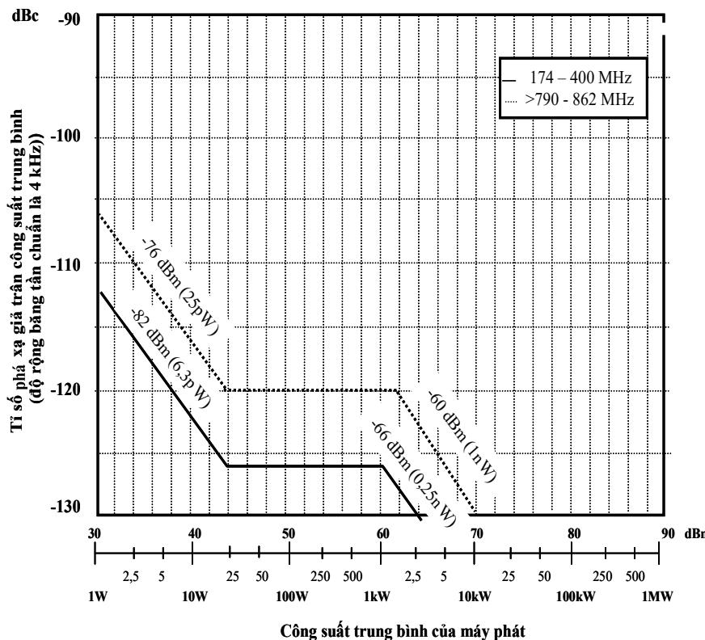
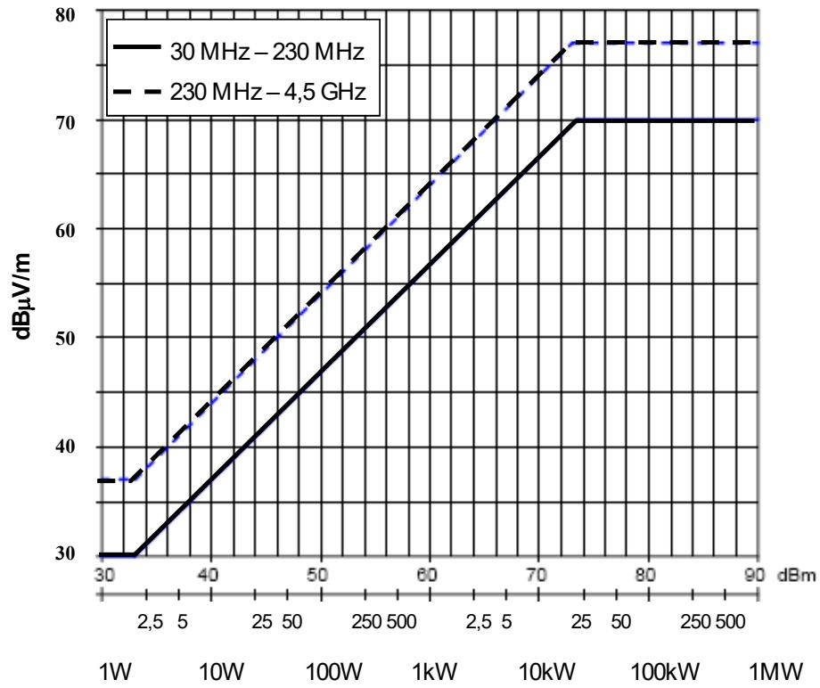

# Public_356

# 1. Yêu cầu về môi trường

Môi trường hoạt động của thiết bị do nhà cung cấp thiết bị công bố. Thiết bị phải tuân thủ tất cả các yêu cầu kỹ thuật trong quy chuẩn này khi hoạt động trong điều kiện môi trường bắt buộc.

# 2. Các thông số đo cổng ăng ten

# 2.1 Phát xạ giả

# 2.1.1 Định nghĩa

Phát xạ ở một tần số hoặc các tần số ngoài độ rộng băng tần cần thiết và mức của nó có thể giảm mà không gây ảnh hưởng tới việc truyền thông tin. Các phát xạ giả bao gồm các phát xạ hài, phát xạ ký sinh, tích xuyên điều chế và tích chuyển đổi tần số nhưng không gồm phát xạ ngoài băng.

Trong quy chuẩn này, các phát xạ giả là các phát xạ ở các tần số ngoài dải $\mathrm { f } _ { 0 } \pm 1 2$ MHz, với f0 là tần số trung tâm của kênh, tương ứng với số sóng mang được sử dụng.

# 2.1.2 Phương pháp đo

Điều kiện đầu:

- Môi trường đo: môi trường hoạt động thông thường theo công bố của nhà sản xuất thiết bị.

- Các tần số đo:

$^ +$ Tần số hoạt động thấp nhất của thiết bị cần đo;   
$^ +$ Tần số hoạt động cao nhất của thiết bị cần đo;   
$^ +$ Tần số trung bình của 2 tần số trên.

- Cấu hình đo: như trong Hình A.1.

$^ +$ Nối thiết bị cần đo với tải kiểm tra, qua bộ ghép nối;   
$^ +$ Nối máy phân tích phổ với bộ ghép nối.

Trong phép đo này không cần tín hiệu kiểm tra, nhà sản xuất thiết bị phải đảm bảo duy trì công suất ra danh định của máy phát trong suốt phép đo.

Thủ tục đo:

- Vận hành EUT ở các tần số đo như trên, - Đo kết quả trên máy phân tích phổ.

# 2.1.3 Giới hạn

Trong dải tần từ $9 \mathrm { k H z }$ đến 4,5 GHz, các phát xạ giả không được vượt quá các giá trị cho trong Bảng 1, và được thể hiện trên Hình 2 và 3.

Bảng 1 - Các giới hạn phát xạ giả cho máy phát DVB-T   

<table>
  
  <tbody>
    <tr>
      <td>Dải tần số phát xạ giả</td>
      <td>Công suất trung bình của máy phát, W</td>
      <td>Giới hạn phát xạ giả</td>
      <td>Độ rộng băng tần chuẩn</td>
      <td>Hình vẽ</td>
    </tr>
    <tr>
      <td>9 kHz đến 174 MHz</td>
      <td></td>
      <td>-36 dBm (250 nW)</td>
      <td>100 kHz</td>
      <td>2</td>
    </tr>
    <tr>
      <td>> 174 MHz đến 400 MHz</td>
      <td>P  25</td>
      <td>-82 dBm</td>
      <td>4 kHz</td>
      <td>3</td>
    </tr>
    <tr>
      <td></td>
      <td>25 < P  1000</td>
      <td>-126 dBc</td>
      <td></td>
      <td></td>
    </tr>
    <tr>
      <td></td>
      <td>1000 < P</td>
      <td>-66 dBm</td>
      <td></td>
      <td></td>
    </tr>
    <tr>
      <td>> 400 MHz đến 790 MHz</td>
      <td></td>
      <td>-36 dBm (250 nW)</td>
      <td>100 kHz</td>
      <td>2</td>
    </tr>
    <tr>
      <td>> 790 MHz đến 862 MHz</td>
      <td>P  25</td>
      <td>-76 dBm</td>
      <td>4 kHz</td>
      <td>3</td>
    </tr>
    <tr>
      <td></td>
      <td>25 < P  1000</td>
      <td>-120 dBc</td>
      <td></td>
      <td></td>
    </tr>
    <tr>
      <td></td>
      <td>1000 < P</td>
      <td>-60 dBm</td>
      <td></td>
      <td></td>
    </tr>
    <tr>
      <td>> 862 MHz đến 1000 MHz</td>
      <td></td>
      <td>-36 dBm (250 nW)</td>
      <td>100 kHz</td>
      <td>2</td>
    </tr>
    <tr>
      <td>> 1000 MHz</td>
      <td></td>
      <td>-30 dBm (1 W)</td>
      <td>100 kHz</td>
      <td>2</td>
    </tr>
  </tbody>
</table>

# Hình 2 - Các giới hạn phát xạ giả đối với máy phát DVB-T (độ rộng băng tần chuẩn là $\mathbf { 1 0 0 k H z }$ )

  
Công suất trung bình của máy phát

<table>
  
  <tbody>
    <tr>
      <td>- 3 0 d B m ( 1  W ) - 3 6 d B m ( 2 5 0 n W )</td>
      <td></td>
    </tr>
    <tr>
      <td></td>
      <td>9 kHz – 174 MHz 400 – 790 MHz >862 – 1000 MHz >1000 MHz</td>
    </tr>
    <tr>
      <td></td>
      <td></td>
    </tr>
  </tbody>
</table>

  
Hình 3 - Các giới hạn phát xạ giả đối với máy phát DVB-T (độ rộng băng tần chuẩn là ${ \bf 4 } ~ { \bf k H z }$ )

# 2.2 Các phát xạ ngoài băng

# 2.2.1 Định nghĩa

Phát xạ ở một tần số hoặc các tần số ngoài độ rộng băng tần cần thiết do qúa trình điều chế gây ra, nhưng không gồm phát xạ giả.

Theo quy chuẩn này, các phát xạ ngoài băng là các phát xạ ở các tần số ngoài độ rộng băng tần cần thiết và trong dải tần số $\mathrm { \bf ~ f } _ { 0 } { \pm } 1 2 \mathrm { \bf ~ M } \mathrm { \bf H } { \bf z }$ , trong đó f0 là tần số trung tâm của kênh, tương ứng với số sóng mang sử dụng.

# 2.2.2 Phương pháp đo

Điều kiện đầu:

- Môi trường đo: môi trường hoạt động thông thường theo công bố của nhà sản xuất thiết bị.

- Các tần số đo:

$^ +$ Tần số hoạt động thấp nhất của thiết bị cần đo;

+ Tần số hoạt động cao nhất của thiết bị cần đo;   
$^ +$ Tần số trung bình của 2 tần số trên.

- Cấu hình đo: như trong Hình A.2.

$^ +$ Nối thiết bị cần đo với tải đo kiểm, qua bộ ghép nối.   
$^ +$ Nối bộ phân tích phổ với bộ ghép nối.

Trong phép đo này không cần tín hiệu kiểm tra, nhà sản xuất thiết bị phải đảm bảo duy trì công suất ra danh định của máy phát trong suốt phép đo.

Thủ tục đo:

- Vận hành EUT ở các tần số đo như trên, - Đo kết quả trên máy phân tích phổ.

# 2.2.3 Giới hạn

Các phát xạ ngoài băng không được vượt quá các giá trị cho trong Bảng 2, Bảng 3 và mặt nạ phổ giới hạn này được thể hiện trên Hình 4.

Các giới hạn phát xạ ngoài băng được tính theo mức công suất trung bình đo trong độ rộng băng tần 4 kHz với mức chuẩn 0 dB tương ứng với mức công suất ra trung bình.

Trừ khi nhà sản xuất có công bố khác, EUT cần phải tuân thủ theo trường hợp không nghiêm ngặt (non-critical case).

Trong những trường hợp nghiêm ngặt như các kênh truyền hình kề với các dịch vụ khác (công suất thấp hoặc chỉ thu) thì mặt nạ phổ với mức suy giảm ngoài kênh phải cao hơn.

Bảng 2 - Các giới hạn phát xạ ngoài băng đối với các máy phát có công suất dưới 25W và từ 25W trở lên   

<table>
  
  <tbody>
    <tr>
      <td>- 7 6 d B m ( 2 5 - p 8 2 W ) d B m ( 6 , 3 p - W 6 ) 0 d - B 6 6 m ( d 1 B n m W ( ) 0 , 2 5 n W</td>
      <td></td>
      <td></td>
    </tr>
    <tr>
      <td></td>
      <td>174 – 400 MHz >790 - 862 MHz</td>
      <td></td>
    </tr>
    <tr>
      <td></td>
      <td></td>
      <td></td>
    </tr>
  </tbody>
</table>

<table>
  
  <tbody>
    <tr>
      <td>( 1 n W )</td>
      <td></td>
      <td></td>
    </tr>
    <tr>
      <td></td>
      <td>174 – 400 MHz >790 - 862 MHz</td>
      <td></td>
    </tr>
    <tr>
      <td></td>
      <td></td>
      <td></td>
    </tr>
  </tbody>
</table>

# Hình 4 - Giới hạn phát xạ ngoài băng đối với các máy phát DVB-T có công suất từ 25 W trở lên

# 2.3 Bức xạ vỏ

# 2.3.1 Định nghĩa

Các phát xạ từ vật chứa, bức xạ từ cổng thiết bị, nhưng không phải từ cổng ăng ten.

# 2.3.2 Phương pháp đo

2.3.2.1. Điều kiện đầu

- Môi trường đo: môi trường hoạt động thông thường theo công bố của nhà sản xuất thiết bị.

- Các tần số đo:

$^ +$ Tần số hoạt động thấp nhất của thiết bị cần đo, $^ +$ Tần số hoạt động cao nhất của thiết bị cần đo, $^ +$ Tần số trung bình của hai tần số trên.

- Cấu hình đo: như trong Hình A.3.

Trong phép đo này không cần tín hiệu kiểm tra, nhà sản xuất thiết bị phải đảm bảo duy trì công suất ra danh định của máy phát trong suốt phép đo.

# 2.3.2.2. Thủ tục đo:

- Thực hiện các phép đo ở ngoài băng ngoại trừ (xem Bảng 4).

- Thực hiện phép đo ở chế độ vận hành tạo phát xạ lớn nhất trong băng tần xét phù hợp với các ứng dụng thông thường.

- Đặt cấu hình thiết bị ở chế độ hoạt động điển hình trên thực tế.

- Dịch chuyển cáp của thiết bị nhằm cực đại hoá phát xạ bức xạ phát hiện được.

- Ghi lại chính xác cấu hình và chế độ hoạt động của thiết bị trong quá trình đo vào biên bản báo cáo kết quả đo.

- Kết cuối các cổng vào/ra RF một cách chính xác.

- Tiến hành đo trong điều kiện môi trường hoạt động thông thường và điện áp nguồn thông thường cấp cho thiết bị.

# 2.3.3 Giới hạn

Trong dải tần từ 30 MHz đến 4,5 GHz, các phát xạ bức xạ không được vượt quá các giá trị trong Bảng 4 và được thể hiện trên Hình 5.

Không được thực hiện các phép đo trong băng ngoại trừ (xem chú thích 2 trong Bảng 4).

<table>
  
  <tbody>
    <tr>
      <td>Phân loại theo ấn định tần số</td>
      <td>Sai lệch tần số tính từ tần số trung tâm, MHz</td>
      <td>Mức tương đối, dBc</td>
    </tr>
    <tr>
      <td>TỪ 25W TRỞ LÊN</td>
      <td></td>
      <td></td>
    </tr>
    <tr>
      <td>Trường hợp không nghiêm ngặt</td>
      <td>3,81</td>
      <td>-32,8</td>
    </tr>
    <tr>
      <td></td>
      <td>4,2</td>
      <td>-73</td>
    </tr>
    <tr>
      <td></td>
      <td>6</td>
      <td>-85</td>
    </tr>
    <tr>
      <td></td>
      <td>12</td>
      <td>-110</td>
    </tr>
    <tr>
      <td></td>
      <td>-</td>
      <td>-126</td>
    </tr>
    <tr>
      <td>Trường hợp nghiêm ngặt</td>
      <td>3,81</td>
      <td>-32,8</td>
    </tr>
    <tr>
      <td></td>
      <td>4,2</td>
      <td>-83</td>
    </tr>
  </tbody>
</table>

Phép đo này được thực hiện $\dot { \mathbf { O } }$ cự ly $1 0 \mathrm { m }$ . Khi có yêu cầu về kích cỡ hay công suất thì có th $\acute { \hat { \mathbf { e } } }$ sử dụng cự ly khác, khi đó cần lưu ý một số điểm sau:

- Có th $\acute { \hat { \mathbf { e } } }$ tiến hành phép đo $\acute { \mathbf { O } }$ các cự ly khác. Trong trường hợp đó, các giới hạn được hiệu chuẩn theo công thức:

$\mathrm { L } ( \mathrm { x } ) { = } \mathrm { L } ( 1 0 \mathrm { m } ) { + } 2 0 \log ( 1 0 / \mathrm { x } )$ với x là cự ly đo tính theo mét

- Cần đặc biệt lưu ý khi thực hiện phép đo $\dot { \mathbf { O } }$ cự ly dưới $1 0 ~ \mathrm { m }$ , vì như vậy là đo trong trường gần.

- Trong trường hợp có tranh cãi $\mathbf { v } \dot { \hat { \mathbf { e } } }$ cự ly đo, thì ưu tiên $\acute { \mathbf { O } }$ cự ly $1 0 \mathrm { m }$ .

Bảng 4 - Các giới hạn bức xạ vỏ   

  
Hình 5 - Giới hạn bức xạ vỏ cho máy phát hình số
