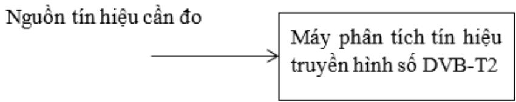
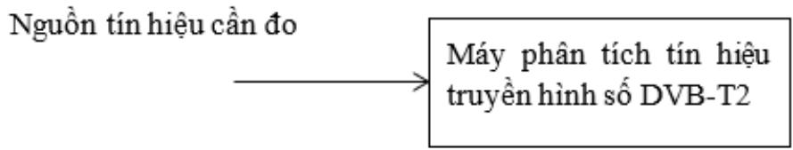
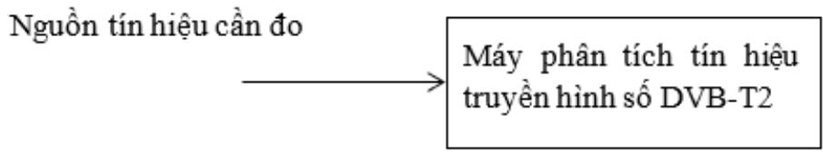

# Public_357

# 1. Mức tín hiệu cao tần

Định nghĩa: Mức biên độ của tín hiệu cao tần sau điều chế tại mỗi kênh truyền hình cáp số DVB-T2 (tính bằng dB $\mu \mathrm { V } _ { \mathrm { \ell } }$ ) đo tại điểm kết nối thuê bao.

Chỉ tiêu: Mức tín hiệu cao tần đo được tại điểm kết nối thuê bao truyền hình cáp số DVB-T2 phải đáp ứng như Bảng 1.

Bảng 1 - Chỉ tiêu mức tín hiệu cao tần   

<table><tr><td rowspan=2 colspan=1></td><td rowspan=1 colspan=1>4/5</td><td rowspan=2 colspan=2></td><td rowspan=1 colspan=1>43</td><td rowspan=1 colspan=1>74</td></tr><tr><td rowspan=1 colspan=1>5/6</td><td rowspan=1 colspan=1>44</td><td rowspan=1 colspan=1>74</td></tr><tr><td rowspan=6 colspan=1>256 QAM</td><td rowspan=1 colspan=1>1/2</td><td rowspan=3 colspan=2>VHF/UHF</td><td rowspan=1 colspan=1>39</td><td rowspan=1 colspan=1>74</td></tr><tr><td rowspan=1 colspan=1>3/5</td><td rowspan=1 colspan=1>42</td><td rowspan=1 colspan=1>74</td></tr><tr><td rowspan=1 colspan=1>2/3</td><td rowspan=2 colspan=2></td><td rowspan=1 colspan=1></td><td rowspan=1 colspan=1>44</td><td rowspan=1 colspan=1>74</td></tr><tr><td rowspan=1 colspan=1>3/4</td><td rowspan=1 colspan=1>46</td><td rowspan=1 colspan=1>74</td></tr><tr><td rowspan=1 colspan=1>4/5</td><td rowspan=2 colspan=2></td><td rowspan=1 colspan=1>48</td><td rowspan=1 colspan=1>74</td></tr><tr><td rowspan=1 colspan=1>5/6</td><td rowspan=1 colspan=1>49</td><td rowspan=1 colspan=1>74</td></tr></table>

Phương pháp xác định: Sử dụng thiết bị đo chuyên dùng xác định mức tín hiệu cao tần của tín hiệu thu được tại điểm kết nối thuê bao truyền hình cáp số DVBT2 của doanh nghiệp cung cấp dịch vụ.

Sơ đồ đo như Hình 1.

> **Hình chú thích:** a diagram of a text in english and vietnamese

  
Hình 1 - Sơ đồ kết nối đo mức tín hiệu cao tần

# 2. Băng thông của mỗi kênh

Định nghĩa: Độ rộng phổ tần số cho phép của mỗi kênh truyền hình cáp số DVB

T2.   
Chỉ tiêu: Tối đa 8 MHz.

Phương pháp xác định: Sử dụng thiết bị đo chuyên dùng xác định băng thông tất cả các kênh truyền hình cáp thu được tại điểm kết nối thuê bao truyền hình cáp số DVB-T2 của đơn vị cung cấp dịch vụ.

Sơ đồ đo như Hình 2.

> **Hình chú thích:** a diagram showing the steps to use dvd - b2

Hình 2 - Sơ đồ kết nối đo băng thông mỗi kênh

3. Sai lệch đáp tuyến biên độ tần số tín hiệu cao tần

Định nghĩa: Chỉ tiêu đánh giá độ đồng đều về biên độ tín hiệu trên toàn băng thông kênh truyền.

Chỉ tiêu: Tối đa 8 dB.

Phương pháp xác định: Sử dụng thiết bị đo chuyên dùng để xác định đáp tuyến biên độ tần số của tín hiệu.

Sơ đồ đo như Hình 3.

> **Hình chú thích:** a diagram showing the steps to buy dvd - t

Hình 3 - Sơ đồ kết nối đo đáp tuyến biên độ tần số tín hiệu cao tần

4. Độ di tần

Định nghĩa: Độ lệch lớn nhất giữa tần số tức thời của tín hiệu RF so với tần số danh định.

Chỉ tiêu: Độ di tần tối đa cho phép l $\dot { \mathrm { \mathbf { a } } } \pm 3 0 \mathrm { k H z }$ .

Phương pháp xác định: Sử dụng thiết bị đo chuyên dùng để xác định độ di tần tại điểm kết nối thuê bao.

Sơ đồ đo như Hình 4.

> **Hình chú thích:** a diagram showing how to buy dvd - t2

# Hình 4 - Sơ đồ kết nối đo độ di tần

# 5. Tỷ số tín hiệu cao tần trên tạp âm

Định nghĩa: Tỷ số tín hiệu cao tần trên tạp âm (S/N) là tỷ số giữa mức công suất sóng mang trên mức công suất tạp âm.

Chỉ tiêu: S/N được đo tại điểm kết nối thuê bao truyền hình cáp số DVB-T2 phải đáp ứng yếu cầu như Bảng 2.

Bảng 2 - Chỉ tiêu tỷ số tín hiệu cao tần trên tạp âm   

<table><tr><td rowspan=1 colspan=1></td><td rowspan=1 colspan=1>5/6</td><td rowspan=1 colspan=1>21,8</td><td rowspan=1 colspan=1>22,8</td></tr><tr><td rowspan=6 colspan=1>64 QAM</td><td rowspan=1 colspan=1>1/2</td><td rowspan=1 colspan=1>20,2</td><td rowspan=1 colspan=1>21,2</td></tr><tr><td rowspan=1 colspan=1>3/5</td><td rowspan=1 colspan=1>22,.3</td><td rowspan=1 colspan=1>23,3</td></tr><tr><td rowspan=1 colspan=1>2/3</td><td rowspan=1 colspan=1>23.8</td><td rowspan=1 colspan=1>24,8</td></tr><tr><td rowspan=1 colspan=1>3/4</td><td rowspan=1 colspan=1>25,4</td><td rowspan=1 colspan=1>26,4</td></tr><tr><td rowspan=1 colspan=1>4/5</td><td rowspan=1 colspan=1>26,6</td><td rowspan=1 colspan=1>27,6</td></tr><tr><td rowspan=1 colspan=1>5/6</td><td rowspan=1 colspan=1>27,2</td><td rowspan=1 colspan=1>28,2</td></tr><tr><td rowspan=6 colspan=1>256 QAM</td><td rowspan=1 colspan=1>1/2</td><td rowspan=1 colspan=1>23.6</td><td rowspan=1 colspan=1>24,6</td></tr><tr><td rowspan=1 colspan=1>3/5</td><td rowspan=1 colspan=1>26,3</td><td rowspan=1 colspan=1>27,3</td></tr><tr><td rowspan=1 colspan=1>2/3</td><td rowspan=1 colspan=1>28,1</td><td rowspan=1 colspan=1>29,1</td></tr><tr><td rowspan=1 colspan=1>3/4</td><td rowspan=1 colspan=1>30,3</td><td rowspan=1 colspan=1>31,3</td></tr><tr><td rowspan=1 colspan=1>4/5</td><td rowspan=1 colspan=1>31,7</td><td rowspan=1 colspan=1>32,7</td></tr><tr><td rowspan=1 colspan=1>5/6</td><td rowspan=1 colspan=1>32.4</td><td rowspan=1 colspan=1>33,4</td></tr></table>

Phương pháp xác định: Điều chỉnh máy phân tích về kênh cần đo, lựa chọn tần số trung tâm và cài đặt mức để có thể hiển thị toàn bộ băng tần.

Đo mức đỉnh của tín hiệu cần đo, máy đo sẽ hiển thị tỷ số công suất tín hiệu trên công suất tạp âm.

Sơ đồ đo như Hình 5.

> **Hình chú thích:** a diagram of a computer program that is used to write a program

  
Hình 5 - Sơ đồ kết nối đo tỷ số S/N

6. Tỷ số lỗi bit

Định nghĩa: Tỷ số lỗi bit (BER) là thông số cơ bản xác định chất lượng kết nối của đường truyền dẫn số; thông số BER là tỷ lệ số bit lỗi trên tổng số bit được truyền.

Chỉ tiêu: $\mathrm { B E R } \leq 1 0 ^ { - 4 }$ trước giải mã Reed-Solomon

Phương pháp xác định: Sử dụng thiết bị đo chuyên dùng xác định tỷ số bit lỗi trên tổng số bit được truyền. Thiết bị thu đo phải được điều chỉnh để loại bỏ méo tuyến tính của mạng truyền hình cáp.

Sơ đồ đo như Hình 6.

> **Hình chú thích:** a diagram showing the steps to buy dvd - t

  
Hình 6 - Sơ đồ kết nối đo tỷ số BER

# 7. Tỷ số lỗi điều chế

Định nghĩa: Tỷ số lỗi điều chế (MER) là thông số đặc trưng cho tính chính xác của tín hiệu và khả năng khôi phục của tín hiệu được điều chế.

Chỉ tiêu: $\mathbf { M E R } \geq 3 2 ~ $ dB.

Phương pháp xác định: Thiết lập tần số sóng mang của bộ điều chế RF theo kênh tần $\mathrm { { s } \acute { o } \ m \dot { a } }$ phép đo sẽ thực hiện.

Sử dụng thiết bị đo chuyên dùng phân tích chòm sao tín hiệu để xác định chỉ số MER.

Sơ đồ đo như Hình 7.

> **Hình chú thích:** a diagram showing the steps to buy a dvd

  
Hình 7 - Sơ đồ kết nối đo tỷ số MER

8. Độ rung pha

Định nghĩa: Độ rung pha là độ biến đổi về pha hoặc tần số của tín hiệu trong mạng truyền hình cáp số DVB-T2.

Chỉ tiêu: Độ rung pha tín hiệu phải nằm trong giải $\pm { } 5 ^ { 0 }$ .

Phương pháp xác định: Sử dụng thiết bị đo chuyên dùng xác định độ rung pha của tín hiệu thu được tại điểm kết nối thuê bao truyền hình cáp số DVB-T2 của đơn vị cung cấp dịch vụ.

> **Hình chú thích:** a diagram showing the steps to buy dvd

Hình 8 - Sơ đồ kết nối đo độ rung pha
