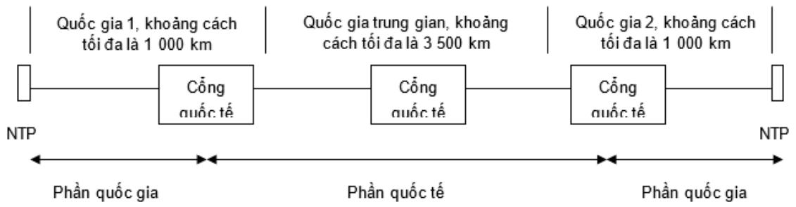

# Public_358

# 1. Giới thiệu

Các lỗi sinh ra bởi một số nguyên nhân sau:

- Do can thiệp của con người;

- Nhiễu nhiệt;

- Các điện áp cảm ứng trong thiết bị và cáp do sét, chớp, sóng vô tuyến và các hiệu ứng điện từ trường khác;

- Mất đồng bộ sau khi bị trượt không điều khiển được;

- Các điểm tiếp xúc và kết nối.

Nguyên nhân chính gây ra lỗi là các điện áp cảm ứng và các lỗi này thường xảy ra với mật độ lớn do các hiện tượng đặc biệt nào đó xuất hiện. Sự phát triển của công nghệ không những giúp con người có sự hiểu biết sâu sắc hơn về các hiệu ứng điện từ trường mà còn có phương hướng lâu dài trong việc giảm các tỷ lệ về lỗi.

Các nghiên cứu của ITU-T đã chứng minh rằng tỷ lệ lỗi đối với đường truyền ít phụ thuộc vào khoảng cách.

# 2. Các tài liệu tham khảo

Khuyến nghị G.826 của ITU-T về giới hạn lỗi đối với đường truyền chuẩn lý thuyết là 2 $7 5 0 0 \mathrm { k m }$ . Để có thể áp dụng các số liệu này cho kênh thuê riêng thì cần phải định nghĩa các đường truyền chuẩn để đại diện cho các kênh thuê riêng được đề cập tới trong Quy chuẩn này. Đường truyền chuẩn trên mặt đất và đường truyền chuẩn qua vệ tinh được định nghĩa trong C.2.1 và C.2.2 dựa trên cơ sở Khuyến nghị G.826 của ITU-T.

# 2.1 Đường truyền trên mặt đất

Hình C.1 mô tả đường truyền chuẩn trên mặt đất qua việc tính toán giới hạn lỗi như đã chỉ ra trong Quy chuẩn này.

> **Hình chú thích:** a blue and white sign with the words vietnam

> **Hình chú thích:** a diagram of the process of a power line

  
Hình C.1 - Đường truyền chuẩn cho kênh thuê riêng trên mặt đất tốc độ 2 048 kbit/s.

Đường truyền chuẩn trong Hình C.1 gồm có 2 nước tại 2 đầu cuối và một nước trung gian. Tại nước có điểm đầu cuối thì khoảng cách tính từ điểm NTP đến cổng đi quốc tế tối đa là $1 \ 0 0 0 \ \mathrm { k m }$ . Đối với nước trung gian thì khoảng cách tối đa là 3 $5 0 0 ~ \mathrm { k m }$ nếu chỉ có một cổng quốc tế. Khoảng cách trên được tính bằng 1,5 lần khoảng cách theo đường thẳng trừ trường hợp nếu là cáp ngầm dưới biển thì khoảng cách sẽ là khoảng cách thực tế.

CHÚ THÍCH: mô hình này cho phép khoảng cách tổng cộng lên đến $5 5 0 0 ~ \mathrm { k m }$ . Mặc dù đường truyền chuẩn này biểu diễn các phần của các quốc gia riêng biệt, nhưng trong Quy chuẩn này không tách lỗi riêng tại từng quốc gia và các lỗi có thể được phân tách theo cách khác.

# 2.2 Đường truyền qua vệ tinh

> **Hình chú thích:** a diagram of the different types of signal

Hình C.2 - Đường truyền chuẩn cho kênh thuê riêng qua vệ tinh tốc độ

Đường truyền chuẩn trong Hình C.2 gồm có đường truyền vệ tinh kết nối hai quốc gia có điểm đầu cuối. Đối với mỗi nước có điểm đầu cuối thì khoảng cách là khoảng $1 0 0 0 { \mathrm { k m } }$ .

# 3. Tiêu chí với lỗi

Trong Bảng C.1 và C.2 thể hiện phân bố theo tỷ lệ phần trăm về lỗi tổng cộng trong Khuyến nghị G.826 của ITU-T đối với các phần khác nhau của kênh thuê riêng dựa theo đường truyền chuẩn (đường truyền mặt đất và đường truyền vệ tinh) như định nghĩa trong C.2. Các bảng dưới đây bao gồm phân bố cố định và phân bố theo khoảng cách với $1 \%$ cho chiều dài $5 0 0 \mathrm { k m }$ .

Bảng C.1 - Phân bố nguyên nhân lỗi theo Khuyến nghị G.826 - Đường truyền mặt đất và đường truyền vệ tinh   

<table><tr><td rowspan=1 colspan=1> Phan duong truyén</td><td rowspan=1 colspan=1>Phan bo loi</td></tr><tr><td rowspan=1 colspan=2>Durong truyén mat dat</td></tr><tr><td rowspan=1 colspan=1>Quóc gia 1 (phan bó có dinh)</td><td rowspan=1 colspan=1>17,5%</td></tr><tr><td rowspan=1 colspan=1>Quóc gia 1 (toi da 1 000 km)</td><td rowspan=1 colspan=1>2.0%</td></tr><tr><td rowspan=1 colspan=1>Diém qua giang quóc té</td><td rowspan=1 colspan=1>1,0%</td></tr><tr><td rowspan=1 colspan=1>Qua giang quoc té (phan bó có dinh)</td><td rowspan=1 colspan=1>2.0%</td></tr><tr><td rowspan=1 colspan=1>Qua giang quoc té (toi da 3 500 km)</td><td rowspan=1 colspan=1>7,0%</td></tr><tr><td rowspan=1 colspan=1>Diem qua giang quc té</td><td rowspan=1 colspan=1>1,0%</td></tr><tr><td rowspan=1 colspan=1>Quóc gia 2 (tói da 1 000 km)</td><td rowspan=1 colspan=1>2,0%</td></tr><tr><td rowspan=1 colspan=1>Quoc gia 2 (phan bó có dinh)</td><td rowspan=1 colspan=1>17,5%</td></tr><tr><td rowspan=1 colspan=1>Tong cong</td><td rowspan=1 colspan=1>50,0%</td></tr><tr><td rowspan=1 colspan=2>Duong truyén v@ tinh</td></tr><tr><td rowspan=1 colspan=1>Quoc gia 1 (phan bó có dinh)</td><td rowspan=1 colspan=1>17,5%</td></tr></table>

<table><tr><td rowspan=1 colspan=1>Quóc gia 1 (toi da 1 000 km)</td><td rowspan=1 colspan=1>2.0%</td></tr><tr><td rowspan=1 colspan=1>Diem két noi quoc té</td><td rowspan=1 colspan=1>2.0%</td></tr><tr><td rowspan=1 colspan=1>Duong truyén vé tinh</td><td rowspan=1 colspan=1>35,0%</td></tr><tr><td rowspan=1 colspan=1>Diém két noi quoc té</td><td rowspan=1 colspan=1>2.0%</td></tr><tr><td rowspan=1 colspan=1>Quoc gia 2 (toi da 1 000 km)</td><td rowspan=1 colspan=1>2,0%</td></tr><tr><td rowspan=1 colspan=1>Quoc gia 2 (phan bó có dinh)</td><td rowspan=1 colspan=1>17,5%</td></tr><tr><td rowspan=1 colspan=1>Tong cong</td><td rowspan=1 colspan=1>78,0%</td></tr></table>

CHÚ THÍCH: Nếu có thêm các quốc gia quá giang vào đường truyền mặt đất thì sẽ phải bổ sung thêm tỷ lệ phân bố cố định $( 2 \% )$ , điểm kết cuối quá giang $( 1 \% )$ và khoảng cách đường truyền ( $1 \%$ cho $5 0 0 ~ \mathrm { k m } ,$ ). Thông tin thêm về vấn đề này có trong Khuyến nghị G.826 của ITU-T.

Khuyến nghị G.826 của ITU-T định nghĩa về các lỗi theo các cụm từ giây bị lỗi ES, giây bị lỗi nghiêm trọng SES và lỗi khối nền BBE cho đường truyền chuẩn lý thuyết có chiều dài $2 7 5 0 0 { \mathrm { k m } }$ , các tỷ lệ này cho trong cột 2 của Bảng C.3.

Việc áp dụng các tỷ lệ trong Bảng C.1 và C.2 vào vấn đề lỗi trong Khuyến nghị G.826 của ITU-T đưa ra các tỷ lệ về lỗi đối với kênh thuê riêng cấu trúc số 2 048 kbit/s như trong cột 3 và 4 của Bảng C.3 tương ứng với đường truyền mặt đất và đường truyền vệ tinh.

Bảng C.2 - Tỷ lệ lỗi dài hạn áp dụng cho kênh thuê riêng cấu trúc số

2 048 kbit/s   

<table><tr><td>Tham s6</td><td>G.826</td><td>Duong truyén mat dat</td><td>Duong truyén vé tinh</td></tr><tr><td>Ty le ES</td><td>4,00%</td><td>2,000 %</td><td>3,120%</td></tr><tr><td>Ty le SES</td><td>0,20%</td><td>0,100%</td><td>0,156%</td></tr></table>

<table><tr><td>Ty le BBE</td><td>0,03%</td><td>0,015%</td><td>0,023%</td></tr><tr><td colspan="4">CHU THiCH: cac só lieu trong bang nay da duoc lam tron, cac só lieu chinh xac dugc sur dung dé tinh toan cac gioi han trong cac muc tiép theo.</td></tr></table>

# 4. Lỗi dài hạn

Các tỷ lệ lỗi trong C.3 áp dụng cho đường truyền chuẩn có thể sử dụng để tính toán các yêu cầu đối với lỗi dài hạn, biểu diễn bằng một số tuyệt đối trong khoảng thời gian 24 giờ; các con số này được cho trong hàng 1 của Bảng C.4 và C.5 tương ứng với đường truyền mặt đất và đường truyền vệ tinh.

Tuy nhiên các yêu cầu về lỗi đã được chỉ ra là các số liệu thống kê dựa trên việc đo kiểm dài hạn (hơn một tháng), không sử dụng số liệu thống kê trong vòng 24 giờ. Do đó, Khuyến nghị M.2100 của ITU-T đưa ra một phương pháp đo có thể giảm thời gian đo xuống là 24 giờ với các giá trị giới hạn S1 và S2. S1 là giới hạn mà thấp hơn mức này đường truyền hoạt động tốt đáp ứng yêu cầu, S2 là giới hạn mà trên mức này đường truyền không còn đáp ứng được yêu cầu. Các giá trị nằm trong khoảng S1 và S2 là không xác định được trạng thái hoạt động của đường truyền. Do đó để có thể kết luận là đường truyền hoạt động tốt đáp ứng yêu cầu dài hạn thì kết quả đo trong khoảng thời gian 24 giờ phải tốt hơn giá trị giới hạn S1.

S1 và S2 được tính như sau:

$$
\begin{array} { r } { { \cal S 1 } = ( Y \hat { \mathsf { e } } u c \hat { \mathsf { a } } u ) - 2 \times \sqrt { ( Y \hat { \mathsf { e } } u c \hat { \mathsf { a } } u ) } } \\ { { \phantom { \frac { 1 } { 2 } } } } \\ { { \cal S 2 } = ( Y \hat { \mathsf { e } } u c \hat { \mathsf { a } } u ) + 2 \times \sqrt { ( Y \hat { \mathsf { e } } u c \hat { \mathsf { a } } u ) } } \end{array}
$$

Bảng C.3 - Các giá trị giới hạn đối với độ dài khối là 2 048 bit - Đường truyền mặt đất   

<table><tr><td rowspan=1 colspan=1>Thong s6</td><td rowspan=1 colspan=1>ES</td><td rowspan=1 colspan=1>SES</td><td rowspan=1 colspan=1>BBE</td></tr><tr><td rowspan=1 colspan=1>Loi dai han</td><td rowspan=1 colspan=1>1 728 / 24h</td><td rowspan=1 colspan=1>86/ 24h</td><td rowspan=1 colspan=1>12 960/ 24h</td></tr></table>

<table><tr><td>Thoi gian do 24 gio</td><td></td><td>68/ 24h</td><td>12 732/ 24h</td></tr><tr><td>Gia tri gioi han S1 Gia tri gioi han S2</td><td>1 645/ 24h 1 811/ 24h</td><td>105/ 24h</td><td>13 188/ 24h</td></tr></table>

Bảng C.4 - Các giá trị giới hạn đối với độ dài khối là 2 048 bit - Đường truyền vệ tinh   

<table><tr><td rowspan=1 colspan=1>Thong s6</td><td rowspan=1 colspan=1>ES</td><td rowspan=1 colspan=1>SES</td><td rowspan=1 colspan=1>BBE</td></tr><tr><td rowspan=1 colspan=1>Loi dai han</td><td rowspan=1 colspan=1>2 696 / 24h</td><td rowspan=1 colspan=1>135 / 24h</td><td rowspan=1 colspan=1>20 218 / 24h</td></tr><tr><td rowspan=2 colspan=1>Thoi gian do 24 gioGia tri gioi han S1Gia tri gioi han S2</td><td rowspan=1 colspan=1>2 592 /24h</td><td rowspan=1 colspan=1>112 / 24h</td><td rowspan=2 colspan=1>19 933 / 24h20 502 /24h</td></tr><tr><td rowspan=1 colspan=1>2 800 / 24h</td><td rowspan=1 colspan=1>158 / 24h</td></tr></table>
