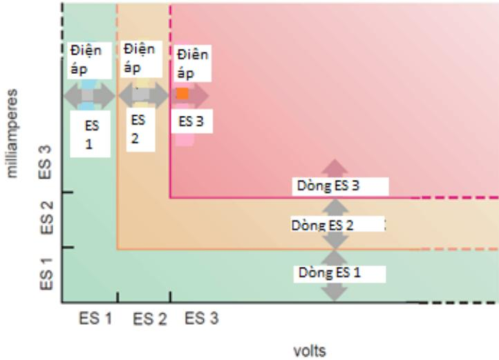
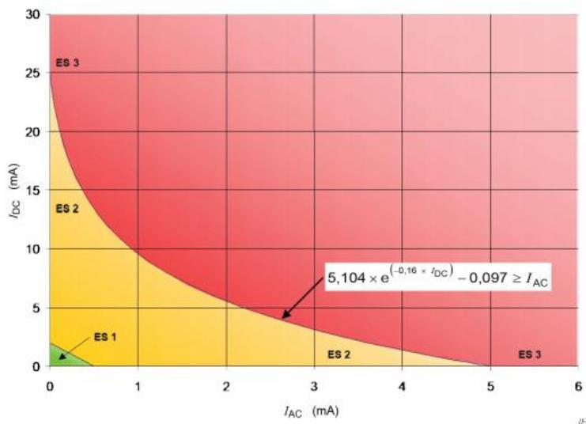

# Public_361

# 1. Phân loại nguồn năng lượng điện

# 1.1 ES1

ES1 là nguồn năng lượng điện loại 1 với các mức dòng điện và điện áp:

- Không vượt quá giới hạn ES1 trong:   
$^ +$ Điều kiện hoạt động bình thường, và   
$^ +$ Điều kiện hoạt động bất thường, và   
$^ +$ Các điều kiện lỗi đơn của một bộ phận, một thiết bị hoặc vật liệu cách điện   
không đóng vai trò là biện pháp bảo vệ và

- Không vượt quá giới hạn ES2 trong các điều kiện lỗi đơn của biện pháp bảo vệ cơ bản hoặc của biện pháp bảo vệ bổ sung.

# 1.2 ES2

ES2 là nguồn năng lượng điện loại 2, khi:

- Cả điện áp và dòng điện vượt quá giới hạn cho ES1, và trong:   
$^ +$ Điều kiện hoạt động bình thường, và   
$^ +$ Điều kiện hoạt động bất thường, và   
$^ +$ Các điều kiện lỗi đơn,

Hoặc điện áp và dòng điện không vượt quá giới hạn cho ES2

# 1.3 ES3

ES3 là nguồn năng lượng điện loại 3 khi cả nguồn điện và điện áp vượt quá giới hạn cho ES2.

2. Các giới hạn nguồn năng lượng điện của ES1 và ES2

2.1 Thông tin chung

> **Hình chú thích:** a diagram shows the different types of batteries

Hình 11 - Hình minh họa các giới hạn ES về điện áp và dòng điện Đối với bất kỳ điện áp trong giới hạn điện áp, sẽ không có giới hạn cho dòng điện. Tương tự như vậy đối với bất kỳ dòng điện nào trong giới hạn, sẽ không có giới hạn nào đối với điện áp, xem Hình 11.

# 2.2 Các giới hạn điện áp và dòng điện ở trạng thái ổn định

Cấp nguồn năng lượng điện được xác định tử cả nguồn điện và điện áp trong các điều kiện hoạt động bình thường, các điều kiện hoạt động bất thường và các điều kiện sự cố đơn lẻ (xem Bảng 4).

# Bảng 4 - Các giới hạn nguồn năng lượng điện cho ES1 và ES2 ở trạng thái ổn định

<table><tr><td rowspan=2 colspan=1>Nguon nang luong</td><td rowspan=1 colspan=2>Cac gioi han cho ES1</td><td rowspan=1 colspan=2>Cac gioi han cho ES2</td><td rowspan=2 colspan=1>ES3</td></tr><tr><td rowspan=1 colspan=1>Dien ap</td><td rowspan=1 colspan=1>Dong dien aced</td><td rowspan=1 colspan=1>Dien ap</td><td rowspan=1 colspan=1>Dongdien b.c</td></tr><tr><td rowspan=1 colspan=1>DC</td><td rowspan=1 colspan=1>60V</td><td rowspan=1 colspan=1>2 mA</td><td rowspan=1 colspan=1>120 V</td><td rowspan=1 colspan=1>25 mA</td><td rowspan=1 colspan=1></td></tr><tr><td rowspan=1 colspan=1>AC toi 1kHz</td><td rowspan=1 colspan=1> 30 V R.M.S42,4 V dinh</td><td rowspan=2 colspan=1>0,5 mA R.M.S0,707 mA dinh</td><td rowspan=1 colspan=1> 50 V R.M.S70,7 V dinh</td><td rowspan=2 colspan=1>0,5 mAR.M.S0,707 mAdinh</td><td rowspan=2 colspan=1>&gt;ES2</td></tr><tr><td rowspan=1 colspan=1>AC</td><td rowspan=1 colspan=1> 30 V R.M.S + 0,4 *f</td><td rowspan=1 colspan=1>50VIR.M.S+0,9*f</td></tr></table>

<table><tr><td rowspan=1 colspan=1>&gt;1 kHz toi100 kHz</td><td rowspan=1 colspan=1>42.2 dinh + 0,4*√2*f</td><td rowspan=2 colspan=1></td><td rowspan=1 colspan=1>70,7 V dinh+ 0.9*√2 * f</td><td rowspan=2 colspan=1></td></tr><tr><td rowspan=1 colspan=1>AC   tren100 kHz</td><td rowspan=1 colspan=1>70 V R.M.S99 V dinh</td><td rowspan=1 colspan=1>140 V R.M.S198 V dinh</td></tr><tr><td rowspan=2 colspan=1>Két   hopAC va DC</td><td rowspan=2 colspan=1>UDc(V)60UAC R.M.s(V)+U R.M.s gibi han≤1UDc(V)60UAC dinh(V)+ Udinh gioi han≤1</td><td rowspan=1 colspan=1>IDc(mA)2IAC R.M.s (mA)+</td><td rowspan=2 colspan=1>Xem Hinh 13</td><td rowspan=2 colspan=1>XemHinh 12</td></tr><tr><td rowspan=1 colspan=1>+0,5≤1IDc(mA)2IAc dinh(mA)+0,707≤1</td></tr></table>

Thay thế cho các yêu cầu bên trên, các giá trị dưới đây có thể được sử dụng cho các dạng sóng hình sin

<table><tr><td rowspan=2 colspan=1>Nguon nang luong</td><td rowspan=1 colspan=1>Cac gioi han cho ES1</td><td rowspan=1 colspan=1>Cac gioi han cho ES2</td><td rowspan=2 colspan=1>ES3</td></tr><tr><td rowspan=1 colspan=1>Dong dien cR.M.S</td><td rowspan=1 colspan=1>Dong dien R.M.S</td></tr><tr><td rowspan=1 colspan=1>A.Ctoi 1kHz</td><td rowspan=1 colspan=1>0,5 mA</td><td rowspan=1 colspan=1>0,5 mA</td><td rowspan=2 colspan=1>&gt;ES2</td></tr><tr><td rowspan=1 colspan=1>A.C&gt;1kHz toi100 kHz</td><td rowspan=1 colspan=1>0,5 mA * fd</td><td rowspan=1 colspan=1>0,5 mA + 0,95fe</td></tr></table>

<table><tr><td>A.Ctren 100 kHz</td><td>50 mAd</td><td>100 mAe</td></tr><tr><td colspan="3">f tinh bang kHz Gia tri dinh phai duoc su dung cho dien ap va dong dien khong phai dang hinh sin. Gia tri R.M.S chi có thé duoc sur dung cho dien ap va dong dien có dang hinh sin. Tham khao 2.2.7 vé phép do dien áp tiép xuc tiém nang va phép do dong dien cham.</td></tr><tr><td colspan="3">a Dong dien duoc do bang cach sur dung mang do duoc quy dinh trong Hinh 4 cua tieu chuan IEC 60990:2016. b Dong dien dugc do bang cach sur dung mang do duoc quy dinh trong Hinh 5 cua tieu chuan IEC 60990:2016 c Dói voi dang s6ng hinh sin va mot chieu, dong dien c6 thé duoc do bang dien tró 2 000</td></tr></table>

> **Hình chú thích:** a graph shows the temperature of a liquid

  
Hình 12 - Các giá trị cực đại cho kết hợp dòng AC và dòng DC

> **Hình chú thích:** the graph shows the temperature of a liquid

  
Hình 13 - Các giá trị cực đại cho kết hợp điện áp AC và điện áp DC

# 2.3 Các giới hạn điện dung

Khi nguồn năng lượng điện là một tụ điện, nguồn năng lượng này được phân loại theo cả điện áp tích và điện dung.

Điện dung là giá trị danh định của tụ điện cộng với dung sai theo quy định.

Các giới hạn ES1 và ES2 cho các giá trị điện dung khác nhau được liệt kê Bảng 5.

# Bảng 5 - Các giới hạn nguồn năng lượng điện đối với các tụ điện tích điện

<table><tr><td rowspan=1 colspan=1>CnF</td><td rowspan=1 colspan=1>ES1UdinhV</td><td rowspan=1 colspan=1>ES2UdinhV</td><td rowspan=1 colspan=2>ES3UdinhV</td></tr><tr><td rowspan=1 colspan=1> 300 hoac lon hon</td><td rowspan=1 colspan=1>60</td><td rowspan=1 colspan=1>120</td><td rowspan=2 colspan=2></td></tr><tr><td rowspan=1 colspan=1>170</td><td rowspan=1 colspan=1>75</td><td rowspan=1 colspan=1>150</td><td rowspan=1 colspan=1></td></tr><tr><td rowspan=1 colspan=1>91</td><td rowspan=1 colspan=1>100</td><td rowspan=1 colspan=1>200</td><td rowspan=1 colspan=1></td><td rowspan=4 colspan=1></td></tr><tr><td rowspan=1 colspan=1>61</td><td rowspan=1 colspan=1>125</td><td rowspan=1 colspan=1>250</td><td rowspan=1 colspan=1></td></tr><tr><td rowspan=1 colspan=1>41</td><td rowspan=1 colspan=1>150</td><td rowspan=1 colspan=1>300</td><td></td></tr><tr><td rowspan=1 colspan=1>28</td><td rowspan=1 colspan=1>200</td><td rowspan=1 colspan=1>400</td><td></td></tr></table>

<table><tr><td rowspan=1 colspan=1>18</td><td rowspan=1 colspan=1>250</td><td rowspan=1 colspan=1>500</td><td rowspan=9 colspan=1></td></tr><tr><td rowspan=1 colspan=1>12</td><td rowspan=1 colspan=1>350</td><td rowspan=1 colspan=1>700</td></tr><tr><td rowspan=1 colspan=1>8,0</td><td rowspan=1 colspan=1>500</td><td rowspan=1 colspan=1>1000</td></tr><tr><td rowspan=1 colspan=1>4,0</td><td rowspan=1 colspan=1>1 000</td><td rowspan=1 colspan=1>2 000</td></tr><tr><td rowspan=1 colspan=1>1,6</td><td rowspan=1 colspan=1>2 500</td><td rowspan=1 colspan=1>5000</td></tr><tr><td rowspan=1 colspan=1>0,8</td><td rowspan=1 colspan=1>5000</td><td rowspan=1 colspan=1>10 000</td></tr><tr><td rowspan=1 colspan=1>0,4</td><td rowspan=1 colspan=1>10 000</td><td rowspan=1 colspan=1>20000</td></tr><tr><td rowspan=1 colspan=1>0,2</td><td rowspan=1 colspan=1>20 000</td><td rowspan=1 colspan=1>40 000</td></tr><tr><td rowspan=1 colspan=1>0,133 hoac nhóhon</td><td rowspan=1 colspan=1>25 000</td><td rowspan=1 colspan=1>50 000</td></tr><tr><td rowspan=1 colspan=4>Phép noi suy tuyén tinh c6 thé dugc sur dung gitra hai diem gan nhat</td></tr></table>

# 2.4 Các giới hạn xung đơn

Trong trường hợp nguồn năng lượng điện là một xung đơn lẻ, nguồn năng lượng được phân loại theo cả điện áp và khoảng thời gian tồn tại hoặc được phân loại theo dòng điện và khoảng thời gian tồn tại. Các giá trị được nêu trong Bảng 6 và Bảng 7.

Đới với xung có thời gian tồn tại đến $1 0 ~ \mathrm { m s }$ , áp dụng giới hạn dòng điện và giới hạn điện áp cho $1 0 \mathrm { m s }$ .

Nếu phát hiện nhiều hơn một xung trong khoảng thời gian 3 s, thì nguồn năng lượng điện được coi là xung lặp lại và áp dụng các giới hạn của giới hạn cho các xung lặp lại.

Bảng 6 - Các giới hạn điện áp cho các xung đơn

Bảng 7 - Các giới hạn dòng điện cho các xung đơn   

<table><tr><td>Khoang thoi gian ton tai cua xung den ms</td><td>ES1 Udinh V</td><td>ES2 Udinh V</td><td>ES3 Udinh V</td></tr><tr><td>10</td><td rowspan="7">60 nhät tinh theo phu luc R.</td><td>196</td><td rowspan="8">&gt; ES2</td></tr><tr><td>20</td><td>178</td></tr><tr><td>50</td><td>150</td></tr><tr><td>80</td><td>135</td></tr><tr><td></td><td></td></tr><tr><td>100 200 va lón hon</td><td>129 120</td></tr><tr><td colspan="4">Néu khoang thoi gian näm gitra cac gia tri trong hai hang bat ky, thi có thé su dung gia tri ES2 cua Udinh thap hon hoac có thé sur dung phép nói suy tuyén tinh gitra hai hang lién ké bat ky voi gia tri dién ap dinh dugc tinh toan lam tron xuong gia tri gan</td></tr></table>

<table><tr><td rowspan=1 colspan=1>Khoangthoigianton taicua xungdénms</td><td rowspan=1 colspan=2>ES1ldinhmA</td><td rowspan=1 colspan=1>ES2lainhmA</td><td rowspan=1 colspan=1>ES3lainhmA</td></tr><tr><td rowspan=1 colspan=1>10</td><td rowspan=3 colspan=2>2</td><td rowspan=1 colspan=1>200</td><td rowspan=3 colspan=1>&gt; ES2</td></tr><tr><td rowspan=1 colspan=1>20</td><td rowspan=1 colspan=1></td><td rowspan=1 colspan=1>153</td></tr><tr><td rowspan=1 colspan=1>50</td><td rowspan=1 colspan=1>107</td></tr></table>

<table><tr><td>100</td><td rowspan="7"></td><td>81</td><td rowspan="7"></td></tr><tr><td>200</td><td>62</td></tr><tr><td>500</td><td>43</td></tr><tr><td>1000</td><td>33</td></tr><tr><td>2 000 va lón hon</td><td>25</td></tr><tr><td colspan="4">Néu khoang thoi gian näm giura cac gia tri trong hai hang bat ky, thi có thé su dung gia tri ES2 cua ldinh thap hon hoac có thé sur dung phép nöi suy tuyén tinh giura hai hang lien ké bat ky voi gia tri dong dien dugc tinh toan lam tron xuong gia tri gan nhät tinh theo mA.</td></tr><tr><td colspan="4">Néu dong dien dinh cho ES2 näm gitra cac gia tri trong hai hang bät ky, thi có thé su dung gia tri khoang thoi gian ton tai cua hang trén hoac có thé sur dung phép noi suy tuyén tinh gitra hai hang lién ké bät ky voi khoang thoi gian tinh toan duoc lam tron xuong gia tri gan nhat tinh theo ms.</td></tr></table>

# 2.5 Giới hạn cho các xung lặp lại

Phân cấp nguồn năng lượng điện xung lặp lại được xác định từ điện áp khả dụng hoặc dòng điện khả dụng. Nếu điện áp vượt quá giới hạn thì dòng điện không được vượt quá giới hạn. Nếu dòng điện vượt quá giới hạn, thì điện áp không được vượt quá giới hạn. Dòng điện được đo theo điện áp tiếp xúc tiềm năng, dòng điện chạm và dòng điện trong dây dẫn bảo vệ.

Đối với thời gian tắt xung nhỏ hơn 3 s, giá trị đỉnh của các giới hạn điện áp và dòng điện ở trạng thái ổn định được áp dụng. Đối với khoảng thời gian dài hơn, giá trị trong các giới hạn xung đơn được áp dụng.
