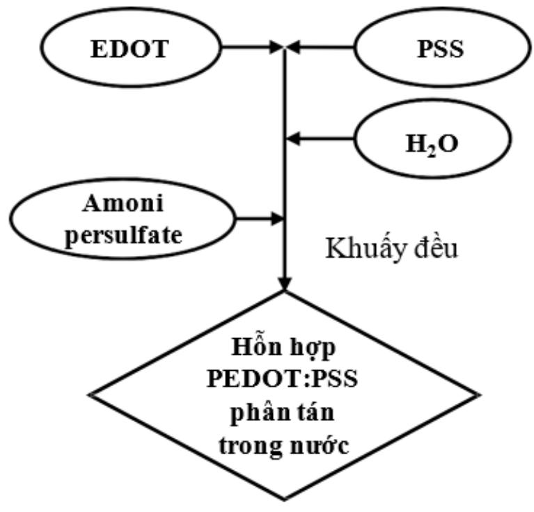
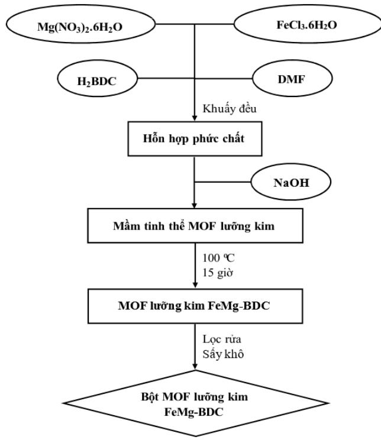

# Public_366

Bảng 1. Hóa chất và dụng cụ, thiết bị thí nghiệm chế tạo điện cực cấu trúc nano

<table><tr><td rowspan=1 colspan=1>STT</td><td rowspan=1 colspan=1>Ten</td><td rowspan=1 colspan=1>Thong so ky thuat</td><td rowspan=1 colspan=1>Xuat xur</td></tr><tr><td rowspan=1 colspan=4> Dung cu, hoa chat</td></tr><tr><td rowspan=1 colspan=1>1</td><td rowspan=1 colspan=1>Ethylene glycol</td><td rowspan=1 colspan=1>D@ tinh khiét 99,9%</td><td rowspan=1 colspan=1>Fisher - Anh</td></tr><tr><td rowspan=1 colspan=1>2</td><td rowspan=1 colspan=1>Polyvinylpyrrolidone(PVP)</td><td rowspan=1 colspan=1>Do tinh khiet 99%, khoi luongphan tir trung binh 360 000 Da</td><td rowspan=1 colspan=1> Sigma- My</td></tr><tr><td rowspan=1 colspan=1>3</td><td rowspan=1 colspan=1>Dung moiChloroform</td><td rowspan=1 colspan=1>Tieu chuan tinh khiét phantich</td><td rowspan=1 colspan=1>Fisher - Anh</td></tr><tr><td rowspan=1 colspan=1>4</td><td rowspan=1 colspan=1>Dung moi Methanol</td><td rowspan=1 colspan=1>Tieu chuan tinh khiet phantich</td><td rowspan=1 colspan=1>Fisher - Anh</td></tr><tr><td rowspan=1 colspan=1>5</td><td rowspan=1 colspan=1>Dung moi Acetone</td><td rowspan=1 colspan=1>Tieu chuan tinh khiét phantich</td><td rowspan=1 colspan=1>Fisher - Anh</td></tr><tr><td rowspan=1 colspan=1>6</td><td rowspan=1 colspan=1>Dung moi Iso-propanol</td><td rowspan=1 colspan=1>Tieu chuan tinh khiet phantich</td><td rowspan=1 colspan=1>Fisher - Anh</td></tr><tr><td rowspan=1 colspan=1>7</td><td rowspan=1 colspan=1>Dung moi Ethanol</td><td rowspan=1 colspan=1> Tieu chuan tinh khiet phantich</td><td rowspan=1 colspan=1>Fisher - Anh</td></tr><tr><td rowspan=1 colspan=1>8</td><td rowspan=1 colspan=1>Dung moi N,N&#x27;-dimethylformamide(DMF)</td><td rowspan=1 colspan=1>Tieu chuan tinh khiét phantich</td><td rowspan=1 colspan=1>Fisher - Anh</td></tr><tr><td rowspan=1 colspan=1>9</td><td rowspan=1 colspan=1>Dung moiTetrahydrofuran(THF)</td><td rowspan=1 colspan=1>Tieu chuan tinh khiét phantich</td><td rowspan=1 colspan=1>Fisher - Anh</td></tr><tr><td rowspan=1 colspan=1>10</td><td rowspan=1 colspan=1>Axit H2SO4</td><td rowspan=1 colspan=1>Nong do 98%</td><td rowspan=1 colspan=1> Sigma - My</td></tr><tr><td rowspan=1 colspan=1>11</td><td rowspan=1 colspan=1>Axit HNO3</td><td rowspan=1 colspan=1>Nong do 70%</td><td rowspan=1 colspan=1> Sigma - My</td></tr><tr><td rowspan=1 colspan=1>12</td><td rowspan=1 colspan=1>Cacbon nanotube</td><td rowspan=1 colspan=1>&gt;95% cacbon</td><td rowspan=1 colspan=1> Sigma - My</td></tr><tr><td rowspan=1 colspan=1>13</td><td rowspan=1 colspan=1>Graphite powder</td><td rowspan=1 colspan=1>Kich thuoc hat ≤20 μm</td><td rowspan=1 colspan=1> Sigma - My</td></tr><tr><td rowspan=1 colspan=1>14</td><td rowspan=1 colspan=1>AgNO3</td><td rowspan=1 colspan=1>D@ tinh khiét 99,9%</td><td rowspan=1 colspan=1>Fisher</td></tr></table>

<table><tr><td rowspan=1 colspan=1>15</td><td rowspan=1 colspan=1>NiCl</td><td rowspan=1 colspan=1>D@ tinh khiét 98%</td><td rowspan=1 colspan=1> Sigma - My</td></tr><tr><td rowspan=1 colspan=1>16</td><td rowspan=1 colspan=1>FeCl3.6HO</td><td rowspan=1 colspan=1>D@ tinh khiét 99%</td><td rowspan=1 colspan=1> Sigma - My</td></tr><tr><td rowspan=1 colspan=1>17</td><td rowspan=1 colspan=1>Mg(NO3)2.6H0</td><td rowspan=1 colspan=1>D tinh khiet 99%</td><td rowspan=1 colspan=1> Sigma - My</td></tr><tr><td rowspan=1 colspan=1>18</td><td rowspan=1 colspan=1>CuCl2.2H2O</td><td rowspan=1 colspan=1>D@ tinh khiet 99%</td><td rowspan=1 colspan=1>Sigma - My</td></tr><tr><td rowspan=1 colspan=1>19</td><td rowspan=1 colspan=1>Dé PET(polyethylene terephthalate)</td><td rowspan=1 colspan=1>Co 300x300x0,25mm, trongsuot</td><td rowspan=1 colspan=1> Sigma - My</td></tr><tr><td rowspan=1 colspan=1>20</td><td rowspan=1 colspan=1> ITO tren dé PET</td><td rowspan=1 colspan=1>Co 300x300x0,25mm, do dandien ~30 Ω2/sq</td><td rowspan=1 colspan=1>Sigma - My</td></tr><tr><td rowspan=1 colspan=1>21</td><td rowspan=1 colspan=1>Potassium phosphatemonobasic (KH2PO4)</td><td rowspan=1 colspan=1>D tinh khiét ≥ 99%</td><td rowspan=1 colspan=1> Sigma - My</td></tr><tr><td rowspan=1 colspan=1>22</td><td rowspan=1 colspan=1>Potassium phosphatedibasic (K2HPO4)</td><td rowspan=1 colspan=1>Do tinh khiét ≥ 98%</td><td rowspan=1 colspan=1> Sigma - My</td></tr><tr><td rowspan=1 colspan=1>23</td><td rowspan=1 colspan=1>Kali clorua (KCl)</td><td rowspan=1 colspan=1>ACS reagent, d tinh khiet99%</td><td rowspan=1 colspan=1> Sigma - My</td></tr><tr><td rowspan=1 colspan=1>24</td><td rowspan=1 colspan=1>Axit Terephtalic</td><td rowspan=1 colspan=1>D@ tinh khiét 99%</td><td rowspan=1 colspan=1> Sigma - My</td></tr><tr><td rowspan=1 colspan=1>25</td><td rowspan=1 colspan=1>NaNO3</td><td rowspan=1 colspan=1>D@ tinh khiét 99%</td><td rowspan=1 colspan=1> Sigma - My</td></tr><tr><td rowspan=1 colspan=1>26</td><td rowspan=1 colspan=1>KMnO4</td><td rowspan=1 colspan=1>Do tinh khiét 99,5%</td><td rowspan=1 colspan=1> Sigma - My</td></tr><tr><td rowspan=1 colspan=1>27</td><td rowspan=1 colspan=1>Dung dichEnrofloxacin 1000</td><td rowspan=1 colspan=1>Tieu chuan tinh khiét phantich</td><td rowspan=1 colspan=1>Sigma - Durc</td></tr><tr><td rowspan=1 colspan=1>28</td><td rowspan=1 colspan=1>Dung dich Pb2+chuan1000 μg/L</td><td rowspan=1 colspan=1> Tieu chuan tinh khiét phantich</td><td rowspan=1 colspan=1> Sigma - Durc</td></tr><tr><td rowspan=1 colspan=1>29</td><td rowspan=1 colspan=1>Dien cuc so sanhAg/AgC1/KC1</td><td rowspan=1 colspan=1>Dau dan gom,drong kinh 6mm</td><td rowspan=1 colspan=1>Thuy si</td></tr><tr><td rowspan=1 colspan=1>30</td><td rowspan=1 colspan=1> Dien cuc than thuytinh</td><td rowspan=1 colspan=1>Duong kinh 3 mm</td><td rowspan=1 colspan=1>Thuy si</td></tr><tr><td rowspan=1 colspan=1>31</td><td rowspan=1 colspan=1>Dien cuc doi Pt</td><td rowspan=1 colspan=1>Drong kinh 2 mm</td><td rowspan=1 colspan=1> Sigma - My</td></tr><tr><td rowspan=1 colspan=1>32</td><td rowspan=1 colspan=1> Dau tip pipet tu dong</td><td rowspan=1 colspan=1>Thé tich 20 μL</td><td rowspan=1 colspan=1> Sigma - My</td></tr><tr><td rowspan=1 colspan=1>33</td><td rowspan=1 colspan=1>Dau tip pipet tur dong</td><td rowspan=1 colspan=1>Thé tich 200 μL</td><td rowspan=1 colspan=1>Sigma - My</td></tr></table>

<table><tr><td rowspan=1 colspan=1>34</td><td rowspan=1 colspan=1>Pipet Dragonlab</td><td rowspan=1 colspan=1>1000-5000 μL</td><td rowspan=1 colspan=1>Dlab-My</td></tr><tr><td rowspan=1 colspan=1>35</td><td rowspan=1 colspan=1>Pipet Dragonlab</td><td rowspan=1 colspan=1>2-20 μL</td><td rowspan=1 colspan=1>Dlab-My</td></tr><tr><td rowspan=1 colspan=4>Thiet bi</td></tr><tr><td rowspan=1 colspan=1>STT</td><td rowspan=1 colspan=1>Ten</td><td rowspan=1 colspan=1>Xuat xur</td><td rowspan=1 colspan=1></td></tr><tr><td rowspan=1 colspan=1>1</td><td rowspan=1 colspan=1>Tu say thep khong ri</td><td rowspan=1 colspan=1>Memmert -Duc</td><td rowspan=1 colspan=1></td></tr><tr><td rowspan=1 colspan=1>2</td><td rowspan=1 colspan=1> May phu quay, WS-650Mz-23NPP</td><td rowspan=1 colspan=1>Laurell TechnologiesCorporation - My</td><td rowspan=1 colspan=1></td></tr><tr><td rowspan=1 colspan=1>3</td><td rowspan=1 colspan=1>May ép co hoc</td><td rowspan=1 colspan=1> Xiangyng - Trung Quóc</td><td rowspan=1 colspan=1></td></tr><tr><td rowspan=1 colspan=1>4</td><td rowspan=1 colspan=1>Dén chiéu tia UV, LF-215.LS</td><td rowspan=1 colspan=1>Vilber Lourmat - Phap</td><td rowspan=1 colspan=1></td></tr><tr><td rowspan=1 colspan=1>5</td><td rowspan=1 colspan=1>Bé rung sieu am,Elmasonic S 100H</td><td rowspan=1 colspan=1>Elma - Duc</td><td rowspan=1 colspan=1></td></tr><tr><td rowspan=1 colspan=1>6</td><td rowspan=1 colspan=1>Can ky thuat dien tr hien s6, Ohaus PA 4102</td><td rowspan=1 colspan=1>Ohaus - My</td><td rowspan=1 colspan=1></td></tr><tr><td rowspan=1 colspan=1>7</td><td rowspan=1 colspan=1>May ly tam lanh, Z326K</td><td rowspan=1 colspan=1>Hermle-Durc</td><td rowspan=1 colspan=1></td></tr><tr><td rowspan=1 colspan=1>8</td><td rowspan=1 colspan=1>Hé do dien hoaAUTOLABpotentiostatPGS302N</td><td rowspan=1 colspan=1>Metrohm, Ha Lan</td><td rowspan=1 colspan=1></td></tr></table>

# 1. Tổng hợp sợi nano bạc bằng phương pháp polyol

Sợi nano bạc được tổng hợp bằng phương pháp polyol, với tiền chất $\mathrm { \sf A g N O 3 }$ là nguồn cung cấp ion bạc, ethylen glycol $\mathrm { \mathrm { \cdot } \mathrm { \mathrm { H O C H } _ { 2 } C H _ { 2 } O H ) } }$ đóng vai trò là dung môi đồng thời là chất khử, NiCl2 là chất xúc tác, có tác dụng kiểm soát lượng ion $\mathrm { A g ^ { + } }$ trong dung dịch bằng cách tạo hạt nano AgCl. PVP đóng vai trò là chất hoạt động bề mặt, định hướng phát triển sợi của tinh thể AgNW [26]. Quy trình công nghệ tổng hợp dung dịch nano bạc dạng sợi được mô tả theo sơ đồ trong Hình 2.1 chi tiết như sau:

> **Hình chú thích:** a diagram of the process for the production of agwg

  
Hình 2.1. Sơ đồ quy trình tổng hợp dung dịch nano bạc dạng sợi

# 1.1 Tổng hợp sợi nano bạc bằng phương pháp polyol

Bước 1: Chuẩn bị các dung dịch:

$^ +$ Dung dịch NiCl2 7,5 mM trong EG (32 ml) $^ +$ Dung dịch PVP 0,188 M trong EG (800 ml) $^ +$ Dung dịch AgNO3 0,15 M trong EG (400 ml)

- Bước 2: Đưa lần lượt $8 0 0 ~ \mathrm { m l }$ dd PVP/EG, 32 ml NiCl2/EG, 400 ml $\mathrm { A g N O } _ { 3 } / \mathrm { E G }$ vào bình. Cuối cùng, thêm EG cho đủ $2 \mathrm { L }$ dung dịch. Bước 3: Đưa hệ vào bát dầu ra nhiệt để hệ đạt $1 0 0 ^ { \circ } \mathrm { C }$ trong 30 phút. Bước 4: Hết 30 phút tăng nhiệt độ của hệ lên $1 4 0 ^ { \circ } \mathrm { C }$ , giữ nhiệt độ ổn định ở $1 4 0 ^ { \circ } \mathrm { C }$ trong 6 giờ.

# 1.2 Tinh chế dung dịch sợi nano bạc

- Bước 1: Dung dịch sợi nano bạc thô sau tổng hợp được cho vào ống li tâm, sau đó thêm etanol (tỉ lệ dung dịch AgNW/Etanol là 1:4). Li tâm ở

tốc độ 7000 vòng/ phút trong 5 phút

- Bước 2: Lọc chất rắn phân tán lại trong isopropanol (IPA) với tỉ lệ 1:1 (so với dung dịch bạc ban đầu). Li tâm ở tốc độ 4000 vòng trong 5 phút.

- Bước 3: Phần bạc thu được phân tán lại trong $1 0 0 0 \mathrm { m l }$ IPA. Ta thu được dung dịch sợi nano bạc nồng độ $0 { , } 4 \%$ $( 4 \mathrm { m g / m l } )$

# 2. Phương pháp tổng hợp graphene oxit

Graphene oxit được tổng hợp theo phương pháp Hummer cải tiến [69], quy trình được mô tả trong sơ đồ Hình 2.2 cụ thể như sau:

> **Hình chú thích:** a diagram of the process of using graph paper

  
Hình 2.2. Sơ đồ quy trình tổng hợp GO

Bước 1: Đặt cốc chứa $9 6 ~ \mathrm { m l }$ $\mathrm { H } _ { 2 } \mathrm { S O } _ { 4 }$ đặc trong chậu muối đá cho tới khi nhiệt độ hệ giảm xuống dưới $5 \mathrm { { } ^ { \circ } C }$ .

Bước 2: Thêm lần lượt $2 \ { \mathrm { g } }$ graphit và ${ 1 \mathrm { ~ g ~ N a N O } _ { 3 } }$ vào cốc, khuấy đều trong 60 phút. Thêm từ từ $1 2 \mathrm { g K M n O } _ { 4 }$ trong vòng $1 { - } 3 \mathrm { ~ h ~ }$ vào hỗn hợp trên, đảm bảo nhiệt độ của hệ không vượt quá $1 0 ~ ^ { \circ } \mathrm { C }$ . Sau đó, bỏ hệ ra khỏi chậu muối đá và để phản ứng diễn ra ở nhiệt độ phòng trong 90 phút.

Bước 3: Tiếp theo, nâng nhiệt độ của hệ lên $3 5 \mathrm { { ^ \circ C } }$ , khuấy đều trong $^ { 2 \mathrm { ~ h ~ } }$ . Thêm từ từ $9 0 ~ \mathrm { m l }$ nước cất bằng phễu nhỏ giọt $\mathrm { d } \acute { \mathrm { e } }$ tránh hiện tượng quá nhiệt.

Bước 4: Nâng nhiệt độ của hệ lên $8 0 ~ ^ { \circ } \mathrm { C }$ , khuấy đều trong 30 phút rồi thêm 200 ml nước cất trong 10-20 phút để làm mát hệ phản ứng.

Bước 5: Thêm từ từ $1 0 \mathrm { m l } \mathrm { H } _ { 2 } \mathrm { O } _ { 2 }$ vào hệ phản ứng, khuấy tiếp trong 20-30 phút.

Bước 6: Sau khi kết thúc phản ứng, dung dịch được ly tâm, phần chất rắn thu được được phân tán trong $8 0 \mathrm { m l H C l } 0 , 1 \mathrm { M }$

Bước 7: Graphene phân tán trong HCl tiếp tục được lọc rửa bằng máy ly tâm với nước tới khi pH của dung dịch lọc khoảng 6 - 7. Graphene oxit thu được có dạng Gel nồng độ $1 \%$ và được pha loãng tới nồng độ $0 { , } 0 5 \%$ để dùng cho công việc chế tạo điện cực.

# 3. Tổng hợp PEDOT:PSS

Quy trình tổng hợp polyme dẫn PEDOT:PSS được mô tả như trong sơ đồ Hình 2.3 cụ thể như sau [70]:

Bước 1: Phân tán $0 , 7 1 \ \mathrm { g }$ EDOT và 1 g PSSNa trong $1 0 0 \mathrm { m l }$ nước, khuấy trong 60 phút trong khí trơ ${ \bf N } _ { 2 }$ , tốc độ $8 0 0 \mathrm { r p m }$ .

Bước $2 \colon 2 ~ \mathrm { m L }$ dung dịch ammoni persulfate và $2 ~ \mathrm { m L }$ dung dịch FeCl3 (0,2M) được thêm từ từ vào dung dịch. Tiếp tục khuấy trong 1h $\dot { \mathbf { O } }$ nhiệt độ phòng. Thu được PEDOT:PSS phân tán trong nước với nồng độ $2 \%$ .

> **Hình chú thích:** a diagram showing the process of using the word

  
Hình 2.3. Sơ đồ quy trình tổng hợp PEDOT:PSS

# 4. Phương pháp oxi hóa cacbon nanotube

Cacbon nanotube dạng oxi hóa (oCNT) được tổng hợp bằng cách oxi hóa CNT bởi hỗn hợp 2 axit đậm đặc $\mathrm { H } _ { 2 } \mathrm { S O } _ { 4 }$ và $\mathrm { H N O } _ { 3 }$ [71, 72]. Quy trình oxi hóa

CNT được thực hiện như sau:

5 gam CNT được phân tán trong $2 5 0 ~ \mathrm { m L }$ dung dịch $\mathrm { H } _ { 2 } \mathrm { S O } _ { 4 }$ đặ $\mathrm { \Phi _ { \mathrm { i c } } / H N O _ { 3 } }$ (tỉ lệ 2 axit là 3/2). Hỗn hợp được gia nhiệt $\dot { \sigma } 5 0 ~ \mathrm { { } ^ { \circ } C }$ và khuấy trong 20 giờ. Sau khi kết thúc phản ứng, chất rắn được lọc, rửa bằng nước cất nhiều lần để loại bỏ hoàn toàn axit dư. Sau đó, hỗn hợp CNT đã oxi hóa được sấy chân không $\dot { \mathrm { ~ o ~ } } 1 0 0 ^ { \mathrm { ~ o ~ } } \mathrm { C }$ trong 24 giờ.

# 5. Phương pháp tổng hợp vật liệu khung hữu cơ kim loại hợp kim FeMg-BDC

Vật liệu khung hữu cơ kim loại lưỡng kim FeMg-BDC với các tỷ lệ mol Fe/Mg khác nhau được tổng hợp theo quy trình như sơ đ $\dot { \hat { 0 } } \mathrm { H i n h } 2 . 4 \mathrm { c u }$ thể như sau [73, 74]:

> **Hình chú thích:** the flow diagram for the process of producing a drug

  
Hình 2.4. Sơ đồ quy trình tổng hợp FeMg-BDC

Bước 1: 1 mmol muối kim loại có tỷ $\mathsf { l e } \mathrm { m o l } \mathrm { F e } ^ { 3 + } / \mathrm { M g } ^ { 2 + }$ thay đổi (1/1, 1/2, 1/4) kết hợp với 1 mmol $\mathrm { H } _ { 2 } \mathrm { B D C }$ được hòa tan trong $1 0 \mathrm { m L }$ DMF và khuấy liên tục để thu được dung dịch đồng nhất.

Bước 2: Sau đó, nhanh chóng bơm $2 \mathrm { m L }$ dung dịch NaOH 0,2 M vào dung dịch hỗn hợp trên và khuấy liên tục trong 15 phút.

Bước 3: Hỗn hợp được chuyển vào Autoclave và đun nóng không khuấy trong lò ở $1 0 0 ^ { \circ } \mathrm { C }$ trong 15 giờ. Sau khi làm nguội đến nhiệt độ phòng, huyền phù thu được được giữ lại bằng cách ly tâm, lọc rửa nhiều lần bằng DMF và metanol. Cuối cùng, mẫu đã rửa được sấy khô ở $6 0 ^ { \circ } \mathrm { C }$ trong 24 giờ trong chân không để loại bỏ hoàn toàn lượng

nước còn dư.

Ba sản phẩm được tổng hợp được ký hiệu là Fe/Mg-BDC(1/1), Fe/MgBDC(1/2) và Fe/Mg-BDC(1/4). Đồng thời, Fe-BDC và $\mathrm { M g }$ -BDC đơn kim cũng được tổng hợp thông qua quy trình tương tự được mô tả ở trên chỉ sử dụng $\mathrm { F e C l } _ { 3 } { \cdot } 6 \mathrm { H } _ { 2 } \mathrm { O }$ hoặc $\mathrm { M g ( N O _ { 3 } ) _ { 2 } { \cdot } 6 H _ { 2 } O }$ làm tiền chất.
